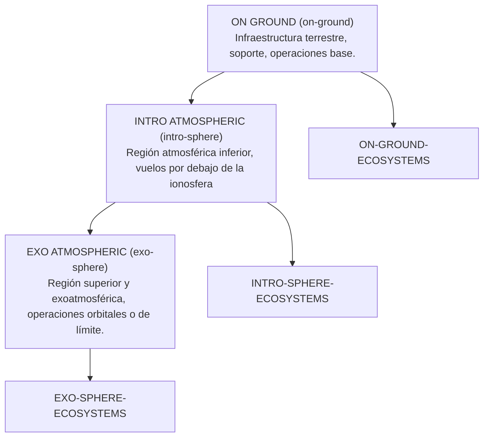

# GAIA-AIR-ESSENTIALS

**ESTRUCTURA PRIMARIA**

## ON GROUND (on-ground)
Infraestructura terrestre, soporte, operaciones base.  
**Ecosystem:** ON-GROUND-ECOSYSTEMS

## INTRO ATMOSFERIC (intro-sphere)
Región atmosférica inferior, vuelos por debajo de la ionosfera.  
**Ecosystem:** INTRO-SPHERE-ECOSYSTEMS

## EXO ATMOSFERIC (exo-sphere)
Región superior y exoatmosférica, operaciones orbitales o de límite.  
**Ecosystem:** EXO-SPHERE-ECOSYSTEMS

---

## Interactive Diagram

To visualize the relationships between zones and ecosystems, here is an interactive diagram rendered using Mermaid:



---

### Notes

- Use the [Mermaid Live Editor](https://mermaid-js.github.io/mermaid-live-editor/) to customize and interact with the diagram further.
- If the Mermaid diagram does not render in this Markdown viewer, copy the code into the live editor above for visualization.

```
