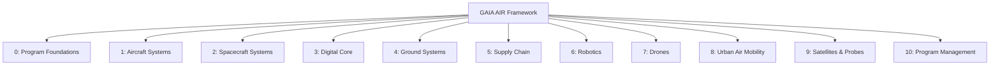
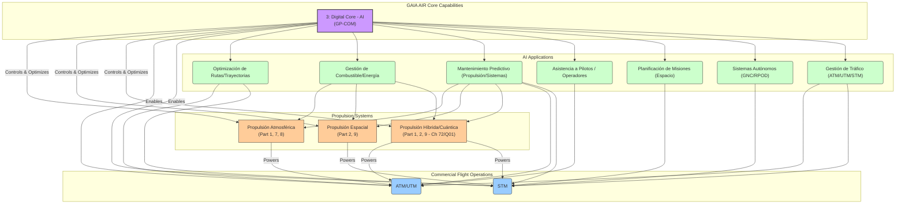
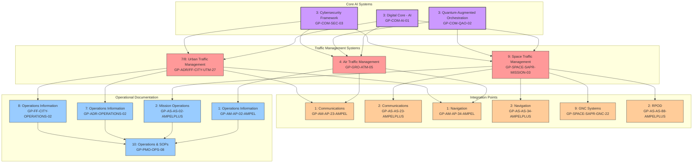

# Gen-AI Architecture (GAIA) Augmented by Intelligent Robotics (AIR) for Canonical Organization of Aerospace Full Ident’s Lifecycle (COAFI)



**Integración Detallada**

1.  **IA y Propulsión (P1, P2, P3):**
    *   **Optimización:** La IA (A) ajusta parámetros para eficiencia y adaptación ambiental.
    *   **Diagnóstico:** La IA (A) permite mantenimiento predictivo (App3) detectando anomalías.
    *   **Gestión Híbrida/Cuántica:** La IA (A) gestiona la complejidad de los sistemas avanzados (P3).

2.  **IA y Vuelos Comerciales Atmosféricos (C1):**
    *   **Rutas y Combustible:** La IA (A) optimiza rutas (App1) y consumo (App2).
    *   **Asistencia y Tráfico:** La IA (A) asiste a pilotos (App4) y se integra con ATM/UTM (App7).
    *   **Mantenimiento:** La IA (A) habilita el Mantenimiento Predictivo (App3).

3.  **IA y Vuelos Comerciales Espaciales (C2):**
    *   **Planificación y Trayectorias:** La IA (A) optimiza misiones (App5) y trayectorias (App1).
    *   **Autonomía y Recursos:** La IA (A) permite operaciones autónomas (App6) y gestiona recursos (App2).
    *   **Mantenimiento y Seguridad:** La IA (A) apoya el Mantenimiento Predictivo (App3) y la seguridad de pasajeros/misión.

4.  **Reflejo en el Framework COAFI:**
    *   **Parte 0:** Ética y Gobernanza de IA.
    *   **Parte 1, 2, 7, 8, 9:** Documentación específica de la integración IA-Propulsión y IA-Control de Vuelo.
    *   **Parte 3:** El núcleo digital (IA, QAO) que habilita estas funciones.
    *   **Parte 10:** Gestión de programas y certificación de sistemas con IA.

Este nivel de detalle y la visualización de las interconexiones son cruciales. Refleja una arquitectura donde la inteligencia no es un añadido, sino una parte integral del diseño y la operación en todos los niveles.



# GAIA AIR • Master Table of Contents (AToC.md)

> **Canonical Orchestrated Architecture File Index (COAFI)**  – *embedded master‑index section*
>
> ⚠️ **DISCLAIMER – GenAI Proposal Status** ⚠️  Generated structures require formal authority review for compliance & certification.

---

## COAFI – Canonical Orchestrated Architecture File Index
*Purpose: one‑stop, machine‑parseable index for every GAIA AIR architecture part, chapter & interface.*

**Filename pattern (master index files)**
`[DomainCode]-[EntityCode]-[BaselineCode]-[NumericalChapterCode]-[SubjectCode]-[InfoCode]-[Rev].[ext]`
*(master indexes use `infoCode="013"` & `infoCodeVariant="Z"` → mnemonic `IDX`)*
*(Specific Entity and Baseline Codes are defined per Part/Domain)*

---
### Part 0 • Program Foundations (GP‑FD) 🏛️

*Purpose: Foundational framework encompassing vision, theories, standards, ethics, and overall program governance.*
*(Domain: `GP-FD`, Entity: `GEN`, Baseline: `0000`, systemDiffCode: `GP`, systemCode: `00`, subSystemCode: `GEN`, subSubSystemCode: `0000`, assyCode: maps to Numerical Chapter Code, disassyCode: `00`, disassyCodeVariant: `000`, infoCode: `013`, infoCodeVariant: `Z`, itemLocationCode: `A`, itemLocationCodeVariant: `00`, productClass: `D`, seqIdentifier: `001`, issueNumber: `001`, inWork: `00`)*

| DM‑code attributes (SD‑XML syntax) | Title |
|---|---|
| `modelIdent="GP‑FD" systemDiffCode="GP" systemCode="00" subSystemCode="GEN" subSubSystemCode="0000" assyCode="00" disassyCode="00" disassyCodeVariant="000" infoCode="013" infoCodeVariant="Z" itemLocationCode="A" itemLocationCodeVariant="00" productClass="D" seqIdentifier="001" issueNumber="001" inWork="00"` | **Part 0 Ch 00 Intro & Vision Index** |
| `modelIdent="GP‑FD" systemDiffCode="GP" systemCode="00" subSystemCode="GEN" subSubSystemCode="0000" assyCode="01" disassyCode="00" disassyCodeVariant="000" infoCode="013" infoCodeVariant="Z" itemLocationCode="A" itemLocationCodeVariant="00" productClass="D" seqIdentifier="001" issueNumber="001" inWork="00"` | **Part 0 Ch 01 Theories & Proofs Index** |
| `modelIdent="GP‑FD" systemDiffCode="GP" systemCode="00" subSystemCode="GEN" subSubSystemCode="0000" assyCode="02" disassyCode="00" disassyCodeVariant="000" infoCode="013" infoCodeVariant="Z" itemLocationCode="A" itemLocationCodeVariant="00" productClass="D" seqIdentifier="001" issueNumber="001" inWork="00"` | **Part 0 Ch 02 Regulatory Standards Index** |
| `modelIdent="GP‑FD" systemDiffCode="GP" systemCode="00" subSystemCode="GEN" subSubSystemCode="0000" assyCode="03" disassyCode="00" disassyCodeVariant="000" infoCode="013" infoCodeVariant="Z" itemLocationCode="A" itemLocationCodeVariant="00" productClass="D" seqIdentifier="001" issueNumber="001" inWork="00"` | **Part 0 Ch 03 Cross Disciplinary Index** |
| `modelIdent="GP‑FD" systemDiffCode="GP" systemCode="00" subSystemCode="GEN" subSubSystemCode="0000" assyCode="04" disassyCode="00" disassyCodeVariant="000" infoCode="013" infoCodeVariant="Z" itemLocationCode="A" itemLocationCodeVariant="00" productClass="D" seqIdentifier="001" issueNumber="001" inWork="00"` | **Part 0 Ch 04 Ethical AI Index** |
| `modelIdent="GP‑FD" systemDiffCode="GP" systemCode="00" subSystemCode="GEN" subSubSystemCode="0000" assyCode="05" disassyCode="00" disassyCodeVariant="000" infoCode="013" infoCodeVariant="Z" itemLocationCode="A" itemLocationCodeVariant="00" productClass="D" seqIdentifier="001" issueNumber="001" inWork="00"` | **Part 0 Ch 05 Interplanetary Vision Index** |
| `modelIdent="GP‑FD" systemDiffCode="GP" systemCode="00" subSystemCode="GEN" subSubSystemCode="0000" assyCode="06" disassyCode="00" disassyCodeVariant="000" infoCode="013" infoCodeVariant="Z" itemLocationCode="A" itemLocationCodeVariant="00" productClass="D" seqIdentifier="001" issueNumber="001" inWork="00"` | **Part 0 Ch 06 Security Frameworks Index** |
| `modelIdent="GP‑FD" systemDiffCode="GP" systemCode="00" subSystemCode="GEN" subSubSystemCode="0000" assyCode="99" disassyCode="00" disassyCodeVariant="000" infoCode="013" infoCodeVariant="Z" itemLocationCode="A" itemLocationCodeVariant="00" productClass="D" seqIdentifier="001" issueNumber="001" inWork="00"` | **Part 0 Ch 99 Special / Emerging Tech Index** |

---

### Part 1 • Air Systems & Airframes (GP‑AM) 🚀✈️

*Purpose: Airframe Design, System & Ops Manuals for AMPEL platforms, leveraging ATA chapter structure.*
*(Domain: `GP-AM`, Entity: `AMPEL`, Baseline: `0100`, systemDiffCode: `AP`, systemCode: maps to ATA Chapter Code, subSystemCode: `AMPEL` (or `Q01`), subSubSystemCode: `0100`, assyCode: `00`, disassyCode: `00`, disassyCodeVariant: `000`, infoCode: `013`, infoCodeVariant: `Z`, itemLocationCode: `A`, itemLocationCodeVariant: `00`, productClass: `D`, seqIdentifier: `001`, issueNumber: `001`, inWork: `00` - EXCEPTION for ATA 72-Q01)*

| DM‑code attributes (SD‑XML syntax) | Title |
|---|---|
| `modelIdent="GP‑AM" systemDiffCode="AP" systemCode="00" subSystemCode="AMPEL" subSubSystemCode="0100" assyCode="00" disassyCode="00" disassyCodeVariant="000" infoCode="013" infoCodeVariant="Z" itemLocationCode="A" itemLocationCodeVariant="00" productClass="D" seqIdentifier="001" issueNumber="001" inWork="00"` | **Part 1 ATA 00 Intro & General Index** |
| `modelIdent="GP‑AM" systemDiffCode="AP" systemCode="01" subSystemCode="AMPEL" subSubSystemCode="0100" assyCode="00" disassyCode="00" disassyCodeVariant="000" infoCode="013" infoCodeVariant="Z" itemLocationCode="A" itemLocationCodeVariant="00" productClass="D" seqIdentifier="001" issueNumber="001" inWork="00"` | **Part 1 ATA 01 Aircraft General Index** |
| `modelIdent="GP‑AM" systemDiffCode="AP" systemCode="02" subSystemCode="AMPEL" subSubSystemCode="0100" assyCode="00" disassyCode="00" disassyCodeVariant="000" infoCode="013" infoCodeVariant="Z" itemLocationCode="A" itemLocationCodeVariant="00" productClass="D" seqIdentifier="001" issueNumber="001" inWork="00"` | **Part 1 ATA 02 Operations Information Index** |
| `modelIdent="GP‑AM" systemDiffCode="AP" systemCode="03" subSystemCode="AMPEL" subSubSystemCode="0100" assyCode="00" disassyCode="00" disassyCodeVariant="000" infoCode="013" infoCodeVariant="Z" itemLocationCode="A" itemLocationCodeVariant="00" productClass="D" seqIdentifier="001" issueNumber="001" inWork="00"` | **Part 1 ATA 03 Performance Index** |
| `modelIdent="GP‑AM" systemDiffCode="AP" systemCode="04" subSystemCode="AMPEL" subSubSystemCode="0100" assyCode="00" disassyCode="00" disassyCodeVariant="000" infoCode="013" infoCodeVariant="Z" itemLocationCode="A" itemLocationCodeVariant="00" productClass="D" seqIdentifier="001" issueNumber="001" inWork="00"` | **Part 1 ATA 04 Airworthiness Index** |
| `modelIdent="GP‑AM" systemDiffCode="AP" systemCode="05" subSystemCode="AMPEL" subSubSystemCode="0100" assyCode="00" disassyCode="00" disassyCodeVariant="000" infoCode="013" infoCodeVariant="Z" itemLocationCode="A" itemLocationCodeVariant="00" productClass="D" seqIdentifier="001" issueNumber="001" inWork="00"` | **Part 1 ATA 05 Time Limits / Maintenance Checks Index** |
| `modelIdent="GP‑AM" systemDiffCode="AP" systemCode="06" subSystemCode="AMPEL" subSubSystemCode="0100" assyCode="00" disassyCode="00" disassyCodeVariant="000" infoCode="013" infoCodeVariant="Z" itemLocationCode="A" itemLocationCodeVariant="00" productClass="D" seqIdentifier="001" issueNumber="001" inWork="00"` | **Part 1 ATA 06 Dimensions & Areas Index** |
| `modelIdent="GP‑AM" systemDiffCode="AP" systemCode="07" subSystemCode="AMPEL" subSubSystemCode="0100" assyCode="00" disassyCode="00" disassyCodeVariant="000" infoCode="013" infoCodeVariant="Z" itemLocationCode="A" itemLocationCodeVariant="00" productClass="D" seqIdentifier="001" issueNumber="001" inWork="00"` | **Part 1 ATA 07 Lifting & Shoring Index** |
| `modelIdent="GP‑AM" systemDiffCode="AP" systemCode="08" subSystemCode="AMPEL" subSubSystemCode="0100" assyCode="00" disassyCode="00" disassyCodeVariant="000" infoCode="013" infoCodeVariant="Z" itemLocationCode="A" itemLocationCodeVariant="00" productClass="D" seqIdentifier="001" issueNumber="001" inWork="00"` | **Part 1 ATA 08 Leveling & Weighing Index** |
| `modelIdent="GP‑AM" systemDiffCode="AP" systemCode="09" subSystemCode="AMPEL" subSubSystemCode="0100" assyCode="00" disassyCode="00" disassyCodeVariant="000" infoCode="013" infoCodeVariant="Z" itemLocationCode="A" itemLocationCodeVariant="00" productClass="D" seqIdentifier="001" issueNumber="001" inWork="00"` | **Part 1 ATA 09 Towing & Taxiing Index** |
| `modelIdent="GP‑AM" systemDiffCode="AP" systemCode="10" subSystemCode="AMPEL" subSubSystemCode="0100" assyCode="00" disassyCode="00" disassyCodeVariant="000" infoCode="013" infoCodeVariant="Z" itemLocationCode="A" itemLocationCodeVariant="00" productClass="D" seqIdentifier="001" issueNumber="001" inWork="00"` | **Part 1 ATA 10 Parking, Mooring, Storage Index** |
| `modelIdent="GP‑AM" systemDiffCode="AP" systemCode="11" subSystemCode="AMPEL" subSubSystemCode="0100" assyCode="00" disassyCode="00" disassyCodeVariant="000" infoCode="013" infoCodeVariant="Z" itemLocationCode="A" itemLocationCodeVariant="00" productClass="D" seqIdentifier="001" issueNumber="001" inWork="00"` | **Part 1 ATA 11 Placards & Markings Index** |
| `modelIdent="GP‑AM" systemDiffCode="AP" systemCode="12" subSystemCode="AMPEL" subSubSystemCode="0100" assyCode="00" disassyCode="00" disassyCodeVariant="000" infoCode="013" infoCodeVariant="Z" itemLocationCode="A" itemLocationCodeVariant="00" productClass="D" seqIdentifier="001" issueNumber="001" inWork="00"` | **Part 1 ATA 12 Servicing – Routine Index** |
| `modelIdent="GP‑AM" systemDiffCode="AP" systemCode="13" subSystemCode="AMPEL" subSubSystemCode="0100" assyCode="00" disassyCode="00" disassyCodeVariant="000" infoCode="013" infoCodeVariant="Z" itemLocationCode="A" itemLocationCodeVariant="00" productClass="D" seqIdentifier="001" issueNumber="001" inWork="00"` | **Part 1 ATA 13 Hydraulic Power (Minimal/EHA) Index** |
| `modelIdent="GP‑AM" systemDiffCode="AP" systemCode="14" subSystemCode="AMPEL" subSubSystemCode="0100" assyCode="00" disassyCode="00" disassyCodeVariant="000" infoCode="013" infoCodeVariant="Z" itemLocationCode="A" itemLocationCodeVariant="00" productClass="D" seqIdentifier="001" issueNumber="001" inWork="00"` | **Part 1 ATA 14 Pneumatic Power (Minimal) Index** |
| `modelIdent="GP‑AM" systemDiffCode="AP" systemCode="15" subSystemCode="AMPEL" subSubSystemCode="0100" assyCode="00" disassyCode="00" disassyCodeVariant="000" infoCode="013" infoCodeVariant="Z" itemLocationCode="A" itemLocationCodeVariant="00" productClass="D" seqIdentifier="001" issueNumber="001" inWork="00"` | **Part 1 ATA 15 Reserved Index** |
| `modelIdent="GP‑AM" systemDiffCode="AP" systemCode="16" subSystemCode="AMPEL" subSubSystemCode="0100" assyCode="00" disassyCode="00" disassyCodeVariant="000" infoCode="013" infoCodeVariant="Z" itemLocationCode="A" itemLocationCodeVariant="00" productClass="D" seqIdentifier="001" issueNumber="001" inWork="00"` | **Part 1 ATA 16 Reserved Index** |
| `modelIdent="GP‑AM" systemDiffCode="AP" systemCode="17" subSystemCode="AMPEL" subSubSystemCode="0100" assyCode="00" disassyCode="00" disassyCodeVariant="000" infoCode="013" infoCodeVariant="Z" itemLocationCode="A" itemLocationCodeVariant="00" productClass="D" seqIdentifier="001" issueNumber="001" inWork="00"` | **Part 1 ATA 17 Reserved Index** |
| `modelIdent="GP‑AM" systemDiffCode="AP" systemCode="18" subSystemCode="AMPEL" subSubSystemCode="0100" assyCode="00" disassyCode="00" disassyCodeVariant="000" infoCode="013" infoCodeVariant="Z" itemLocationCode="A" itemLocationCodeVariant="00" productClass="D" seqIdentifier="001" issueNumber="001" inWork="00"` | **Part 1 ATA 18 Vibration & Noise Control Index** |
| `modelIdent="GP‑AM" systemDiffCode="AP" systemCode="20" subSystemCode="AMPEL" subSubSystemCode="0100" assyCode="00" disassyCode="00" disassyCodeVariant="000" infoCode="013" infoCodeVariant="Z" itemLocationCode="A" itemLocationCodeVariant="00" productClass="D" seqIdentifier="001" issueNumber="001" inWork="00"` | **Part 1 ATA 20 Standard Practices – Airframe Index** |
| `modelIdent="GP‑AM" systemDiffCode="AP" systemCode="21" subSystemCode="AMPEL" subSubSystemCode="0100" assyCode="00" disassyCode="00" disassyCodeVariant="000" infoCode="013" infoCodeVariant="Z" itemLocationCode="A" itemLocationCodeVariant="00" productClass="D" seqIdentifier="001" issueNumber="001" inWork="00"` | **Part 1 ATA 21 Air Conditioning & Pressurization (ECS) Index** |
| `modelIdent="GP‑AM" systemDiffCode="AP" systemCode="22" subSystemCode="AMPEL" subSubSystemCode="0100" assyCode="00" disassyCode="00" disassyCodeVariant="000" infoCode="013" infoCodeVariant="Z" itemLocationCode="A" itemLocationCodeVariant="00" productClass="D" seqIdentifier="001" issueNumber="001" inWork="00"` | **Part 1 ATA 22 Auto Flight Index** |
| `modelIdent="GP‑AM" systemDiffCode="AP" systemCode="23" subSystemCode="AMPEL" subSubSystemCode="0100" assyCode="00" disassyCode="00" disassyCodeVariant="000" infoCode="013" infoCodeVariant="Z" itemLocationCode="A" itemLocationCodeVariant="00" productClass="D" seqIdentifier="001" issueNumber="001" inWork="00"` | **Part 1 ATA 23 Communications Index** |
| `modelIdent="GP‑AM" systemDiffCode="AP" systemCode="24" subSystemCode="AMPEL" subSubSystemCode="0100" assyCode="00" disassyCode="00" disassyCodeVariant="000" infoCode="013" infoCodeVariant="Z" itemLocationCode="A" itemLocationCodeVariant="00" productClass="D" seqIdentifier="001" issueNumber="001" inWork="00"` | **Part 1 ATA 24 Electrical Power Index** |
| `modelIdent="GP‑AM" systemDiffCode="AP" systemCode="25" subSystemCode="AMPEL" subSubSystemCode="0100" assyCode="00" disassyCode="00" disassyCodeVariant="000" infoCode="013" infoCodeVariant="Z" itemLocationCode="A" itemLocationCodeVariant="00" productClass="D" seqIdentifier="001" issueNumber="001" inWork="00"` | **Part 1 ATA 25 Equipment / Furnishings Index** |
| `modelIdent="GP‑AM" systemDiffCode="AP" systemCode="26" subSystemCode="AMPEL" subSubSystemCode="0100" assyCode="00" disassyCode="00" disassyCodeVariant="000" infoCode="013" infoCodeVariant="Z" itemLocationCode="A" itemLocationCodeVariant="00" productClass="D" seqIdentifier="001" issueNumber="001" inWork="00"` | **Part 1 ATA 26 Fire Protection Index** |
| `modelIdent="GP‑AM" systemDiffCode="AP" systemCode="27" subSystemCode="AMPEL" subSubSystemCode="0100" assyCode="00" disassyCode="00" disassyCodeVariant="000" infoCode="013" infoCodeVariant="Z" itemLocationCode="A" itemLocationCodeVariant="00" productClass="D" seqIdentifier="001" issueNumber="001" inWork="00"` | **Part 1 ATA 27 Flight Controls (incl. GPAM) Index** |
| `modelIdent="GP‑AM" systemDiffCode="AP" systemCode="28" subSystemCode="AMPEL" subSubSystemCode="0100" assyCode="00" disassyCode="00" disassyCodeVariant="000" infoCode="013" infoCodeVariant="Z" itemLocationCode="A" itemLocationCodeVariant="00" productClass="D" seqIdentifier="001" issueNumber="001" inWork="00"` | **Part 1 ATA 28 Fuel (Hybrid H2/SAF) Index** |
| `modelIdent="GP‑AM" systemDiffCode="AP" systemCode="29" subSystemCode="AMPEL" subSubSystemCode="0100" assyCode="00" disassyCode="00" disassyCodeVariant="000" infoCode="013" infoCodeVariant="Z" itemLocationCode="A" itemLocationCodeVariant="00" productClass="D" seqIdentifier="001" issueNumber="001" inWork="00"` | **Part 1 ATA 29 Hydraulic Power (Actuation Focus) Index** |
| `modelIdent="GP‑AM" systemDiffCode="AP" systemCode="30" subSystemCode="AMPEL" subSubSystemCode="0100" assyCode="00" disassyCode="00" disassyCodeVariant="000" infoCode="013" infoCodeVariant="Z" itemLocationCode="A" itemLocationCodeVariant="00" productClass="D" seqIdentifier="001" issueNumber="001" inWork="00"` | **Part 1 ATA 30 Ice & Rain Protection Index** |
| `modelIdent="GP‑AM" systemDiffCode="AP" systemCode="31" subSystemCode="AMPEL" subSubSystemCode="0100" assyCode="00" disassyCode="00" disassyCodeVariant="000" infoCode="013" infoCodeVariant="Z" itemLocationCode="A" itemLocationCodeVariant="00" productClass="D" seqIdentifier="001" issueNumber="001" inWork="00"` | **Part 1 ATA 31 Indicating / Recording Systems Index** |
| `modelIdent="GP‑AM" systemDiffCode="AP" systemCode="32" subSystemCode="AMPEL" subSubSystemCode="0100" assyCode="00" disassyCode="00" disassyCodeVariant="000" infoCode="013" infoCodeVariant="Z" itemLocationCode="A" itemLocationCodeVariant="00" productClass="D" seqIdentifier="001" issueNumber="001" inWork="00"` | **Part 1 ATA 32 Landing Gear Index** |
| `modelIdent="GP‑AM" systemDiffCode="AP" systemCode="33" subSystemCode="AMPEL" subSubSystemCode="0100" assyCode="00" disassyCode="00" disassyCodeVariant="000" infoCode="013" infoCodeVariant="Z" itemLocationCode="A" itemLocationCodeVariant="00" productClass="D" seqIdentifier="001" issueNumber="001" inWork="00"` | **Part 1 ATA 33 Lights Index** |
| `modelIdent="GP‑AM" systemDiffCode="AP" systemCode="34" subSystemCode="AMPEL" subSubSystemCode="0100" assyCode="00" disassyCode="00" disassyCodeVariant="000" infoCode="013" infoCodeVariant="Z" itemLocationCode="A" itemLocationCodeVariant="00" productClass="D" seqIdentifier="001" issueNumber="001" inWork="00"` | **Part 1 ATA 34 Navigation Index** |
| `modelIdent="GP‑AM" systemDiffCode="AP" systemCode="35" subSystemCode="AMPEL" subSubSystemCode="0100" assyCode="00" disassyCode="00" disassyCodeVariant="000" infoCode="013" infoCodeVariant="Z" itemLocationCode="A" itemLocationCodeVariant="00" productClass="D" seqIdentifier="001" issueNumber="001" inWork="00"` | **Part 1 ATA 35 Oxygen Index** |
| `modelIdent="GP‑AM" systemDiffCode="AP" systemCode="36" subSystemCode="AMPEL" subSubSystemCode="0100" assyCode="00" disassyCode="00" disassyCodeVariant="000" infoCode="013" infoCodeVariant="Z" itemLocationCode="A" itemLocationCodeVariant="00" productClass="D" seqIdentifier="001" issueNumber="001" inWork="00"` | **Part 1 ATA 36 Pneumatic Index** |
| `modelIdent="GP‑AM" systemDiffCode="AP" systemCode="37" subSystemCode="AMPEL" subSubSystemCode="0100" assyCode="00" disassyCode="00" disassyCodeVariant="000" infoCode="013" infoCodeVariant="Z" itemLocationCode="A" itemLocationCodeVariant="00" productClass="D" seqIdentifier="001" issueNumber="001" inWork="00"` | **Part 1 ATA 37 Vacuum Index** |
| `modelIdent="GP‑AM" systemDiffCode="AP" systemCode="38" subSystemCode="AMPEL" subSubSystemCode="0100" assyCode="00" disassyCode="00" disassyCodeVariant="000" infoCode="013" infoCodeVariant="Z" itemLocationCode="A" itemLocationCodeVariant="00" productClass="D" seqIdentifier="001" issueNumber="001" inWork="00"` | **Part 1 ATA 38 Water / Waste Index** |
| `modelIdent="GP‑AM" systemDiffCode="AP" systemCode="39" subSystemCode="AMPEL" subSubSystemCode="0100" assyCode="00" disassyCode="00" disassyCodeVariant="000" infoCode="013" infoCodeVariant="Z" itemLocationCode="A" itemLocationCodeVariant="00" productClass="D" seqIdentifier="001" issueNumber="001" inWork="00"` | **Part 1 ATA 39 Electrical/Electronic Panels Index** |
| `modelIdent="GP‑AM" systemDiffCode="AP" systemCode="41" subSystemCode="AMPEL" subSubSystemCode="0100" assyCode="00" disassyCode="00" disassyCodeVariant="000" infoCode="013" infoCodeVariant="Z" itemLocationCode="A" itemLocationCodeVariant="00" productClass="D" seqIdentifier="001" issueNumber="001" inWork="00"` | **Part 1 ATA 41 Water Ballast Index** |
| `modelIdent="GP‑AM" systemDiffCode="AP" systemCode="42" subSystemCode="AMPEL" subSubSystemCode="0100" assyCode="00" disassyCode="00" disassyCodeVariant="000" infoCode="013" infoCodeVariant="Z" itemLocationCode="A" itemLocationCodeVariant="00" productClass="D" seqIdentifier="001" issueNumber="001" inWork="00"` | **Part 1 ATA 42 Integrated Modular Avionics (IMA) Index** |
| `modelIdent="GP‑AM" systemDiffCode="AP" systemCode="44" subSystemCode="AMPEL" subSubSystemCode="0100" assyCode="00" disassyCode="00" disassyCodeVariant="000" infoCode="013" infoCodeVariant="Z" itemLocationCode="A" itemLocationCodeVariant="00" productClass="D" seqIdentifier="001" issueNumber="001" inWork="00"` | **Part 1 ATA 44 Cabin Systems Index** |
| `modelIdent="GP‑AM" systemDiffCode="AP" systemCode="45" subSystemCode="AMPEL" subSubSystemCode="0100" assyCode="00" disassyCode="00" disassyCodeVariant="000" infoCode="013" infoCodeVariant="Z" itemLocationCode="A" itemLocationCodeVariant="00" productClass="D" seqIdentifier="001" issueNumber="001" inWork="00"` | **Part 1 ATA 45 Central Maintenance System (CMS) Index** |
| `modelIdent="GP‑AM" systemDiffCode="AP" systemCode="46" subSystemCode="AMPEL" subSubSystemCode="0100" assyCode="00" disassyCode="00" disassyCodeVariant="000" infoCode="013" infoCodeVariant="Z" itemLocationCode="A" itemLocationCodeVariant="00" productClass="D" seqIdentifier="001" issueNumber="001" inWork="00"` | **Part 1 ATA 46 Information Systems Index** |
| `modelIdent="GP‑AM" systemDiffCode="AP" systemCode="47" subSystemCode="AMPEL" subSubSystemCode="0100" assyCode="00" disassyCode="00" disassyCodeVariant="000" infoCode="013" infoCodeVariant="Z" itemLocationCode="A" itemLocationCodeVariant="00" productClass="D" seqIdentifier="001" issueNumber="001" inWork="00"` | **Part 1 ATA 47 Nitrogen Generation System (NGS) Index** |
| `modelIdent="GP‑AM" systemDiffCode="AP" systemCode="49" subSystemCode="AMPEL" subSubSystemCode="0100" assyCode="00" disassyCode="00" disassyCodeVariant="000" infoCode="013" infoCodeVariant="Z" itemLocationCode="A" itemLocationCodeVariant="00" productClass="D" seqIdentifier="001" issueNumber="001" inWork="00"` | **Part 1 ATA 49 Airborne Auxiliary Power (AAP/APU) Index** |
| `modelIdent="GP‑AM" systemDiffCode="AP" systemCode="50" subSystemCode="AMPEL" subSubSystemCode="0100" assyCode="00" disassyCode="00" disassyCodeVariant="000" infoCode="013" infoCodeVariant="Z" itemLocationCode="A" itemLocationCodeVariant="00" productClass="D" seqIdentifier="001" issueNumber="001" inWork="00"` | **Part 1 ATA 50 Cargo and Accessory Compartments Index** |
| `modelIdent="GP‑AM" systemDiffCode="AP" systemCode="51" subSystemCode="AMPEL" subSubSystemCode="0100" assyCode="00" disassyCode="00" disassyCodeVariant="000" infoCode="013" infoCodeVariant="Z" itemLocationCode="A" itemLocationCodeVariant="00" productClass="D" seqIdentifier="001" issueNumber="001" inWork="00"` | **Part 1 ATA 51 Structures – General Index** |
| `modelIdent="GP‑AM" systemDiffCode="AP" systemCode="52" subSystemCode="AMPEL" subSubSystemCode="0100" assyCode="00" disassyCode="00" disassyCodeVariant="000" infoCode="013" infoCodeVariant="Z" itemLocationCode="A" itemLocationCodeVariant="00" productClass="D" seqIdentifier="001" issueNumber="001" inWork="00"` | **Part 1 ATA 52 Doors Index** |
| `modelIdent="GP‑AM" systemDiffCode="AP" systemCode="53" subSystemCode="AMPEL" subSubSystemCode="0100" assyCode="00" disassyCode="00" disassyCodeVariant="000" infoCode="013" infoCodeVariant="Z" itemLocationCode="A" itemLocationCodeVariant="00" productClass="D" seqIdentifier="001" issueNumber="001" inWork="00"` | **Part 1 ATA 53 Fuselaje Index** |
| `modelIdent="GP‑AM" systemDiffCode="AP" systemCode="54" subSystemCode="AMPEL" subSubSystemCode="0100" assyCode="00" disassyCode="00" disassyCodeVariant="000" infoCode="013" infoCodeVariant="Z" itemLocationCode="A" itemLocationCodeVariant="00" productClass="D" seqIdentifier="001" issueNumber="001" inWork="00"` | **Part 1 ATA 54 Nacelles/Pylons Index** |
| `modelIdent="GP‑AM" systemDiffCode="AP" systemCode="55" subSystemCode="AMPEL" subSubSystemCode="0100" assyCode="00" disassyCode="00" disassyCodeVariant="000" infoCode="013" infoCodeVariant="Z" itemLocationCode="A" itemLocationCodeVariant="00" productClass="D" seqIdentifier="001" issueNumber="001" inWork="00"` | **Part 1 ATA 55 Stabilizers Index** |
| `modelIdent="GP‑AM" systemDiffCode="AP" systemCode="56" subSystemCode="AMPEL" subSubSystemCode="0100" assyCode="00" disassyCode="00" disassyCodeVariant="000" infoCode="013" infoCodeVariant="Z" itemLocationCode="A" itemLocationCodeVariant="00" productClass="D" seqIdentifier="001" issueNumber="001" inWork="00"` | **Part 1 ATA 56 Windows (incl. VR) Index** |
| `modelIdent="GP‑AM" systemDiffCode="AP" systemCode="57" subSystemCode="AMPEL" subSubSystemCode="0100" assyCode="00" disassyCode="00" disassyCodeVariant="000" infoCode="013" infoCodeVariant="Z" itemLocationCode="A" itemLocationCodeVariant="00" productClass="D" seqIdentifier="001" issueNumber="001" inWork="00"` | **Part 1 ATA 57 Wings (incl. GPAM) Index** |
| `modelIdent="GP‑AM" systemDiffCode="AP" systemCode="60" subSystemCode="AMPEL" subSubSystemCode="0100" assyCode="00" disassyCode="00" disassyCodeVariant="000" infoCode="013" infoCodeVariant="Z" itemLocationCode="A" itemLocationCodeVariant="00" productClass="D" seqIdentifier="001" issueNumber="001" inWork="00"` | **Part 1 ATA 60 Standard Practices - Engine Index** |
| `modelIdent="GP‑AM" systemDiffCode="AP" systemCode="61" subSystemCode="AMPEL" subSubSystemCode="0100" assyCode="00" disassyCode="00" disassyCodeVariant="000" infoCode="013" infoCodeVariant="Z" itemLocationCode="A" itemLocationCodeVariant="00" productClass="D" seqIdentifier="001" issueNumber="001" inWork="00"` | **Part 1 ATA 61 Propellers/Propulsors Index** |
| `modelIdent="GP‑AM" systemDiffCode="AP" systemCode="62" subSystemCode="AMPEL" subSubSystemCode="0100" assyCode="00" disassyCode="00" disassyCodeVariant="000" infoCode="013" infoCodeVariant="Z" itemLocationCode="A" itemLocationCodeVariant="00" productClass="D" seqIdentifier="001" issueNumber="001" inWork="00"` | **Part 1 ATA 62 Main Rotor Index** |
| `modelIdent="GP‑AM" systemDiffCode="AP" systemCode="63" subSystemCode="AMPEL" subSubSystemCode="0100" assyCode="00" disassyCode="00" disassyCodeVariant="000" infoCode="013" infoCodeVariant="Z" itemLocationCode="A" itemLocationCodeVariant="00" productClass="D" seqIdentifier="001" issueNumber="001" inWork="00"` | **Part 1 ATA 63 Main Rotor Drive Index** |
| `modelIdent="GP‑AM" systemDiffCode="AP" systemCode="64" subSystemCode="AMPEL" subSubSystemCode="0100" assyCode="00" disassyCode="00" disassyCodeVariant="000" infoCode="013" infoCodeVariant="Z" itemLocationCode="A" itemLocationCodeVariant="00" productClass="D" seqIdentifier="001" issueNumber="001" inWork="00"` | **Part 1 ATA 64 Tail Rotor Index** |
| `modelIdent="GP‑AM" systemDiffCode="AP" systemCode="65" subSystemCode="AMPEL" subSubSystemCode="0100" assyCode="00" disassyCode="00" disassyCodeVariant="000" infoCode="013" infoCodeVariant="Z" itemLocationCode="A" itemLocationCodeVariant="00" productClass="D" seqIdentifier="001" issueNumber="001" inWork="00"` | **Part 1 ATA 65 Tail Rotor Drive Index** |
| `modelIdent="GP‑AM" systemDiffCode="AP" systemCode="66" subSystemCode="AMPEL" subSubSystemCode="0100" assyCode="00" disassyCode="00" disassyCodeVariant="000" infoCode="013" infoCodeVariant="Z" itemLocationCode="A" itemLocationCodeVariant="00" productClass="D" seqIdentifier="001" issueNumber="001" inWork="00"` | **Part 1 ATA 66 Folding Blades/Pylon Index** |
| `modelIdent="GP‑AM" systemDiffCode="AP" systemCode="67" subSystemCode="AMPEL" subSubSystemCode="0100" assyCode="00" disassyCode="00" disassyCodeVariant="000" infoCode="013" infoCodeVariant="Z" itemLocationCode="A" itemLocationCodeVariant="00" productClass="D" seqIdentifier="001" issueNumber="001" inWork="00"` | **Part 1 ATA 67 Rotors Flight Control Index** |
| `modelIdent="GP‑AM" systemDiffCode="AP" systemCode="70" subSystemCode="AMPEL" subSubSystemCode="0100" assyCode="00" disassyCode="00" disassyCodeVariant="000" infoCode="013" infoCodeVariant="Z" itemLocationCode="A" itemLocationCodeVariant="00" productClass="D" seqIdentifier="001" issueNumber="001" inWork="00"` | **Part 1 ATA 70 Standard Practices – Engines Index** |
| `modelIdent="GP‑AM" systemDiffCode="AP" systemCode="71" subSystemCode="AMPEL" subSubSystemCode="0100" assyCode="00" disassyCode="00" disassyCodeVariant="000" infoCode="013" infoCodeVariant="Z" itemLocationCode="A" itemLocationCodeVariant="00" productClass="D" seqIdentifier="001" issueNumber="001" inWork="00"` | **Part 1 ATA 71 Power Plant–General Index** |
| `modelIdent="GP‑AM" systemDiffCode="AP" systemCode="72" subSystemCode="AMPEL" subSubSystemCode="0100" assyCode="00" disassyCode="00" disassyCodeVariant="000" infoCode="013" infoCodeVariant="Z" itemLocationCode="A" itemLocationCodeVariant="00" productClass="D" seqIdentifier="001" issueNumber="001" inWork="00"` | **Part 1 ATA 72 Engine (Turbine/Hybrid/H2) Index** |
| `modelIdent="GP‑AM" systemDiffCode="AP" systemCode="72" subSystemCode="Q01" subSubSystemCode="0100" assyCode="00" disassyCode="00" disassyCodeVariant="000" infoCode="013" infoCodeVariant="Z" itemLocationCode="A" itemLocationCodeVariant="00" productClass="D" seqIdentifier="001" issueNumber="001" inWork="00"` | **Part 1 ATA 72‑Q01 Quantum Propulsion Extension Index** |
| `modelIdent="GP‑AM" systemDiffCode="AP" systemCode="73" subSystemCode="AMPEL" subSubSystemCode="0100" assyCode="00" disassyCode="00" disassyCodeVariant="000" infoCode="013" infoCodeVariant="Z" itemLocationCode="A" itemLocationCodeVariant="00" productClass="D" seqIdentifier="001" issueNumber="001" inWork="00"` | **Part 1 ATA 73 Engine Fuel & Control Index** |
| `modelIdent="GP‑AM" systemDiffCode="AP" systemCode="74" subSystemCode="AMPEL" subSubSystemCode="0100" assyCode="00" disassyCode="00" disassyCodeVariant="000" infoCode="013" infoCodeVariant="Z" itemLocationCode="A" itemLocationCodeVariant="00" productClass="D" seqIdentifier="001" issueNumber="001" inWork="00"` | **Part 1 ATA 74 Ignition Index** |
| `modelIdent="GP‑AM" systemDiffCode="AP" systemCode="75" subSystemCode="AMPEL" subSubSystemCode="0100" assyCode="00" disassyCode="00" disassyCodeVariant="000" infoCode="013" infoCodeVariant="Z" itemLocationCode="A" itemLocationCodeVariant="00" productClass="D" seqIdentifier="001" issueNumber="001" inWork="00"` | **Part 1 ATA 75 Air (Engine Bleed/ECS Input) Index** |
| `modelIdent="GP‑AM" systemDiffCode="AP" systemCode="76" subSystemCode="AMPEL" subSubSystemCode="0100" assyCode="00" disassyCode="00" disassyCodeVariant="000" infoCode="013" infoCodeVariant="Z" itemLocationCode="A" itemLocationCodeVariant="00" productClass="D" seqIdentifier="001" issueNumber="001" inWork="00"` | **Part 1 ATA 76 Engine Controls Index** |
| `modelIdent="GP‑AM" systemDiffCode="AP" systemCode="77" subSystemCode="AMPEL" subSubSystemCode="0100" assyCode="00" disassyCode="00" disassyCodeVariant="000" infoCode="013" infoCodeVariant="Z" itemLocationCode="A" itemLocationCodeVariant="00" productClass="D" seqIdentifier="001" issueNumber="001" inWork="00"` | **Part 1 ATA 77 Engine Indication Index** |
| `modelIdent="GP‑AM" systemDiffCode="AP" systemCode="78" subSystemCode="AMPEL" subSubSystemCode="0100" assyCode="00" disassyCode="00" disassyCodeVariant="000" infoCode="013" infoCodeVariant="Z" itemLocationCode="A" itemLocationCodeVariant="00" productClass="D" seqIdentifier="001" issueNumber="001" inWork="00"` | **Part 1 ATA 78 Exhaust Index** |
| `modelIdent="GP‑AM" systemDiffCode="AP" systemCode="79" subSystemCode="AMPEL" subSubSystemCode="0100" assyCode="00" disassyCode="00" disassyCodeVariant="000" infoCode="013" infoCodeVariant="Z" itemLocationCode="A" itemLocationCodeVariant="00" productClass="D" seqIdentifier="001" issueNumber="001" inWork="00"` | **Part 1 ATA 79 Oil Index** |
| `modelIdent="GP‑AM" systemDiffCode="AP" systemCode="80" subSystemCode="AMPEL" subSubSystemCode="0100" assyCode="00" disassyCode="00" disassyCodeVariant="000" infoCode="013" infoCodeVariant="Z" itemLocationCode="A" itemLocationCodeVariant="00" productClass="D" seqIdentifier="001" issueNumber="001" inWork="00"` | **Part 1 ATA 80 Starting Index** |
| `modelIdent="GP‑AM" systemDiffCode="AP" systemCode="83" subSystemCode="AMPEL" subSubSystemCode="0100" assyCode="00" disassyCode="00" disassyCodeVariant="000" infoCode="013" infoCodeVariant="Z" itemLocationCode="A" itemLocationCodeVariant="00" productClass="D" seqIdentifier="001" issueNumber="001" inWork="00"` | **Part 1 ATA 83 Accessory Gear Boxes Index** |
| `modelIdent="GP‑AM" systemDiffCode="AP" systemCode="85" subSystemCode="AMPEL" subSubSystemCode="0100" assyCode="00" disassyCode="00" disassyCodeVariant="000" infoCode="013" infoCodeVariant="Z" itemLocationCode="A" itemLocationCodeVariant="00" productClass="D" seqIdentifier="001" issueNumber="001" inWork="00"` | **Part 1 ATA 85 Fuel Cell System Index** |
| `modelIdent="GP‑AM" systemDiffCode="AP" systemCode="91" subSystemCode="AMPEL" subSubSystemCode="0100" assyCode="00" disassyCode="00" disassyCodeVariant="000" infoCode="013" infoCodeVariant="Z" itemLocationCode="A" itemLocationCodeVariant="00" productClass="D" seqIdentifier="001" issueNumber="001" inWork="00"` | **Part 1 ATA 91 Charts Index** |
| `modelIdent="GP‑AM" systemDiffCode="AP" systemCode="92" subSystemCode="AMPEL" subSubSystemCode="0100" assyCode="00" disassyCode="00" disassyCodeVariant="000" infoCode="013" infoCodeVariant="Z" itemLocationCode="A" itemLocationCodeVariant="00" productClass="D" seqIdentifier="001" issueNumber="001" inWork="00"` | **Part 1 ATA 92 Electrical System Installation Index** |
| `modelIdent="GP‑AM" systemDiffCode="AP" systemCode="95" subSystemCode="AMPEL" subSubSystemCode="0100" assyCode="00" disassyCode="00" disassyCodeVariant="000" infoCode="013" infoCodeVariant="Z" itemLocationCode="A" itemLocationCodeVariant="00" productClass="D" seqIdentifier="001" issueNumber="001" inWork="00"` | **Part 1 ATA 95 Special Equipment (GSE) Index** |
| `modelIdent="GP‑AM" systemDiffCode="AP" systemCode="97" subSystemCode="AMPEL" subSubSystemCode="0100" assyCode="00" disassyCode="00" disassyCodeVariant="000" infoCode="013" infoCodeVariant="Z" itemLocationCode="A" itemLocationCodeVariant="00" productClass="D" seqIdentifier="001" issueNumber="001" inWork="00"` | **Part 1 ATA 97 Wiring Reporting Index** |
| `modelIdent="GP‑AM" systemDiffCode="AP" systemCode="99" subSystemCode="AMPEL" subSubSystemCode="0100" assyCode="00" disassyCode="00" disassyCodeVariant="000" infoCode="013" infoCodeVariant="Z" itemLocationCode="A" itemLocationCodeVariant="00" productClass="D" seqIdentifier="001" issueNumber="001" inWork="00"` | **Part 1 ATA 99 Special / Emerging Tech Index** |

---

### Part 2 • Space Systems & Spaceframes (GP‑AS) 🛰️🌌

*Purpose: Spaceframe Design, System & Ops Manuals for AMPEL+ platforms, leveraging AS chapter structure.*
*(Domain: `GP-AS`, Entity: `AMPELPLUS`, Baseline: `0200`, systemDiffCode: `AS`, systemCode: maps to AS Chapter Code, subSystemCode: `AMPELPLUS` (or `Q01`), subSubSystemCode: `0200`, assyCode: `00`, disassyCode: `00`, disassyCodeVariant: `000`, infoCode: `013`, infoCodeVariant: `Z`, itemLocationCode: `A`, itemLocationCodeVariant: `00`, productClass: `D`, seqIdentifier: `001`, issueNumber: `001`, inWork: `00` - EXCEPTION for AS 72-Q01)*

| DM‑code attributes (SD‑XML syntax) | Title |
|---|---|
| `modelIdent="GP‑AS" systemDiffCode="AS" systemCode="00" subSystemCode="AMPELPLUS" subSubSystemCode="0200" assyCode="00" disassyCode="00" disassyCodeVariant="000" infoCode="013" infoCodeVariant="Z" itemLocationCode="A" itemLocationCodeVariant="00" productClass="D" seqIdentifier="001" issueNumber="001" inWork="00"` | **Part 2 AS 00 Intro & General (Spacecraft) Index** |
| `modelIdent="GP‑AS" systemDiffCode="AS" systemCode="01" subSystemCode="AMPELPLUS" subSubSystemCode="0200" assyCode="00" disassyCode="00" disassyCodeVariant="000" infoCode="013" infoCodeVariant="Z" itemLocationCode="A" itemLocationCodeVariant="00" productClass="D" seqIdentifier="001" issueNumber="001" inWork="00"` | **Part 2 AS 01 Spacecraft General Index** |
| `modelIdent="GP‑AS" systemDiffCode="AS" systemCode="02" subSystemCode="AMPELPLUS" subSubSystemCode="0200" assyCode="00" disassyCode="00" disassyCodeVariant="000" infoCode="013" infoCodeVariant="Z" itemLocationCode="A" itemLocationCodeVariant="00" productClass="D" seqIdentifier="001" issueNumber="001" inWork="00"` | **Part 2 AS 02 Mission Operations Information Index** |
| `modelIdent="GP‑AS" systemDiffCode="AS" systemCode="03" subSystemCode="AMPELPLUS" subSubSystemCode="0200" assyCode="00" disassyCode="00" disassyCodeVariant="000" infoCode="013" infoCodeVariant="Z" itemLocationCode="A" itemLocationCodeVariant="00" productClass="D" seqIdentifier="001" issueNumber="001" inWork="00"` | **Part 2 AS 03 Mission Performance Index** |
| `modelIdent="GP‑AS" systemDiffCode="AS" systemCode="04" subSystemCode="AMPELPLUS" subSubSystemCode="0200" assyCode="00" disassyCode="00" disassyCodeVariant="000" infoCode="013" infoCodeVariant="Z" itemLocationCode="A" itemLocationCodeVariant="00" productClass="D" seqIdentifier="001" issueNumber="001" inWork="00"` | **Part 2 AS 04 Spacecraft Safety & Reliability Index** |
| `modelIdent="GP‑AS" systemDiffCode="AS" systemCode="05" subSystemCode="AMPELPLUS" subSubSystemCode="0200" assyCode="00" disassyCode="00" disassyCodeVariant="000" infoCode="013" infoCodeVariant="Z" itemLocationCode="A" itemLocationCodeVariant="00" productClass="D" seqIdentifier="001" issueNumber="001" inWork="00"` | **Part 2 AS 05 Maintenance & Servicing (Space) Index** |
| `modelIdent="GP‑AS" systemDiffCode="AS" systemCode="06" subSystemCode="AMPELPLUS" subSubSystemCode="0200" assyCode="00" disassyCode="00" disassyCodeVariant="000" infoCode="013" infoCodeVariant="Z" itemLocationCode="A" itemLocationCodeVariant="00" productClass="D" seqIdentifier="001" issueNumber="001" inWork="00"` | **Part 2 AS 06 Dimensions & Coordinate Systems Index** |
| `modelIdent="GP‑AS" systemDiffCode="AS" systemCode="07" subSystemCode="AMPELPLUS" subSubSystemCode="0200" assyCode="00" disassyCode="00" disassyCodeVariant="000" infoCode="013" infoCodeVariant="Z" itemLocationCode="A" itemLocationCodeVariant="00" productClass="D" seqIdentifier="001" issueNumber="001" inWork="00"` | **Part 2 AS 07 Handling & Transportation Index** |
| `modelIdent="GP‑AS" systemDiffCode="AS" systemCode="08" subSystemCode="AMPELPLUS" subSubSystemCode="0200" assyCode="00" disassyCode="00" disassyCodeVariant="000" infoCode="013" infoCodeVariant="Z" itemLocationCode="A" itemLocationCodeVariant="00" productClass="D" seqIdentifier="001" issueNumber="001" inWork="00"` | **Part 2 AS 08 Mass Properties & Balancing Index** |
| `modelIdent="GP‑AS" systemDiffCode="AS" systemCode="09" subSystemCode="AMPELPLUS" subSubSystemCode="0200" assyCode="00" disassyCode="00" disassyCodeVariant="000" infoCode="013" infoCodeVariant="Z" itemLocationCode="A" itemLocationCodeVariant="00" productClass="D" seqIdentifier="001" issueNumber="001" inWork="00"` | **Part 2 AS 09 Launch Vehicle Interface Index** |
| `modelIdent="GP‑AS" systemDiffCode="AS" systemCode="10" subSystemCode="AMPELPLUS" subSubSystemCode="0200" assyCode="00" disassyCode="00" disassyCodeVariant="000" infoCode="013" infoCodeVariant="Z" itemLocationCode="A" itemLocationCodeVariant="00" productClass="D" seqIdentifier="001" issueNumber="001" inWork="00"` | **Part 2 AS 10 Storage & Preservation Index** |
| `modelIdent="GP‑AS" systemDiffCode="AS" systemCode="11" subSystemCode="AMPELPLUS" subSubSystemCode="0200" assyCode="00" disassyCode="00" disassyCodeVariant="000" infoCode="013" infoCodeVariant="Z" itemLocationCode="A" itemLocationCodeVariant="00" productClass="D" seqIdentifier="001" issueNumber="001" inWork="00"` | **Part 2 AS 11 Placards & Markings (Spacecraft) Index** |
| `modelIdent="GP‑AS" systemDiffCode="AS" systemCode="12" subSystemCode="AMPELPLUS" subSubSystemCode="0200" assyCode="00" disassyCode="00" disassyCodeVariant="000" infoCode="013" infoCodeVariant="Z" itemLocationCode="A" itemLocationCodeVariant="00" productClass="D" seqIdentifier="001" issueNumber="001" inWork="00"` | **Part 2 AS 12 Servicing – Routine (Space) Index** |
| `modelIdent="GP‑AS" systemDiffCode="AS" systemCode="13" subSystemCode="AMPELPLUS" subSubSystemCode="0200" assyCode="00" disassyCode="00" disassyCodeVariant="000" infoCode="013" infoCodeVariant="Z" itemLocationCode="A" itemLocationCodeVariant="00" productClass="D" seqIdentifier="001" issueNumber="001" inWork="00"` | **Part 2 AS 13 Fluid Power (Specialized Mechanisms) Index** |
| `modelIdent="GP‑AS" systemDiffCode="AS" systemCode="14" subSystemCode="AMPELPLUS" subSubSystemCode="0200" assyCode="00" disassyCode="00" disassyCodeVariant="000" infoCode="013" infoCodeVariant="Z" itemLocationCode="A" itemLocationCodeVariant="00" productClass="D" seqIdentifier="001" issueNumber="001" inWork="00"` | **Part 2 AS 14 Pressurized Gas Systems Index** |
| `modelIdent="GP‑AS" systemDiffCode="AS" systemCode="15" subSystemCode="AMPELPLUS" subSubSystemCode="0200" assyCode="00" disassyCode="00" disassyCodeVariant="000" infoCode="013" infoCodeVariant="Z" itemLocationCode="A" itemLocationCodeVariant="00" productClass="D" seqIdentifier="001" issueNumber="001" inWork="00"` | **Part 2 AS 15 Air Conditioning (Crew Modules) Index** |
| `modelIdent="GP‑AS" systemDiffCode="AS" systemCode="16" subSystemCode="AMPELPLUS" subSubSystemCode="0200" assyCode="00" disassyCode="00" disassyCodeVariant="000" infoCode="013" infoCodeVariant="Z" itemLocationCode="A" itemLocationCodeVariant="00" productClass="D" seqIdentifier="001" issueNumber="001" inWork="00"` | **Part 2 AS 16 Pressurization (Crew Modules) Index** |
| `modelIdent="GP‑AS" systemDiffCode="AS" systemCode="17" subSystemCode="AMPELPLUS" subSubSystemCode="0200" assyCode="00" disassyCode="00" disassyCodeVariant="000" infoCode="013" infoCodeVariant="Z" itemLocationCode="A" itemLocationCodeVariant="00" productClass="D" seqIdentifier="001" issueNumber="001" inWork="00"` | **Part 2 AS 17 Environmental Control Index** |
| `modelIdent="GP‑AS" systemDiffCode="AS" systemCode="18" subSystemCode="AMPELPLUS" subSubSystemCode="0200" assyCode="00" disassyCode="00" disassyCodeVariant="000" infoCode="013" infoCodeVariant="Z" itemLocationCode="A" itemLocationCodeVariant="00" productClass="D" seqIdentifier="001" issueNumber="001" inWork="00"` | **Part 2 AS 18 Vibration & Acoustic Environment Index** |
| `modelIdent="GP‑AS" systemDiffCode="AS" systemCode="19" subSystemCode="AMPELPLUS" subSubSystemCode="0200" assyCode="00" disassyCode="00" disassyCodeVariant="000" infoCode="013" infoCodeVariant="Z" itemLocationCode="A" itemLocationCodeVariant="00" productClass="D" seqIdentifier="001" issueNumber="001" inWork="00"` | **Part 2 AS 19 Reserved for Future Use Index** |
| `modelIdent="GP‑AS" systemDiffCode="AS" systemCode="20" subSystemCode="AMPELPLUS" subSubSystemCode="0200" assyCode="00" disassyCode="00" disassyCodeVariant="000" infoCode="013" infoCodeVariant="Z" itemLocationCode="A" itemLocationCodeVariant="00" productClass="D" seqIdentifier="001" issueNumber="001" inWork="00"` | **Part 2 AS 20 Standard Practices – Spacecraft Structure Index** |
| `modelIdent="GP‑AS" systemDiffCode="AS" systemCode="21" subSystemCode="AMPELPLUS" subSubSystemCode="0200" assyCode="00" disassyCode="00" disassyCodeVariant="000" infoCode="013" infoCodeVariant="Z" itemLocationCode="A" itemLocationCodeVariant="00" productClass="D" seqIdentifier="001" issueNumber="001" inWork="00"` | **Part 2 AS 21 ECLSS Index** |
| `modelIdent="GP‑AS" systemDiffCode="AS" systemCode="22" subSystemCode="AMPELPLUS" subSubSystemCode="0200" assyCode="00" disassyCode="00" disassyCodeVariant="000" infoCode="013" infoCodeVariant="Z" itemLocationCode="A" itemLocationCodeVariant="00" productClass="D" seqIdentifier="001" issueNumber="001" inWork="00"` | **Part 2 AS 22 Guidance, Navigation & Control (GNC) Index** |
| `modelIdent="GP‑AS" systemDiffCode="AS" systemCode="23" subSystemCode="AMPELPLUS" subSubSystemCode="0200" assyCode="00" disassyCode="00" disassyCodeVariant="000" infoCode="013" infoCodeVariant="Z" itemLocationCode="A" itemLocationCodeVariant="00" productClass="D" seqIdentifier="001" issueNumber="001" inWork="00"` | **Part 2 AS 23 Communications (Spacecraft) Index** |
| `modelIdent="GP‑AS" systemDiffCode="AS" systemCode="24" subSystemCode="AMPELPLUS" subSubSystemCode="0200" assyCode="00" disassyCode="00" disassyCodeVariant="000" infoCode="013" infoCodeVariant="Z" itemLocationCode="A" itemLocationCodeVariant="00" productClass="D" seqIdentifier="001" issueNumber="001" inWork="00"` | **Part 2 AS 24 Electrical Power Subsystem (EPS) Index** |
| `modelIdent="GP‑AS" systemDiffCode="AS" systemCode="25" subSystemCode="AMPELPLUS" subSubSystemCode="0200" assyCode="00" disassyCode="00" disassyCodeVariant="000" infoCode="013" infoCodeVariant="Z" itemLocationCode="A" itemLocationCodeVariant="00" productClass="D" seqIdentifier="001" issueNumber="001" inWork="00"` | **Part 2 AS 25 Crew Systems & Habitability (If Crewed) Index** |
| `modelIdent="GP‑AS" systemDiffCode="AS" systemCode="26" subSystemCode="AMPELPLUS" subSubSystemCode="0200" assyCode="00" disassyCode="00" disassyCodeVariant="000" infoCode="013" infoCodeVariant="Z" itemLocationCode="A" itemLocationCodeVariant="00" productClass="D" seqIdentifier="001" issueNumber="001" inWork="00"` | **Part 2 AS 26 Hazard Detection & Safety Index** |
| `modelIdent="GP‑AS" systemDiffCode="AS" systemCode="27" subSystemCode="AMPELPLUS" subSubSystemCode="0200" assyCode="00" disassyCode="00" disassyCodeVariant="000" infoCode="013" infoCodeVariant="Z" itemLocationCode="A" itemLocationCodeVariant="00" productClass="D" seqIdentifier="001" issueNumber="001" inWork="00"` | **Part 2 AS 27 Flight Control Actuation (GNC Actuators) Index** |
| `modelIdent="GP‑AS" systemDiffCode="AS" systemCode="28" subSystemCode="AMPELPLUS" subSubSystemCode="0200" assyCode="00" disassyCode="00" disassyCodeVariant="000" infoCode="013" infoCodeVariant="Z" itemLocationCode="A" itemLocationCodeVariant="00" productClass="D" seqIdentifier="001" issueNumber="001" inWork="00"` | **Part 2 AS 28 Propellant Systems Index** |
| `modelIdent="GP‑AS" systemDiffCode="AS" systemCode="29" subSystemCode="AMPELPLUS" subSubSystemCode="0200" assyCode="00" disassyCode="00" disassyCodeVariant="000" infoCode="013" infoCodeVariant="Z" itemLocationCode="A" itemLocationCodeVariant="00" productClass="D" seqIdentifier="001" issueNumber="001" inWork="00"` | **Part 2 AS 29 Fluid Power (Specific Use) Index** |
| `modelIdent="GP‑AS" systemDiffCode="AS" systemCode="30" subSystemCode="AMPELPLUS" subSubSystemCode="0200" assyCode="00" disassyCode="00" disassyCodeVariant="000" infoCode="013" infoCodeVariant="Z" itemLocationCode="A" itemLocationCodeVariant="00" productClass="D" seqIdentifier="001" issueNumber="001" inWork="00"` | **Part 2 AS 30 TPS & Temp Control Index** |
| `modelIdent="GP‑AS" systemDiffCode="AS" systemCode="31" subSystemCode="AMPELPLUS" subSubSystemCode="0200" assyCode="00" disassyCode="00" disassyCodeVariant="000" infoCode="013" infoCodeVariant="Z" itemLocationCode="A" itemLocationCodeVariant="00" productClass="D" seqIdentifier="001" issueNumber="001" inWork="00"` | **Part 2 AS 31 C&amp;DH Index** |
| `modelIdent="GP‑AS" systemDiffCode="AS" systemCode="32" subSystemCode="AMPELPLUS" subSubSystemCode="0200" assyCode="00" disassyCode="00" disassyCodeVariant="000" infoCode="013" infoCodeVariant="Z" itemLocationCode="A" itemLocationCodeVariant="00" productClass="D" seqIdentifier="001" issueNumber="001" inWork="00"` | **Part 2 AS 32 Landing & Recovery Systems Index** |
| `modelIdent="GP‑AS" systemDiffCode="AS" systemCode="33" subSystemCode="AMPELPLUS" subSubSystemCode="0200" assyCode="00" disassyCode="00" disassyCodeVariant="000" infoCode="013" infoCodeVariant="Z" itemLocationCode="A" itemLocationCodeVariant="00" productClass="D" seqIdentifier="001" issueNumber="001" inWork="00"` | **Part 2 AS 33 Lighting (Spacecraft) Index** |
| `modelIdent="GP‑AS" systemDiffCode="AS" systemCode="34" subSystemCode="AMPELPLUS" subSubSystemCode="0200" assyCode="00" disassyCode="00" disassyCodeVariant="000" infoCode="013" infoCodeVariant="Z" itemLocationCode="A" itemLocationCodeVariant="00" productClass="D" seqIdentifier="001" issueNumber="001" inWork="00"` | **Part 2 AS 34 Navigation Sensors & Systems Index** |
| `modelIdent="GP‑AS" systemDiffCode="AS" systemCode="35" subSystemCode="AMPELPLUS" subSubSystemCode="0200" assyCode="00" disassyCode="00" disassyCodeVariant="000" infoCode="013" infoCodeVariant="Z" itemLocationCode="A" itemLocationCodeVariant="00" productClass="D" seqIdentifier="001" issueNumber="001" inWork="00"` | **Part 2 AS 35 Life Support Systems Index** |
| `modelIdent="GP‑AS" systemDiffCode="AS" systemCode="36" subSystemCode="AMPELPLUS" subSubSystemCode="0200" assyCode="00" disassyCode="00" disassyCodeVariant="000" infoCode="013" infoCodeVariant="Z" itemLocationCode="A" itemLocationCodeVariant="00" productClass="D" seqIdentifier="001" issueNumber="001" inWork="00"` | **Part 2 AS 36 Pneumatic Systems (Specific Use) Index** |
| `modelIdent="GP‑AS" systemDiffCode="AS" systemCode="37" subSystemCode="AMPELPLUS" subSubSystemCode="0200" assyCode="00" disassyCode="00" disassyCodeVariant="000" infoCode="013" infoCodeVariant="Z" itemLocationCode="A" itemLocationCodeVariant="00" productClass="D" seqIdentifier="001" issueNumber="001" inWork="00"` | **Part 2 AS 37 Vacuum Systems Index** |
| `modelIdent="GP‑AS" systemDiffCode="AS" systemCode="38" subSystemCode="AMPELPLUS" subSubSystemCode="0200" assyCode="00" disassyCode="00" disassyCodeVariant="000" infoCode="013" infoCodeVariant="Z" itemLocationCode="A" itemLocationCodeVariant="00" productClass="D" seqIdentifier="001" issueNumber="001" inWork="00"` | **Part 2 AS 38 Water & Waste Management Index** |
| `modelIdent="GP‑AS" systemDiffCode="AS" systemCode="39" subSystemCode="AMPELPLUS" subSubSystemCode="0200" assyCode="00" disassyCode="00" disassyCodeVariant="000" infoCode="013" infoCodeVariant="Z" itemLocationCode="A" itemLocationCodeVariant="00" productClass="D" seqIdentifier="001" issueNumber="001" inWork="00"` | **Part 2 AS 39 Crew Interface Panels & Displays Index** |
| `modelIdent="GP‑AS" systemDiffCode="AS" systemCode="40" subSystemCode="AMPELPLUS" subSubSystemCode="0200" assyCode="00" disassyCode="00" disassyCodeVariant="000" infoCode="013" infoCodeVariant="Z" itemLocationCode="A" itemLocationCodeVariant="00" productClass="D" seqIdentifier="001" issueNumber="001" inWork="00"` | **Part 2 AS 40 Reserved for Future Use Index** |
| `modelIdent="GP‑AS" systemDiffCode="AS" systemCode="41" subSystemCode="AMPELPLUS" subSubSystemCode="0200" assyCode="00" disassyCode="00" disassyCodeVariant="000" infoCode="013" infoCodeVariant="Z" itemLocationCode="A" itemLocationCodeVariant="00" productClass="D" seqIdentifier="001" issueNumber="001" inWork="00"` | **Part 2 AS 41 Ballast Systems Index** |
| `modelIdent="GP‑AS" systemDiffCode="AS" systemCode="42" subSystemCode="AMPELPLUS" subSubSystemCode="0200" assyCode="00" disassyCode="00" disassyCodeVariant="000" infoCode="013" infoCodeVariant="Z" itemLocationCode="A" itemLocationCodeVariant="00" productClass="D" seqIdentifier="001" issueNumber="001" inWork="00"` | **Part 2 AS 42 Integrated Avionics Architecture Index** |
| `modelIdent="GP‑AS" systemDiffCode="AS" systemCode="43" subSystemCode="AMPELPLUS" subSubSystemCode="0200" assyCode="00" disassyCode="00" disassyCodeVariant="000" infoCode="013" infoCodeVariant="Z" itemLocationCode="A" itemLocationCodeVariant="00" productClass="D" seqIdentifier="001" issueNumber="001" inWork="00"` | **Part 2 AS 43 Reserved for Future Use Index** |
| `modelIdent="GP‑AS" systemDiffCode="AS" systemCode="44" subSystemCode="AMPELPLUS" subSubSystemCode="0200" assyCode="00" disassyCode="00" disassyCodeVariant="000" infoCode="013" infoCodeVariant="Z" itemLocationCode="A" itemLocationCodeVariant="00" productClass="D" seqIdentifier="001" issueNumber="001" inWork="00"` | **Part 2 AS 44 Payload & Experiment Systems Index** |
| `modelIdent="GP‑AS" systemDiffCode="AS" systemCode="45" subSystemCode="AMPELPLUS" subSubSystemCode="0200" assyCode="00" disassyCode="00" disassyCodeVariant="000" infoCode="013" infoCodeVariant="Z" itemLocationCode="A" itemLocationCodeVariant="00" productClass="D" seqIdentifier="001" issueNumber="001" inWork="00"` | **Part 2 AS 45 SHMS Index** |
| `modelIdent="GP‑AS" systemDiffCode="AS" systemCode="46" subSystemCode="AMPELPLUS" subSubSystemCode="0200" assyCode="00" disassyCode="00" disassyCodeVariant="000" infoCode="013" infoCodeVariant="Z" itemLocationCode="A" itemLocationCodeVariant="00" productClass="D" seqIdentifier="001" issueNumber="001" inWork="00"` | **Part 2 AS 46 On-Board Information Systems & Networks Index** |
| `modelIdent="GP‑AS" systemDiffCode="AS" systemCode="47" subSystemCode="AMPELPLUS" subSubSystemCode="0200" assyCode="00" disassyCode="00" disassyCodeVariant="000" infoCode="013" infoCodeVariant="Z" itemLocationCode="A" itemLocationCodeVariant="00" productClass="D" seqIdentifier="001" issueNumber="001" inWork="00"` | **Part 2 AS 47 Inert Gas Systems Index** |
| `modelIdent="GP‑AS" systemDiffCode="AS" systemCode="48" subSystemCode="AMPELPLUS" subSubSystemCode="0200" assyCode="00" disassyCode="00" disassyCodeVariant="000" infoCode="013" infoCodeVariant="Z" itemLocationCode="A" itemLocationCodeVariant="00" productClass="D" seqIdentifier="001" issueNumber="001" inWork="00"` | **Part 2 AS 48 Reserved for Future Use Index** |
| `modelIdent="GP‑AS" systemDiffCode="AS" systemCode="49" subSystemCode="AMPELPLUS" subSubSystemCode="0200" assyCode="00" disassyCode="00" disassyCodeVariant="000" infoCode="013" infoCodeVariant="Z" itemLocationCode="A" itemLocationCodeVariant="00" productClass="D" seqIdentifier="001" issueNumber="001" inWork="00"` | **Part 2 AS 49 Auxiliary Power Systems Index** |
| `modelIdent="GP‑AS" systemDiffCode="AS" systemCode="50" subSystemCode="AMPELPLUS" subSubSystemCode="0200" assyCode="00" disassyCode="00" disassyCodeVariant="000" infoCode="013" infoCodeVariant="Z" itemLocationCode="A" itemLocationCodeVariant="00" productClass="D" seqIdentifier="001" issueNumber="001" inWork="00"` | **Part 2 AS 50 Payload Accommodation & Cargo Transfer Index** |
| `modelIdent="GP‑AS" systemDiffCode="AS" systemCode="51" subSystemCode="AMPELPLUS" subSubSystemCode="0200" assyCode="00" disassyCode="00" disassyCodeVariant="000" infoCode="013" infoCodeVariant="Z" itemLocationCode="A" itemLocationCodeVariant="00" productClass="D" seqIdentifier="001" issueNumber="001" inWork="00"` | **Part 2 AS 51 Structures (Spacecraft) Index** |
| `modelIdent="GP‑AS" systemDiffCode="AS" systemCode="52" subSystemCode="AMPELPLUS" subSubSystemCode="0200" assyCode="00" disassyCode="00" disassyCodeVariant="000" infoCode="013" infoCodeVariant="Z" itemLocationCode="A" itemLocationCodeVariant="00" productClass="D" seqIdentifier="001" issueNumber="001" inWork="00"` | **Part 2 AS 52 Mechanisms (Hatches, Deployables) Index** |
| `modelIdent="GP‑AS" systemDiffCode="AS" systemCode="53" subSystemCode="AMPELPLUS" subSubSystemCode="0200" assyCode="00" disassyCode="00" disassyCodeVariant="000" infoCode="013" infoCodeVariant="Z" itemLocationCode="A" itemLocationCodeVariant="00" productClass="D" seqIdentifier="001" issueNumber="001" inWork="00"` | **Part 2 AS 53 Primary Structure / Pressure Vessel Index** |
| `modelIdent="GP‑AS" systemDiffCode="AS" systemCode="54" subSystemCode="AMPELPLUS" subSubSystemCode="0200" assyCode="00" disassyCode="00" disassyCodeVariant="000" infoCode="013" infoCodeVariant="Z" itemLocationCode="A" itemLocationCodeVariant="00" productClass="D" seqIdentifier="001" issueNumber="001" inWork="00"` | **Part 2 AS 54 Propulsion Module Structures & Interfaces Index** |
| `modelIdent="GP‑AS" systemDiffCode="AS" systemCode="55" subSystemCode="AMPELPLUS" subSubSystemCode="0200" assyCode="00" disassyCode="00" disassyCodeVariant="000" infoCode="013" infoCodeVariant="Z" itemLocationCode="A" itemLocationCodeVariant="00" productClass="D" seqIdentifier="001" issueNumber="001" inWork="00"` | **Part 2 AS 55 Aerodynamic Control Surfaces (Re-entry/Trans-Atmospheric) Index** |
| `modelIdent="GP‑AS" systemDiffCode="AS" systemCode="56" subSystemCode="AMPELPLUS" subSubSystemCode="0200" assyCode="00" disassyCode="00" disassyCodeVariant="000" infoCode="013" infoCodeVariant="Z" itemLocationCode="A" itemLocationCodeVariant="00" productClass="D" seqIdentifier="001" issueNumber="001" inWork="00"` | **Part 2 AS 56 Viewports & Optical Windows Index** |
| `modelIdent="GP‑AS" systemDiffCode="AS" systemCode="57" subSystemCode="AMPELPLUS" subSubSystemCode="0200" assyCode="00" disassyCode="00" disassyCodeVariant="000" infoCode="013" infoCodeVariant="Z" itemLocationCode="A" itemLocationCodeVariant="00" productClass="D" seqIdentifier="001" issueNumber="001" inWork="00"` | **Part 2 AS 57 Lifting Surfaces & Aerobraking Structures Index** |
| `modelIdent="GP‑AS" systemDiffCode="AS" systemCode="60" subSystemCode="AMPELPLUS" subSubSystemCode="0200" assyCode="00" disassyCode="00" disassyCodeVariant="000" infoCode="013" infoCodeVariant="Z" itemLocationCode="A" itemLocationCodeVariant="00" productClass="D" seqIdentifier="001" issueNumber="001" inWork="00"` | **Part 2 AS 60 Standard Practices - Propulsion Systems (Space) Index** |
| `modelIdent="GP‑AS" systemDiffCode="AS" systemCode="61" subSystemCode="AMPELPLUS" subSubSystemCode="0200" assyCode="00" disassyCode="00" disassyCodeVariant="000" infoCode="013" infoCodeVariant="Z" itemLocationCode="A" itemLocationCodeVariant="00" productClass="D" seqIdentifier="001" issueNumber="001" inWork="00"` | **Part 2 AS 61‑67 Rotors / Propellers / Drives / Controls Index** |
| `modelIdent="GP‑AS" systemDiffCode="AS" systemCode="71" subSystemCode="AMPELPLUS" subSubSystemCode="0200" assyCode="00" disassyCode="00" disassyCodeVariant="000" infoCode="013" infoCodeVariant="Z" itemLocationCode="A" itemLocationCodeVariant="00" productClass="D" seqIdentifier="001" issueNumber="001" inWork="00"` | **Part 2 AS 71 Propulsion Systems (Spacecraft) Index** |
| `modelIdent="GP‑AS" systemDiffCode="AS" systemCode="72" subSystemCode="AMPELPLUS" subSubSystemCode="0200" assyCode="00" disassyCode="00" disassyCodeVariant="000" infoCode="013" infoCodeVariant="Z" itemLocationCode="A" itemLocationCodeVariant="00" productClass="D" seqIdentifier="001" issueNumber="001" inWork="00"` | **Part 2 AS 72 Engine Details (Chemical/Electric) Index** |
| `modelIdent="GP‑AS" systemDiffCode="AS" systemCode="72" subSystemCode="Q01" subSubSystemCode="0200" assyCode="00" disassyCode="00" disassyCodeVariant="000" infoCode="013" infoCodeVariant="Z" itemLocationCode="A" itemLocationCodeVariant="00" productClass="D" seqIdentifier="001" issueNumber="001" inWork="00"` | **Part 2 AS 72‑Q01 Quantum Propulsion Extension (Space) Index** |
| `modelIdent="GP‑AS" systemDiffCode="AS" systemCode="73" subSystemCode="AMPELPLUS" subSubSystemCode="0200" assyCode="00" disassyCode="00" disassyCodeVariant="000" infoCode="013" infoCodeVariant="Z" itemLocationCode="A" itemLocationCodeVariant="00" productClass="D" seqIdentifier="001" issueNumber="001" inWork="00"` | **Part 2 AS 73 Propellant Management Index** |
| `modelIdent="GP‑AS" systemDiffCode="AS" systemCode="74" subSystemCode="AMPELPLUS" subSubSystemCode="0200" assyCode="00" disassyCode="00" disassyCodeVariant="000" infoCode="013" infoCodeVariant="Z" itemLocationCode="A" itemLocationCodeVariant="00" productClass="D" seqIdentifier="001" issueNumber="001" inWork="00"` | **Part 2 AS 74 Ignition Systems (Chemical Engines) Index** |
| `modelIdent="GP‑AS" systemDiffCode="AS" systemCode="75" subSystemCode="AMPELPLUS" subSubSystemCode="0200" assyCode="00" disassyCode="00" disassyCodeVariant="000" infoCode="013" infoCodeVariant="Z" itemLocationCode="A" itemLocationCodeVariant="00" productClass="D" seqIdentifier="001" issueNumber="001" inWork="00"` | **Part 2 AS 75 Bleed Air / Gas Systems (Propulsion) Index** |
| `modelIdent="GP‑AS" systemDiffCode="AS" systemCode="76" subSystemCode="AMPELPLUS" subSubSystemCode="0200" assyCode="00" disassyCode="00" disassyCodeVariant="000" infoCode="013" infoCodeVariant="Z" itemLocationCode="A" itemLocationCodeVariant="00" productClass="D" seqIdentifier="001" issueNumber="001" inWork="00"` | **Part 2 AS 76 Propulsion Control Systems Index** |
| `modelIdent="GP‑AS" systemDiffCode="AS" systemCode="77" subSystemCode="AMPELPLUS" subSubSystemCode="0200" assyCode="00" disassyCode="00" disassyCodeVariant="000" infoCode="013" infoCodeVariant="Z" itemLocationCode="A" itemLocationCodeVariant="00" productClass="D" seqIdentifier="001" issueNumber="001" inWork="00"` | **Part 2 AS 77 Propulsion System Indicating & Monitoring Index** |
| `modelIdent="GP‑AS" systemDiffCode="AS" systemCode="78" subSystemCode="AMPELPLUS" subSubSystemCode="0200" assyCode="00" disassyCode="00" disassyCodeVariant="000" infoCode="013" infoCodeVariant="Z" itemLocationCode="A" itemLocationCodeVariant="00" productClass="D" seqIdentifier="001" issueNumber="001" inWork="00"` | **Part 2 AS 78 Exhaust Systems / Nozzles Index** |
| `modelIdent="GP‑AS" systemDiffCode="AS" systemCode="79" subSystemCode="AMPELPLUS" subSubSystemCode="0200" assyCode="00" disassyCode="00" disassyCodeVariant="000" infoCode="013" infoCodeVariant="Z" itemLocationCode="A" itemLocationCodeVariant="00" productClass="D" seqIdentifier="001" issueNumber="001" inWork="00"` | **Part 2 AS 79 Propulsion System Lubrication Index** |
| `modelIdent="GP‑AS" systemDiffCode="AS" systemCode="80" subSystemCode="AMPELPLUS" subSubSystemCode="0200" assyCode="00" disassyCode="00" disassyCodeVariant="000" infoCode="013" infoCodeVariant="Z" itemLocationCode="A" itemLocationCodeVariant="00" productClass="D" seqIdentifier="001" issueNumber="001" inWork="00"` | **Part 2 AS 80 Starting Systems (Chemical Engines) Index** |
| `modelIdent="GP‑AS" systemDiffCode="AS" systemCode="81" subSystemCode="AMPELPLUS" subSubSystemCode="0200" assyCode="00" disassyCode="00" disassyCodeVariant="000" infoCode="013" infoCodeVariant="Z" itemLocationCode="A" itemLocationCodeVariant="00" productClass="D" seqIdentifier="001" issueNumber="001" inWork="00"` | **Part 2 AS 81 Turbines (Reciprocating Engines) Index** |
| `modelIdent="GP‑AS" systemDiffCode="AS" systemCode="82" subSystemCode="AMPELPLUS" subSubSystemCode="0200" assyCode="00" disassyCode="00" disassyCodeVariant="000" infoCode="013" infoCodeVariant="Z" itemLocationCode="A" itemLocationCodeVariant="00" productClass="D" seqIdentifier="001" issueNumber="001" inWork="00"` | **Part 2 AS 82 Water Injection Index** |
| `modelIdent="GP‑AS" systemDiffCode="AS" systemCode="83" subSystemCode="AMPELPLUS" subSubSystemCode="0200" assyCode="00" disassyCode="00" disassyCodeVariant="000" infoCode="013" infoCodeVariant="Z" itemLocationCode="A" itemLocationCodeVariant="00" productClass="D" seqIdentifier="001" issueNumber="001" inWork="00"` | **Part 2 AS 83 Accessory Drives / Power Take-Off Index** |
| `modelIdent="GP‑AS" systemDiffCode="AS" systemCode="84" subSystemCode="AMPELPLUS" subSubSystemCode="0200" assyCode="00" disassyCode="00" disassyCodeVariant="000" infoCode="013" infoCodeVariant="Z" itemLocationCode="A" itemLocationCodeVariant="00" productClass="D" seqIdentifier="001" issueNumber="001" inWork="00"` | **Part 2 AS 84 Reserved for Future Use Index** |
| `modelIdent="GP‑AS" systemDiffCode="AS" systemCode="85" subSystemCode="AMPELPLUS" subSubSystemCode="0200" assyCode="00" disassyCode="00" disassyCodeVariant="000" infoCode="013" infoCodeVariant="Z" itemLocationCode="A" itemLocationCodeVariant="00" productClass="D" seqIdentifier="001" issueNumber="001" inWork="00"` | **Part 2 AS 85 Fuel Cell System (Power Generation) Index** |
| `modelIdent="GP‑AS" systemDiffCode="AS" systemCode="86" subSystemCode="AMPELPLUS" subSubSystemCode="0200" assyCode="00" disassyCode="00" disassyCodeVariant="000" infoCode="013" infoCodeVariant="Z" itemLocationCode="A" itemLocationCodeVariant="00" productClass="D" seqIdentifier="001" issueNumber="001" inWork="00"` | **Part 2 AS 86‑87 Reserved/Not Applicable Index** |
| `modelIdent="GP‑AS" systemDiffCode="AS" systemCode="88" subSystemCode="AMPELPLUS" subSubSystemCode="0200" assyCode="00" disassyCode="00" disassyCodeVariant="000" infoCode="013" infoCodeVariant="Z" itemLocationCode="A" itemLocationCodeVariant="00" productClass="D" seqIdentifier="001" issueNumber="001" inWork="00"` | **Part 2 AS 88 RPOD Index** |
| `modelIdent="GP‑AS" systemDiffCode="AS" systemCode="89" subSystemCode="AMPELPLUS" subSubSystemCode="0200" assyCode="00" disassyCode="00" disassyCodeVariant="000" infoCode="013" infoCodeVariant="Z" itemLocationCode="A" itemLocationCodeVariant="00" productClass="D" seqIdentifier="001" issueNumber="001" inWork="00"` | **Part 2 AS 89 Reserved for Future Use Index** |
| `modelIdent="GP‑AS" systemDiffCode="AS" systemCode="90" subSystemCode="AMPELPLUS" subSubSystemCode="0200" assyCode="00" disassyCode="00" disassyCodeVariant="000" infoCode="013" infoCodeVariant="Z" itemLocationCode="A" itemLocationCodeVariant="00" productClass="D" seqIdentifier="001" issueNumber="001" inWork="00"` | **Part 2 AS 90 Reserved for Future Use Index** |
| `modelIdent="GP‑AS" systemDiffCode="AS" systemCode="91" subSystemCode="AMPELPLUS" subSubSystemCode="0200" assyCode="00" disassyCode="00" disassyCodeVariant="000" infoCode="013" infoCodeVariant="Z" itemLocationCode="A" itemLocationCodeVariant="00" productClass="D" seqIdentifier="001" issueNumber="001" inWork="00"` | **Part 2 AS 91 Mission Data & Charts Index** |
| `modelIdent="GP‑AS" systemDiffCode="AS" systemCode="92" subSystemCode="AMPELPLUS" subSubSystemCode="0200" assyCode="00" disassyCode="00" disassyCodeVariant="000" infoCode="013" infoCodeVariant="Z" itemLocationCode="A" itemLocationCodeVariant="00" productClass="D" seqIdentifier="001" issueNumber="001" inWork="00"` | **Part 2 AS 92 Harnessing Installation Index** |
| `modelIdent="GP‑AS" systemDiffCode="AS" systemCode="93" subSystemCode="AMPELPLUS" subSubSystemCode="0200" assyCode="00" disassyCode="00" disassyCodeVariant="000" infoCode="013" infoCodeVariant="Z" itemLocationCode="A" itemLocationCodeVariant="00" productClass="D" seqIdentifier="001" issueNumber="001" inWork="00"` | **Part 2 AS 93 Reserved for Future Use Index** |
| `modelIdent="GP‑AS" systemDiffCode="AS" systemCode="94" subSystemCode="AMPELPLUS" subSubSystemCode="0200" assyCode="00" disassyCode="00" disassyCodeVariant="000" infoCode="013" infoCodeVariant="Z" itemLocationCode="A" itemLocationCodeVariant="00" productClass="D" seqIdentifier="001" issueNumber="001" inWork="00"` | **Part 2 AS 94 Reserved for Future Use Index** |
| `modelIdent="GP‑AS" systemDiffCode="AS" systemCode="95" subSystemCode="AMPELPLUS" subSubSystemCode="0200" assyCode="00" disassyCode="00" disassyCodeVariant="000" infoCode="013" infoCodeVariant="Z" itemLocationCode="A" itemLocationCodeVariant="00" productClass="D" seqIdentifier="001" issueNumber="001" inWork="00"` | **Part 2 AS 95 Special Support Equipment (Space) Index** |
| `modelIdent="GP‑AS" systemDiffCode="AS" systemCode="96" subSystemCode="AMPELPLUS" subSubSystemCode="0200" assyCode="00" disassyCode="00" disassyCodeVariant="000" infoCode="013" infoCodeVariant="Z" itemLocationCode="A" itemLocationCodeVariant="00" productClass="D" seqIdentifier="001" issueNumber="001" inWork="00"` | **Part 2 AS 96 Reserved for Future Use Index** |
| `modelIdent="GP‑AS" systemDiffCode="AS" systemCode="97" subSystemCode="AMPELPLUS" subSubSystemCode="0200" assyCode="00" disassyCode="00" disassyCodeVariant="000" infoCode="013" infoCodeVariant="Z" itemLocationCode="A" itemLocationCodeVariant="00" productClass="D" seqIdentifier="001" issueNumber="001" inWork="00"` | **Part 2 AS 97 Wiring Data Management Index** |
| `modelIdent="GP‑AS" systemDiffCode="AS" systemCode="98" subSystemCode="AMPELPLUS" subSubSystemCode="0200" assyCode="00" disassyCode="00" disassyCodeVariant="000" infoCode="013" infoCodeVariant="Z" itemLocationCode="A" itemLocationCodeVariant="00" productClass="D" seqIdentifier="001" issueNumber="001" inWork="00"` | **Part 2 AS 98 Reserved for Future Use Index** |
| `modelIdent="GP‑AS" systemDiffCode="AS" systemCode="99" subSystemCode="AMPELPLUS" subSubSystemCode="0200" assyCode="00" disassyCode="00" disassyCodeVariant="000" infoCode="013" infoCodeVariant="Z" itemLocationCode="A" itemLocationCodeVariant="00" productClass="D" seqIdentifier="001" issueNumber="001" inWork="00"` | **Part 2 AS 99 Spacecraft Special / Emerging Tech Index** |

---

### Part 3 • Core Operating Matrix (GP‑COM) 💻🔗🔒

*Purpose: Provides central documentation for cross-domain digital and computational systems.*
*(Domain: `GP-COM`, Baseline: `0300`, systemDiffCode: `GP`, systemCode: `03`, subSystemCode: maps to Entity Code, assyCode: maps to Numerical Chapter Code)*

| DM‑code attributes (SD‑XML syntax) | Title |
|---|---|
| `modelIdent="GP-COM" systemDiffCode="GP" systemCode="03" subSystemCode="GEN" subSubSystemCode="0300" assyCode="00" disassyCode="00" disassyCodeVariant="000" infoCode="013" infoCodeVariant="Z" itemLocationCode="A" itemLocationCodeVariant="00" productClass="D" seqIdentifier="001" issueNumber="001" inWork="00"` | **Part 3 Ch 00 Intro & General Index** |
| `modelIdent="GP-COM" systemDiffCode="GP" systemCode="03" subSystemCode="AI" subSubSystemCode="0300" assyCode="01" disassyCode="00" disassyCodeVariant="000" infoCode="013" infoCodeVariant="Z" itemLocationCode="A" itemLocationCodeVariant="00" productClass="D" seqIdentifier="001" issueNumber="001" inWork="00"` | **Part 3 Ch 01 GAIA AI Core (i-Aher0) Index** |
| `modelIdent="GP-COM" systemDiffCode="GP" systemCode="03" subSystemCode="QAO" subSubSystemCode="0300" assyCode="02" disassyCode="00" disassyCodeVariant="000" infoCode="013" infoCodeVariant="Z" itemLocationCode="A" itemLocationCodeVariant="00" productClass="D" seqIdentifier="001" issueNumber="001" inWork="00"` | **Part 3 Ch 02 Quantum-Augmented Orchestration Index** |
| `modelIdent="GP-COM" systemDiffCode="GP" systemCode="03" subSystemCode="SEC" subSubSystemCode="0300" assyCode="03" disassyCode="00" disassyCodeVariant="000" infoCode="013" infoCodeVariant="Z" itemLocationCode="A" itemLocationCodeVariant="00" productClass="D" seqIdentifier="001" issueNumber="001" inWork="00"` | **Part 3 Ch 03 Cybersecurity Framework Index** |
| `modelIdent="GP-COM" systemDiffCode="GP" systemCode="03" subSystemCode="BC" subSubSystemCode="0300" assyCode="04" disassyCode="00" disassyCodeVariant="000" infoCode="013" infoCodeVariant="Z" itemLocationCode="A" itemLocationCodeVariant="00" productClass="D" seqIdentifier="001" issueNumber="001" inWork="00"` | **Part 3 Ch 04 Blockchain Infrastructure Index** |
| `modelIdent="GP-COM" systemDiffCode="GP" systemCode="03" subSystemCode="BITT" subSubSystemCode="0300" assyCode="05" disassyCode="00" disassyCodeVariant="000" infoCode="013" infoCodeVariant="Z" itemLocationCode="A" itemLocationCodeVariant="00" productClass="D" seqIdentifier="001" issueNumber="001" inWork="00"` | **Part 3 Ch 05 BITT Application Layer Index** |
| `modelIdent="GP-COM" systemDiffCode="GP" systemCode="03" subSystemCode="AMPELCORE" subSubSystemCode="0300" assyCode="06" disassyCode="00" disassyCodeVariant="000" infoCode="013" infoCodeVariant="Z" itemLocationCode="A" itemLocationCodeVariant="00" productClass="D" seqIdentifier="001" issueNumber="001" inWork="00"` | **Part 3 Ch 06 AMPEL Core Systems Index** |
| `modelIdent="GP-COM" systemDiffCode="GP" systemCode="03" subSystemCode="NET" subSubSystemCode="0300" assyCode="07" disassyCode="00" disassyCodeVariant="000" infoCode="013" infoCodeVariant="Z" itemLocationCode="A" itemLocationCodeVariant="00" productClass="D" seqIdentifier="001" issueNumber="001" inWork="00"` | **Part 3 Ch 07 Common Network Infrastructure Index** |
| `modelIdent="GP-COM" systemDiffCode="GP" systemCode="03" subSystemCode="EN" subSubSystemCode="0300" assyCode="08" disassyCode="00" disassyCodeVariant="000" infoCode="013" infoCodeVariant="Z" itemLocationCode="A" itemLocationCodeVariant="00" productClass="D" seqIdentifier="001" issueNumber="001" inWork="00"` | **Part 3 Ch 08 Energy System Index** |
| `modelIdent="GP-COM" systemDiffCode="GP" systemCode="03" subSystemCode="PR" subSubSystemCode="0300" assyCode="09" disassyCode="00" disassyCodeVariant="000" infoCode="013" infoCodeVariant="Z" itemLocationCode="A" itemLocationCodeVariant="00" productClass="D" seqIdentifier="001" issueNumber="001" inWork="00"` | **Part 3 Ch 09 Propulsion System Index** |
| `modelIdent="GP-COM" systemDiffCode="GP" systemCode="03" subSystemCode="SPEC" subSubSystemCode="0300" assyCode="90" disassyCode="00" disassyCodeVariant="000" infoCode="013" infoCodeVariant="Z" itemLocationCode="A" itemLocationCodeVariant="00" productClass="D" seqIdentifier="001" issueNumber="001" inWork="00"` | **Part 3 Ch 90 Specifications Index** |
| `modelIdent="GP-COM" systemDiffCode="GP" systemCode="03" subSystemCode="TEST" subSubSystemCode="0300" assyCode="91" disassyCode="00" disassyCodeVariant="000" infoCode="013" infoCodeVariant="Z" itemLocationCode="A" itemLocationCodeVariant="00" productClass="D" seqIdentifier="001" issueNumber="001" inWork="00"` | **Part 3 Ch 91 Testing & Verification Methods Index** |
| `modelIdent="GP-COM" systemDiffCode="GP" systemCode="03" subSystemCode="SPECIAL" subSubSystemCode="0300" assyCode="99" disassyCode="00" disassyCodeVariant="000" infoCode="013" infoCodeVariant="Z" itemLocationCode="A" itemLocationCodeVariant="00" productClass="D" seqIdentifier="001" issueNumber="001" inWork="00"` | **Part 3 Ch 99 Special / Emerging Tech (COM) Index** |

---

### Part 4 • Ground Infrastructure & Automation (GP‑GRO) 🏗️⛽

*Purpose: Documents ground-based systems, facilities, and automation.*
*(Domain: `GP-GRO`, Baseline: `0400`, systemDiffCode: `GP`, systemCode: `04`, subSystemCode: maps to Entity Code, assyCode: maps to Numerical Chapter Code)*

| DM‑code attributes (SD‑XML syntax) | Title |
|---|---|
| `modelIdent="GP-GRO" systemDiffCode="GP" systemCode="04" subSystemCode="GEN" subSubSystemCode="0400" assyCode="00" disassyCode="00" disassyCodeVariant="000" infoCode="013" infoCodeVariant="Z" itemLocationCode="A" itemLocationCodeVariant="00" productClass="D" seqIdentifier="001" issueNumber="001" inWork="00"` | **Part 4 Ch 00 General (GRO) Index** |
| `modelIdent="GP-GRO" systemDiffCode="GP" systemCode="04" subSystemCode="LAND-FAC" subSubSystemCode="0400" assyCode="01" disassyCode="00" disassyCodeVariant="000" infoCode="013" infoCodeVariant="Z" itemLocationCode="A" itemLocationCodeVariant="00" productClass="D" seqIdentifier="001" issueNumber="001" inWork="00"` | **Part 4 Ch 01 Land-Based Facilities (Airports, Spaceports) Index** |
| `modelIdent="GP-GRO" systemDiffCode="GP" systemCode="04" subSystemCode="SEA-FAC" subSubSystemCode="0400" assyCode="02" disassyCode="00" disassyCodeVariant="000" infoCode="013" infoCodeVariant="Z" itemLocationCode="A" itemLocationCodeVariant="00" productClass="D" seqIdentifier="001" issueNumber="001" inWork="00"` | **Part 4 Ch 02 Sea-Based Facilities (Floating Airports) Index** |
| `modelIdent="GP-GRO" systemDiffCode="GP" systemCode="04" subSystemCode="FUELING" subSubSystemCode="0400" assyCode="03" disassyCode="00" disassyCodeVariant="000" infoCode="013" infoCodeVariant="Z" itemLocationCode="A" itemLocationCodeVariant="00" productClass="D" seqIdentifier="001" issueNumber="001" inWork="00"` | **Part 4 Ch 03 Fueling & Servicing Systems Index** |
| `modelIdent="GP-GRO" systemDiffCode="GP" systemCode="04" subSystemCode="CONTROL" subSubSystemCode="0400" assyCode="04" disassyCode="00" disassyCodeVariant="000" infoCode="013" infoCodeVariant="Z" itemLocationCode="A" itemLocationCodeVariant="00" productClass="D" seqIdentifier="001" issueNumber="001" inWork="00"` | **Part 4 Ch 04 Ground Data Network & Control Centers Index** |
| `modelIdent="GP-GRO" systemDiffCode="GP" systemCode="04" subSystemCode="ATM" subSubSystemCode="0400" assyCode="05" disassyCode="00" disassyCodeVariant="000" infoCode="013" infoCodeVariant="Z" itemLocationCode="A" itemLocationCodeVariant="00" productClass="D" seqIdentifier="001" issueNumber="001" inWork="00"` | **Part 4 Ch 05 Air Traffic Management (ATM) Integration Index** |
| `modelIdent="GP-GRO" systemDiffCode="GP" systemCode="04" subSystemCode="ROBOTICS" subSubSystemCode="0400" assyCode="06" disassyCode="00" disassyCodeVariant="000" infoCode="013" infoCodeVariant="Z" itemLocationCode="A" itemLocationCodeVariant="00" productClass="D" seqIdentifier="001" issueNumber="001" inWork="00"` | **Part 4 Ch 06 Ground Robotics & Automation Index** |
| `modelIdent="GP-GRO" systemDiffCode="GP" systemCode="04" subSystemCode="GSE" subSubSystemCode="0400" assyCode="07" disassyCode="00" disassyCodeVariant="000" infoCode="013" infoCodeVariant="Z" itemLocationCode="A" itemLocationCodeVariant="00" productClass="D" seqIdentifier="001" issueNumber="001" inWork="00"` | **Part 4 Ch 07 Ground Support Equipment (GSE) Index** |
| `modelIdent="GP-GRO" systemDiffCode="GP" systemCode="04" subSystemCode="SPECIAL" subSubSystemCode="0400" assyCode="99" disassyCode="00" disassyCodeVariant="000" infoCode="013" infoCodeVariant="Z" itemLocationCode="A" itemLocationCodeVariant="00" productClass="D" seqIdentifier="001" issueNumber="001" inWork="00"` | **Part 4 Ch 99 Special / Emerging Tech (GRO) Index** |

---

### Part 5 • Supply Chain & Ethical Logistics (GP‑SUPL) 📦🌿

*Purpose: Documents processes for ethical sourcing, traceability, and sustainable logistics.*
*(Domain: `GP-SUPL`, Baseline: `0500`, systemDiffCode: `GP`, systemCode: `05`, subSystemCode: maps to Entity Code, assyCode: maps to Numerical Chapter Code)*

| DM‑code attributes (SD‑XML syntax) | Title |
|---|---|
| `modelIdent="GP-SUPL" systemDiffCode="GP" systemCode="05" subSystemCode="GEN" subSubSystemCode="0500" assyCode="00" disassyCode="00" disassyCodeVariant="000" infoCode="013" infoCodeVariant="Z" itemLocationCode="A" itemLocationCodeVariant="00" productClass="D" seqIdentifier="001" issueNumber="001" inWork="00"` | **Part 5 Ch 00 General (SUPL) Index** |
| `modelIdent="GP-SUPL" systemDiffCode="GP" systemCode="05" subSystemCode="ESRC" subSubSystemCode="0500" assyCode="01" disassyCode="00" disassyCodeVariant="000" infoCode="013" infoCodeVariant="Z" itemLocationCode="A" itemLocationCodeVariant="00" productClass="D" seqIdentifier="001" issueNumber="001" inWork="00"` | **Part 5 Ch 01 Ethical Sourcing & Provenance Index** |
| `modelIdent="GP-SUPL" systemDiffCode="GP" systemCode="05" subSystemCode="TRAC" subSubSystemCode="0500" assyCode="02" disassyCode="00" disassyCodeVariant="000" infoCode="013" infoCodeVariant="Z" itemLocationCode="A" itemLocationCodeVariant="00" productClass="D" seqIdentifier="001" issueNumber="001" inWork="00"` | **Part 5 Ch 02 Lifecycle Traceability Index** |
| `modelIdent="GP-SUPL" systemDiffCode="GP" systemCode="05" subSystemCode="LOGI" subSubSystemCode="0500" assyCode="03" disassyCode="00" disassyCodeVariant="000" infoCode="013" infoCodeVariant="Z" itemLocationCode="A" itemLocationCodeVariant="00" productClass="D" seqIdentifier="001" issueNumber="001" inWork="00"` | **Part 5 Ch 03 Logistics Optimization & Sustainability Index** |
| `modelIdent="GP-SUPL" systemDiffCode="GP" systemCode="05" subSystemCode="SPECIAL" subSubSystemCode="0500" assyCode="99" disassyCode="00" disassyCodeVariant="000" infoCode="013" infoCodeVariant="Z" itemLocationCode="A" itemLocationCodeVariant="00" productClass="D" seqIdentifier="001" issueNumber="001" inWork="00"` | **Part 5 Ch 99 Special / Emerging Tech (SUPL) Index** |

---

### Part 6 • Robotic Assembly & Maintenance (GP‑RAME) 🛠️🤖

*Purpose: Documents systems and practices for autonomous assembly and maintenance.*
*(Domain: `GP-RAME`, Baseline: `0600`, systemDiffCode: `GP`, systemCode: `06`, subSystemCode: maps to Entity Code, assyCode: maps to Numerical Chapter Code)*

| DM‑code attributes (SD‑XML syntax) | Title |
|---|---|
| `modelIdent="GP-RAME" systemDiffCode="GP" systemCode="06" subSystemCode="GEN" subSubSystemCode="0600" assyCode="00" disassyCode="00" disassyCodeVariant="000" infoCode="013" infoCodeVariant="Z" itemLocationCode="A" itemLocationCodeVariant="00" productClass="D" seqIdentifier="001" issueNumber="001" inWork="00"` | **Part 6 Ch 00 General (RAME) Index** |
| `modelIdent="GP-RAME" systemDiffCode="GP" systemCode="06" subSystemCode="COMMON" subSubSystemCode="0600" assyCode="10" disassyCode="00" disassyCodeVariant="000" infoCode="013" infoCodeVariant="Z" itemLocationCode="A" itemLocationCodeVariant="00" productClass="D" seqIdentifier="001" issueNumber="001" inWork="00"` | **Part 6 Ch 10 Common Components Index** |
| `modelIdent="GP-RAME" systemDiffCode="GP" systemCode="06" subSystemCode="INTEGRATION" subSubSystemCode="0600" assyCode="20" disassyCode="00" disassyCodeVariant="000" infoCode="013" infoCodeVariant="Z" itemLocationCode="A" itemLocationCodeVariant="00" productClass="D" seqIdentifier="001" issueNumber="001" inWork="00"` | **Part 6 Ch 20 Integration with Other Systems Index** |
| `modelIdent="GP-RAME" systemDiffCode="GP" systemCode="06" subSystemCode="AEROROBO" subSubSystemCode="0600" assyCode="40" disassyCode="00" disassyCodeVariant="000" infoCode="013" infoCodeVariant="Z" itemLocationCode="A" itemLocationCodeVariant="00" productClass="D" seqIdentifier="001" issueNumber="001" inWork="00"` | **Part 6 Ch 40 Aerospace Robotics Index** |
| `modelIdent="GP-RAME" systemDiffCode="GP" systemCode="06" subSystemCode="MECHROBO" subSubSystemCode="0600" assyCode="42" disassyCode="00" disassyCodeVariant="000" infoCode="013" infoCodeVariant="Z" itemLocationCode="A" itemLocationCodeVariant="00" productClass="D" seqIdentifier="001" issueNumber="001" inWork="00"` | **Part 6 Ch 42 Robotic Mechanics Index** |
| `modelIdent="GP-RAME" systemDiffCode="GP" systemCode="06" subSystemCode="EACTUATOR" subSubSystemCode="0600" assyCode="43" disassyCode="00" disassyCodeVariant="000" infoCode="013" infoCodeVariant="Z" itemLocationCode="A" itemLocationCodeVariant="00" productClass="D" seqIdentifier="001" issueNumber="001" inWork="00"` | **Part 6 Ch 43 Electroactuation Systems Index** |
| `modelIdent="GP-RAME" systemDiffCode="GP" systemCode="06" subSystemCode="CONTROL" subSubSystemCode="0600" assyCode="50" disassyCode="00" disassyCodeVariant="000" infoCode="013" infoCodeVariant="Z" itemLocationCode="A" itemLocationCodeVariant="00" productClass="D" seqIdentifier="001" issueNumber="001" inWork="00"` | **Part 6 Ch 50 Control Systems Index** |
| `modelIdent="GP-RAME" systemDiffCode="GP" systemCode="06" subSystemCode="SENSORS" subSubSystemCode="0600" assyCode="60" disassyCode="00" disassyCodeVariant="000" infoCode="013" infoCodeVariant="Z" itemLocationCode="A" itemLocationCodeVariant="00" productClass="D" seqIdentifier="001" issueNumber="001" inWork="00"` | **Part 6 Ch 60 Sensor Systems Index** |
| `modelIdent="GP-RAME" systemDiffCode="GP" systemCode="06" subSystemCode="SOFTWARE" subSubSystemCode="0600" assyCode="70" disassyCode="00" disassyCodeVariant="000" infoCode="013" infoCodeVariant="Z" itemLocationCode="A" itemLocationCodeVariant="00" productClass="D" seqIdentifier="001" issueNumber="001" inWork="00"` | **Part 6 Ch 70 Software Systems Index** |
| `modelIdent="GP-RAME" systemDiffCode="GP" systemCode="06" subSystemCode="TESTING" subSubSystemCode="0600" assyCode="80" disassyCode="00" disassyCodeVariant="000" infoCode="013" infoCodeVariant="Z" itemLocationCode="A" itemLocationCodeVariant="00" productClass="D" seqIdentifier="001" issueNumber="001" inWork="00"` | **Part 6 Ch 80 Testing and Validation Index** |
| `modelIdent="GP-RAME" systemDiffCode="GP" systemCode="06" subSystemCode="RESEARCH" subSubSystemCode="0600" assyCode="90" disassyCode="00" disassyCodeVariant="000" infoCode="013" infoCodeVariant="Z" itemLocationCode="A" itemLocationCodeVariant="00" productClass="D" seqIdentifier="001" issueNumber="001" inWork="00"` | **Part 6 Ch 90 Research and Advanced Concepts Index** |
| `modelIdent="GP-RAME" systemDiffCode="GP" systemCode="06" subSystemCode="RBT" subSubSystemCode="0600" assyCode="91" disassyCode="00" disassyCodeVariant="000" infoCode="013" infoCodeVariant="Z" itemLocationCode="A" itemLocationCodeVariant="00" productClass="D" seqIdentifier="001" issueNumber="001" inWork="00"` | **Part 6 Ch 91 Robotics Braining Theory Index** |
| `modelIdent="GP-RAME" systemDiffCode="GP" systemCode="06" subSystemCode="SPECIAL" subSubSystemCode="0600" assyCode="99" disassyCode="00" disassyCodeVariant="000" infoCode="013" infoCodeVariant="Z" itemLocationCode="A" itemLocationCodeVariant="00" productClass="D" seqIdentifier="001" issueNumber="001" inWork="00"` | **Part 6 Ch 99 Special / Emerging Tech (RAME) Index** |

---

### Part 7 • Aerial Drones (AI‑Piloted Drones) (GP‑ADR) 🚁🤖

*Purpose: Documents drones and related ground/control systems specific to UAS operations.*
*(Domain: `GP-ADR`, Baseline: `0700`, systemDiffCode: `GP`, systemCode: `07`, subSystemCode: maps to Entity Code, assyCode: maps to Numerical Chapter Code)*

| DM‑code attributes (SD‑XML syntax) | Title |
|---|---|
| `modelIdent="GP-ADR" systemDiffCode="GP" systemCode="07" subSystemCode="GEN" subSubSystemCode="0700" assyCode="00" disassyCode="00" disassyCodeVariant="000" infoCode="013" infoCodeVariant="Z" itemLocationCode="A" itemLocationCodeVariant="00" productClass="D" seqIdentifier="001" issueNumber="001" inWork="00"` | **Part 7 Ch 00 Intro & General Index** |
| `modelIdent="GP-ADR" systemDiffCode="GP" systemCode="07" subSystemCode="PLT" subSubSystemCode="0700" assyCode="01" disassyCode="00" disassyCodeVariant="000" infoCode="013" infoCodeVariant="Z" itemLocationCode="A" itemLocationCodeVariant="00" productClass="D" seqIdentifier="001" issueNumber="001" inWork="00"` | **Part 7 Ch 01 Platform General Index** |
| `modelIdent="GP-ADR" systemDiffCode="GP" systemCode="07" subSystemCode="OPERATIONS" subSubSystemCode="0700" assyCode="02" disassyCode="00" disassyCodeVariant="000" infoCode="013" infoCodeVariant="Z" itemLocationCode="A" itemLocationCodeVariant="00" productClass="D" seqIdentifier="001" issueNumber="001" inWork="00"` | **Part 7 Ch 02 Operations Information Index** |
| `modelIdent="GP-ADR" systemDiffCode="GP" systemCode="07" subSystemCode="PERFORMANCE" subSubSystemCode="0700" assyCode="03" disassyCode="00" disassyCodeVariant="000" infoCode="013" infoCodeVariant="Z" itemLocationCode="A" itemLocationCodeVariant="00" productClass="D" seqIdentifier="001" issueNumber="001" inWork="00"` | **Part 7 Ch 03 Performance Index** |
| `modelIdent="GP-ADR" systemDiffCode="GP" systemCode="07" subSystemCode="AIRWORTHINESS" subSubSystemCode="0700" assyCode="04" disassyCode="00" disassyCodeVariant="000" infoCode="013" infoCodeVariant="Z" itemLocationCode="A" itemLocationCodeVariant="00" productClass="D" seqIdentifier="001" issueNumber="001" inWork="00"` | **Part 7 Ch 04 Airworthiness / Certification Index** |
| `modelIdent="GP-ADR" systemDiffCode="GP" systemCode="07" subSystemCode="MAINTENANCE" subSubSystemCode="0700" assyCode="05" disassyCode="00" disassyCodeVariant="000" infoCode="013" infoCodeVariant="Z" itemLocationCode="A" itemLocationCodeVariant="00" productClass="D" seqIdentifier="001" issueNumber="001" inWork="00"` | **Part 7 Ch 05 Maintenance & Inspection Index** |
| `modelIdent="GP-ADR" systemDiffCode="GP" systemCode="07" subSystemCode="DIMENSIONS" subSubSystemCode="0700" assyCode="06" disassyCode="00" disassyCodeVariant="000" infoCode="013" infoCodeVariant="Z" itemLocationCode="A" itemLocationCodeVariant="00" productClass="D" seqIdentifier="001" issueNumber="001" inWork="00"` | **Part 7 Ch 06 Dimensions & Areas Index** |
| `modelIdent="GP-ADR" systemDiffCode="GP" systemCode="07" subSystemCode="LAUNCH" subSubSystemCode="0700" assyCode="07" disassyCode="00" disassyCodeVariant="000" infoCode="013" infoCodeVariant="Z" itemLocationCode="A" itemLocationCodeVariant="00" productClass="D" seqIdentifier="001" issueNumber="001" inWork="00"` | **Part 7 Ch 07 Launch / Recovery & Ground Ops Index** |
| `modelIdent="GP-ADR" systemDiffCode="GP" systemCode="07" subSystemCode="WEIGHT" subSubSystemCode="0700" assyCode="08" disassyCode="00" disassyCodeVariant="000" infoCode="013" infoCodeVariant="Z" itemLocationCode="A" itemLocationCodeVariant="00" productClass="D" seqIdentifier="001" issueNumber="001" inWork="00"` | **Part 7 Ch 08 Weight & Balance Index** |
| `modelIdent="GP-ADR" systemDiffCode="GP" systemCode="07" subSystemCode="PACKAGING" subSubSystemCode="0700" assyCode="09" disassyCode="00" disassyCodeVariant="000" infoCode="013" infoCodeVariant="Z" itemLocationCode="A" itemLocationCodeVariant="00" productClass="D" seqIdentifier="001" issueNumber="001" inWork="00"` | **Part 7 Ch 09 Packaging & Transport Index** |
| `modelIdent="GP-ADR" systemDiffCode="GP" systemCode="07" subSystemCode="STORAGE" subSubSystemCode="0700" assyCode="10" disassyCode="00" disassyCodeVariant="000" infoCode="013" infoCodeVariant="Z" itemLocationCode="A" itemLocationCodeVariant="00" productClass="D" seqIdentifier="001" issueNumber="001" inWork="00"` | **Part 7 Ch 10 Storage & Preservation Index** |
| `modelIdent="GP-ADR" systemDiffCode="GP" systemCode="07" subSystemCode="MARKINGS" subSubSystemCode="0700" assyCode="11" disassyCode="00" disassyCodeVariant="000" infoCode="013" infoCodeVariant="Z" itemLocationCode="A" itemLocationCodeVariant="00" productClass="D" seqIdentifier="001" issueNumber="001" inWork="00"` | **Part 7 Ch 11 Markings & Lighting Index** |
| `modelIdent="GP-ADR" systemDiffCode="GP" systemCode="07" subSystemCode="SERVICING" subSubSystemCode="0700" assyCode="12" disassyCode="00" disassyCodeVariant="000" infoCode="013" infoCodeVariant="Z" itemLocationCode="A" itemLocationCodeVariant="00" productClass="D" seqIdentifier="001" issueNumber="001" inWork="00"` | **Part 7 Ch 12 Servicing – Routine Index** |
| `modelIdent="GP-ADR" systemDiffCode="GP" systemCode="07" subSystemCode="ELECTRICAL" subSubSystemCode="0700" assyCode="20" disassyCode="00" disassyCodeVariant="000" infoCode="013" infoCodeVariant="Z" itemLocationCode="A" itemLocationCodeVariant="00" productClass="D" seqIdentifier="001" issueNumber="001" inWork="00"` | **Part 7 Ch 20 Electrical & Power Index** |
| `modelIdent="GP-ADR" systemDiffCode="GP" systemCode="07" subSystemCode="PROPULSION" subSubSystemCode="0700" assyCode="21" disassyCode="00" disassyCodeVariant="000" infoCode="013" infoCodeVariant="Z" itemLocationCode="A" itemLocationCodeVariant="00" productClass="D" seqIdentifier="001" issueNumber="001" inWork="00"` | **Part 7 Ch 21 Propulsion (Motor / ESC) Index** |
| `modelIdent="GP-ADR" systemDiffCode="GP" systemCode="07" subSystemCode="AUTONOMY" subSubSystemCode="0700" assyCode="22" disassyCode="00" disassyCodeVariant="000" infoCode="013" infoCodeVariant="Z" itemLocationCode="A" itemLocationCodeVariant="00" productClass="D" seqIdentifier="001" issueNumber="001" inWork="00"` | **Part 7 Ch 22 Autopilot & Flight Control Index** |
| `modelIdent="GP-ADR" systemDiffCode="GP" systemCode="07" subSystemCode="COMMS" subSubSystemCode="0700" assyCode="23" disassyCode="00" disassyCodeVariant="000" infoCode="013" infoCodeVariant="Z" itemLocationCode="A" itemLocationCodeVariant="00" productClass="D" seqIdentifier="001" issueNumber="001" inWork="00"` | **Part 7 Ch 23 Communications / Datalink Index** |
| `modelIdent="GP-ADR" systemDiffCode="GP" systemCode="07" subSystemCode="BATTERY" subSubSystemCode="0700" assyCode="24" disassyCode="00" disassyCodeVariant="000" infoCode="013" infoCodeVariant="Z" itemLocationCode="A" itemLocationCodeVariant="00" productClass="D" seqIdentifier="001" issueNumber="001" inWork="00"` | **Part 7 Ch 24 Battery / Energy Storage Index** |
| `modelIdent="GP-ADR" systemDiffCode="GP" systemCode="07" subSystemCode="PAYLOAD" subSubSystemCode="0700" assyCode="25" disassyCode="00" disassyCodeVariant="000" infoCode="013" infoCodeVariant="Z" itemLocationCode="A" itemLocationCodeVariant="00" productClass="D" seqIdentifier="001" issueNumber="001" inWork="00"` | **Part 7 Ch 25 Payload Systems Index** |
| `modelIdent="GP-ADR" systemDiffCode="GP" systemCode="07" subSystemCode="SENSORS" subSubSystemCode="0700" assyCode="26" disassyCode="00" disassyCodeVariant="000" infoCode="013" infoCodeVariant="Z" itemLocationCode="A" itemLocationCodeVariant="00" productClass="D" seqIdentifier="001" issueNumber="001" inWork="00"` | **Part 7 Ch 26 Detect-&-Avoid Sensors Index** |
| `modelIdent="GP-ADR" systemDiffCode="GP" systemCode="07" subSystemCode="SWARM" subSubSystemCode="0700" assyCode="27" disassyCode="00" disassyCodeVariant="000" infoCode="013" infoCodeVariant="Z" itemLocationCode="A" itemLocationCodeVariant="00" productClass="D" seqIdentifier="001" issueNumber="001" inWork="00"` | **Part 7 Ch 27 Swarm Coordination Index** |
| `modelIdent="GP-ADR" systemDiffCode="GP" systemCode="07" subSystemCode="AUTONOMY" subSubSystemCode="0700" assyCode="30" disassyCode="00" disassyCodeVariant="000" infoCode="013" infoCodeVariant="Z" itemLocationCode="A" itemLocationCodeVariant="00" productClass="D" seqIdentifier="001" issueNumber="001" inWork="00"` | **Part 7 Ch 30 AI & Autonomy Core Index** |
| `modelIdent="GP-ADR" systemDiffCode="GP" systemCode="07" subSystemCode="CYBERSECURITY" subSubSystemCode="0700" assyCode="40" disassyCode="00" disassyCodeVariant="000" infoCode="013" infoCodeVariant="Z" itemLocationCode="A" itemLocationCodeVariant="00" productClass="D" seqIdentifier="001" issueNumber="001" inWork="00"` | **Part 7 Ch 40 Cyber‑security & OTA Index** |
| `modelIdent="GP-ADR" systemDiffCode="GP" systemCode="07" subSystemCode="GCS" subSubSystemCode="0700" assyCode="50" disassyCode="00" disassyCodeVariant="000" infoCode="013" infoCodeVariant="Z" itemLocationCode="A" itemLocationCodeVariant="00" productClass="D" seqIdentifier="001" issueNumber="001" inWork="00"` | **Part 7 Ch 50 Ground Control Systems Index** |
| `modelIdent="GP-ADR" systemDiffCode="GP" systemCode="07" subSystemCode="PRACTICES" subSubSystemCode="0700" assyCode="60" disassyCode="00" disassyCodeVariant="000" infoCode="013" infoCodeVariant="Z" itemLocationCode="A" itemLocationCodeVariant="00" productClass="D" seqIdentifier="001" issueNumber="001" inWork="00"` | **Part 7 Ch 60 Standard Practices – UAS Index** |
| `modelIdent="GP-ADR" systemDiffCode="GP" systemCode="07" subSystemCode="CHARTS" subSubSystemCode="0700" assyCode="91" disassyCode="00" disassyCodeVariant="000" infoCode="013" infoCodeVariant="Z" itemLocationCode="A" itemLocationCodeVariant="00" productClass="D" seqIdentifier="001" issueNumber="001" inWork="00"` | **Part 7 Ch 91 Charts & Schematics Index** |
| `modelIdent="GP-ADR" systemDiffCode="GP" systemCode="07" subSystemCode="SPECIAL" subSubSystemCode="0700" assyCode="99" disassyCode="00" disassyCodeVariant="000" infoCode="013" infoCodeVariant="Z" itemLocationCode="A" itemLocationCodeVariant="00" productClass="D" seqIdentifier="001" issueNumber="001" inWork="00"` | **Part 7 Ch 99 Special / Emerging Tech (ADR) Index** |

---

### Part 8 • Flying City Cars (Family Vehicles) (GP‑FF‑CITY) 🚖🌆

*Purpose: Documents UAM vehicles and related ground/control systems.*
*(Domain: `GP-FF-CITY`, Baseline: `0800`, systemDiffCode: `GP`, systemCode: `08`, subSystemCode: maps to Entity Code, assyCode: maps to Numerical Chapter Code)*

| DM‑code attributes (SD‑XML syntax) | Title |
|---|---|
| `modelIdent="GP-FF-CITY" systemDiffCode="GP" systemCode="08" subSystemCode="GEN" subSubSystemCode="0800" assyCode="00" disassyCode="00" disassyCodeVariant="000" infoCode="013" infoCodeVariant="Z" itemLocationCode="A" itemLocationCodeVariant="00" productClass="D" seqIdentifier="001" issueNumber="001" inWork="00"` | **Part 8 Ch 00 Intro & General Index** |
| `modelIdent="GP-FF-CITY" systemDiffCode="GP" systemCode="08" subSystemCode="PLT" subSubSystemCode="0800" assyCode="01" disassyCode="00" disassyCodeVariant="000" infoCode="013" infoCodeVariant="Z" itemLocationCode="A" itemLocationCodeVariant="00" productClass="D" seqIdentifier="001" issueNumber="001" inWork="00"` | **Part 8 Ch 01 Platform General Index** |
| `modelIdent="GP-FF-CITY" systemDiffCode="GP" systemCode="08" subSystemCode="OPERATIONS" subSubSystemCode="0800" assyCode="02" disassyCode="00" disassyCodeVariant="000" infoCode="013" infoCodeVariant="Z" itemLocationCode="A" itemLocationCodeVariant="00" productClass="D" seqIdentifier="001" issueNumber="001" inWork="00"` | **Part 8 Ch 02 Operations Information Index** |
| `modelIdent="GP-FF-CITY" systemDiffCode="GP" systemCode="08" subSystemCode="PERFORMANCE" subSubSystemCode="0800" assyCode="03" disassyCode="00" disassyCodeVariant="000" infoCode="013" infoCodeVariant="Z" itemLocationCode="A" itemLocationCodeVariant="00" productClass="D" seqIdentifier="001" issueNumber="001" inWork="00"` | **Part 8 Ch 03 Performance Index** |
| `modelIdent="GP-FF-CITY" systemDiffCode="GP" systemCode="08" subSystemCode="AIRWORTHINESS" subSubSystemCode="0800" assyCode="04" disassyCode="00" disassyCodeVariant="000" infoCode="013" infoCodeVariant="Z" itemLocationCode="A" itemLocationCodeVariant="00" productClass="D" seqIdentifier="001" issueNumber="001" inWork="00"` | **Part 8 Ch 04 Airworthiness / Certification Index** |
| `modelIdent="GP-FF-CITY" systemDiffCode="GP" systemCode="08" subSystemCode="MAINTENANCE" subSubSystemCode="0800" assyCode="05" disassyCode="00" disassyCodeVariant="000" infoCode="013" infoCodeVariant="Z" itemLocationCode="A" itemLocationCodeVariant="00" productClass="D" seqIdentifier="001" issueNumber="001" inWork="00"` | **Part 8 Ch 05 Maintenance & Inspection Index** |
| `modelIdent="GP-FF-CITY" systemDiffCode="GP" systemCode="08" subSystemCode="DIMENSIONS" subSubSystemCode="0800" assyCode="06" disassyCode="00" disassyCodeVariant="000" infoCode="013" infoCodeVariant="Z" itemLocationCode="A" itemLocationCodeVariant="00" productClass="D" seqIdentifier="001" issueNumber="001" inWork="00"` | **Part 8 Ch 06 Dimensions & Areas Index** |
| `modelIdent="GP-FF-CITY" systemDiffCode="GP" systemCode="08" subSystemCode="GROUND" subSubSystemCode="0800" assyCode="07" disassyCode="00" disassyCodeVariant="000" infoCode="013" infoCodeVariant="Z" itemLocationCode="A" itemLocationCodeVariant="00" productClass="D" seqIdentifier="001" issueNumber="001" inWork="00"` | **Part 8 Ch 07 Ground Handling & Vertiport Ops Index** |
| `modelIdent="GP-FF-CITY" systemDiffCode="GP" systemCode="08" subSystemCode="WEIGHT" subSubSystemCode="0800" assyCode="08" disassyCode="00" disassyCodeVariant="000" infoCode="013" infoCodeVariant="Z" itemLocationCode="A" itemLocationCodeVariant="00" productClass="D" seqIdentifier="001" issueNumber="001" inWork="00"` | **Part 8 Ch 08 Weight & Balance Index** |
| `modelIdent="GP-FF-CITY" systemDiffCode="GP" systemCode="08" subSystemCode="CABIN" subSubSystemCode="0800" assyCode="09" disassyCode="00" disassyCodeVariant="000" infoCode="013" infoCodeVariant="Z" itemLocationCode="A" itemLocationCodeVariant="00" productClass="D" seqIdentifier="001" issueNumber="001" inWork="00"` | **Part 8 Ch 09 Passenger Cabin Index** |
| `modelIdent="GP-FF-CITY" systemDiffCode="GP" systemCode="08" subSystemCode="STORAGE" subSubSystemCode="0800" assyCode="10" disassyCode="00" disassyCodeVariant="000" infoCode="013" infoCodeVariant="Z" itemLocationCode="A" itemLocationCodeVariant="00" productClass="D" seqIdentifier="001" issueNumber="001" inWork="00"` | **Part 8 Ch 10 Storage & Charging Index** |
| `modelIdent="GP-FF-CITY" systemDiffCode="GP" systemCode="08" subSystemCode="MARKINGS" subSubSystemCode="0800" assyCode="11" disassyCode="00" disassyCodeVariant="000" infoCode="013" infoCodeVariant="Z" itemLocationCode="A" itemLocationCodeVariant="00" productClass="D" seqIdentifier="001" issueNumber="001" inWork="00"` | **Part 8 Ch 11 Markings & Lighting Index** |
| `modelIdent="GP-FF-CITY" systemDiffCode="GP" systemCode="08" subSystemCode="SERVICING" subSubSystemCode="0800" assyCode="12" disassyCode="00" disassyCodeVariant="000" infoCode="013" infoCodeVariant="Z" itemLocationCode="A" itemLocationCodeVariant="00" productClass="D" seqIdentifier="001" issueNumber="001" inWork="00"` | **Part 8 Ch 12 Servicing – Routine Index** |
| `modelIdent="GP-FF-CITY" systemDiffCode="GP" systemCode="08" subSystemCode="ELECTRICAL" subSubSystemCode="0800" assyCode="20" disassyCode="00" disassyCodeVariant="000" infoCode="013" infoCodeVariant="Z" itemLocationCode="A" itemLocationCodeVariant="00" productClass="D" seqIdentifier="001" issueNumber="001" inWork="00"` | **Part 8 Ch 20 Electrical & HV Power Index** |
| `modelIdent="GP-FF-CITY" systemDiffCode="GP" systemCode="08" subSystemCode="PROPULSION" subSubSystemCode="0800" assyCode="21" disassyCode="00" disassyCodeVariant="000" infoCode="013" infoCodeVariant="Z" itemLocationCode="A" itemLocationCodeVariant="00" productClass="D" seqIdentifier="001" issueNumber="001" inWork="00"` | **Part 8 Ch 21 Propulsion (Motors / ESC) Index** |
| `modelIdent="GP-FF-CITY" systemDiffCode="GP" systemCode="08" subSystemCode="AUTONOMY" subSubSystemCode="0800" assyCode="22" disassyCode="00" disassyCodeVariant="000" infoCode="013" infoCodeVariant="Z" itemLocationCode="A" itemLocationCodeVariant="00" productClass="D" seqIdentifier="001" issueNumber="001" inWork="00"` | **Part 8 Ch 22 Flight Control / Autopilot Index** |
| `modelIdent="GP-FF-CITY" systemDiffCode="GP" systemCode="08" subSystemCode="COMMS" subSubSystemCode="0800" assyCode="23" disassyCode="00" disassyCodeVariant="000" infoCode="013" infoCodeVariant="Z" itemLocationCode="A" itemLocationCodeVariant="00" productClass="D" seqIdentifier="001" issueNumber="001" inWork="00"` | **Part 8 Ch 23 Communications / Datalink Index** |
| `modelIdent="GP-FF-CITY" systemDiffCode="GP" systemCode="08" subSystemCode="BATTERY" subSubSystemCode="0800" assyCode="24" disassyCode="00" disassyCodeVariant="000" infoCode="013" infoCodeVariant="Z" itemLocationCode="A" itemLocationCodeVariant="00" productClass="D" seqIdentifier="001" issueNumber="001" inWork="00"` | **Part 8 Ch 24 Battery / Energy Storage Index** |
| `modelIdent="GP-FF-CITY" systemDiffCode="GP" systemCode="08" subSystemCode="CABIN" subSubSystemCode="0800" assyCode="25" disassyCode="00" disassyCodeVariant="000" infoCode="013" infoCodeVariant="Z" itemLocationCode="A" itemLocationCodeVariant="00" productClass="D" seqIdentifier="001" issueNumber="001" inWork="00"` | **Part 8 Ch 25 Cabin Systems Index** |
| `modelIdent="GP-FF-CITY" systemDiffCode="GP" systemCode="08" subSystemCode="SENSORS" subSubSystemCode="0800" assyCode="26" disassyCode="00" disassyCodeVariant="000" infoCode="013" infoCodeVariant="Z" itemLocationCode="A" itemLocationCodeVariant="00" productClass="D" seqIdentifier="001" issueNumber="001" inWork="00"` | **Part 8 Ch 26 Detect-&-Avoid Sensors Index** |
| `modelIdent="GP-FF-CITY" systemDiffCode="GP" systemCode="08" subSystemCode="UTM" subSubSystemCode="0800" assyCode="27" disassyCode="00" disassyCodeVariant="000" infoCode="013" infoCodeVariant="Z" itemLocationCode="A" itemLocationCodeVariant="00" productClass="D" seqIdentifier="001" issueNumber="001" inWork="00"` | **Part 8 Ch 27 Urban Traffic Mgmt Integration Index** |
| `modelIdent="GP-FF-CITY" systemDiffCode="GP" systemCode="08" subSystemCode="AUTONOMY" subSubSystemCode="0800" assyCode="30" disassyCode="00" disassyCodeVariant="000" infoCode="013" infoCodeVariant="Z" itemLocationCode="A" itemLocationCodeVariant="00" productClass="D" seqIdentifier="001" issueNumber="001" inWork="00"` | **Part 8 Ch 30 AI & Autonomy Core Index** |
| `modelIdent="GP-FF-CITY" systemDiffCode="GP" systemCode="08" subSystemCode="CYBERSECURITY" subSubSystemCode="0800" assyCode="40" disassyCode="00" disassyCodeVariant="000" infoCode="013" infoCodeVariant="Z" itemLocationCode="A" itemLocationCodeVariant="00" productClass="D" seqIdentifier="001" issueNumber="001" inWork="00"` | **Part 8 Ch 40 Cyber‑security & OTA Index** |
| `modelIdent="GP-FF-CITY" systemDiffCode="GP" systemCode="08" subSystemCode="INFRA" subSubSystemCode="0800" assyCode="50" disassyCode="00" disassyCodeVariant="000" infoCode="013" infoCodeVariant="Z" itemLocationCode="A" itemLocationCodeVariant="00" productClass="D" seqIdentifier="001" issueNumber="001" inWork="00"` | **Part 8 Ch 50 Vertiport & GCS Systems Index** |
| `modelIdent="GP-FF-CITY" systemDiffCode="GP" systemCode="08" subSystemCode="PRACTICES" subSubSystemCode="0800" assyCode="60" disassyCode="00" disassyCodeVariant="000" infoCode="013" infoCodeVariant="Z" itemLocationCode="A" itemLocationCodeVariant="00" productClass="D" seqIdentifier="001" issueNumber="001" inWork="00"` | **Part 8 Ch 60 Standard Practices – UAM Index** |
| `modelIdent="GP-FF-CITY" systemDiffCode="GP" systemCode="08" subSystemCode="CHARTS" subSubSystemCode="0800" assyCode="91" disassyCode="00" disassyCodeVariant="000" infoCode="013" infoCodeVariant="Z" itemLocationCode="A" itemLocationCodeVariant="00" productClass="D" seqIdentifier="001" issueNumber="001" inWork="00"` | **Part 8 Ch 91 Charts & Schematics Index** |
| `modelIdent="GP-FF-CITY" systemDiffCode="GP" systemCode="08" subSystemCode="SPECIAL" subSubSystemCode="0800" assyCode="99" disassyCode="00" disassyCodeVariant="000" infoCode="013" infoCodeVariant="Z" itemLocationCode="A" itemLocationCodeVariant="00" productClass="D" seqIdentifier="001" issueNumber="001" inWork="00"` | **Part 8 Ch 99 Special / Emerging Tech Index** |

---

### Part 9 • Space Satellites & Probes (GP‑SPACE‑SAPR) 🛰️🔬

*Purpose: Documents small to medium uncrewed spacecraft, including bus, payload, comms, GNC, power, thermal, structures, etc.*
*(Domain: `GP-SPACE-SAPR`, Baseline: `0900`, systemDiffCode: `GP`, systemCode: `09`, subSystemCode: maps to Entity Code, assyCode: maps to Numerical Chapter Code)*

| DM‑code attributes (SD‑XML syntax) | Title |
|---|---|
| `modelIdent="GP‑SPACE‑SAPR" systemDiffCode="GP" systemCode="09" subSystemCode="GEN" subSubSystemCode="0900" assyCode="00" disassyCode="00" disassyCodeVariant="000" infoCode="013" infoCodeVariant="Z" itemLocationCode="A" itemLocationCodeVariant="00" productClass="D" seqIdentifier="001" issueNumber="001" inWork="00"` | **Part 9 Ch 00 Intro & General Index** |
| `modelIdent="GP‑SPACE‑SAPR" systemDiffCode="GP" systemCode="09" subSystemCode="BUS" subSubSystemCode="0900" assyCode="01" disassyCode="00" disassyCodeVariant="000" infoCode="013" infoCodeVariant="Z" itemLocationCode="A" itemLocationCodeVariant="00" productClass="D" seqIdentifier="001" issueNumber="001" inWork="00"` | **Part 9 Ch 01 Spacecraft Bus General Index** |
| `modelIdent="GP‑SPACE‑SAPR" systemDiffCode="GP" systemCode="09" subSystemCode="MISSION" subSubSystemCode="0900" assyCode="02" disassyCode="00" disassyCodeVariant="000" infoCode="013" infoCodeVariant="Z" itemLocationCode="A" itemLocationCodeVariant="00" productClass="D" seqIdentifier="001" issueNumber="001" inWork="00"` | **Part 9 Ch 02 Mission Ops Information Index** |
| `modelIdent="GP‑SPACE‑SAPR" systemDiffCode="GP" systemCode="09" subSystemCode="MISSION" subSubSystemCode="0900" assyCode="03" disassyCode="00" disassyCodeVariant="000" infoCode="013" infoCodeVariant="Z" itemLocationCode="A" itemLocationCodeVariant="00" productClass="D" seqIdentifier="001" issueNumber="001" inWork="00"` | **Part 9 Ch 03 Mission Performance Index** |
| `modelIdent="GP‑SPACE‑SAPR" systemDiffCode="GP" systemCode="09" subSystemCode="SEC" subSubSystemCode="0900" assyCode="04" disassyCode="00" disassyCodeVariant="000" infoCode="013" infoCodeVariant="Z" itemLocationCode="A" itemLocationCodeVariant="00" productClass="D" seqIdentifier="001" issueNumber="001" inWork="00"` | **Part 9 Ch 04 Safety & Reliability Index** |
| `modelIdent="GP‑SPACE‑SAPR" systemDiffCode="GP" systemCode="09" subSystemCode="MISSION" subSubSystemCode="0900" assyCode="05" disassyCode="00" disassyCodeVariant="000" infoCode="013" infoCodeVariant="Z" itemLocationCode="A" itemLocationCodeVariant="00" productClass="D" seqIdentifier="001" issueNumber="001" inWork="00"` | **Part 9 Ch 05 Maintenance & Servicing Index** |
| `modelIdent="GP‑SPACE‑SAPR" systemDiffCode="GP" systemCode="09" subSystemCode="BUS" subSubSystemCode="0900" assyCode="06" disassyCode="00" disassyCodeVariant="000" infoCode="013" infoCodeVariant="Z" itemLocationCode="A" itemLocationCodeVariant="00" productClass="D" seqIdentifier="001" issueNumber="001" inWork="00"` | **Part 9 Ch 06 Dimensions & Coord Systems Index** |
| `modelIdent="GP‑SPACE‑SAPR" systemDiffCode="GP" systemCode="09" subSystemCode="INFRA" subSubSystemCode="0900" assyCode="07" disassyCode="00" disassyCodeVariant="000" infoCode="013" infoCodeVariant="Z" itemLocationCode="A" itemLocationCodeVariant="00" productClass="D" seqIdentifier="001" issueNumber="001" inWork="00"` | **Part 9 Ch 07 Handling & Transportation Index** |
| `modelIdent="GP‑SPACE‑SAPR" systemDiffCode="GP" systemCode="09" subSystemCode="BUS" subSubSystemCode="0900" assyCode="08" disassyCode="00" disassyCodeVariant="000" infoCode="013" infoCodeVariant="Z" itemLocationCode="A" itemLocationCodeVariant="00" productClass="D" seqIdentifier="001" issueNumber="001" inWork="00"` | **Part 9 Ch 08 Mass Properties & Balance Index** |
| `modelIdent="GP‑SPACE‑SAPR" systemDiffCode="GP" systemCode="09" subSystemCode="PAY" subSubSystemCode="0900" assyCode="09" disassyCode="00" disassyCodeVariant="000" infoCode="013" infoCodeVariant="Z" itemLocationCode="A" itemLocationCodeVariant="00" productClass="D" seqIdentifier="001" issueNumber="001" inWork="00"` | **Part 9 Ch 09 Payload Instruments Index** |
| `modelIdent="GP‑SPACE‑SAPR" systemDiffCode="GP" systemCode="09" subSystemCode="BUS" subSubSystemCode="0900" assyCode="10" disassyCode="00" disassyCodeVariant="000" infoCode="013" infoCodeVariant="Z" itemLocationCode="A" itemLocationCodeVariant="00" productClass="D" seqIdentifier="001" issueNumber="001" inWork="00"` | **Part 9 Ch 10 Storage & Preservation Index** |
| `modelIdent="GP‑SPACE‑SAPR" systemDiffCode="GP" systemCode="09" subSystemCode="BUS" subSubSystemCode="0900" assyCode="11" disassyCode="00" disassyCodeVariant="000" infoCode="013" infoCodeVariant="Z" itemLocationCode="A" itemLocationCodeVariant="00" productClass="D" seqIdentifier="001" issueNumber="001" inWork="00"` | **Part 9 Ch 11 Markings & Identification Index** |
| `modelIdent="GP‑SPACE‑SAPR" systemDiffCode="GP" systemCode="09" subSystemCode="MISSION" subSubSystemCode="0900" assyCode="12" disassyCode="00" disassyCodeVariant="000" infoCode="013" infoCodeVariant="Z" itemLocationCode="A" itemLocationCodeVariant="00" productClass="D" seqIdentifier="001" issueNumber="001" inWork="00"` | **Part 9 Ch 12 Servicing – Routine Index** |
| `modelIdent="GP‑SPACE‑SAPR" systemDiffCode="GP" systemCode="09" subSystemCode="PROP" subSubSystemCode="0900" assyCode="13" disassyCode="00" disassyCodeVariant="000" infoCode="013" infoCodeVariant="Z" itemLocationCode="A" itemLocationCodeVariant="00" productClass="D" seqIdentifier="001" issueNumber="001" inWork="00"` | **Part 9 Ch 13 Propellant Systems Index** |
| `modelIdent="GP‑SPACE‑SAPR" systemDiffCode="GP" systemCode="09" subSystemCode="BUS" subSubSystemCode="0900" assyCode="14" disassyCode="00" disassyCodeVariant="000" infoCode="013" infoCodeVariant="Z" itemLocationCode="A" itemLocationCodeVariant="00" productClass="D" seqIdentifier="001" issueNumber="001" inWork="00"` | **Part 9 Ch 14 Pressurized Gas Systems Index** |
| `modelIdent="GP‑SPACE‑SAPR" systemDiffCode="GP" systemCode="09" subSystemCode="COMM" subSubSystemCode="0900" assyCode="15" disassyCode="00" disassyCodeVariant="000" infoCode="013" infoCodeVariant="Z" itemLocationCode="A" itemLocationCodeVariant="00" productClass="D" seqIdentifier="001" issueNumber="001" inWork="00"` | **Part 9 Ch 15 Antennas & RF Systems Index** | *(New)*
| `modelIdent="GP‑SPACE‑SAPR" systemDiffCode="GP" systemCode="09" subSystemCode="PAY" subSubSystemCode="0900" assyCode="16" disassyCode="00" disassyCodeVariant="000" infoCode="013" infoCodeVariant="Z" itemLocationCode="A" itemLocationCodeVariant="00" productClass="D" seqIdentifier="001" issueNumber="001" inWork="00"` | **Part 9 Ch 16 Space Telescopes & Optical Payloads Index** | *(New)*
| `modelIdent="GP‑SPACE‑SAPR" systemDiffCode="GP" systemCode="09" subSystemCode="BUS" subSubSystemCode="0900" assyCode="18" disassyCode="00" disassyCodeVariant="000" infoCode="013" infoCodeVariant="Z" itemLocationCode="A" itemLocationCodeVariant="00" productClass="D" seqIdentifier="001" issueNumber="001" inWork="00"` | **Part 9 Ch 18 Vib & Acoustic Environment Index** | *(Renumbered)*
| `modelIdent="GP‑SPACE‑SAPR" systemDiffCode="GP" systemCode="09" subSystemCode="STRUC" subSubSystemCode="0900" assyCode="20" disassyCode="00" disassyCodeVariant="000" infoCode="013" infoCodeVariant="Z" itemLocationCode="A" itemLocationCodeVariant="00" productClass="D" seqIdentifier="001" issueNumber="001" inWork="00"` | **Part 9 Ch 20 Standard Practices – Structure Index** | *(Renumbered)*
| `modelIdent="GP‑SPACE‑SAPR" systemDiffCode="GP" systemCode="09" subSystemCode="THERM" subSubSystemCode="0900" assyCode="21" disassyCode="00" disassyCodeVariant="000" infoCode="013" infoCodeVariant="Z" itemLocationCode="A" itemLocationCodeVariant="00" productClass="D" seqIdentifier="001" issueNumber="001" inWork="00"` | **Part 9 Ch 21 Thermal Control Index** | *(Renumbered)*
| `modelIdent="GP‑SPACE‑SAPR" systemDiffCode="GP" systemCode="09" subSystemCode="GNC" subSubSystemCode="0900" assyCode="22" disassyCode="00" disassyCodeVariant="000" infoCode="013" infoCodeVariant="Z" itemLocationCode="A" itemLocationCodeVariant="00" productClass="D" seqIdentifier="001" issueNumber="001" inWork="00"` | **Part 9 Ch 22 Guidance & Control Index** | *(Renumbered)*
| `modelIdent="GP‑SPACE‑SAPR" systemDiffCode="GP" systemCode="09" subSystemCode="COMM" subSubSystemCode="0900" assyCode="23" disassyCode="00" disassyCodeVariant="000" infoCode="013" infoCodeVariant="Z" itemLocationCode="A" itemLocationCodeVariant="00" productClass="D" seqIdentifier="001" issueNumber="001" inWork="00"` | **Part 9 Ch 23 Comms & TT&amp;C Index** | *(Renumbered)*
| `modelIdent="GP‑SPACE‑SAPR" systemDiffCode="GP" systemCode="09" subSystemCode="POWER" subSubSystemCode="0900" assyCode="24" disassyCode="00" disassyCodeVariant="000" infoCode="013" infoCodeVariant="Z" itemLocationCode="A" itemLocationCodeVariant="00" productClass="D" seqIdentifier="001" issueNumber="001" inWork="00"` | **Part 9 Ch 24 Electrical Power Index** | *(Renumbered)*
| `modelIdent="GP‑SPACE‑SAPR" systemDiffCode="GP" systemCode="09" subSystemCode="BUS" subSubSystemCode="0900" assyCode="25" disassyCode="00" disassyCodeVariant="000" infoCode="013" infoCodeVariant="Z" itemLocationCode="A" itemLocationCodeVariant="00" productClass="D" seqIdentifier="001" issueNumber="001" inWork="00"` | **Part 9 Ch 25 Command & Data Handling Index** | *(Renumbered)*
| `modelIdent="GP‑SPACE‑SAPR" systemDiffCode="GP" systemCode="09" subSystemCode="SEC" subSubSystemCode="0900" assyCode="26" disassyCode="00" disassyCodeVariant="000" infoCode="013" infoCodeVariant="Z" itemLocationCode="A" itemLocationCodeVariant="00" productClass="D" seqIdentifier="001" issueNumber="001" inWork="00"` | **Part 9 Ch 26 Hazard Detection & Safety Index** | *(Renumbered)*
| `modelIdent="GP‑SPACE‑SAPR" systemDiffCode="GP" systemCode="09" subSystemCode="GNC" subSubSystemCode="0900" assyCode="27" disassyCode="00" disassyCodeVariant="000" infoCode="013" infoCodeVariant="Z" itemLocationCode="A" itemLocationCodeVariant="00" productClass="D" seqIdentifier="001" issueNumber="001" inWork="00"` | **Part 9 Ch 27 Autonomous Ops & AI Index** | *(Renumbered)*
| `modelIdent="GP‑SPACE‑SAPR" systemDiffCode="GP" systemCode="09" subSystemCode="PAY" subSubSystemCode="0900" assyCode="30" disassyCode="00" disassyCodeVariant="000" infoCode="013" infoCodeVariant="Z" itemLocationCode="A" itemLocationCodeVariant="00" productClass="D" seqIdentifier="001" issueNumber="001" inWork="00"` | **Part 9 Ch 30 Science Data Pipeline Index** | *(Renumbered)*
| `modelIdent="GP‑SPACE‑SAPR" systemDiffCode="GP" systemCode="09" subSystemCode="SEC" subSubSystemCode="0900" assyCode="40" disassyCode="00" disassyCodeVariant="000" infoCode="013" infoCodeVariant="Z" itemLocationCode="A" itemLocationCodeVariant="00" productClass="D" seqIdentifier="001" issueNumber="001" inWork="00"` | **Part 9 Ch 40 Cyber‑security & QKD Index** | *(Renumbered)*
| `modelIdent="GP‑SPACE‑SAPR" systemDiffCode="GP" systemCode="09" subSystemCode="GDS" subSubSystemCode="0900" assyCode="50" disassyCode="00" disassyCodeVariant="000" infoCode="013" infoCodeVariant="Z" itemLocationCode="A" itemLocationCodeVariant="00" productClass="D" seqIdentifier="001" issueNumber="001" inWork="00"` | **Part 9 Ch 50 Ground Data System Index** | *(Renumbered)*
| `modelIdent="GP‑SPACE‑SAPR" systemDiffCode="GP" systemCode="09" subSystemCode="PROP" subSubSystemCode="0900" assyCode="60" disassyCode="00" disassyCodeVariant="000" infoCode="013" infoCodeVariant="Z" itemLocationCode="A" itemLocationCodeVariant="00" productClass="D" seqIdentifier="001" issueNumber="001" inWork="00"` | **Part 9 Ch 60 Standard Practices – Propulsion Index** | *(Renumbered)*
| `modelIdent="GP‑SPACE‑SAPR" systemDiffCode="GP" systemCode="09" subSystemCode="GDS" subSubSystemCode="0900" assyCode="91" disassyCode="00" disassyCodeVariant="000" infoCode="013" infoCodeVariant="Z" itemLocationCode="A" itemLocationCodeVariant="00" productClass="D" seqIdentifier="001" issueNumber="001" inWork="00"` | **Part 9 Ch 91 Charts & Schematics Index** | *(Renumbered)*
| `modelIdent="GP‑SPACE‑SAPR" systemDiffCode="GP" systemCode="09" subSystemCode="SPECIAL" subSubSystemCode="0900" assyCode="99" disassyCode="00" disassyCodeVariant="000" infoCode="013" infoCodeVariant="Z" itemLocationCode="A" itemLocationCodeVariant="00" productClass="D" seqIdentifier="001" issueNumber="001" inWork="00"` | **Part 9 Ch 99 Special / Emerging Tech Index** | *(Renumbered)*

---

### Part 10 • Program Management & Operations (GP‑PMO) 🗓️🔒

*Purpose: Provides central documentation for project and operational oversight.*
*(Domain: `GP-PMO`, Baseline: `0500`, systemDiffCode: `GP`, systemCode: `10`, subSystemCode: maps to Entity Code, assyCode: maps to Numerical Chapter Code)*

| DM‑code attributes (SD‑XML syntax) | Title |
|---|---|
| `modelIdent="GP-PMO" systemDiffCode="GP" systemCode="10" subSystemCode="GEN" subSubSystemCode="0500" assyCode="00" disassyCode="00" disassyCodeVariant="000" infoCode="013" infoCodeVariant="Z" itemLocationCode="A" itemLocationCodeVariant="00" productClass="D" seqIdentifier="001" issueNumber="001" inWork="00"` | **Part 10 Ch 00 Intro & General Index** |
| `modelIdent="GP-PMO" systemDiffCode="GP" systemCode="10" subSystemCode="GOV" subSubSystemCode="0500" assyCode="01" disassyCode="00" disassyCodeVariant="000" infoCode="013" infoCodeVariant="Z" itemLocationCode="A" itemLocationCodeVariant="00" productClass="D" seqIdentifier="001" issueNumber="001" inWork="00"` | **Part 10 Ch 01 Governance & Organization Index** |
| `modelIdent="GP-PMO" systemDiffCode="GP" systemCode="10" subSystemCode="PLAN" subSubSystemCode="0500" assyCode="02" disassyCode="00" disassyCodeVariant="000" infoCode="013" infoCodeVariant="Z" itemLocationCode="A" itemLocationCodeVariant="00" productClass="D" seqIdentifier="001" issueNumber="001" inWork="00"` | **Part 10 Ch 02 Planning & Scheduling Index** |
| `modelIdent="GP-PMO" systemDiffCode="GP" systemCode="10" subSystemCode="RISK" subSubSystemCode="0500" assyCode="03" disassyCode="00" disassyCodeVariant="000" infoCode="013" infoCodeVariant="Z" itemLocationCode="A" itemLocationCodeVariant="00" productClass="D" seqIdentifier="001" issueNumber="001" inWork="00"` | **Part 10 Ch 03 Risk Management Index** |
| `modelIdent="GP-PMO" systemDiffCode="GP" systemCode="10" subSystemCode="QA" subSubSystemCode="0500" assyCode="04" disassyCode="00" disassyCodeVariant="000" infoCode="013" infoCodeVariant="Z" itemLocationCode="A" itemLocationCodeVariant="00" productClass="D" seqIdentifier="001" issueNumber="001" inWork="00"` | **Part 10 Ch 04 Quality Assurance Index** |
| `modelIdent="GP-PMO" systemDiffCode="GP" systemCode="10" subSystemCode="CERT" subSubSystemCode="0500" assyCode="05" disassyCode="00" disassyCodeVariant="000" infoCode="013" infoCodeVariant="Z" itemLocationCode="A" itemLocationCodeVariant="00" productClass="D" seqIdentifier="001" issueNumber="001" inWork="00"` | **Part 10 Ch 05 Certification & Compliance Index** |
| `modelIdent="GP-PMO" systemDiffCode="GP" systemCode="10" subSystemCode="CONFIG" subSubSystemCode="0500" assyCode="06" disassyCode="00" disassyCodeVariant="000" infoCode="013" infoCodeVariant="Z" itemLocationCode="A" itemLocationCodeVariant="00" productClass="D" seqIdentifier="001" issueNumber="001" inWork="00"` | **Part 10 Ch 06 Configuration Management Index** |
| `modelIdent="GP-PMO" systemDiffCode="GP" systemCode="10" subSystemCode="COST" subSubSystemCode="0500" assyCode="07" disassyCode="00" disassyCodeVariant="000" infoCode="013" infoCodeVariant="Z" itemLocationCode="A" itemLocationCodeVariant="00" productClass="D" seqIdentifier="001" issueNumber="001" inWork="00"` | **Part 10 Ch 07 Cost & Resource Mgmt Index** |
| `modelIdent="GP-PMO" systemDiffCode="GP" systemCode="10" subSystemCode="OPS" subSubSystemCode="0500" assyCode="08" disassyCode="00" disassyCodeVariant="000" infoCode="013" infoCodeVariant="Z" itemLocationCode="A" itemLocationCodeVariant="00" productClass="D" seqIdentifier="001" issueNumber="001" inWork="00"` | **Part 10 Ch 08 Operations & SOPs Index** |
| `modelIdent="GP-PMO" systemDiffCode="GP" systemCode="10" subSystemCode="COMM" subSubSystemCode="0500" assyCode="09" disassyCode="00" disassyCodeVariant="000" infoCode="013" infoCodeVariant="Z" itemLocationCode="A" itemLocationCodeVariant="00" productClass="D" seqIdentifier="001" issueNumber="001" inWork="00"` | **Part 10 Ch 09 Reviews & Gates Index** |
| `modelIdent="GP-PMO" systemDiffCode="GP" systemCode="10" subSystemCode="DATA" subSubSystemCode="0500" assyCode="10" disassyCode="00" disassyCodeVariant="000" infoCode="013" infoCodeVariant="Z" itemLocationCode="A" itemLocationCodeVariant="00" productClass="D" seqIdentifier="001" issueNumber="001" inWork="00"` | **Part 10 Ch 10 Documentation & Records Index** |
| `modelIdent="GP-PMO" systemDiffCode="GP" systemCode="10" subSystemCode="QA" subSubSystemCode="0500" assyCode="11" disassyCode="00" disassyCodeVariant="000" infoCode="013" infoCodeVariant="Z" itemLocationCode="A" itemLocationCodeVariant="00" productClass="D" seqIdentifier="001" issueNumber="001" inWork="00"` | **Part 10 Ch 11 Safety & Environmental Mgmt Index** |
| `modelIdent="GP-PMO" systemDiffCode="GP" systemCode="10" subSystemCode="QA" subSubSystemCode="0500" assyCode="12" disassyCode="00" disassyCodeVariant="000" infoCode="013" infoCodeVariant="Z" itemLocationCode="A" itemLocationCodeVariant="00" productClass="D" seqIdentifier="001" issueNumber="001" inWork="00"` | **Part 10 Ch 12 Training & Competency Index** |
| `modelIdent="GP-PMO" systemDiffCode="GP" systemCode="10" subSystemCode="DATA" subSubSystemCode="0500" assyCode="90" disassyCode="00" disassyCodeVariant="000" infoCode="013" infoCodeVariant="Z" itemLocationCode="A" itemLocationCodeVariant="00" productClass="D" seqIdentifier="001" issueNumber="001" inWork="00"` | **Part 10 Ch 90 Metrics & Dashboards Index** |
| `modelIdent="GP-PMO" systemDiffCode="GP" systemCode="10" subSystemCode="SPECIAL" subSubSystemCode="0500" assyCode="99" disassyCode="00" disassyCodeVariant="000" infoCode="013" infoCodeVariant="Z" itemLocationCode="A" itemLocationCodeVariant="00" productClass="D" seqIdentifier="001" issueNumber="001" inWork="00"` | **Part 10 Ch 99 Special / Emerging Ops Tech Index** |

---

*Further COAFI tables for remaining Parts will follow this exact pattern as they are defined and ratified.*

### Gestión de Tráfico Aéreo y Espacial con IA en GAIA AIR COAFI


Profundicemos en la **Gestión de Tráfico (App7)** y cómo se documentaría dentro de la estructura COAFI, ya que representa un excelente ejemplo de integración transversal que abarca tanto operaciones atmosféricas (ATM/UTM) como espaciales (STM).

## Gestión de Tráfico Integrada con IA en COAFI



### GAIA AIR Applications Grouped by COAFI Part

## Part 0: Program Foundations 🏛️

| Code | Application | Description
|-----|-----|-----
| `App28` | **Empathetic Decision Engines (DEF)** | Federated decisions scored by Empathy Amplification Index
| `App29` | **Ethical AI Certification Validator** | Alignment of AI outputs to AMEDEO ontology + federated standards
| `App33` | **Digital Statutes & Rights of AI Agents** | Management of AI autonomy levels and symbolic constraints


## Part 1: Air Systems & Airframes 🚀✈️

| Code | Application | Description
|-----|-----|-----
| `App11` | **Quantum Propulsion Management** | Entanglement-injected control logic (GP‑AM‑72‑Q01)
| `App13` | **Structural Health Monitoring (SHMS)** | Real-time deformation/stress sensing, with AMPEL+ materials
| `App17` | **VR-Enhanced Cockpits** | Integration of virtual/AR data streams in flight control (Part 1 - ATA 56)


## Part 2: Space Systems & Spaceframes 🛰️🌌

| Code | Application | Description
|-----|-----|-----
| `App11` | **Quantum Propulsion Management** | Entanglement-injected control logic (GP‑AM‑72‑Q01)
| `App12` | **Thermal Adaptive Control** | Autonomous adjustment based on orbital exposure or atmospheric entry
| `App13` | **Structural Health Monitoring (SHMS)** | Real-time deformation/stress sensing, with AMPEL+ materials
| `App15` | **In-orbit Servicing (RPOD)** | AI-guided proximity ops, repair, and assembly in space


## Part 3: Core Operating Matrix 💻🔗🔒

| Code | Application | Description
|-----|-----|-----
| `App1` | **Trajectory Optimization** | Real-time multi-vehicle route planning using QAO/i‑Aher0
| `App2` | **Fuel & Energy Management** | Adaptive consumption regulation across hybrid & quantum systems
| `App3` | **Predictive Maintenance** | Lifecycle-based anomaly detection (APU, Engines, Thermal)
| `App4` | **Pilot & Operator Assistance** | Human-machine teaming (cockpit insights, augmented decisions)
| `App5` | **Mission Planning** | Autonomous sequencing of mission phases (launch, docking, return)
| `App6` | **Autonomous Ops (GNC/RPOD)** | AI-driven control loops for spacecraft/drones with ethics flags
| `App7` | **Traffic Management (ATM/UTM/STM)** | Domain-aware coordination across air, urban, and orbital corridors
| `App8` | **Anomaly Detection & Emergency Response** | Secure detection chains with quantum-tamper-resistance
| `App9` | **Semantic Systems Audit (XAI)** | Traceable AI decisions with PET‑CORE + AMEDEO labeling
| `App10` | **Cybersecurity Layer** | Federated identity, intrusion detection, QKD for AI & comms


## Part 4: Ground Infrastructure & Automation 🏗️⛽

| Code | Application | Description
|-----|-----|-----
| `App18` | **Smart Ground Automation** | Autonomous refueling, vertiport logistics, robotic inspection
| `App20` | **Distributed Airspace Command (UTM/GRO)** | Federated coordination of city and ground airspace
| `App21` | **Federated Infrastructure Synchronization** | Sync between spaceports, airbases, city launch pads
| `App22` | **Digital Twin Monitoring (Infra/Assets)** | Real-time infrastructure health and activity loop (DTO-integration)


## Part 5: Supply Chain & Ethical Logistics 📦🌿

| Code | Application | Description
|-----|-----|-----
| `App19` | **Sustainable Supply Chain Governance** | Ethical sourcing traceability with semantic provenance graphs


## Part 6: Robotic Assembly & Maintenance 🛠️🤖

| Code | Application | Description
|-----|-----|-----
| `App23` | **Robotic Maintenance Swarms** | Multi-agent orchestration for external repair (space/air)
| `App24` | **Self-Adaptive Actuation (EHA/MHA)** | AI-managed smart actuators based on PET-CORE scores
| `App25` | **Cognitive Robotic Brains (RBT Theory)** | Modular logic-inference for evolving assembly plans
| `App26` | **Zero-Gravity Assembly Planning** | Predictive sequencing of robotic operations in space
| `App27` | **Electro-Robotic Co-Pilots** | Hybrid AI+robotic agents for autonomous mission participation


## Part 7: Aerial Drones 🚁🤖

| Code | Application | Description
|-----|-----|-----
| `App6` | **Autonomous Ops (GNC/RPOD)** | AI-driven control loops for spacecraft/drones with ethics flags
| `App7` | **Traffic Management (ATM/UTM/STM)** | Domain-aware coordination across air, urban, and orbital corridors
| `App16` | **Multimodal Sensor Fusion** | Combining LIDAR, RADAR, IR for awareness in air/space drones


## Part 8: Flying City Cars 🚖🌆

| Code | Application | Description
|-----|-----|-----
| `App7` | **Traffic Management (ATM/UTM/STM)** | Domain-aware coordination across air, urban, and orbital corridors
| `App14` | **Payload-Oriented Tasking** | Targeted scheduling of satellite experiments or city car tasks
| `App16` | **Multimodal Sensor Fusion** | Combining LIDAR, RADAR, IR for awareness in air/space drones
| `App20` | **Distributed Airspace Command (UTM/GRO)** | Federated coordination of city and ground airspace


## Part 9: Space Satellites & Probes 🛰️🔬

| Code | Application | Description
|-----|-----|-----
| `App12` | **Thermal Adaptive Control** | Autonomous adjustment based on orbital exposure or atmospheric entry
| `App14` | **Payload-Oriented Tasking** | Targeted scheduling of satellite experiments or city car tasks
| `App15` | **In-orbit Servicing (RPOD)** | AI-guided proximity ops, repair, and assembly in space
| `App16` | **Multimodal Sensor Fusion** | Combining LIDAR, RADAR, IR for awareness in air/space drones


## Part 10: Program Management & Operations 🗓️🔒

| Code | Application | Description
|-----|-----|-----
| `App30` | **Mission Governance Dashboard** | Part 10-aligned SOPs, gate reviews, metrics, XAI flows
| `App31` | **AI-Aware Risk Management Engine** | Predictive simulation + hazard cross-mapping in design & ops
| `App32` | **XAI-Driven Metrics & Reporting** | Generation of traceable insight reports for all AI decisions


## Part 99: Special / Emerging Technologies 🔮🔬

| Code | Application | Description
|-----|-----|-----
| `App99A` | **Quantum Memory Recalibration** | Federated context decay + entanglement trace alignment
| `App99B` | **Hyperloop-Drone Interlink** | Interface between next-gen city travel and air drone corridors
| `App99C` | **Terraforming Robotic Protocols** | Autonomous robotic systems for off-planet infrastructure building
| `App99D` | **Multi-Gravity GNC Dynamics** | Flight/path planning under variable gravity fields
| `App99E` | **Time-Indexed Operational Recall** | Elastic memory slice engine across past missions (QAO recall)


---

## Documentación en la Estructura COAFI

### 1. Núcleo Digital (Parte 3)

**GP-COM-AI-01: GAIA AI Core (i-Aher0)**

- Algoritmos de predicción de trayectorias y detección de conflictos
- Modelos de aprendizaje para optimización de flujo de tráfico
- Interfaces con sistemas ATM/UTM/STM


**GP-COM-QAO-02: Quantum-Augmented Orchestration**

- Algoritmos cuánticos para optimización de rutas en tiempo real
- Simulación de escenarios complejos de tráfico multi-dominio


**GP-COM-SEC-03: Cybersecurity Framework**

- Protocolos de seguridad para comunicaciones de gestión de tráfico
- Prevención de interferencias y ataques en sistemas de navegación


### 2. Gestión de Tráfico Aéreo Convencional (Parte 4)

**GP-GRO-ATM-05: Air Traffic Management Integration**

- Interfaces con sistemas ATM convencionales
- Protocolos de transición entre espacio aéreo controlado y no controlado
- Integración con sistemas de vigilancia y comunicación terrestres


### 3. Gestión de Tráfico de Drones y UAM (Partes 7 y 8)

**GP-ADR-UTM-27: Urban Traffic Mgmt Integration (Drones)**

- Corredores de vuelo para drones en entornos urbanos
- Gestión de operaciones BVLOS con supervisión de IA
- Respuesta automática a contingencias


**GP-FF-CITY-UTM-27: Urban Traffic Mgmt Integration (UAM)**

- Gestión de vertiports y corredores urbanos
- Integración con transporte terrestre y aéreo convencional
- Procedimientos de aproximación y aterrizaje automatizados


### 4. Gestión de Tráfico Espacial (Parte 2 y 9)

**GP-SPACE-SAPR-MISSION-03: Mission Performance (STM)**

- Planificación de trayectorias para evitar desechos espaciales
- Coordinación de ventanas de lanzamiento y reentrada
- Gestión de constelaciones de satélites


**GP-AS-AS-88-AMPELPLUS: RPOD (Rendezvous, Proximity Operations, Docking)**

- Procedimientos automatizados para aproximación y acoplamiento
- Gestión de tráfico en órbitas concurridas (LEO, GEO)
- Coordinación de operaciones de servicio en órbita


### 5. Integración con Sistemas de Comunicación y Navegación (Partes 1 y 2)

**GP-AM-AP-23-AMPEL: Communications**

- Protocolos de comunicación aire-tierra para gestión de tráfico
- Enlaces de datos para información de tráfico en tiempo real


**GP-AM-AP-34-AMPEL: Navigation**

- Sistemas de navegación aumentados por IA
- Integración con sistemas de vigilancia cooperativos y no cooperativos


### 6. Gestión de Operaciones (Parte 10)

**GP-PMO-OPS-08: Operations & SOPs**

- Procedimientos operativos estándar para gestión de tráfico multi-dominio
- Planes de contingencia para degradación de sistemas
- Métricas de rendimiento y seguridad para sistemas de gestión de tráfico con IA


## Flujos de Información y Procesos Clave

1. **Detección y Resolución de Conflictos**

1. El núcleo de IA (GP-COM-AI-01) procesa datos de vigilancia
2. Predice conflictos potenciales usando algoritmos cuánticos (GP-COM-QAO-02)
3. Genera y comunica resoluciones a través de sistemas de comunicación (GP-AM-AP-23)
4. Documenta procedimientos en manuales de operaciones (GP-PMO-OPS-08)


2. **Gestión de Contingencias**

1. Sistemas de seguridad (GP-COM-SEC-03) detectan anomalías o interferencias
2. Procedimientos automatizados de respuesta se activan según SOPs (GP-PMO-OPS-08)
3. Comunicación segura de alertas a todos los vehículos afectados
4. Registro y análisis post-evento para mejora continua


3. **Transiciones entre Dominios**

1. Coordinación de transiciones entre espacio aéreo convencional (GP-GRO-ATM-05) y urbano (GP-FF-CITY-UTM-27)
2. Procedimientos para transición atmósfera-espacio (GP-AS-AS-02)
3. Gestión de prioridades y secuenciación en puntos de convergencia


## Beneficios de la Estructura COAFI para Gestión de Tráfico

1. **Trazabilidad Completa**: Cada aspecto del sistema está documentado con referencias cruzadas
2. **Integración Multi-dominio**: Facilita la coordinación entre sistemas atmosféricos y espaciales
3. **Gobernanza Clara**: Establece responsabilidades y procedimientos para cada componente
4. **Evolución Tecnológica**: Permite incorporar avances en IA y computación cuántica de manera estructurada
5. **Certificación Simplificada**: Proporciona una base documental para la certificación de sistemas autónomos

This reorganization by COAFI Part numbers provides a different perspective on how applications are distributed across the architectural framework. Some applications appear in multiple parts due to their cross-cutting nature (like Traffic Management and Quantum Propulsion Management), highlighting the integrated design of the GAIA AIR system.


## Detailed Breakdown: Part 3 - Core Operating Matrix (GP-COM)

*Purpose: Provides the shared digital infrastructure and core computational systems enabling advanced functionalities across all GAIA AIR domains.*

---

### **GP-COM-AI: GAIA AI Core (i-Aher0)** 🧠
*The central federated learning engine, core models, and APIs. This is the foundational AI capability.*

**Enables/Supports Applications:**

*   **`App1`: Trajectory Optimization:** Provides the core AI models and learning capabilities used by QAO (and potentially directly) for real-time route/trajectory planning and optimization across all flight domains (Atmospheric, Urban, Space).
*   **`App2`: Fuel & Energy Management:** Contains the AI algorithms for adaptive regulation and optimization of fuel/energy consumption based on mission phase, vehicle state, and environmental conditions.
*   **`App3`: Predictive Maintenance:** Hosts the AI models (potentially trained on data from AMPELCORE/AI-SHM) for anomaly detection, diagnostics, and prognostics across propulsion and other critical systems.
*   **`App4`: Pilot & Operator Assistance:** Includes the AI components for human-machine teaming, generating cockpit/GCS insights, augmenting decision-making, and managing operator workload.
*   **`App5`: Mission Planning:** Provides AI capabilities for autonomous sequencing, contingency planning, and adaptation of mission phases, especially for complex space operations.
*   **`App6`: Autonomous Ops (GNC/RPOD):** Contains the core AI logic, learning models, and potentially reinforcement learning agents that drive autonomous control loops for GNC and RPOD, incorporating ethical constraints defined in Part 0.
*   **`App7`: Traffic Management (ATM/UTM/STM):** Houses the AI algorithms for domain-aware coordination, conflict detection/resolution (deconfliction), and flow management across different airspace/orbital regimes.
*   **`App8`: Anomaly Detection & Emergency Response:** Provides the core AI models for detecting system anomalies and potentially triggering automated emergency responses, integrated with the Security Framework.
*   **`App9`: Semantic Systems Audit (XAI):** Contains the Explainable AI (XAI) components and logging mechanisms necessary to provide traceable justifications for AI decisions, linking to BITT for immutability.

---

### **GP-COM-QAO: Quantum-Augmented Orchestration** ⚛️
*Focuses on leveraging quantum computing resources for complex optimization and simulation tasks.*

**Enables/Supports Applications:**

*   **`App1`: Trajectory Optimization:** Provides quantum algorithms and access to QPU resources for solving highly complex, multi-variable optimization problems involved in real-time trajectory planning, especially for multi-vehicle or complex orbital scenarios.
*   **`App5`: Mission Planning:** Utilizes quantum optimization for complex mission sequencing and resource allocation problems.
*   *(Potential)* **`App2`: Fuel & Energy Management:** May use quantum algorithms for optimizing complex energy flow in hybrid or quantum propulsion systems.
*   *(Potential)* **`App6`: Autonomous Ops:** Could use quantum approaches for specific complex control or decision-making problems under uncertainty.

---

### **GP-COM-SEC: Cybersecurity Framework** 🔒
*Defines the security architecture, policies, and technologies protecting the digital infrastructure.*

**Enables/Supports Applications:**

*   **`App8`: Anomaly Detection & Emergency Response:** Provides the secure infrastructure and potentially AI-IDPS capabilities for trustworthy anomaly detection and secure communication during emergency responses.
*   **`App10`: Cybersecurity Layer:** This application *is* the embodiment of the framework described in this chapter, providing federated identity, intrusion detection, QKD, and overall security posture for all other AI applications and communications.
*   *(Underpins)* **All Other AI Applications:** Ensures the integrity, confidentiality, and availability of the AI models, data, and communication channels used by all other applications.

---

### **GP-COM-BC/BITT: Blockchain Infrastructure & Application Layer** 🔗📊
*Provides the immutable ledger and traceability services.*

**Enables/Supports Applications:**

*   **`App9`: Semantic Systems Audit (XAI):** Leverages the BITT layer for immutable logging of AI decisions, parameters, and sensor inputs, providing a verifiable audit trail for explainability and compliance.
*   *(Supports)* **`App3`: Predictive Maintenance:** Could use BITT to record maintenance actions and component lifecycles immutably.
*   *(Supports)* **`App5`: Mission Planning:** Could use BITT to log mission plan execution and deviations immutably.

---

### **GP-COM-AMPELCORE: AMPEL Core Systems** 🧪
*Manages data and logic related to advanced materials and structural health.*

**Enables/Supports Applications:**

*   **`App3`: Predictive Maintenance:** Provides the AI-SHM logic and accesses the Materials Database, feeding crucial structural health data into the predictive maintenance models hosted in GP-COM-AI.

---

### **GP-COM-NET: Common Network Infrastructure** 🌐
*Defines the underlying physical and logical networks.*

**Enables/Supports Applications:**

*   **`App7`: Traffic Management (ATM/UTM/STM):** Provides the secure, high-bandwidth, low-latency communication backbone required for real-time coordination and data exchange between vehicles, ground control, and traffic management systems.
*   **`App10`: Cybersecurity Layer:** Relies on the network infrastructure for secure data transport, QKD links, and distributed monitoring.
*   *(Underpins)* **All Distributed AI Applications:** Enables the federated nature of i-Aher0, swarm coordination (App6/Part 7), remote operations, and OTA updates.

---

### **GP-COM-EN & GP-COM-PR: Energy & Propulsion Systems Documentation** ⚡🚀
*Documents the design and specification of common energy and propulsion components/systems (though the specific instances are detailed in Parts 1, 2, 7, 8, 9).*

**Enables/Supports Applications:**

*   **`App2`: Fuel & Energy Management:** The AI models for managing these systems (hosted in GP-COM-AI) rely on the specifications and design descriptions documented here.
*   **`App3`: Predictive Maintenance:** The AI models for predicting failures in these systems rely on the design and operational parameters documented here.

---

This detailed breakdown shows how Part 3 (GP-COM) acts as the central nervous system and computational brain of the GAIA AIR framework, providing the core AI, Quantum, Security, Blockchain, and Network capabilities that enable the diverse range of advanced applications across all operational domains.📄

```mermaid 
    %% Core Components
    AI["GP-COM-AI<br>GAIA AI Core<br>(i-Aher0)"]:::aiCore
    QAO["GP-COM-QAO<br>Quantum-Augmented<br>Orchestration"]:::quantum
    SEC["GP-COM-SEC<br>Cybersecurity<br>Framework"]:::security
    BC["GP-COM-BC/BITT<br>Blockchain Infrastructure<br>& Application Layer"]:::blockchain
    AMPEL["GP-COM-AMPELCORE<br>AMPEL Core Systems"]:::ampel
    NET["GP-COM-NET<br>Common Network<br>Infrastructure"]:::network
    EN["GP-COM-EN/PR<br>Energy & Propulsion<br>Systems Documentation"]:::energy
    
    %% Applications
    App1["App1<br>Trajectory<br>Optimization"]:::app
    App2["App2<br>Fuel & Energy<br>Management"]:::app
    App3["App3<br>Predictive<br>Maintenance"]:::app
    App4["App4<br>Pilot & Operator<br>Assistance"]:::app
    App5["App5<br>Mission<br>Planning"]:::app
    App6["App6<br>Autonomous Ops<br>(GNC/RPOD)"]:::app
    App7["App7<br>Traffic Management<br>(ATM/UTM/STM)"]:::app
    App8["App8<br>Anomaly Detection &<br>Emergency Response"]:::app
    App9["App9<br>Semantic Systems<br>Audit (XAI)"]:::app
    App10["App10<br>Cybersecurity<br>Layer"]:::app
    
    %% Connections from AI Core
    AI --> App1
    AI --> App2
    AI --> App3
    AI --> App4
    AI --> App5
    AI --> App6
    AI --> App7
    AI --> App8
    AI --> App9
    
    %% Connections from QAO
    QAO --> App1
    QAO --> App5
    QAO -.-> App2
    QAO -.-> App6
    
    %% Connections from SEC
    SEC --> App8
    SEC --> App10
    SEC -.-> App1
    SEC -.-> App2
    SEC -.-> App3
    SEC -.-> App4
    SEC -.-> App5
    SEC -.-> App6
    SEC -.-> App7
    SEC -.-> App9
    
    %% Connections from BC/BITT
    BC --> App9
    BC -.-> App3
    BC -.-> App5
    
    %% Connections from AMPELCORE
    AMPEL --> App3
    
    %% Connections from NET
    NET --> App7
    NET --> App10
    NET -.-> App1
    NET -.-> App2
    NET -.-> App3
    NET -.-> App4
    NET -.-> App5
    NET -.-> App6
    NET -.-> App8
    NET -.-> App9
    
    %% Connections from EN/PR
    EN --> App2
    EN --> App3
    
    %% Styling
    classDef aiCore fill:#cc99ff,stroke:#333,stroke-width:2px;
    classDef quantum fill:#ffcc99,stroke:#333,stroke-width:1px;
    classDef security fill:#ff9999,stroke:#333,stroke-width:1px;
    classDef blockchain fill:#99ccff,stroke:#333,stroke-width:1px;
    classDef ampel fill:#ffff99,stroke:#333,stroke-width:1px;
    classDef network fill:#99ffcc,stroke:#333,stroke-width:1px;
    classDef energy fill:#ff99cc,stroke:#333,stroke-width:1px;
    classDef app fill:#f9f9f9,stroke:#333,stroke-width:1px,rx:5px,ry:5px;
```
**GAIA AI - GEN_AI GENERATING APPLICATION**
