```mermaid
graph TD
    %% Primary Structure Zones
    ON_GROUND["ON GROUND (on-ground)<br>Infraestructura terrestre,<br>soporte, operaciones base.<br><i>(Ref: Part 4 GP-GRO)</i>"]:::zoneStyle
    INTRO_SPHERE["INTRO ATMOSPHERIC (intro-sphere)<br>Región atmosférica inferior,<br>vuelos < ionosfera.<br><i>(Ref: Part 1 GP-AM)</i>"]:::zoneStyle
    EXO_SPHERE["EXO ATMOSPHERIC (exo-sphere)<br>Región superior/exoatmosférica,<br>operaciones orbitales.<br><i>(Ref: Part 2 GP-AS)</i>"]:::zoneStyle

    %% Ecosystems
    ON_GROUND_ECOSYSTEMS["ON-GROUND-ECOSYSTEMS"]:::ecosystemStyle
    INTRO_SPHERE_ECOSYSTEMS["INTRO-SPHERE-ECOSYSTEMS"]:::ecosystemStyle
    EXO_SPHERE_ECOSYSTEMS["EXO-SPHERE-ECOSYSTEMS"]:::ecosystemStyle

    %% Connections
    ON_GROUND -- Serves --> INTRO_SPHERE
    INTRO_SPHERE -- Gateway --> EXO_SPHERE
    ON_GROUND --> ON_GROUND_ECOSYSTEMS
    INTRO_SPHERE --> INTRO_SPHERE_ECOSYSTEMS
    EXO_SPHERE --> EXO_SPHERE_ECOSYSTEMS

    %% Styling
    classDef zoneStyle fill:#f2f2f2,stroke:#333,stroke-width:2px,padding:10px;
    classDef ecosystemStyle fill:#e6f7ff,stroke:#0077cc,stroke-width:1px,padding:8px,rx:5px,ry:5px;

```

# GAIA AIR: COAFI Master Table of Contents (AToC.md) - Index to Technical Mastery Manuals

**(🚨 DISCLAIMER - GenAI Proposal Status 🚨)**
**(Generated Structures and Contents require Official Authority Check for tool Compliance and Certification.)**

**(Note:** This Master Table of Contents (AToC.md) serves as the central index for the entire **COAFI (Codes and Ontology as Aerospace Foresights Indexed)** technical documentation library, often referred to as the GAIA AIR "Mastery Manuals". It provides a fully enumerated, hierarchical structure linking to specific COAFI Data Modules (documents) identified by their unique Infocode and filename. Document Types (Info Codes) are indicated for each entry. The detailed technical content resides within the linked `.md` files. This document also includes the **INFOCODE-INDEX** defining the purpose and structure of each document type, and references key framework standards like **AGIS**, **TPSL/TPWD**, **CFSI**, **CEU**, **AGAD**, **URIF**, and **e.G.A.I.As** which are detailed in their respective foundational documents within Part 0.)*

[Return to COAFI.MD Main Document](./COAFI.md)

---

## Document Parts Overview

| Part    | Domain Code | Title                              | Scope                                           | Key Interfaces                     |
| :------ | :---------- | :--------------------------------- | :---------------------------------------------- | :--------------------------------- |
| **0**   | `GP-FD`     | **Program Foundations**            | Vision, ethics, compliance, standards, doctrines. | All domains.                       |
| **1**   | `GP-AM`     | **Air Systems & Airframes**        | AMPEL materials, aircraft systems (ATA chapters). | `GP-COM`, `GP-GRO`, `GP-RAME`.       |
| **2**   | `GP-AS`     | **Space Systems & Spaceframes**    | AMPEL+ platforms, orbital logistics (AS chapters). | `GP-COM`, `GP-GRO`, `GP-RAME`.       |
| **3**   | `GP-COM`    | **Core Operating Matrix**          | AI (`i-Aher0`), QAO, secure networks, BITT.     | All domains.                       |
| **4**   | `GP-GRO`    | **Ground & Infrastructure**        | Robotics-augmented logistics, launch/landing.   | `GP-AM`, `GP-AS`, `GP-SUPL`.       |
| **5**   | `GP-SUPL`   | **Supply Chain & Ethical Logistics** | Ethical sourcing, lifecycle traceability.        | `GP-GRO`, `GP-RAME`, `GP-AM`/`GP-AS`. |
| **6**   | `GP-RAME`   | **Robotic Assembly & Maintenance** | Autonomous assembly, predictive maintenance.    | `GP-AM`, `GP-AS`, `GP-SUPL`.       |
| **7**   | `GP-PM`     | **Program Management & Ops**       | Certification, risk management, lifecycle QA.   | All domains.                       |
| *(Note: Further Parts reserved for future expansion)* |

---

## COAFI Information Code Index (INFOCODE-INDEX)

*This section maps information codes (`infoCodes`) to their meaning, expected key sections, and representative documents within the GAIA AIR COAFI system. It serves as a semantic key to complement the hierarchical AToC structure below, enabling functional understanding and toolchain integration.*

*(Note: For full details, refer to the complete INFOCODE-INDEX section in previous versions or the dedicated standard document [GP-FD-05-002-SPEC-A.md](./GP-FD/GP-FD-05-002-SPEC-A.md) - Assuming InfoCode definition is moved to FD.05)*

*(... Full INFOCODE-INDEX Content as generated previously ...)*

---

## GAIA-AIR-ESSENTIALS: Core Operational Domains

*This section defines the primary operational domains within the GAIA AIR framework, providing a high-level conceptual layering.*

**ESTRUCTURA PRIMARIA**

### ON GROUND (on-ground)
Infraestructura terrestre, soporte, operaciones base.
**Ecosystem:** ON-GROUND-ECOSYSTEMS
*(Primarily covered by **Part 4: GP-GRO**)*

### INTRO ATMOSFERIC (intro-sphere)
Región atmosférica inferior, vuelos por debajo de la ionosfera.
**Ecosystem:** INTRO-SPHERE-ECOSYSTEMS
*(Primarily covered by **Part 1: GP-AM**)*

### EXO ATMOSFERIC (exo-sphere)
Región superior y exoatmosférica, operaciones orbitales o de límite.
**Ecosystem:** EXO-SPHERE-ECOSYSTEMS
*(Primarily covered by **Part 2: GP-AS**)*

---

### Interactive Diagram



---

## COAFI Framework Master Index — *No-Placeholder Edition* (v2025-04-18)

> This cut of the master index **removes every placeholder row, stub and “Reserved” tag**. Only chapters/sections that already have an approved canonical file (IDX, OV, SPEC…) appear below. Missing chapter numbers are intentionally omitted and will re-enter the index once their baselines are ratified.

---

## Part 0: GP-FD · Program Foundations 🌱🔬

*Scope: Vision, ethics, compliance, standards, doctrines, foundational science & maths.*

| Sect. | Title                            | Scope                              | Canonical Entry / Link to Details                     |
| :---- | :------------------------------- | :--------------------------------- | :------------------------------------------------------ |
| FD-00 | Introduction & Program Vision  | Purpose, long-range roadmap      | [GP-FD-00-000-IDX-A.md](./GP-FD/GP-FD-00-000-IDX-A.md) *(Implied Index)* / [Details](./GP-FD/ToC-GP-FD.md#fd00-introduction--program-vision-) |
| FD-01 | Key Theories & Proofs            | Foundational science & maths       | [GP-FD-01-000-IDX-A.md](./GP-FD/GP-FD-01-000-IDX-A.md) *(Implied Index)* / [Details](./GP-FD/ToC-GP-FD.md#fd01-key-theories--proofs-) |
| FD-02 | Regulatory & Standards Base    | ICAO, NASA, ESA, ISO, MIL, etc.    | [GP-FD-02-000-IDX-A.md](./GP-FD/GP-FD-02-000-IDX-A.md) *(Implied Index)* / [Details](./GP-FD/ToC-GP-FD.md#fd02-regulatory--standards-base-) |
| FD-03 | Cross-Disciplinary Research    | Joint aero-astro-AI studies        | [GP-FD-03-000-IDX-A.md](./GP-FD/GP-FD-03-000-IDX-A.md) *(Implied Index)* / [Details](./GP-FD/ToC-GP-FD.md#fd03-cross-disciplinary-research-) |
| FD-04 | Ethical AI & Operational Framework | Bias control, XAI tagging, compliance | [GP-FD-04-000-IDX-A.md](./GP-FD/GP-FD-04-000-IDX-A.md) *(Implied Index)* / [Details](./GP-FD/ToC-GP-FD.md#fd04-ethical-ai--operational-framework-) |
| FD-05 | COAFI Documentation Standard     | Definitions, Metadata, Conventions | [GP-FD-05-000-IDX-A.md](./GP-FD/GP-FD-05-000-IDX-A.md) *(Implied Index)* / [Details](./GP-FD/ToC-GP-FD.md#fd05-coafi-documentation-standard-) |
| FD-06 | COAFI Structure & Metadata Schema| JSON Schema for Library          | [GP-FD-06-001-SPEC-A.json](./GP-FD/GP-FD-06-001-SPEC-A.json) / [Details](./GP-FD/ToC-GP-FD.md#fd06-coafi-structure--metadata-schema-) |
*(FD.07-99 are Reserved/Not Applicable in this view)*

---

## Part 1: GP-AM · Air Systems & Airframes 🚀✈️

*Filename pattern*: `GP‑AM-[PlatformCode]-[SeqCode]-[ATAChapterCode]-[SubjectCode]-[InfoCode]-[Rev].[ext]`
*(Asterisk `*` denotes `AMPEL-0100` for this example)*

| ATA Ch | Title                                      | Canonical IDX file              | Link to Chapter Details            |
| :----- | :----------------------------------------- | :------------------------------ | :--------------------------------- |
| 00     | Intro & General                            | `GP‑AM-*-00-000-IDX-A.md`       | [Details](./GP-AM/ToC-GP-AM.md#ata-chapter-00-intro--general) |
| 01     | Aircraft General                           | `GP‑AM-*-01-000-IDX-A.md`       | [Details](./GP-AM/ToC-GP-AM.md#ata-chapter-01-aircraft-general) |
| 02     | Operations Information                     | `GP‑AM-*-02-000-IDX-A.md`       | [Details](./GP-AM/ToC-GP-AM.md#ata-chapter-02-operations-information) |
| 03     | Performance                                | `GP‑AM-*-03-000-IDX-A.md`       | [Details](./GP-AM/ToC-GP-AM.md#ata-chapter-03-performance) |
| 04     | Airworthiness                              | `GP‑AM-*-04-000-IDX-A.md`       | [Details](./GP-AM/ToC-GP-AM.md#ata-chapter-04-airworthiness) |
| 05     | Time Limits / Maintenance Checks           | `GP‑AM-*-05-000-IDX-A.md`       | [Details](./GP-AM/ToC-GP-AM.md#ata-chapter-05-time-limits--maintenance-checks) |
| 06     | Dimensions & Areas                         | `GP‑AM-*-06-000-IDX-A.md`       | [Details](./GP-AM/ToC-GP-AM.md#ata-chapter-06-dimensions--areas) |
| 07     | Lifting & Shoring                          | `GP‑AM-*-07-000-IDX-A.md`       | [Details](./GP-AM/ToC-GP-AM.md#ata-chapter-07-lifting--shoring) |
| 08     | Leveling & Weighing                        | `GP‑AM-*-08-000-IDX-A.md`       | [Details](./GP-AM/ToC-GP-AM.md#ata-chapter-08-leveling--weighing) |
| 09     | Towing & Taxiing                           | `GP‑AM-*-09-000-IDX-A.md`       | [Details](./GP-AM/ToC-GP-AM.md#ata-chapter-09-towing--taxiing) |
| 10     | Parking, Mooring, Storage                  | `GP‑AM-*-10-000-IDX-A.md`       | [Details](./GP-AM/ToC-GP-AM.md#ata-chapter-10-parking-mooring-storage) |
| 11     | Placards & Markings                        | `GP‑AM-*-11-000-IDX-A.md`       | [Details](./GP-AM/ToC-GP-AM.md#ata-chapter-11-placards--markings) |
| 12     | Servicing – Routine                        | `GP‑AM-*-12-000-IDX-A.md`       | [Details](./GP-AM/ToC-GP-AM.md#ata-chapter-12-servicing--routine) |
| 13     | Hydraulic Power (Minimal/EHA)              | `GP‑AM-*-13-000-IDX-A.md`       | [Details](./GP-AM/ToC-GP-AM.md#ata-chapter-13-hydraulic-power) |
| 14     | Pneumatic Power (Minimal)                  | `GP‑AM-*-14-000-IDX-A.md`       | [Details](./GP-AM/ToC-GP-AM.md#ata-chapter-14-pneumatic-power) |
| 15     | *Merged into ATA 21*                     | `GP-AM-*-15-001-REF-A.md`       | *(See ATA 21)*                     |
| 16     | *Merged into ATA 21*                     | `GP-AM-*-16-001-REF-A.md`       | *(See ATA 21)*                     |
| 17     | *Merged into ATA 21*                     | `GP-AM-*-17-001-REF-A.md`       | *(See ATA 21)*                     |
| 18     | Vibration & Noise Control                  | `GP‑AM-*-18-000-IDX-A.md`       | [Details](./GP-AM/ToC-GP-AM.md#ata-chapter-18-vibration--noise) |
| 20     | Standard Practices – Airframe              | `GP‑AM-*-20-000-IDX-A.md`       | [Details](./GP-AM/ToC-GP-AM.md#ata-chapter-20-standard-practices--airframe) |
| 21     | Air Conditioning & Pressurization (ECS)    | `GP‑AM-*-21-000-IDX-A.md`       | [Details](./GP-AM/ToC-GP-AM.md#ata-chapter-21-air-conditioning--pressurization) |
| 22     | Auto Flight                                | `GP‑AM-*-22-000-IDX-A.md`       | [Details](./GP-AM/ToC-GP-AM.md#ata-chapter-22-auto-flight) |
| 23     | Communications                             | `GP‑AM-*-23-000-IDX-A.md`       | [Details](./GP-AM/ToC-GP-AM.md#ata-chapter-23-communications) |
| 24     | Electrical Power                           | `GP‑AM-*-24-000-IDX-A.md`       | [Details](./GP-AM/ToC-GP-AM.md#ata-chapter-24-electrical-power) |
| 25     | Equipment / Furnishings                    | `GP‑AM-*-25-000-IDX-A.md`       | [Details](./GP-AM/ToC-GP-AM.md#ata-chapter-25-equipment--furnishings) |
| 26     | Fire Protection                            | `GP‑AM-*-26-000-IDX-A.md`       | [Details](./GP-AM/ToC-GP-AM.md#ata-chapter-26-fire-protection) |
| 27     | Flight Controls (incl. GPAM)               | `GP‑AM-*-27-000-IDX-A.md`       | [Details](./GP-AM/ToC-GP-AM.md#ata-chapter-27-flight-controls) |
| 28     | Fuel (Hybrid H2/SAF)                       | `GP‑AM-*-28-000-IDX-A.md`       | [Details](./GP-AM/ToC-GP-AM.md#ata-chapter-28-fuel) |
| 29     | Hydraulic Power (Actuation Focus)          | `GP‑AM-*-29-000-IDX-A.md`       | [Details](./GP-AM/ToC-GP-AM.md#ata-chapter-29-hydraulic-power) |
| 30     | Ice & Rain Protection                      | `GP‑AM-*-30-000-IDX-A.md`       | [Details](./GP-AM/ToC-GP-AM.md#ata-chapter-30-ice--rain-protection) |
| 31     | Indicating / Recording Systems             | `GP‑AM-*-31-000-IDX-A.md`       | [Details](./GP-AM/ToC-GP-AM.md#ata-chapter-31-indicating--recording) |
| 32     | Landing Gear                               | `GP‑AM-*-32-000-IDX-A.md`       | [Details](./GP-AM/ToC-GP-AM.md#ata-chapter-32-landing-gear) |
| 33     | Lights                                     | `GP‑AM-*-33-000-IDX-A.md`       | [Details](./GP-AM/ToC-GP-AM.md#ata-chapter-33-lights) |
| 34     | Navigation                                 | `GP‑AM-*-34-000-IDX-A.md`       | [Details](./GP-AM/ToC-GP-AM.md#ata-chapter-34-navigation) |
| 35     | Oxygen                                     | `GP‑AM-*-35-000-IDX-A.md`       | [Details](./GP-AM/ToC-GP-AM.md#ata-chapter-35-oxygen) |
| 36     | Pneumatic                                  | `GP‑AM-*-36-000-IDX-A.md`       | [Details](./GP-AM/ToC-GP-AM.md#ata-chapter-36-pneumatic) |
| 37     | Vacuum                                     | `GP-AM-*-37-001-OV-A.md`        | [Details](./GP-AM/ToC-GP-AM.md#ata-chapter-37-vacuum) |
| 38     | Water / Waste                              | `GP‑AM-*-38-000-IDX-A.md`       | [Details](./GP-AM/ToC-GP-AM.md#ata-chapter-38-water--waste) |
| 39     | Electrical/Electronic Panels               | `GP‑AM-*-39-000-IDX-A.md`       | [Details](./GP-AM/ToC-GP-AM.md#ata-chapter-39-electricalelectronic-panels) |
| 41     | Water Ballast                              | `GP‑AM-*-41-000-IDX-A.md`       | [Details](./GP-AM/ToC-GP-AM.md#ata-chapter-41-water-ballast) |
| 42     | Integrated Modular Avionics (IMA)          | `GP‑AM-*-42-000-IDX-A.md`       | [Details](./GP-AM/ToC-GP-AM.md#ata-chapter-42-integrated-modular-avionics-ima) |
| 44     | Cabin Systems                              | `GP‑AM-*-44-000-IDX-A.md`       | [Details](./GP-AM/ToC-GP-AM.md#ata-chapter-44-cabin-systems) |
| 45     | Central Maintenance System (CMS)           | `GP‑AM-*-45-000-IDX-A.md`       | [Details](./GP-AM/ToC-GP-AM.md#ata-chapter-45-central-maintenance-system-cms) |
| 46     | Information Systems                        | `GP‑AM-*-46-000-IDX-A.md`       | [Details](./GP-AM/ToC-GP-AM.md#ata-chapter-46-information-systems) |
| 47     | Nitrogen Generation System (NGS)           | `GP‑AM-*-47-000-IDX-A.md`       | [Details](./GP-AM/ToC-GP-AM.md#ata-chapter-47-nitrogen-generation-system) |
| 49     | Airborne Auxiliary Power (AAP/APU)         | `GP‑AM-*-49-000-IDX-A.md`       | [Details](./GP-AM/ToC-GP-AM.md#ata-chapter-49-airborne-auxiliary-power-aap) |
| 50     | Cargo and Accessory Compartments           | `GP‑AM-*-50-000-IDX-A.md`       | [Details](./GP-AM/ToC-GP-AM.md#ata-chapter-50-cargo-and-accessory-compartments) |
| 51     | Structures – General                       | `GP‑AM-*-51-000-IDX-A.md`       | [Details](./GP-AM/ToC-GP-AM.md#ata-chapter-51-structures--general) |
| 52     | Doors                                      | `GP‑AM-*-52-000-IDX-A.md`       | [Details](./GP-AM/ToC-GP-AM.md#ata-chapter-52-doors) |
| 53     | Fuselage                                   | `GP‑AM-*-53-000-IDX-A.md`       | [Details](./GP-AM/ToC-GP-AM.md#ata-chapter-53-fuselage) |
| 54     | Nacelles/Pylons                            | `GP‑AM-*-54-000-IDX-A.md`       | [Details](./GP-AM/ToC-GP-AM.md#ata-chapter-54-nacellespylons) |
| 55     | Stabilizers                                | `GP‑AM-*-55-000-IDX-A.md`       | [Details](./GP-AM/ToC-GP-AM.md#ata-chapter-55-stabilizers) |
| 56     | Windows (incl. VR)                         | `GP‑AM-*-56-000-IDX-A.md`       | [Details](./GP-AM/ToC-GP-AM.md#ata-chapter-56-windows) |
| 57     | Wings (incl. GPAM)                         | `GP‑AM-*-57-000-IDX-A.md`       | [Details](./GP-AM/ToC-GP-AM.md#ata-chapter-57-wings) |
| 60     | Standard Practices - Engine                | `GP‑AM-*-60-000-IDX-A.md`       | [Details](./GP-AM/ToC-GP-AM.md#ata-chapter-60-standard-practices---engine) |
| 61     | Propellers/Propulsors *(If Applicable)*    | `GP‑AM-*-61-000-IDX-A.md`       | [Details](./GP-AM/ToC-GP-AM.md#ata-chapter-61-propellerspropulsors) |
| 62     | Main Rotor *(If Applicable)*               | `GP‑AM-*-62-000-IDX-A.md`       | [Details](./GP-AM/ToC-GP-AM.md#ata-chapter-62-main-rotor) |
| 63     | Main Rotor Drive *(If Applicable)*         | `GP‑AM-*-63-000-IDX-A.md`       | [Details](./GP-AM/ToC-GP-AM.md#ata-chapter-63-main-rotor-drive) |
| 64     | Tail Rotor *(If Applicable)*               | `GP‑AM-*-64-000-IDX-A.md`       | [Details](./GP-AM/ToC-GP-AM.md#ata-chapter-64-tail-rotor) |
| 65     | Tail Rotor Drive *(If Applicable)*         | `GP‑AM-*-65-000-IDX-A.md`       | [Details](./GP-AM/ToC-GP-AM.md#ata-chapter-65-tail-rotor-drive) |
| 66     | Folding Blades/Pylon *(If Applicable)*     | `GP‑AM-*-66-000-IDX-A.md`       | [Details](./GP-AM/ToC-GP-AM.md#ata-chapter-66-folding-bladespylon) |
| 67     | Rotors Flight Control *(If Applicable)*    | `GP‑AM-*-67-000-IDX-A.md`       | [Details](./GP-AM/ToC-GP-AM.md#ata-chapter-67-rotors-flight-control) |
| 70     | Standard Practices – Engines               | `GP‑AM-*-70-000-IDX-A.md`       | [Details](./GP-AM/ToC-GP-AM.md#ata-chapter-70-standard-practices---engines) |
| 71     | Power Plant–General                        | `GP‑AM-*-71-000-IDX-A.md`       | [Details](./GP-AM/ToC-GP-AM.md#ata-chapter-71-power-plant-general) |
| 72     | Engine (Turbine/Hybrid/H2)                 | `GP‑AM-*-72-000-IDX-A.md`       | [Details](./GP-AM/ToC-GP-AM.md#ata-chapter-72-engine-turbinepiston) |
| 72-Q01 | **Quantum Propulsion Extension**           | `GP‑AM-*-72-Q01-000-IDX-A.md`   | [Details](./GP-AM/ToC-GP-AM.md#ata-chapter-72-q01-propulsion--quantum-extension) |
| 73     | Engine Fuel & Control                      | `GP‑AM-*-73-000-IDX-A.md`       | [Details](./GP-AM/ToC-GP-AM.md#ata-chapter-73-engine-fuel-and-control) |
| 74     | Ignition                                   | `GP‑AM-*-74-000-IDX-A.md`       | [Details](./GP-AM/ToC-GP-AM.md#ata-chapter-74-ignition) |
| 75     | Air (Engine Bleed/ECS Input)               | `GP‑AM-*-75-000-IDX-A.md`       | [Details](./GP-AM/ToC-GP-AM.md#ata-chapter-75-air-engine-bleedecs-input) |
| 76     | Engine Controls                            | `GP‑AM-*-76-000-IDX-A.md`       | [Details](./GP-AM/ToC-GP-AM.md#ata-chapter-76-engine-controls) |
| 77     | Engine Indication                          | `GP‑AM-*-77-000-IDX-A.md`       | [Details](./GP-AM/ToC-GP-AM.md#ata-chapter-77-engine-indication) |
| 78     | Exhaust                                    | `GP‑AM-*-78-000-IDX-A.md`       | [Details](./GP-AM/ToC-GP-AM.md#ata-chapter-78-exhaust) |
| 79     | Oil                                        | `GP‑AM-*-79-000-IDX-A.md`       | [Details](./GP-AM/ToC-GP-AM.md#ata-chapter-79-oil) |
| 80     | Starting                                   | `GP‑AM-*-80-000-IDX-A.md`       | [Details](./GP-AM/ToC-GP-AM.md#ata-chapter-80-starting) |
| 83     | Accessory Gear Boxes                       | `GP‑AM-*-83-000-IDX-A.md`       | [Details](./GP-AM/ToC-GP-AM.md#ata-chapter-83-accessory-gear-boxes) |
| 85     | Fuel Cell System *(If Applicable)*         | `GP‑AM-*-85-000-IDX-A.md`       | [Details](./GP-AM/ToC-GP-AM.md#ata-chapter-85-fuel-cell-system-if-applicable) |
| 91     | Charts                                     | `GP‑AM-*-91-000-IDX-A.md`       | [Details](./GP-AM/ToC-GP-AM.md#ata-chapter-91-charts) |
| 92     | Electrical System Installation             | `GP‑AM-*-92-000-IDX-A.md`       | [Details](./GP-AM/ToC-GP-AM.md#ata-chapter-92-electrical-system-installation) |
| 95     | Special Equipment (GSE)                    | `GP‑AM-*-95-000-IDX-A.md`       | [Details](./GP-AM/ToC-GP-AM.md#ata-chapter-95-special-equipment-gse) |
| 97     | Wiring Reporting                           | `GP‑AM-*-97-000-IDX-A.md`       | [Details](./GP-AM/ToC-GP-AM.md#ata-chapter-97-wiring-reporting) |
| 99     | Special / Emerging Tech                    | `GP‑AM-*-99-000-IDX-A.md`       | [Details](./GP-AM/ToC-GP-AM.md#ata-chapter-99-special--emerging-tech) |

*(Note: Chapters 15-17, 19, 37(OV only), 40, 43, 48, 58-59, 68-69, 81-82, 84, 86-90, 93-94, 96, 98 omitted in this "No-Placeholder" view)*

---

### COAFI filename grammar (canonical example)
```
GP-AM-AMPEL-0100-27-50-SDD-A.md
```
*GP‑AM* (Air Systems) · *AMPEL* platform · Seq #*0100* · **ATA 27** Flight Controls · Subject #*50* Flap System · *SDD* (System Design Description) · Rev *A*.

---

### Change Log v2025-04-18 (No-Placeholder Edition)
*   **Removed** all placeholder rows/stubs for Reserved/Not Applicable chapters.
*   Only chapters with existing canonical entry points (IDX or specific OV/REF files) are listed in the Part 1 table.
*   Added explicit links to detailed Part ToC files for all Parts (Parts II-VII below).
*   Confirmed `REF` mapping for merged ATA chapters 15-17.
*   No structural changes to Parts II-VII (beyond confirming placeholder removal).
*   Updated Change Log to reflect the "No-Placeholder" philosophy.

---

## Part II: GP-AS · Space Systems & Spaceframes 🛰️🌌
**[Link to Part II Detailed ToC](./GP-AS/ToC-GP-AS.md)**

## Part II: Space Systems & Spaceframes (GP-AS / antiguamente GP-SM) 🛰️🌌

*Purpose: Spaceframe Design, System & Ops Manuals for AMPEL+ platforms.*
*Filename pattern*: `GP-AS-[PlatformCode]-[SeqCode]-[ASChapterCode]-[SubjectCode]-[InfoCode]-[Rev].[ext]`
*(Asterisk `*` denotes `AMPELPLUS-0200` for this example)*

### AS Chapter 00: Intro & General (Spacecraft)
*Introduction, mission profiles, standards alignment, certification, design philosophy, and advanced materials for spacecraft.*
*   [GP-AS-*-00-001-OV-A.md](./GP-AS/GP-AS-AMPELPLUS-0200-00-001-OV-A.md): 00-01: AS-00 General Document - Intro & Vision - *(OV)*
*   [GP-AS-*-00-002-OV-A.md](./GP-AS/GP-AS-AMPELPLUS-0200-00-002-OV-A.md): 00-02: Mission Profiles Overview (Suborbital, Orbital, Cislunar) - *(OV)*
*   [GP-AS-*-00-003-OV-A.md](./GP-AS/GP-AS-AMPELPLUS-0200-00-003-OV-A.md): 00-03: COAFI Part II Scope & AS/ECSS Standard Alignment - *(OV, REF)*
*   [GP-AS-*-00-004-REQ-A.md](./GP-AS/GP-AS-AMPELPLUS-0200-00-004-REQ-A.md): 00-10: Space Compliance & Certification Overview (Launch, Ops) - *(REQ, OV)*
*   [GP-AS-*-00-005-PLAN-A.md](./GP-AS/GP-AS-AMPELPLUS-0200-00-005-PLAN-A.md): 00-11: Spacecraft Certification Strategy - *(PLAN)*
*   [GP-AS-*-00-006-OV-A.md](./GP-AS/GP-AS-AMPELPLUS-0200-00-006-OV-A.md): 00-20: Spacecraft Design Philosophy (Reusability, Safety, Modularity) - *(OV)*
*   [GP-AS-*-00-007-OV-A.md](./GP-AS/GP-AS-AMPELPLUS-0200-00-007-OV-A.md): 00-21: Advanced Materials for Space (AMPEL+) Overview - *(OV)*
*   [GP-AS-*-00-008-SDD-A.md](./GP-AS/GP-AS-AMPELPLUS-0200-00-008-SDD-A.md): 00-30: AI-Driven Document Adaptation System (Spacecraft) - *(SDD)*

### AS Chapter 01: Spacecraft General
*Spacecraft identification, general specifications (mass, power, volume), performance characteristics (Delta-V, payload), mass properties, CG, and mission constraints.*
*   [GP-AS-*-01-001-OV-A.md](./GP-AS/GP-AS-AMPELPLUS-0200-01-001-OV-A.md): 01-01: Spacecraft Identification & General Specs Overview - *(OV)*
*   [GP-AS-*-01-002-SPEC-A.md](./GP-AS/GP-AS-AMPELPLUS-0200-01-002-SPEC-A.md): 01-02: Spacecraft Identification and Designation Specification - *(SPEC)*
*   [GP-AS-*-01-003-SPEC-A.md](./GP-AS/GP-AS-AMPELPLUS-0200-01-003-SPEC-A.md): 01-03: General Specifications (Mass, Power, Volume Budgets) - *(SPEC)*
*   [GP-AS-*-01-004-RPT-A.md](./GP-AS/GP-AS-AMPELPLUS-0200-01-004-RPT-A.md): 01-10: Mission Performance Characteristics Report (Delta-V, Payload Capacity) - *(RPT, SPEC)*
*   [GP-AS-*-01-005-LIST-A.md](./GP-AS/GP-AS-AMPELPLUS-0200-01-005-LIST-A.md): 01-11: Mass Properties and Center of Gravity (CG) Data List - *(LIST, SPEC)*
*   [GP-AS-*-01-006-SPEC-A.md](./GP-AS/GP-AS-AMPELPLUS-0200-01-006-SPEC-A.md): 01-20: Mission Constraints and Operational Limits Specification - *(SPEC, REQ)*
*   [GP-AS-*-01-007-SDD-A.md](./GP-AS/GP-AS-AMPELPLUS-0200-01-007-SDD-A.md): 01-21: AI-Enhanced Mission Constraint Monitoring System Description - *(SDD)*

### AS Chapter 02: Mission Operations Information
*Procedures for pre-launch checkout, launch/ascent, nominal orbital operations (station keeping, attitude control), AI-assisted operations, de-orbit/re-entry/landing, and contingency procedures.*
*   [GP-AS-*-02-001-OV-A.md](./GP-AS/GP-AS-AMPELPLUS-0200-02-001-OV-A.md): 02-01: Mission Operations Handbook Overview - *(OV)*
*   [GP-AS-*-02-002-PROC-A.md](./GP-AS/GP-AS-AMPELPLUS-0200-02-002-PROC-A.md): 02-10: Pre-Launch Checkout Procedure - *(PROC)*
*   [GP-AS-*-02-003-PROC-A.md](./GP-AS/GP-AS-AMPELPLUS-0200-02-003-PROC-A.md): 02-11: Launch & Ascent Sequence Procedure - *(PROC)*
*   [GP-AS-*-02-004-PROC-A.md](./GP-AS/GP-AS-AMPELPLUS-0200-02-004-PROC-A.md): 02-20: Nominal Orbital Procedures (Station Keeping, Attitude Control, Maneuvering) - *(PROC)*
*   [GP-AS-*-02-005-SDD-A.md](./GP-AS/GP-AS-AMPELPLUS-0200-02-005-SDD-A.md): 02-21: AI-Assisted Orbital Operations System Description - *(SDD)*
*   [GP-AS-*-02-006-PROC-A.md](./GP-AS/GP-AS-AMPELPLUS-0200-02-006-PROC-A.md): 02-30: De-orbit, Re-entry, and Landing/Recovery Procedure - *(PROC)*
*   [GP-AS-*-02-007-PROC-A.md](./GP-AS/GP-AS-AMPELPLUS-0200-02-007-PROC-A.md): 02-40: Contingency Procedures (System Failures, Aborts, Safe Modes) - *(PROC)*

### AS Chapter 03: Mission Performance
*Performance data for ascent trajectory, Delta-V budget, maneuvers, re-entry, and landing, including AI optimization and quantum propulsion impact.*
*   [GP-AS-*-03-001-OV-A.md](./GP-AS/GP-AS-AMPELPLUS-0200-03-001-OV-A.md): 03-01: Mission Performance Data Overview - *(OV, RPT)*
*   [GP-AS-*-03-002-RPT-A.md](./GP-AS/GP-AS-AMPELPLUS-0200-03-002-RPT-A.md): 03-10: Ascent Trajectory Performance Data Report - *(RPT, CAL)*
*   [GP-AS-*-03-003-SDD-A.md](./GP-AS/GP-AS-AMPELPLUS-0200-03-003-SDD-A.md): 03-11: Quantum Propulsion Impact on Ascent Profile Analysis - *(SDD, RPT)*
*   [GP-AS-*-03-004-RPT-A.md](./GP-AS/GP-AS-AMPELPLUS-0200-03-004-RPT-A.md): 03-20: Delta-V Budget and Maneuver Performance Report - *(RPT, CAL)*
*   [GP-AS-*-03-005-SDD-A.md](./GP-AS/GP-AS-AMPELPLUS-0200-03-005-SDD-A.md): 03-21: AI-Optimized Orbital Maneuvering System Description - *(SDD)*
*   [GP-AS-*-03-006-RPT-A.md](./GP-AS/GP-AS-AMPELPLUS-0200-03-006-RPT-A.md): 03-30: Re-entry Corridor & Landing Performance Report - *(RPT, CAL)*

### AS Chapter 04: Spacecraft Safety & Reliability
*Safety and reliability requirements, compliance standards, FMEA/FMECA analysis, reliability program plan, and AI-driven health management.*
*   [GP-AS-*-04-001-OV-A.md](./GP-AS/GP-AS-AMPELPLUS-0200-04-001-OV-A.md): 04-01: Safety & Reliability Requirements Overview - *(OV, REQ)*
*   [GP-AS-*-04-002-REQ-A.md](./GP-AS/GP-AS-AMPELPLUS-0200-04-002-REQ-A.md): 04-10: Spacecraft Safety Standards Compliance Requirements - *(REQ)*
*   [GP-AS-*-04-003-RPT-A.md](./GP-AS/GP-AS-AMPELPLUS-0200-04-003-RPT-A.md): 04-11: FMEA/FMECA Analysis Report - *(RPT, CAL)*
*   [GP-AS-*-04-004-PLAN-A.md](./GP-AS/GP-AS-AMPELPLUS-0200-04-004-PLAN-A.md): 04-20: Reliability Program Plan - *(PLAN)*
*   [GP-AS-*-04-005-SDD-A.md](./GP-AS/GP-AS-AMPELPLUS-0200-04-005-SDD-A.md): 04-21: AI-Driven Fault Prediction & Health Management System (i-Aher0 Space) - *(SDD)*

### AS Chapter 05: Maintenance & Servicing (Space)
*Spacecraft maintenance philosophy (on-orbit/ground), program plan, AI scheduling, on-orbit servicing concept (RAME), life-limited items, and critical limitations.*
*   [GP-AS-*-05-001-OV-A.md](./GP-AS/GP-AS-AMPELPLUS-0200-05-001-OV-A.md): 05-01: Spacecraft Maintenance Philosophy Overview (On-Orbit/Ground) - *(OV)*
*   [GP-AS-*-05-002-PLAN-A.md](./GP-AS/GP-AS-AMPELPLUS-0200-05-002-PLAN-A.md): 05-10: Spacecraft Maintenance Program Plan - *(PLAN)*
*   [GP-AS-*-05-003-SDD-A.md](./GP-AS/GP-AS-AMPELPLUS-0200-05-003-SDD-A.md): 05-11: AI-Driven Adaptive Maintenance Scheduling (i-Aher0 Space) - *(SDD)*
*   [GP-AS-*-05-004-OV-A.md](./GP-AS/GP-AS-AMPELPLUS-0200-05-004-OV-A.md): 05-20: On-Orbit Servicing Concept Overview (RAME Integration) - *(OV, SDD)*
*   [GP-AS-*-05-005-LIST-A.md](./GP-AS/GP-AS-AMPELPLUS-0200-05-005-LIST-A.md): 05-50: Life-Limited Items List (Spacecraft) - *(LIST)*
*   [GP-AS-*-05-006-REQ-A.md](./GP-AS/GP-AS-AMPELPLUS-0200-05-006-REQ-A.md): 05-51: Critical Item Limitations Requirements - *(REQ)*

### AS Chapter 06: Dimensions & Coordinate Systems
*Spacecraft coordinate system definition, overall dimensions, key component locations, and station/zone definitions.*
*   [GP-AS-*-06-001-OV-A.md](./GP-AS/GP-AS-AMPELPLUS-0200-06-001-OV-A.md): 06-01: Dimensions & Coordinate Systems Overview - *(OV)*
*   [GP-AS-*-06-002-SPEC-A.md](./GP-AS/GP-AS-AMPELPLUS-0200-06-002-SPEC-A.md): 06-02: Spacecraft Coordinate System & Datum Specification - *(SPEC)*
*   [GP-AS-*-06-003-DWG-A.md](./GP-AS/GP-AS-AMPELPLUS-0200-06-003-DWG-A.md): 06-10: Overall Spacecraft Dimensions Drawing - *(DWG)*
*   [GP-AS-*-06-004-LIST-A.md](./GP-AS/GP-AS-AMPELPLUS-0200-06-004-LIST-A.md): 06-11: Key Component Dimensions & Locations List - *(LIST, SPEC)*
*   [GP-AS-*-06-005-DWG-A.md](./GP-AS/GP-AS-AMPELPLUS-0200-06-005-DWG-A.md): 06-20: Station & Zone Definition Drawing - *(DWG, SPEC)*

### AS Chapter 07: Handling & Transportation
*Specifications and procedures for spacecraft handling and ground transportation, including lifting points.*
*   [GP-AS-*-07-001-OV-A.md](./GP-AS/GP-AS-AMPELPLUS-0200-07-001-OV-A.md): 07-01: Handling & Transportation Overview - *(OV)*
*   [GP-AS-*-07-002-SPEC-A.md](./GP-AS/GP-AS-AMPELPLUS-0200-07-002-SPEC-A.md): 07-10: Lifting Point Specification & Load Limits - *(SPEC)*
*   [GP-AS-*-07-003-DWG-A.md](./GP-AS/GP-AS-AMPELPLUS-0200-07-003-DWG-A.md): 07-11: Lifting Point Location Drawing - *(DWG)*
*   [GP-AS-*-07-004-PROC-A.md](./GP-AS/GP-AS-AMPELPLUS-0200-07-004-PROC-A.md): 07-20: Ground Transportation Procedure & Requirements - *(PROC, REQ)*

### AS Chapter 08: Mass Properties & Balancing
*Procedures for mass properties measurement, CG/Moment of Inertia calculation, and balancing.*
*   [GP-AS-*-08-001-OV-A.md](./GP-AS/GP-AS-AMPELPLUS-0200-08-001-OV-A.md): 08-01: Mass Properties & Balancing Overview - *(OV)*
*   [GP-AS-*-08-002-PROC-A.md](./GP-AS/GP-AS-AMPELPLUS-0200-08-002-PROC-A.md): 08-10: Mass Properties Measurement Procedure - *(PROC)*
*   [GP-AS-*-08-003-CAL-A.md](./GP-AS/GP-AS-AMPELPLUS-0200-08-003-CAL-A.md): 08-11: CG & Moment of Inertia Calculation Analysis - *(CAL, RPT)*
*   [GP-AS-*-08-004-PROC-A.md](./GP-AS/GP-AS-AMPELPLUS-0200-08-004-PROC-A.md): 08-20: Balancing Procedure - *(PROC)*

### AS Chapter 09: Launch Vehicle Interface
*Mechanical and electrical interface control documents (ICDs) with the launch vehicle, launch environment specifications, and separation procedures.*
*   [GP-AS-*-09-001-OV-A.md](./GP-AS/GP-AS-AMPELPLUS-0200-09-001-OV-A.md): 09-01: Launch Vehicle Interface Overview - *(OV)*
*   [GP-AS-*-09-002-ICD-A.md](./GP-AS/GP-AS-AMPELPLUS-0200-09-002-ICD-A.md): 09-10: Mechanical Interface Control Document - *(ICD, SPEC)*
*   [GP-AS-*-09-003-ICD-A.md](./GP-AS/GP-AS-AMPELPLUS-0200-09-003-ICD-A.md): 09-20: Electrical Interface Control Document - *(ICD, SPEC)*
*   [GP-AS-*-09-004-SPEC-A.md](./GP-AS/GP-AS-AMPELPLUS-0200-09-004-SPEC-A.md): 09-30: Launch Environment Specification (Loads, Vibration, Acoustics) - *(SPEC, REQ)*
*   [GP-AS-*-09-005-PROC-A.md](./GP-AS/GP-AS-AMPELPLUS-0200-09-005-PROC-A.md): 09-40: Separation System Procedure & Verification - *(PROC, TEST)*

### AS Chapter 10: Storage & Preservation
*Procedures and environmental requirements for short/long-term spacecraft storage and quantum system safing.*
*   [GP-AS-*-10-001-OV-A.md](./GP-AS/GP-AS-AMPELPLUS-0200-10-001-OV-A.md): 10-01: Storage & Preservation Overview - *(OV)*
*   [GP-AS-*-10-002-PROC-A.md](./GP-AS/GP-AS-AMPELPLUS-0200-10-002-PROC-A.md): 10-10: Short/Long Term Storage Procedure - *(PROC)*
*   [GP-AS-*-10-003-SPEC-A.md](./GP-AS/GP-AS-AMPELPLUS-0200-10-003-SPEC-A.md): 10-11: Storage Environmental Requirements Specification - *(SPEC, REQ)*
*   [GP-AS-*-10-004-PROC-A.md](./GP-AS/GP-AS-AMPELPLUS-0200-10-004-PROC-A.md): 10-20: Quantum System Safing Procedure (Storage) - *(PROC)*

### AS Chapter 11: Placards & Markings (Spacecraft)
*Specifications, locations, and drawings for exterior and interior spacecraft markings and placards, including hazard markings.*
*   [GP-AS-*-11-001-OV-A.md](./GP-AS/GP-AS-AMPELPLUS-0200-11-001-OV-A.md): 11-01: Placards & Markings Overview - *(OV, REF)*
*   [GP-AS-*-11-002-DWG-A.md](./GP-AS/GP-AS-AMPELPLUS-0200-11-002-DWG-A.md): 11-10: Exterior Marking Location Drawing - *(DWG)*
*   [GP-AS-*-11-003-LIST-A.md](./GP-AS/GP-AS-AMPELPLUS-0200-11-003-LIST-A.md): 11-11: Exterior Marking List & Specifications - *(LIST, SPEC)*
*   [GP-AS-*-11-004-SPEC-A.md](./GP-AS/GP-AS-AMPELPLUS-0200-11-004-SPEC-A.md): 11-12: Quantum/High-Voltage Hazard Marking Specification - *(SPEC)*
*   [GP-AS-*-11-005-DWG-A.md](./GP-AS/GP-AS-AMPELPLUS-0200-11-005-DWG-A.md): 11-20: Interior Placard Location Drawing (Crewed Modules) - *(DWG)*
*   [GP-AS-*-11-006-LIST-A.md](./GP-AS/GP-AS-AMPELPLUS-0200-11-006-LIST-A.md): 11-21: Interior Placard List & Specifications - *(LIST, SPEC)*

### AS Chapter 12: Servicing – Routine (Space)
*Procedures for routine ground and on-orbit servicing, including propellant loading, fluid/gas servicing, quantum system coolant, and consumables.*
*   [GP-AS-*-12-001-OV-A.md](./GP-AS/GP-AS-AMPELPLUS-0200-12-001-OV-A.md): 12-01: Routine Servicing Overview (Ground & On-Orbit) - *(OV)*
*   [GP-AS-*-12-002-PROC-A.md](./GP-AS/GP-AS-AMPELPLUS-0200-12-002-PROC-A.md): 12-10: Propellant Loading Procedure (Ground) - *(PROC)*
*   [GP-AS-*-12-003-PROC-A.md](./GP-AS/GP-AS-AMPELPLUS-0200-12-003-PROC-A.md): 12-11: Fluid/Gas Servicing Procedure (Ground/Orbit) - *(PROC)*
*   [GP-AS-*-12-004-PROC-A.md](./GP-AS/GP-AS-AMPELPLUS-0200-12-004-PROC-A.md): 12-12: Quantum System Coolant Servicing Procedure - *(PROC)*
*   [GP-AS-*-12-005-SPEC-A.md](./GP-AS/GP-AS-AMPELPLUS-0200-12-005-SPEC-A.md): 12-13: Consumables Specification (Propellant, Gas, Coolant) - *(SPEC)*

### AS Chapter 13: Fluid Power (Specialized Mechanisms)
*Overview and specifications for specialized fluid power systems (EHA, specific mechanisms).*
*   [GP-AS-*-13-001-OV-A.md](./GP-AS/GP-AS-AMPELPLUS-0200-13-001-OV-A.md): 13-01: Fluid Power System Overview (Minimal/EHA/Specific Use) - *(OV, SDD)*
*   [GP-AS-*-13-002-SPEC-A.md](./GP-AS/GP-AS-AMPELPLUS-0200-13-002-SPEC-A.md): 13-10: Mechanism Actuation Fluid Specification (If Applicable) - *(SPEC)*
*   [GP-AS-*-13-003-DWG-A.md](./GP-AS/GP-AS-AMPELPLUS-0200-13-003-DWG-A.md): 13-20: Fluid Line Drawing (Specific Mechanisms Only) - *(DWG)*

### AS Chapter 14: Pressurized Gas Systems
*Overview, specifications, and drawings for pressurized gas systems used for propellant pressurization, actuation, etc.*
*   [GP-AS-*-14-001-OV-A.md](./GP-AS/GP-AS-AMPELPLUS-0200-14-001-OV-A.md): 14-01: Pressurized Gas System Overview (Propellant Pressurization, Actuation) - *(OV, SDD)*
*   [GP-AS-*-14-002-SPEC-A.md](./GP-AS/GP-AS-AMPELPLUS-0200-14-002-SPEC-A.md): 14-10: High-Pressure Gas Tank Specification - *(SPEC)*
*   [GP-AS-*-14-003-DWG-A.md](./GP-AS/GP-AS-AMPELPLUS-0200-14-003-DWG-A.md): 14-20: Gas Distribution Plumbing Drawing - *(DWG)*
*   [GP-AS-*-14-004-SPEC-A.md](./GP-AS/GP-AS-AMPELPLUS-0200-14-004-SPEC-A.md): 14-21: Regulator and Valve Specification - *(SPEC)*

### AS Chapter 15: Air Conditioning (Crew Modules)
*   [GP-AS-*-15-001-REF-A.md](./GP-AS/GP-AS-AMPELPLUS-0200-15-001-REF-A.md): 15-01: Reference to AS 21 (ECLSS - Atmosphere Management) - *(REF)*

### AS Chapter 16: Pressurization (Crew Modules)
*   [GP-AS-*-16-001-REF-A.md](./GP-AS/GP-AS-AMPELPLUS-0200-16-001-REF-A.md): 16-01: Reference to AS 21 (ECLSS - Atmosphere Management) - *(REF)*

### AS Chapter 17: Environmental Control
*   [GP-AS-*-17-001-REF-A.md](./GP-AS/GP-AS-AMPELPLUS-0200-17-001-REF-A.md): 17-01: Reference to AS 21 (ECLSS & Thermal Control) - *(REF)*

### AS Chapter 18: Vibration & Acoustic Environment
*   [GP-AS-*-18-001-OV-A.md](./GP-AS/GP-AS-AMPELPLUS-0200-18-001-OV-A.md): 18-01: Vibration & Acoustic Control Overview (Launch & On-Orbit) - *(OV)*
*   [GP-AS-*-18-002-SPEC-A.md](./GP-AS/GP-AS-AMPELPLUS-0200-18-002-SPEC-A.md): 18-10: Vibration Environment Specification (Launch, Operations) - *(SPEC, REQ)*
*   [GP-AS-*-18-003-SDD-A.md](./GP-AS/GP-AS-AMPELPLUS-0200-18-003-SDD-A.md): 18-11: Vibration Isolation System Description (Payloads, QPU) - *(SDD)*
*   [GP-AS-*-18-004-SPEC-A.md](./GP-AS/GP-AS-AMPELPLUS-0200-18-004-SPEC-A.md): 18-20: Acoustic Environment Specification (Launch) - *(SPEC, REQ)*
*   [GP-AS-*-18-005-SDD-A.md](./GP-AS/GP-AS-AMPELPLUS-0200-18-005-SDD-A.md): 18-21: Acoustic Dampening Description (Fairing, Interstages) - *(SDD)*

### AS Chapter 19: Reserved for Future Use
*   [GP-AS-*-19-001-OV-A.md](./GP-AS/GP-AS-AMPELPLUS-0200-19-001-OV-A.md): 19-01: Placeholder - *(OV)*

### AS Chapter 20: Standard Practices – Spacecraft Structure
*   [GP-AS-*-20-001-OV-A.md](./GP-AS/GP-AS-AMPELPLUS-0200-20-001-OV-A.md): 20-01: Standard Structural Practices Overview (Space) - *(OV)*
*   [GP-AS-*-20-002-PROC-A.md](./GP-AS/GP-AS-AMPELPLUS-0200-20-002-PROC-A.md): 20-10: AMPEL+ Composite Fastening & Bonding Procedure - *(PROC)*
*   [GP-AS-*-20-003-SPEC-A.md](./GP-AS/GP-AS-AMPELPLUS-0200-20-003-SPEC-A.md): 20-11: AMPEL+ Fastening & Bonding Specification - *(SPEC)*
*   [GP-AS-*-20-004-PROC-A.md](./GP-AS/GP-AS-AMPELPLUS-0200-20-004-PROC-A.md): 20-20: NDT Procedure for Space Structures - *(PROC)*
*   [GP-AS-*-20-005-SPEC-A.md](./GP-AS/GP-AS-AMPELPLUS-0200-20-005-SPEC-A.md): 20-21: NDT Method Specification (Space Application) - *(SPEC)*
*   [GP-AS-*-20-006-SDD-A.md](./GP-AS/GP-AS-AMPELPLUS-0200-20-006-SDD-A.md): 20-22: AI-Enhanced NDT Analysis System Description - *(SDD)*
*   [GP-AS-*-20-007-PROC-A.md](./GP-AS/GP-AS-AMPELPLUS-0200-20-007-PROC-A.md): 20-30: Structural Repair Procedure (Ground/On-Orbit Concept) - *(PROC, OV)*

### AS Chapter 21: Environmental Control & Life Support (ECLSS)
*   [GP-AS-*-21-001-OV-A.md](./GP-AS/GP-AS-AMPELPLUS-0200-21-001-OV-A.md): 21-01: ECLSS System Overview & Philosophy - *(OV, SDD)*
*   [GP-AS-*-21-002-SDD-A.md](./GP-AS/GP-AS-AMPELPLUS-0200-21-002-SDD-A.md): 21-10: Atmosphere Management System Description (Pressure, Composition, Revitalization) - *(SDD)*
*   [GP-AS-*-21-003-SPEC-A.md](./GP-AS/GP-AS-AMPELPLUS-0200-21-003-SPEC-A.md): 21-11: Atmosphere Management System Specification - *(SPEC)*
*   [GP-AS-*-21-004-SDD-A.md](./GP-AS/GP-AS-AMPELPLUS-0200-21-004-SDD-A.md): 21-20: Water Management System Description (Potable, Waste, Recycling) - *(SDD)*
*   [GP-AS-*-21-005-SPEC-A.md](./GP-AS/GP-AS-AMPELPLUS-0200-21-005-SPEC-A.md): 21-21: Water Management System Specification - *(SPEC)*
*   [GP-AS-*-21-006-SDD-A.md](./GP-AS/GP-AS-AMPELPLUS-0200-21-006-SDD-A.md): 21-30: Waste Management System Description - *(SDD)*
*   [GP-AS-*-21-007-SPEC-A.md](./GP-AS/GP-AS-AMPELPLUS-0200-21-007-SPEC-A.md): 21-31: Waste Management System Specification - *(SPEC)*
*   [GP-AS-*-21-008-SDD-A.md](./GP-AS/GP-AS-AMPELPLUS-0200-21-008-SDD-A.md): 21-50: Spacecraft Thermal Control System (STCS) Description (Active & Passive) - *(SDD)*
*   [GP-AS-*-21-009-SPEC-A.md](./GP-AS/GP-AS-AMPELPLUS-0200-21-009-SPEC-A.md): 21-51: STCS Specification (Radiators, Heat Pipes, MLI, Louvers) - *(SPEC)*
*   [GP-AS-*-21-010-SDD-A.md](./GP-AS/GP-AS-AMPELPLUS-0200-21-010-SDD-A.md): 21-60: AI-Driven ECLSS Optimization System - *(SDD)*

### AS Chapter 22: Guidance, Navigation & Control (GNC)
*   [GP-AS-*-22-001-OV-A.md](./GP-AS/GP-AS-AMPELPLUS-0200-22-001-OV-A.md): 22-01: GNC System Architecture Overview - *(OV, SDD, FIG)*
*   [GP-AS-*-22-002-SPEC-A.md](./GP-AS/GP-AS-AMPELPLUS-0200-22-002-SPEC-A.md): 22-10: AI Autopilot & Mission Sequence Capabilities Specification - *(SPEC)*
*   [GP-AS-*-22-003-SDD-A.md](./GP-AS/GP-AS-AMPELPLUS-0200-22-003-SDD-A.md): 22-11: Quantum-Enhanced GNC Algorithms Concept Description - *(SDD)*
*   [GP-AS-*-22-004-SDD-A.md](./GP-AS/GP-AS-AMPELPLUS-0200-22-004-SDD-A.md): 22-20: Attitude Determination & Control System (ADCS) Description - *(SDD)*
*   [GP-AS-*-22-005-SPEC-A.md](./GP-AS/GP-AS-AMPELPLUS-0200-22-005-SPEC-A.md): 22-21: ADCS Sensor Specification (Star Trackers, Sun Sensors, IMU, Gyros, Magnetometers) - *(SPEC)*
*   [GP-AS-*-22-006-SPEC-A.md](./GP-AS/GP-AS-AMPELPLUS-0200-22-006-SPEC-A.md): 22-22: ADCS Actuator Specification (Reaction Wheels, Thrusters, Mag. Torquers, CMGs) - *(SPEC)*
*   [GP-AS-*-22-007-SDD-A.md](./GP-AS/GP-AS-AMPELPLUS-0200-22-007-SDD-A.md): 22-30: Orbit Determination & Propagation System Description - *(SDD)*
*   [GP-AS-*-22-008-SDD-A.md](./GP-AS/GP-AS-AMPELPLUS-0200-22-008-SDD-A.md): 22-80: Flight Management System (FMS) Integration with AI & QAO - *(SDD)*

### AS Chapter 23: Communications (Spacecraft)
*   [GP-AS-*-23-001-OV-A.md](./GP-AS/GP-AS-AMPELPLUS-0200-23-001-OV-A.md): 23-01: Communications System Architecture Overview (TT&C, Data, Inter-Satellite) - *(OV, SDD, FIG)*
*   [GP-AS-*-23-002-SDD-A.md](./GP-AS/GP-AS-AMPELPLUS-0200-23-002-SDD-A.md): 23-10: Telemetry, Tracking & Command (TT&C) Subsystem Description - *(SDD)*
*   [GP-AS-*-23-003-SPEC-A.md](./GP-AS/GP-AS-AMPELPLUS-0200-23-003-SPEC-A.md): 23-11: TT&C Transponder & Antenna Specification (S-Band, X-Band, etc.) - *(SPEC)*
*   [GP-AS-*-23-004-SDD-A.md](./GP-AS/GP-AS-AMPELPLUS-0200-23-004-SDD-A.md): 23-20: High-Rate Data Transmission Subsystem Description (Payload/Science Data, Ka-Band, Laser) - *(SDD)*
*   [GP-AS-*-23-005-SPEC-A.md](./GP-AS/GP-AS-AMPELPLUS-0200-23-005-SPEC-A.md): 23-21: High-Rate Data Transmitter & Antenna Specification - *(SPEC)*
*   [GP-AS-*-23-006-SDD-A.md](./GP-AS/GP-AS-AMPELPLUS-0200-23-006-SDD-A.md): 23-50: Audio/Video Integrating System Description (Crewed Modules/EVA) - *(SDD)*
*   [GP-AS-*-23-007-SDD-A.md](./GP-AS/GP-AS-AMPELPLUS-0200-23-007-SDD-A.md): 23-70: AI Communications Management Function Description (Link Selection, Scheduling) - *(SDD)*
*   [GP-AS-*-23-008-SDD-A.md](./GP-AS/GP-AS-AMPELPLUS-0200-23-008-SDD-A.md): 23-80: QKD System Integration Description (Space Links) - *(SDD)*
*   [GP-AS-*-23-009-SPEC-A.md](./GP-AS/GP-AS-AMPELPLUS-0200-23-009-SPEC-A.md): 23-81: QKD Secure Communication Protocol Specification - *(SPEC)*

### AS Chapter 24: Electrical Power Subsystem (EPS)
*   [GP-AS-*-24-001-OV-A.md](./GP-AS/GP-AS-AMPELPLUS-0200-24-001-OV-A.md): 24-01: EPS Architecture Overview - *(OV, SDD, DWG)*
*   [GP-AS-*-24-002-SDD-A.md](./GP-AS/GP-AS-AMPELPLUS-0200-24-002-SDD-A.md): 24-10: Power Generation System Description (Solar Arrays, RTG, Fuel Cell) - *(SDD)*
*   [GP-AS-*-24-003-SPEC-A.md](./GP-AS/GP-AS-AMPELPLUS-0200-24-003-SPEC-A.md): 24-11: Power Generation System Specification - *(SPEC)*
*   [GP-AS-*-24-004-SDD-A.md](./GP-AS/GP-AS-AMPELPLUS-0200-24-004-SDD-A.md): 24-30: Power Storage System Description (Batteries, Supercapacitors) - *(SDD)*
*   [GP-AS-*-24-005-SPEC-A.md](./GP-AS/GP-AS-AMPELPLUS-0200-24-005-SPEC-A.md): 24-31: Battery System Specification (Space Grade - Li-Ion, etc.) - *(SPEC)*
*   [GP-AS-*-24-006-SDD-A.md](./GP-AS/GP-AS-AMPELPLUS-0200-24-006-SDD-A.md): 24-50: Power Distribution Unit (PDU) & Control Architecture (BCR, SADE) - *(SDD, DWG)*
*   [GP-AS-*-24-007-SDD-A.md](./GP-AS/GP-AS-AMPELPLUS-0200-24-007-SDD-A.md): 24-51: AI-Driven Power Management & Load Shedding System Description - *(SDD)*

### AS Chapter 25: Crew Systems & Habitability (If Crewed)
*   [GP-AS-*-25-001-OV-A.md](./GP-AS/GP-AS-AMPELPLUS-0200-25-001-OV-A.md): 25-01: Crew Module Layout Overview & Options - *(OV, FIG)*
*   [GP-AS-*-25-002-SPEC-A.md](./GP-AS/GP-AS-AMPELPLUS-0200-25-002-SPEC-A.md): 25-10: Crew Seat Specification (Launch/Entry/On-Orbit) - *(SPEC)*
*   [GP-AS-*-25-003-SPEC-A.md](./GP-AS/GP-AS-AMPELPLUS-0200-25-003-SPEC-A.md): 25-20: Crew Quarters & Furnishings Specification - *(SPEC)*
*   [GP-AS-*-25-004-SDD-A.md](./GP-AS/GP-AS-AMPELPLUS-0200-25-004-SDD-A.md): 25-40: Stowage & Logistics Management System Description - *(SDD)*
*   [GP-AS-*-25-005-LIST-A.md](./GP-AS/GP-AS-AMPELPLUS-0200-25-005-LIST-A.md): 25-50: Galley & Food System Equipment List - *(LIST, SPEC)*
*   [GP-AS-*-25-006-LIST-A.md](./GP-AS/GP-AS-AMPELPLUS-0200-25-006-LIST-A.md): 25-60: Emergency Equipment List (Space Suits, Escape Systems, First Aid) - *(LIST)*
*   [GP-AS-*-25-007-DWG-A.md](./GP-AS/GP-AS-AMPELPLUS-0200-25-007-DWG-A.md): 25-61: Emergency Equipment Location Drawing - *(DWG)*

### AS Chapter 26: Hazard Detection & Safety
*   [GP-AS-*-26-001-OV-A.md](./GP-AS/GP-AS-AMPELPLUS-0200-26-001-OV-A.md): 26-01: Hazard Detection & Safety System Overview - *(OV, SDD)*
*   [GP-AS-*-26-002-SPEC-A.md](./GP-AS/GP-AS-AMPELPLUS-0200-26-002-SPEC-A.md): 26-10: Fire/Smoke Detector Specification (Space Environment) - *(SPEC)*
*   [GP-AS-*-26-003-DWG-A.md](./GP-AS/GP-AS-AMPELPLUS-0200-26-003-DWG-A.md): 26-11: Fire/Smoke Detector Location Drawing - *(DWG)*
*   [GP-AS-*-26-004-SPEC-A.md](./GP-AS/GP-AS-AMPELPLUS-0200-26-004-SPEC-A.md): 26-12: Micrometeoroid & Orbital Debris (MMOD) Detection Sensor Specification - *(SPEC)*
*   [GP-AS-*-26-005-SPEC-A.md](./GP-AS/GP-AS-AMPELPLUS-0200-26-005-SPEC-A.md): 26-13: Radiation Environment Monitor Specification - *(SPEC)*
*   [GP-AS-*-26-006-SPEC-A.md](./GP-AS/GP-AS-AMPELPLUS-0200-26-006-SPEC-A.md): 26-14: Toxic Atmosphere Sensor Specification - *(SPEC)*
*   [GP-AS-*-26-007-SDD-A.md](./GP-AS/GP-AS-AMPELPLUS-0200-26-007-SDD-A.md): 26-20: Fire Suppression System Description (Space Rated - CO2, Water Mist, Novec) - *(SDD)*
*   [GP-AS-*-26-008-SPEC-A.md](./GP-AS/GP-AS-AMPELPLUS-0200-26-008-SPEC-A.md): 26-21: Fire Suppression Agent & System Specification - *(SPEC)*
*   [GP-AS-*-26-009-SDD-A.md](./GP-AS/GP-AS-AMPELPLUS-0200-26-009-SDD-A.md): 26-30: Caution & Warning System Description (Alarms, Annunciators) - *(SDD)*

### AS Chapter 27: Flight Control Actuation (GNC Actuators)
*   [GP-AS-*-27-001-OV-A.md](./GP-AS/GP-AS-AMPELPLUS-0200-27-001-OV-A.md): 27-01: GNC Actuator Systems Overview - *(OV)*
*   [GP-AS-*-27-002-SPEC-A.md](./GP-AS/GP-AS-AMPELPLUS-0200-27-002-SPEC-A.md): 27-10: Reaction Control System (RCS) Thruster Specification - *(SPEC)* (Ref AS 71)
*   [GP-AS-*-27-003-SPEC-A.md](./GP-AS/GP-AS-AMPELPLUS-0200-27-003-SPEC-A.md): 27-20: Main Engine Gimbal Actuator Specification (If Applicable) - *(SPEC)*
*   [GP-AS-*-27-004-SPEC-A.md](./GP-AS/GP-AS-AMPELPLUS-0200-27-004-SPEC-A.md): 27-30: Reaction Wheel Assembly (RWA) Specification - *(SPEC)* (Ref AS 22)
*   [GP-AS-*-27-005-SPEC-A.md](./GP-AS/GP-AS-AMPELPLUS-0200-27-005-SPEC-A.md): 27-40: Control Moment Gyroscope (CMG) Specification (If Applicable) - *(SPEC)* (Ref AS 22)
*   [GP-AS-*-27-006-SPEC-A.md](./GP-AS/GP-AS-AMPELPLUS-0200-27-006-SPEC-A.md): 27-50: Magnetic Torquer Specification (If Applicable) - *(SPEC)* (Ref AS 22)
*   [GP-AS-*-27-007-SPEC-A.md](./GP-AS/GP-AS-AMPELPLUS-0200-27-007-SPEC-A.md): 27-60: Aerodynamic Control Surface Actuator Specification (Re-entry Vehicles) - *(SPEC)*

### AS Chapter 28: Propellant Systems
*   [GP-AS-*-28-001-REF-A.md](./GP-AS/GP-AS-AMPELPLUS-0200-28-001-REF-A.md): 28-01: Reference to AS 73 (Propellant Management) - *(REF)*

### AS Chapter 29: Fluid Power (Specific Use)
*   [GP-AS-*-29-001-REF-A.md](./GP-AS/GP-AS-AMPELPLUS-0200-29-001-REF-A.md): 29-01: Reference to AS 13 (Fluid Power) & AS 52 (Mechanisms) - *(REF)*

### AS Chapter 30: Thermal Protection System (TPS) & Temperature Control
*   [GP-AS-*-30-001-OV-A.md](./GP-AS/GP-AS-AMPELPLUS-0200-30-001-OV-A.md): 30-01: TPS & Temperature Control Overview (Re-entry & Space Environment) - *(OV, SDD)*
*   [GP-AS-*-30-002-SPEC-A.md](./GP-AS/GP-AS-AMPELPLUS-0200-30-002-SPEC-A.md): 30-10: Re-entry TPS Material Specification (Tiles, Ablatives, Composites) - *(SPEC)*
*   [GP-AS-*-30-003-DD-A.md](./GP-AS/GP-AS-AMPELPLUS-0200-30-003-DD-A.md): 30-11: Re-entry TPS Design Document - *(DD)*
*   [GP-AS-*-30-004-SPEC-A.md](./GP-AS/GP-AS-AMPELPLUS-0200-30-004-SPEC-A.md): 30-20: Multi-Layer Insulation (MLI) Specification - *(SPEC)* (Ref AS 21)
*   [GP-AS-*-30-005-SPEC-A.md](./GP-AS/GP-AS-AMPELPLUS-0200-30-005-SPEC-A.md): 30-30: Radiator & Heat Pipe Specification - *(SPEC)* (Ref AS 21)
*   [GP-AS-*-30-006-SPEC-A.md](./GP-AS/GP-AS-AMPELPLUS-0200-30-006-SPEC-A.md): 30-80: Temperature Sensor Specification - *(SPEC)*
*   [GP-AS-*-30-007-SDD-A.md](./GP-AS/GP-AS-AMPELPLUS-0200-30-007-SDD-A.md): 30-81: AI-Driven Thermal Modeling & Control System - *(SDD)*

### AS Chapter 31: Command & Data Handling (C&DH)
*   [GP-AS-*-31-001-OV-A.md](./GP-AS/GP-AS-AMPELPLUS-0200-31-001-OV-A.md): 31-01: C&DH System Overview - *(OV, SDD)*
*   [GP-AS-*-31-002-SPEC-A.md](./GP-AS/GP-AS-AMPELPLUS-0200-31-002-SPEC-A.md): 31-10: On-Board Computer (OBC) Specification (Main & Redundant) - *(SPEC)*
*   [GP-AS-*-31-003-SPEC-A.md](./GP-AS/GP-AS-AMPELPLUS-0200-31-003-SPEC-A.md): 31-20: Data Bus Architecture Specification (SpaceWire, MIL-STD-1553, CAN, Ethernet) - *(SPEC)*
*   [GP-AS-*-31-004-SPEC-A.md](./GP-AS/GP-AS-AMPELPLUS-0200-31-004-SPEC-A.md): 31-30: Mass Memory Unit (MMU) Specification - *(SPEC)*
*   [GP-AS-*-31-005-SDD-A.md](./GP-AS/GP-AS-AMPELPLUS-0200-31-005-SDD-A.md): 31-40: Flight Software Architecture Description - *(SDD)*
*   [GP-AS-*-31-006-PROC-A.md](./GP-AS/GP-AS-AMPELPLUS-0200-31-006-PROC-A.md): 31-41: Flight Software Upload & Verification Procedure - *(PROC)*
*   [GP-AS-*-31-007-SDD-A.md](./GP-AS/GP-AS-AMPELPLUS-0200-31-007-SDD-A.md): 31-50: Telemetry Packet Format & Command Structure Description - *(SDD, SPEC)*
*   [GP-AS-*-31-008-SDD-A.md](./GP-AS/GP-AS-AMPELPLUS-0200-31-008-SDD-A.md): 31-60: HPC/QPU Integration within C&DH Description - *(SDD)* (Ref AS 99)
*   [GP-AS-*-31-009-ICD-A.md](./GP-AS/GP-AS-AMPELPLUS-0200-31-009-ICD-A.md): 31-70: Subsystem Interface Control Document (C&DH Focus) - *(ICD)*

### AS Chapter 32: Landing & Recovery Systems
*   [GP-AS-*-32-001-OV-A.md](./GP-AS/GP-AS-AMPELPLUS-0200-32-001-OV-A.md): 32-01: Landing & Recovery System Overview - *(OV, SDD)*
*   [GP-AS-*-32-002-SDD-A.md](./GP-AS/GP-AS-AMPELPLUS-0200-32-002-SDD-A.md): 32-10: Parachute System Description (Drogue, Main - If Applicable) - *(SDD)*
*   [GP-AS-*-32-003-SPEC-A.md](./GP-AS/GP-AS-AMPELPLUS-0200-32-003-SPEC-A.md): 32-11: Parachute System Specification - *(SPEC)*
*   [GP-AS-*-32-004-SDD-A.md](./GP-AS/GP-AS-AMPELPLUS-0200-32-004-SDD-A.md): 32-20: Landing Leg/Gear System Description (Fixed, Deployable) - *(SDD)*
*   [GP-AS-*-32-005-SPEC-A.md](./GP-AS/GP-AS-AMPELPLUS-0200-32-005-SPEC-A.md): 32-21: Landing Leg/Gear System Specification - *(SPEC)*
*   [GP-AS-*-32-006-SDD-A.md](./GP-AS/GP-AS-AMPELPLUS-0200-32-006-SDD-A.md): 32-30: Touchdown Attenuation System Description (Crushable Core, Active Suspension) - *(SDD)*
*   [GP-AS-*-32-007-SDD-A.md](./GP-AS/GP-AS-AMPELPLUS-0200-32-007-SDD-A.md): 32-40: Post-Landing Recovery Aids Description (Beacons, Flotation, Uprighting) - *(SDD)*
*   [GP-AS-*-32-008-SDD-A.md](./GP-AS/GP-AS-AMPELPLUS-0200-32-008-SDD-A.md): 32-50: Propulsive Landing System Description (If Applicable) - *(SDD)*

### AS Chapter 33: Lighting (Spacecraft)
*   [GP-AS-*-33-001-OV-A.md](./GP-AS/GP-AS-AMPELPLUS-0200-33-001-OV-A.md): 33-01: Lighting System Overview - *(OV, SDD)*
*   [GP-AS-*-33-002-SPEC-A.md](./GP-AS/GP-AS-AMPELPLUS-0200-33-002-SPEC-A.md): 33-10: Crew Module Lighting Specification (Task, General, Sleep) - *(SPEC)*
*   [GP-AS-*-33-003-SDD-A.md](./GP-AS/GP-AS-AMPELPLUS-0200-33-003-SDD-A.md): 33-20: AI-Adaptive Circadian Lighting System Description - *(SDD)*
*   [GP-AS-*-33-004-LIST-A.md](./GP-AS/GP-AS-AMPELPLUS-0200-33-004-LIST-A.md): 33-40: Exterior Lighting List (Docking, Navigation, Inspection, Landing) - *(LIST, SPEC)*
*   [GP-AS-*-33-005-DWG-A.md](./GP-AS/GP-AS-AMPELPLUS-0200-33-005-DWG-A.md): 33-41: Exterior Lighting Location Drawing - *(DWG)*
*   [GP-AS-*-33-006-SDD-A.md](./GP-AS/GP-AS-AMPELPLUS-0200-33-006-SDD-A.md): 33-50: Emergency Lighting System Description - *(SDD)*

### AS Chapter 34: Navigation Sensors & Systems
*   [GP-AS-*-34-001-OV-A.md](./GP-AS/GP-AS-AMPELPLUS-0200-34-001-OV-A.md): 34-01: Navigation Sensor Suite Overview - *(OV)* (Primarily covered by AS 22 GNC)
*   [GP-AS-*-34-002-SPEC-A.md](./GP-AS/GP-AS-AMPELPLUS-0200-34-002-SPEC-A.md): 34-10: Inertial Measurement Unit (IMU) Specification - *(SPEC)* (Ref AS 22)
*   [GP-AS-*-34-003-SPEC-A.md](./GP-AS/GP-AS-AMPELPLUS-0200-34-003-SPEC-A.md): 34-20: Star Tracker Specification - *(SPEC)* (Ref AS 22)
*   [GP-AS-*-34-004-SPEC-A.md](./GP-AS/GP-AS-AMPELPLUS-0200-34-004-SPEC-A.md): 34-30: Sun Sensor Specification - *(SPEC)* (Ref AS 22)
*   [GP-AS-*-34-005-SPEC-A.md](./GP-AS/GP-AS-AMPELPLUS-0200-34-005-SPEC-A.md): 34-40: GNSS Receiver Specification (Space Grade) - *(SPEC)* (Ref AS 22)
*   [GP-AS-*-34-006-SPEC-A.md](./GP-AS/GP-AS-AMPELPLUS-0200-34-006-SPEC-A.md): 34-50: Rendezvous & Docking Sensor Specification (LiDAR, Camera, RF) - *(SPEC)* (Ref AS 88)
*   [GP-AS-*-34-007-SPEC-A.md](./GP-AS/GP-AS-AMPELPLUS-0200-34-007-SPEC-A.md): 34-60: Landing Sensor Specification (Radar/Laser Altimeter, Velocimeter) - *(SPEC)*
*   [GP-AS-*-34-008-SDD-A.md](./GP-AS/GP-AS-AMPELPLUS-0200-34-008-SDD-A.md): 34-70: Quantum Sensor Integration Concept (Navigation Enhancement) - *(SDD)*

### AS Chapter 35: Life Support Systems
*   [GP-AS-*-35-001-REF-A.md](./GP-AS/GP-AS-AMPELPLUS-0200-35-001-REF-A.md): 35-01: Reference to AS 21 (ECLSS) - *(REF)*

### AS Chapter 36: Pneumatic Systems (Specific Use)
*   [GP-AS-*-36-001-REF-A.md](./GP-AS/GP-AS-AMPELPLUS-0200-36-001-REF-A.md): 36-01: Reference to AS 14 (Pressurized Gas Systems) - *(REF)*

### AS Chapter 37: Vacuum Systems
*   [GP-AS-*-37-001-OV-A.md](./GP-AS/GP-AS-AMPELPLUS-0200-37-001-OV-A.md): 37-01: Not Applicable (Space Environment is Vacuum) - *(OV)*

### AS Chapter 38: Water & Waste Management
*   [GP-AS-*-38-001-REF-A.md](./GP-AS/GP-AS-AMPELPLUS-0200-38-001-REF-A.md): 38-01: Reference to AS 21 (ECLSS - Water & Waste Management) - *(REF)*

### AS Chapter 39: Crew Interface Panels & Displays
*   [GP-AS-*-39-001-OV-A.md](./GP-AS/GP-AS-AMPELPLUS-0200-39-001-OV-A.md): 39-01: Crew Interface Panels & Displays Overview - *(OV, SDD)*
*   [GP-AS-*-39-002-DWG-A.md](./GP-AS/GP-AS-AMPELPLUS-0200-39-002-DWG-A.md): 39-10: Cockpit/Control Station Layout Drawing - *(DWG)*
*   [GP-AS-*-39-003-SPEC-A.md](./GP-AS/GP-AS-AMPELPLUS-0200-39-003-SPEC-A.md): 39-11: Display Unit Specification (Space Rated) - *(SPEC)*
*   [GP-AS-*-39-004-SPEC-A.md](./GP-AS/GP-AS-AMPELPLUS-0200-39-004-SPEC-A.md): 39-20: Control Input Device Specification (Joysticks, Keyboards, Switches) - *(SPEC)*
*   [GP-AS-*-39-005-SDD-A.md](./GP-AS/GP-AS-AMPELPLUS-0200-39-005-SDD-A.md): 39-21: Human-Machine Interface (HMI) Software Description - *(SDD)*
*   [GP-AS-*-39-006-SDD-A.md](./GP-AS/GP-AS-AMPELPLUS-0200-39-006-SDD-A.md): 39-22: AI/XAI Crew Interface Description - *(SDD)*

### AS Chapter 40: Reserved for Future Use
*   [GP-AS-*-40-001-OV-A.md](./GP-AS/GP-AS-AMPELPLUS-0200-40-001-OV-A.md): 40-01: Placeholder - *(OV)*

### AS Chapter 41: Ballast Systems
*   [GP-AS-*-41-001-OV-A.md](./GP-AS/GP-AS-AMPELPLUS-0200-41-001-OV-A.md): 41-01: Ballast System Overview (If Applicable for CG Control) - *(OV, SDD)*
*   [GP-AS-*-41-002-SPEC-A.md](./GP-AS/GP-AS-AMPELPLUS-0200-41-002-SPEC-A.md): 41-10: Ballast Mass Specification - *(SPEC)*
*   [GP-AS-*-41-003-SDD-A.md](./GP-AS/GP-AS-AMPELPLUS-0200-41-003-SDD-A.md): 41-20: Ballast Movement Mechanism Description - *(SDD)*

### AS Chapter 42: Integrated Avionics Architecture
*   [GP-AS-*-42-001-OV-A.md](./GP-AS/GP-AS-AMPELPLUS-0200-42-001-OV-A.md): 42-01: Integrated Avionics Architecture Overview - *(OV, SDD)*
*   [GP-AS-*-42-002-SDD-A.md](./GP-AS/GP-AS-AMPELPLUS-0200-42-002-SDD-A.md): 42-10: Core Processing Module Description (Ref AS 31 OBC) - *(SDD)*
*   [GP-AS-*-42-003-SPEC-A.md](./GP-AS/GP-AS-AMPELPLUS-0200-42-003-SPEC-A.md): 42-11: Core Processing Module Specification - *(SPEC)*
*   [GP-AS-*-42-004-SDD-A.md](./GP-AS/GP-AS-AMPELPLUS-0200-42-004-SDD-A.md): 42-20: Avionics Network Architecture Description (Ref AS 31 Data Bus) - *(SDD)*
*   [GP-AS-*-42-005-FIG-A.md](./GP-AS/GP-AS-AMPELPLUS-0200-42-005-FIG-A.md): 42-21: Avionics Network Architecture Figure - *(FIG)*
*   [GP-AS-*-42-006-SDD-A.md](./GP-AS/GP-AS-AMPELPLUS-0200-42-006-SDD-A.md): 42-30: Time Distribution System Description - *(SDD)*

### AS Chapter 43: Reserved for Future Use
*   [GP-AS-*-43-001-OV-A.md](./GP-AS/GP-AS-AMPELPLUS-0200-43-001-OV-A.md): 43-01: Placeholder - *(OV)*

### AS Chapter 44: Payload & Experiment Systems
*   [GP-AS-*-44-001-OV-A.md](./GP-AS/GP-AS-AMPELPLUS-0200-44-001-OV-A.md): 44-01: Payload & Experiment Systems Overview - *(OV, SDD)*
*   [GP-AS-*-44-002-ICD-A.md](./GP-AS/GP-AS-AMPELPLUS-0200-44-002-ICD-A.md): 44-10: Standard Payload Interface Control Document (Mechanical, Electrical, Data, Thermal) - *(ICD, SPEC)*
*   [GP-AS-*-44-003-SDD-A.md](./GP-AS/GP-AS-AMPELPLUS-0200-44-003-SDD-A.md): 44-20: Payload Data Handling & Storage Description - *(SDD)*
*   [GP-AS-*-44-004-SDD-A.md](./GP-AS/GP-AS-AMPELPLUS-0200-44-004-SDD-A.md): 44-30: Crew Science Facilities Description (Glovebox, Racks - If Applicable) - *(SDD)*

### AS Chapter 45: Spacecraft Health Management System (SHMS)
*   [GP-AS-*-45-001-OV-A.md](./GP-AS/GP-AS-AMPELPLUS-0200-45-001-OV-A.md): 45-01: SHMS Architecture Overview (i-Aher0 Space & DTO) - *(OV, SDD, FIG)*
*   [GP-AS-*-45-002-SPEC-A.md](./GP-AS/GP-AS-AMPELPLUS-0200-45-002-SPEC-A.md): 45-10: Central Health Monitoring Unit Specification - *(SPEC)*
*   [GP-AS-*-45-003-SDD-A.md](./GP-AS/GP-AS-AMPELPLUS-0200-45-003-SDD-A.md): 45-20: Sensor Data Acquisition & Fusion Description - *(SDD)*
*   [GP-AS-*-45-004-SPEC-A.md](./GP-AS/GP-AS-AMPELPLUS-0200-45-004-SPEC-A.md): 45-40: Health & Status Reporting Format Specification - *(SPEC)*
*   [GP-AS-*-45-005-SDD-A.md](./GP-AS/GP-AS-AMPELPLUS-0200-45-005-SDD-A.md): 45-41: AI Predictive Diagnostics & Prognostics Logic Description - *(SDD)*
*   [GP-AS-*-45-006-OV-A.md](./GP-AS/GP-AS-AMPELPLUS-0200-45-006-OV-A.md): 45-50: i-Aher0 Space Diagnostic Capabilities Overview - *(OV, SDD)*
*   [GP-AS-*-45-007-SDD-A.md](./GP-AS/GP-AS-AMPELPLUS-0200-45-007-SDD-A.md): 45-51: AI Fault Detection, Isolation & Recovery (FDIR) Algorithm Description - *(SDD)*
*   [GP-AS-*-45-008-CAL-A.md](./GP-AS/GP-AS-AMPELPLUS-0200-45-008-CAL-A.md): 45-52: AI FDIR Performance Analysis - *(CAL)*
*   [GP-AS-*-45-009-OV-A.md](./GP-AS/GP-AS-AMPELPLUS-0200-45-009-OV-A.md): 45-60: Digital Twin Orchestration (DTO) Integration Overview - *(OV)*
*   [GP-AS-*-45-010-SDD-A.md](./GP-AS/GP-AS-AMPELPLUS-0200-45-010-SDD-A.md): 45-61: DTO Functionality Description (Spacecraft) - *(SDD)*
*   [GP-AS-*-45-011-ICD-A.md](./GP-AS/GP-AS-AMPELPLUS-0200-45-011-ICD-A.md): 45-62: DTO Interface Control Document (SHMS Integration) - *(ICD)*

### AS Chapter 46: On-Board Information Systems & Networks
*   [GP-AS-*-46-001-OV-A.md](./GP-AS/GP-AS-AMPELPLUS-0200-46-001-OV-A.md): 46-01: On-Board Information Systems Architecture Overview - *(OV, SDD, FIG)*
*   [GP-AS-*-46-002-SDD-A.md](./GP-AS/GP-AS-AMPELPLUS-0200-46-002-SDD-A.md): 46-10: GQP On-Board Interface System Description - *(SDD)* (Ref Part III)
*   [GP-AS-*-46-003-ICD-A.md](./GP-AS/GP-AS-AMPELPLUS-0200-46-003-ICD-A.md): 46-11: GQP On-Board Interface Control Document - *(ICD)*
*   [GP-AS-*-46-004-SDD-A.md](./GP-AS/GP-AS-AMPELPLUS-0200-46-004-SDD-A.md): 46-20: Crew Support Information System Description (Procedures, Timelines) - *(SDD)*
*   [GP-AS-*-46-005-SPEC-A.md](./GP-AS/GP-AS-AMPELPLUS-0200-46-005-SPEC-A.md): 46-30: Payload Data Network Specification - *(SPEC)*
*   [GP-AS-*-46-006-OV-A.md](./GP-AS/GP-AS-AMPELPLUS-0200-46-006-OV-A.md): 46-60: BITT Ledger Integration Overview (Spacecraft Data) - *(OV)* (Ref Part III)
*   [GP-AS-*-46-007-SDD-A.md](./GP-AS/GP-AS-AMPELPLUS-0200-46-007-SDD-A.md): 46-61: BITT On-Board Logging System Description - *(SDD)*
*   [GP-AS-*-46-008-ICD-A.md](./GP-AS/GP-AS-AMPELPLUS-0200-46-008-ICD-A.md): 46-62: BITT Interface Control Document (On-Board) - *(ICD)*
*   [GP-AS-*-46-009-SDD-A.md](./GP-AS/GP-AS-AMPELPLUS-0200-46-009-SDD-A.md): 46-63: QAO On-Board Interface Description - *(SDD)* (Ref Part III)
*   [GP-AS-*-46-010-ICD-A.md](./GP-AS/GP-AS-AMPELPLUS-0200-46-010-ICD-A.md): 46-64: QAO Interface Control Document (On-Board) - *(ICD)*
*   [GP-AS-*-46-011-OV-A.md](./GP-AS/GP-AS-AMPELPLUS-0200-46-011-OV-A.md): 46-70: i-Aher0 Cybersecurity Functions Overview (Spacecraft) - *(OV, SDD)* (Ref Part III)
*   [GP-AS-*-46-012-SPEC-A.md](./GP-AS/GP-AS-AMPELPLUS-0200-46-012-SPEC-A.md): 46-71: On-Board Intrusion Detection Protocol Specification - *(SPEC)*
*   [GP-AS-*-46-013-PROC-A.md](./GP-AS/GP-AS-AMPELPLUS-0200-46-013-PROC-A.md): 46-72: On-Board Intrusion Prevention/Response Procedure - *(PROC)*

### AS Chapter 47: Inert Gas Systems
*   [GP-AS-*-47-001-OV-A.md](./GP-AS/GP-AS-AMPELPLUS-0200-47-001-OV-A.md): 47-01: Not Applicable (Covered by AS 14 / AS 21) - *(OV)*

### AS Chapter 48: Reserved for Future Use
*   [GP-AS-*-48-001-OV-A.md](./GP-AS/GP-AS-AMPELPLUS-0200-48-001-OV-A.md): 48-01: Placeholder - *(OV)*

### AS Chapter 49: Auxiliary Power Systems
*   [GP-AS-*-49-001-OV-A.md](./GP-AS/GP-AS-AMPELPLUS-0200-49-001-OV-A.md): 49-01: Auxiliary & Emergency Power Overview - *(OV, SDD)* (Ref AS 24 EPS)
*   [GP-AS-*-49-002-SPEC-A.md](./GP-AS/GP-AS-AMPELPLUS-0200-49-002-SPEC-A.md): 49-10: Emergency Battery Specification - *(SPEC)*
*   [GP-AS-*-49-003-SDD-A.md](./GP-AS/GP-AS-AMPELPLUS-0200-49-003-SDD-A.md): 49-20: Auxiliary Power Unit Description (Fuel Cell / Chemical - If Applicable) - *(SDD)*

### AS Chapter 50: Payload Accommodation & Cargo Transfer
*   [GP-AS-*-50-001-OV-A.md](./GP-AS/GP-AS-AMPELPLUS-0200-50-001-OV-A.md): 50-01: Payload Accommodation & Cargo Transfer Overview - *(OV, FIG)*
*   [GP-AS-*-50-002-DD-A.md](./GP-AS/GP-AS-AMPELPLUS-0200-50-002-DD-A.md): 50-10: Payload Bay / Cargo Module Design Document - *(DD)*
*   [GP-AS-*-50-003-DWG-A.md](./GP-AS/GP-AS-AMPELPLUS-0200-50-003-DWG-A.md): 50-11: Payload Envelope & Interface Drawing - *(DWG)*
*   [GP-AS-*-50-004-ICD-A.md](./GP-AS/GP-AS-AMPELPLUS-0200-50-004-ICD-A.md): 50-12: Payload Deployment/Release System Interface Control Document - *(ICD)*
*   [GP-AS-*-50-005-SDD-A.md](./GP-AS/GP-AS-AMPELPLUS-0200-50-005-SDD-A.md): 50-13: Robotic Cargo Transfer System Description (If Applicable) - *(SDD)* (Ref AS 88, Part VI)
*   [GP-AS-*-50-006-DWG-A.md](./GP-AS/GP-AS-AMPELPLUS-0200-50-006-DWG-A.md): 50-20: Equipment Bay & Rack Location Drawing - *(DWG)*
*   [GP-AS-*-50-007-LIST-A.md](./GP-AS/GP-AS-AMPELPLUS-0200-50-007-LIST-A.md): 50-21: Equipment Bay Access & Constraints List - *(LIST)*

### AS Chapter 51: Structures (Spacecraft)
*   [GP-AS-*-51-001-OV-A.md](./GP-AS/GP-AS-AMPELPLUS-0200-51-001-OV-A.md): 51-01: Structural Design Overview (Launch, Space Environment) - *(OV, DD)*
*   [GP-AS-*-51-002-SPEC-A.md](./GP-AS/GP-AS-AMPELPLUS-0200-51-002-SPEC-A.md): 51-10: Primary Structural Material Specification (AMPEL+) - *(SPEC)*
*   [GP-AS-*-51-003-OV-A.md](./GP-AS/GP-AS-AMPELPLUS-0200-51-003-OV-A.md): 51-20: Structural Analysis Methodology Overview (Space Loads) - *(OV)*
*   [GP-AS-*-51-004-CAL-A.md](./GP-AS/GP-AS-AMPELPLUS-0200-51-004-CAL-A.md): 51-21: Structural Analysis Calculation Report (FEM, Thermal, MMOD, Fatigue) - *(CAL, RPT)*
*   [GP-AS-*-51-005-SDD-A.md](./GP-AS/GP-AS-AMPELPLUS-0200-51-005-SDD-A.md): 51-70: AI-SHM System Description (Spacecraft Integration) - *(SDD)*

### AS Chapter 52: Mechanisms (Hatches, Deployables)
*   [GP-AS-*-52-001-OV-A.md](./GP-AS/GP-AS-AMPELPLUS-0200-52-001-OV-A.md): 52-01: Mechanism Systems Overview - *(OV, LIST)*
*   [GP-AS-*-52-002-DD-A.md](./GP-AS/GP-AS-AMPELPLUS-0200-52-002-DD-A.md): 52-10: Hatch/Airlock Design Document - *(DD)*
*   [GP-AS-*-52-003-SPEC-A.md](./GP-AS/GP-AS-AMPELPLUS-0200-52-003-SPEC-A.md): 52-11: Hatch/Airlock Mechanism Specification & Operation - *(SPEC, PROC)*
*   [GP-AS-*-52-004-DD-A.md](./GP-AS/GP-AS-AMPELPLUS-0200-52-004-DD-A.md): 52-20: Solar Array Deployment Mechanism Design Document - *(DD)*
*   [GP-AS-*-52-005-SPEC-A.md](./GP-AS/GP-AS-AMPELPLUS-0200-52-005-SPEC-A.md): 52-21: Solar Array Deployment Mechanism Specification & Operation - *(SPEC, PROC)*
*   [GP-AS-*-52-006-DD-A.md](./GP-AS/GP-AS-AMPELPLUS-0200-52-006-DD-A.md): 52-30: Antenna Pointing/Deployment Mechanism Design Document - *(DD)*
*   [GP-AS-*-52-007-SPEC-A.md](./GP-AS/GP-AS-AMPELPLUS-0200-52-007-SPEC-A.md): 52-31: Antenna Pointing/Deployment Mechanism Specification & Operation - *(SPEC, PROC)*
*   [GP-AS-*-52-008-DD-A.md](./GP-AS/GP-AS-AMPELPLUS-0200-52-008-DD-A.md): 52-40: Payload Release/Separation Mechanism Design Document - *(DD)*
*   [GP-AS-*-52-009-SPEC-A.md](./GP-AS/GP-AS-AMPELPLUS-0200-52-009-SPEC-A.md): 52-41: Payload Release/Separation Mechanism Specification & Operation - *(SPEC, PROC)*

### AS Chapter 53: Primary Structure / Pressure Vessel
*   [GP-AS-*-53-001-OV-A.md](./GP-AS/GP-AS-AMPELPLUS-0200-53-001-OV-A.md): 53-01: Primary Structure / Pressure Vessel Design Overview - *(OV, DD)*
*   [GP-AS-*-53-002-DD-A.md](./GP-AS/GP-AS-AMPELPLUS-0200-53-002-DD-A.md): 53-10: Main Bus Structure Design Document - *(DD)*
*   [GP-AS-*-53-003-SPEC-A.md](./GP-AS/GP-AS-AMPELPLUS-0200-53-003-SPEC-A.md): 53-11: Main Bus Structure Specification - *(SPEC)*
*   [GP-AS-*-53-004-DWG-A.md](./GP-AS/GP-AS-AMPELPLUS-0200-53-004-DWG-A.md): 53-12: Main Bus Structure Drawing - *(DWG)*
*   [GP-AS-*-53-005-DD-A.md](./GP-AS/GP-AS-AMPELPLUS-0200-53-005-DD-A.md): 53-20: Crew Module Pressure Vessel Design Document (If Applicable) - *(DD)*
*   [GP-AS-*-53-006-SPEC-A.md](./GP-AS/GP-AS-AMPELPLUS-0200-53-006-SPEC-A.md): 53-21: Crew Module Pressure Vessel Specification - *(SPEC)*
*   [GP-AS-*-53-007-SPEC-A.md](./GP-AS/GP-AS-AMPELPLUS-0200-53-007-SPEC-A.md): 53-30: MMOD Shielding Specification - *(SPEC)*

### AS Chapter 54: Propulsion Module Structures & Interfaces
*   [GP-AS-*-54-001-OV-A.md](./GP-AS/GP-AS-AMPELPLUS-0200-54-001-OV-A.md): 54-01: Propulsion Module Structures & Interfaces Overview - *(OV, DD)*
*   [GP-AS-*-54-002-DD-A.md](./GP-AS/GP-AS-AMPELPLUS-0200-54-002-DD-A.md): 54-10: Engine Mount & Thrust Structure Design Document - *(DD)*
*   [GP-AS-*-54-003-SPEC-A.md](./GP-AS/GP-AS-AMPELPLUS-0200-54-003-SPEC-A.md): 54-11: Engine Mount & Thrust Structure Specification - *(SPEC)*
*   [GP-AS-*-54-004-DWG-A.md](./GP-AS/GP-AS-AMPELPLUS-0200-54-004-DWG-A.md): 54-12: Propulsion Module Structural Drawing - *(DWG)*
*   [GP-AS-*-54-005-ICD-A.md](./GP-AS/GP-AS-AMPELPLUS-0200-54-005-ICD-A.md): 54-20: Propulsion System Interface Control Document (Structural) - *(ICD)*

### AS Chapter 55: Aerodynamic Control Surfaces (Re-entry/Trans-Atmospheric)
*   [GP-AS-*-55-001-OV-A.md](./GP-AS/GP-AS-AMPELPLUS-0200-55-001-OV-A.md): 55-01: Aerodynamic Control Surfaces Overview (If Applicable) - *(OV, DD)*
*   [GP-AS-*-55-002-DD-A.md](./GP-AS/GP-AS-AMPELPLUS-0200-55-002-DD-A.md): 55-10: Control Surface Structural Design Document - *(DD)*
*   [GP-AS-*-55-003-SPEC-A.md](./GP-AS/GP-AS-AMPELPLUS-0200-55-003-SPEC-A.md): 55-11: Control Surface Specification - *(SPEC)*
*   [GP-AS-*-55-004-DWG-A.md](./GP-AS/GP-AS-AMPELPLUS-0200-55-004-DWG-A.md): 55-12: Control Surface Drawing - *(DWG)*

### AS Chapter 56: Viewports & Optical Windows
*   [GP-AS-*-56-001-OV-A.md](./GP-AS/GP-AS-AMPELPLUS-0200-56-001-OV-A.md): 56-01: Viewports & Optical Windows Overview - *(OV)*
*   [GP-AS-*-56-002-SPEC-A.md](./GP-AS/GP-AS-AMPELPLUS-0200-56-002-SPEC-A.md): 56-10: Crew Viewport Specification (Pressure, Thermal, Radiation) - *(SPEC)*
*   [GP-AS-*-56-003-SPEC-A.md](./GP-AS/GP-AS-AMPELPLUS-0200-56-003-SPEC-A.md): 56-20: Scientific Instrument Optical Window Specification - *(SPEC)*
*   [GP-AS-*-56-004-PROC-A.md](./GP-AS/GP-AS-AMPELPLUS-0200-56-004-PROC-A.md): 56-30: Viewport/Window Inspection & Maintenance Procedure - *(PROC)*

### AS Chapter 57: Lifting Surfaces & Aerobraking Structures
*   [GP-AS-*-57-001-OV-A.md](./GP-AS/GP-AS-AMPELPLUS-0200-57-001-OV-A.md): 57-01: Lifting Surfaces & Aerobraking Structures Overview (If Applicable) - *(OV, DD)*
*   [GP-AS-*-57-002-DD-A.md](./GP-AS/GP-AS-AMPELPLUS-0200-57-002-DD-A.md): 57-10: Wing/Lifting Body Structural Design Document - *(DD)*
*   [GP-AS-*-57-003-SPEC-A.md](./GP-AS/GP-AS-AMPELPLUS-0200-57-003-SPEC-A.md): 57-11: Wing/Lifting Body Specification - *(SPEC)*
*   [GP-AS-*-57-004-DD-A.md](./GP-AS/GP-AS-AMPELPLUS-0200-57-004-DD-A.md): 57-20: Aerobraking Shield/Structure Design Document - *(DD)*
*   [GP-AS-*-57-005-SPEC-A.md](./GP-AS/GP-AS-AMPELPLUS-0200-57-005-SPEC-A.md): 57-21: Aerobraking Shield/Structure Specification - *(SPEC)*

### AS Chapter 60: Standard Practices - Propulsion Systems (Space)
*   [GP-AS-*-60-001-OV-A.md](./GP-AS/GP-AS-AMPELPLUS-0200-60-001-OV-A.md): 60-01: Standard Propulsion Practices Overview (Space) - *(OV)*
*   [GP-AS-*-60-002-PROC-A.md](./GP-AS/GP-AS-AMPELPLUS-0200-60-002-PROC-A.md): 60-10: Propulsion System Integration & Test Procedure - *(PROC, TEST)*
*   [GP-AS-*-60-003-PROC-A.md](./GP-AS/GP-AS-AMPELPLUS-0200-60-003-PROC-A.md): 60-20: Propellant Handling Safety Procedure - *(PROC, REQ)*
*   [GP-AS-*-60-004-PROC-A.md](./GP-AS/GP-AS-AMPELPLUS-0200-60-004-PROC-A.md): 60-30: Thruster Firing & Test Procedure (Ground/Vacuum) - *(PROC, TEST)*

### AS Chapter 61-67: Rotors / Propellers / Drives / Controls
*   [GP-AS-*-61-001-OV-A.md](./GP-AS/GP-AS-AMPELPLUS-0200-61-001-OV-A.md): 61-67: Not Applicable for Orbital Spacecraft - *(OV)* (May be relevant for atmospheric stages or planetary flyers)

### AS Chapter 71: Propulsion Systems (Spacecraft)
*   [GP-AS-*-71-001-OV-A.md](./GP-AS/GP-AS-AMPELPLUS-0200-71-001-OV-A.md): 71-01: Propulsion System Overview (Main, RCS, Quantum) - *(OV, SDD)*
*   [GP-AS-*-71-002-DD-A.md](./GP-AS/GP-AS-AMPELPLUS-0200-71-002-DD-A.md): 71-10: Main Propulsion System Design Document (Chemical/Electric/Quantum) - *(DD)*
*   [GP-AS-*-71-003-SPEC-A.md](./GP-AS/GP-AS-AMPELPLUS-0200-71-003-SPEC-A.md): 71-11: Main Propulsion System Specification (Performance, Interfaces) - *(SPEC)*
*   [GP-AS-*-71-004-DD-A.md](./GP-AS/GP-AS-AMPELPLUS-0200-71-004-DD-A.md): 71-20: Reaction Control System (RCS) Design Document - *(DD)*
*   [GP-AS-*-71-005-SPEC-A.md](./GP-AS/GP-AS-AMPELPLUS-0200-71-005-SPEC-A.md): 71-21: RCS Specification (Thruster Type, Performance, Interfaces) - *(SPEC)*

### AS Chapter 72: Engine Details (Chemical/Electric)
*   [GP-AS-*-72-001-OV-A.md](./GP-AS/GP-AS-AMPELPLUS-0200-72-001-OV-A.md): 72-01: Space Engine Architecture Overview - *(OV, SDD)*
*   [GP-AS-*-72-002-SPEC-A.md](./GP-AS/GP-AS-AMPELPLUS-0200-72-002-SPEC-A.md): 72-10: Chemical Engine Thrust Chamber Specification - *(SPEC)*
*   [GP-AS-*-72-003-SPEC-A.md](./GP-AS/GP-AS-AMPELPLUS-0200-72-003-SPEC-A.md): 72-20: Electric Propulsion Thruster Specification (Hall, Ion, etc.) - *(SPEC)*
*   [GP-AS-*-72-004-SPEC-A.md](./GP-AS/GP-AS-AMPELPLUS-0200-72-004-SPEC-A.md): 72-30: Power Processing Unit (PPU) Specification (Electric Propulsion) - *(SPEC)*

### AS Chapter 72-Q01: Propulsion – Quantum Extension (Space)
*   [GP-AS-*-72-Q01-001-OV-A.md](./GP-AS/GP-AS-AMPELPLUS-0200-72-Q01-001-OV-A.md): 72-Q01-01: Q-Thruster Module Overview (Space Application) - *(OV, SDD)*
*   [GP-AS-*-72-Q01-002-SPEC-A.md](./GP-AS/GP-AS-AMPELPLUS-0200-72-Q01-002-SPEC-A.md): 72-Q01-02: Q-Thruster Module Specification (Space) - *(SPEC)*
*   [GP-AS-*-72-Q01-003-SDD-A.md](./GP-AS/GP-AS-AMPELPLUS-0200-72-Q01-003-SDD-A.md): 72-Q01-03: QEE/QSM Integration & Control Description (Space) - *(SDD)*
*   [GP-AS-*-72-Q01-004-ICD-A.md](./GP-AS/GP-AS-AMPELPLUS-0200-72-Q01-004-ICD-A.md): 72-Q01-04: QEE/QSM Control Interface Document (Space) - *(ICD)*

### AS Chapter 73: Propellant Management
*   [GP-AS-*-73-001-OV-A.md](./GP-AS/GP-AS-AMPELPLUS-0200-73-001-OV-A.md): 73-01: Propellant Management System Overview - *(OV, SDD)*
*   [GP-AS-*-73-002-SPEC-A.md](./GP-AS/GP-AS-AMPELPLUS-0200-73-002-SPEC-A.md): 73-10: Propellant Tank Specification (Cryo/Storable, Materials, Insulation) - *(SPEC)*
*   [GP-AS-*-73-003-SDD-A.md](./GP-AS/GP-AS-AMPELPLUS-0200-73-003-SDD-A.md): 73-20: Propellant Feed System Description (Lines, Valves, Pumps, Filters) - *(SDD)*
*   [GP-AS-*-73-004-SPEC-A.md](./GP-AS/GP-AS-AMPELPLUS-0200-73-004-SPEC-A.md): 73-21: Propellant Feed System Component Specification - *(SPEC)*
*   [GP-AS-*-73-005-SDD-A.md](./GP-AS/GP-AS-AMPELPLUS-0200-73-005-SDD-A.md): 73-30: Propellant Gauging System Description (Level Sensors, Mass Flow) - *(SDD)*
*   [GP-AS-*-73-006-SDD-A.md](./GP-AS/GP-AS-AMPELPLUS-0200-73-006-SDD-A.md): 73-40: Propellant Conditioning System Description (Heaters, Chillers - If Applicable) - *(SDD)*
*   [GP-AS-*-73-007-SDD-A.md](./GP-AS/GP-AS-AMPELPLUS-0200-73-007-SDD-A.md): 73-50: Zero-G Propellant Management Device (PMD) Description - *(SDD)*

### AS Chapter 74: Ignition Systems (Chemical Engines)
*   [GP-AS-*-74-001-OV-A.md](./GP-AS/GP-AS-AMPELPLUS-0200-74-001-OV-A.md): 74-01: Ignition System Overview (Chemical Engines) - *(OV, SDD)*
*   [GP-AS-*-74-002-SPEC-A.md](./GP-AS/GP-AS-AMPELPLUS-0200-74-002-SPEC-A.md): 74-10: Igniter Specification (Spark, Hypergolic, Laser) - *(SPEC)*
*   [GP-AS-*-74-003-SDD-A.md](./GP-AS/GP-AS-AMPELPLUS-0200-74-003-SDD-A.md): 74-20: Ignition Sequence Controller Description - *(SDD)* (Ref AS 76)

### AS Chapter 75: Bleed Air / Gas Systems (Propulsion)
*   [GP-AS-*-75-001-OV-A.md](./GP-AS/GP-AS-AMPELPLUS-0200-75-001-OV-A.md): 75-01: Propulsion Gas Systems Overview (Pressurization, Purge) - *(OV, SDD)* (Ref AS 14)
*   [GP-AS-*-75-002-SDD-A.md](./GP-AS/GP-AS-AMPELPLUS-0200-75-002-SDD-A.md): 75-10: Tank Pressurization System Description - *(SDD)*
*   [GP-AS-*-75-003-SDD-A.md](./GP-AS/GP-AS-AMPELPLUS-0200-75-003-SDD-A.md): 75-20: System Purge Description - *(SDD)*

### AS Chapter 76: Propulsion Control Systems
*   [GP-AS-*-76-001-OV-A.md](./GP-AS/GP-AS-AMPELPLUS-0200-76-001-OV-A.md): 76-01: Propulsion Control System Overview - *(OV, SDD)*
*   [GP-AS-*-76-002-SDD-A.md](./GP-AS/GP-AS-AMPELPLUS-0200-76-002-SDD-A.md): 76-10: Thruster Control Unit (TCU) Description - *(SDD)*
*   [GP-AS-*-76-003-ICD-A.md](./GP-AS/GP-AS-AMPELPLUS-0200-76-003-ICD-A.md): 76-11: Propulsion Control Interface Document (GNC/C&DH) - *(ICD)*
*   [GP-AS-*-76-004-PROC-A.md](./GP-AS/GP-AS-AMPELPLUS-0200-76-004-PROC-A.md): 76-20: Propulsion System Safing & Emergency Shutdown Procedure - *(PROC)*

### AS Chapter 77: Propulsion System Indicating & Monitoring
*   [GP-AS-*-77-001-OV-A.md](./GP-AS/GP-AS-AMPELPLUS-0200-77-001-OV-A.md): 77-01: Propulsion Indicating System Overview - *(OV, SDD)*
*   [GP-AS-*-77-002-SPEC-A.md](./GP-AS/GP-AS-AMPELPLUS-0200-77-002-SPEC-A.md): 77-10: Thrust/Performance Indication Specification - *(SPEC)*
*   [GP-AS-*-77-003-SPEC-A.md](./GP-AS/GP-AS-AMPELPLUS-0200-77-003-SPEC-A.md): 77-20: Propulsion System Temperature Monitoring Specification - *(SPEC)*
*   [GP-AS-*-77-004-SPEC-A.md](./GP-AS/GP-AS-AMPELPLUS-0200-77-004-SPEC-A.md): 77-30: Propulsion System Pressure Monitoring Specification - *(SPEC)*
*   [GP-AS-*-77-005-SPEC-A.md](./GP-AS/GP-AS-AMPELPLUS-0200-77-005-SPEC-A.md): 77-40: Propulsion System Vibration Monitoring Specification - *(SPEC)*
*   [GP-AS-*-77-006-OV-A.md](./GP-AS/GP-AS-AMPELPLUS-0200-77-006-OV-A.md): 77-50: AI-Driven Propulsion Health Monitoring Overview - *(OV)* (Ref AS 45)
*   [GP-AS-*-77-007-SDD-A.md](./GP-AS/GP-AS-AMPELPLUS-0200-77-007-SDD-A.md): 77-51: AI-Driven Propulsion Health Monitoring System Description - *(SDD)*
*   [GP-AS-*-77-008-ICD-A.md](./GP-AS/GP-AS-AMPELPLUS-0200-77-008-ICD-A.md): 77-52: i-Aher0 Interface Control Document (Propulsion Health) - *(ICD)*

### AS Chapter 78: Exhaust Systems / Nozzles
*   [GP-AS-*-78-001-OV-A.md](./GP-AS/GP-AS-AMPELPLUS-0200-78-001-OV-A.md): 78-01: Exhaust Nozzle Overview - *(OV, SDD)*
*   [GP-AS-*-78-002-DD-A.md](./GP-AS/GP-AS-AMPELPLUS-0200-78-002-DD-A.md): 78-10: Nozzle Design Document (Bell, Aerospike, etc.) - *(DD)*
*   [GP-AS-*-78-003-SPEC-A.md](./GP-AS/GP-AS-AMPELPLUS-0200-78-003-SPEC-A.md): 78-11: Nozzle Material & Performance Specification - *(SPEC)*
*   [GP-AS-*-78-004-SDD-A.md](./GP-AS/GP-AS-AMPELPLUS-0200-78-004-SDD-A.md): 78-20: Nozzle Extension Mechanism Description (If Applicable) - *(SDD)*

### AS Chapter 79: Propulsion System Lubrication
*   [GP-AS-*-79-001-OV-A.md](./GP-AS/GP-AS-AMPELPLUS-0200-79-001-OV-A.md): 79-01: Propulsion Lubrication System Overview (Turbopumps, Gimbals) - *(OV, SDD)*
*   [GP-AS-*-79-002-SPEC-A.md](./GP-AS/GP-AS-AMPELPLUS-0200-79-002-SPEC-A.md): 79-10: Lubricant Specification (Space Grade) - *(SPEC)*
*   [GP-AS-*-79-003-SDD-A.md](./GP-AS/GP-AS-AMPELPLUS-0200-79-003-SDD-A.md): 79-20: Lubrication Delivery System Description - *(SDD)*

### AS Chapter 80: Starting Systems (Chemical Engines)
*   [GP-AS-*-80-001-OV-A.md](./GP-AS/GP-AS-AMPELPLUS-0200-80-001-OV-A.md): 80-01: Engine Start System Overview (Chemical) - *(OV, SDD)*
*   [GP-AS-*-80-002-SDD-A.md](./GP-AS/GP-AS-AMPELPLUS-0200-80-002-SDD-A.md): 80-10: Start Sequence Description (Valve Timing, Ignition) - *(SDD)* (Ref AS 74, AS 76)
*   [GP-AS-*-80-003-SPEC-A.md](./GP-AS/GP-AS-AMPELPLUS-0200-80-003-SPEC-A.md): 80-20: Starter Cartridge/System Specification (If Applicable) - *(SPEC)*

### AS Chapter 81: Turbines (Reciprocating Engines)
*   [GP-AS-*-81-001-OV-A.md](./GP-AS/GP-AS-AMPELPLUS-0200-81-001-OV-A.md): 81-01: Not Applicable - *(OV)*

### AS Chapter 82: Water Injection
*   [GP-AS-*-82-001-OV-A.md](./GP-AS/GP-AS-AMPELPLUS-0200-82-001-OV-A.md): 82-01: Not Applicable - *(OV)*

### AS Chapter 83: Accessory Drives / Power Take-Off
*   [GP-AS-*-83-001-OV-A.md](./GP-AS/GP-AS-AMPELPLUS-0200-83-001-OV-A.md): 83-01: Accessory Drive Overview (Turbopumps, Generators) - *(OV, SDD)*
*   [GP-AS-*-83-002-SPEC-A.md](./GP-AS/GP-AS-AMPELPLUS-0200-83-002-SPEC-A.md): 83-10: Gearbox/Drive Train Specification - *(SPEC)*
*   [GP-AS-*-83-003-DWG-A.md](./GP-AS/GP-AS-AMPELPLUS-0200-83-003-DWG-A.md): 83-20: Accessory Drive Assembly Drawing - *(DWG)*

### AS Chapter 84: Reserved for Future Use
*   [GP-AS-*-84-001-OV-A.md](./GP-AS/GP-AS-AMPELPLUS-0200-84-001-OV-A.md): 84-01: Placeholder - *(OV)*

### AS Chapter 85: Fuel Cell System (Power Generation)
*   [GP-AS-*-85-001-OV-A.md](./GP-AS/GP-AS-AMPELPLUS-0200-85-001-OV-A.md): 85-01: Fuel Cell System Overview (Power Generation) - *(OV, SDD)* (Ref AS 24)
*   [GP-AS-*-85-002-SPEC-A.md](./GP-AS/GP-AS-AMPELPLUS-0200-85-002-SPEC-A.md): 85-10: Fuel Cell Stack Specification (PEMFC, SOFC) - *(SPEC)*
*   [GP-AS-*-85-003-SDD-A.md](./GP-AS/GP-AS-AMPELPLUS-0200-85-003-SDD-A.md): 85-20: Reactant Storage & Supply System Description (H2, O2) - *(SDD)*
*   [GP-AS-*-85-004-SDD-A.md](./GP-AS/GP-AS-AMPELPLUS-0200-85-004-SDD-A.md): 85-30: Fuel Cell Power Conditioning & Control Description - *(SDD)*

### AS Chapter 86-87: Reserved/Not Applicable
*   [GP-AS-*-86-001-OV-A.md](./GP-AS/GP-AS-AMPELPLUS-0200-86-001-OV-A.md): 86-01: Reserved/Not Applicable - *(OV)*
*   [GP-AS-*-87-001-OV-A.md](./GP-AS/GP-AS-AMPELPLUS-0200-87-001-OV-A.md): 87-01: Reserved/Not Applicable - *(OV)*

### AS Chapter 88: Rendezvous, Proximity Operations & Docking (RPOD)
*   [GP-AS-*-88-001-OV-A.md](./GP-AS/GP-AS-AMPELPLUS-0200-88-001-OV-A.md): 88-01: RPOD System Overview - *(OV, SDD)*
*   [GP-AS-*-88-002-SPEC-A.md](./GP-AS/GP-AS-AMPELPLUS-0200-88-002-SPEC-A.md): 88-10: RPOD Sensor Specification (LiDAR, Cameras, RF, Thermal) - *(SPEC)*
*   [GP-AS-*-88-003-SDD-A.md](./GP-AS/GP-AS-AMPELPLUS-0200-88-003-SDD-A.md): 88-20: RPOD Control Algorithm Description (AI-Assisted, Autonomous) - *(SDD)*
*   [GP-AS-*-88-004-SPEC-A.md](./GP-AS/GP-AS-AMPELPLUS-0200-88-004-SPEC-A.md): 88-30: Docking/Berthing Mechanism Specification (Androgynous, Probe-Drogue) - *(SPEC)*
*   [GP-AS-*-88-005-PROC-A.md](./GP-AS/GP-AS-AMPELPLUS-0200-88-005-PROC-A.md): 88-40: Docking/Undocking & Berthing/Unberthing Procedure - *(PROC)*
*   [GP-AS-*-88-006-ICD-A.md](./GP-AS/GP-AS-AMPELPLUS-0200-88-006-ICD-A.md): 88-50: RPOD Interface Control Document (Target Vehicle) - *(ICD)*

### AS Chapter 89: Reserved for Future Use
*   [GP-AS-*-89-001-OV-A.md](./GP-AS/GP-AS-AMPELPLUS-0200-89-001-OV-A.md): 89-01: Placeholder - *(OV)*

### AS Chapter 90: Reserved for Future Use
*   [GP-AS-*-90-001-OV-A.md](./GP-AS/GP-AS-AMPELPLUS-0200-90-001-OV-A.md): 90-01: Placeholder - *(OV)*

### AS Chapter 91: Mission Data & Charts
*   [GP-AS-*-91-001-OV-A.md](./GP-AS/GP-AS-AMPELPLUS-0200-91-001-OV-A.md): 91-01: Mission Data & Charts Overview - *(OV)*
*   [GP-AS-*-91-002-LIST-A.md](./GP-AS/GP-AS-AMPELPLUS-0200-91-002-LIST-A.md): 91-10: Performance Data & Constraints Summary List - *(LIST, RPT)* (Ref AS 03)
*   [GP-AS-*-91-003-LIST-A.md](./GP-AS/GP-AS-AMPELPLUS-0200-91-003-LIST-A.md): 91-20: Spacecraft Wiring Diagram Manual Index - *(LIST, REF)*
*   [GP-AS-*-91-004-LIST-A.md](./GP-AS/GP-AS-AMPELPLUS-0200-91-004-LIST-A.md): 91-30: Spacecraft Plumbing Diagram Manual Index - *(LIST, REF)*

### AS Chapter 92: Harnessing Installation
*   [GP-AS-*-92-001-OV-A.md](./GP-AS/GP-AS-AMPELPLUS-0200-92-001-OV-A.md): 92-01: Harnessing Installation Overview - *(OV)*
*   [GP-AS-*-92-002-PROC-A.md](./GP-AS/GP-AS-AMPELPLUS-0200-92-002-PROC-A.md): 92-10: Wiring Harness Installation Procedure (Spacecraft) - *(PROC)*
*   [GP-AS-*-92-003-SPEC-A.md](./GP-AS/GP-AS-AMPELPLUS-0200-92-003-SPEC-A.md): 92-11: Wiring Harness Installation Specification (Routing, Securing, Shielding) - *(SPEC)*
*   [GP-AS-*-92-004-SPEC-A.md](./GP-AS/GP-AS-AMPELPLUS-0200-92-004-SPEC-A.md): 92-20: Connector Specification (Space Grade - D-Sub, Circular, RF) - *(SPEC)*
*   [GP-AS-*-92-005-PROC-A.md](./GP-AS/GP-AS-AMPELPLUS-0200-92-005-PROC-A.md): 92-21: Connector Mating/Demating & Torquing Procedure - *(PROC)*

### AS Chapter 93: Reserved for Future Use
*   [GP-AS-*-93-001-OV-A.md](./GP-AS/GP-AS-AMPELPLUS-0200-93-001-OV-A.md): 93-01: Placeholder - *(OV)*

### AS Chapter 94: Reserved for Future Use
*   [GP-AS-*-94-001-OV-A.md](./GP-AS/GP-AS-AMPELPLUS-0200-94-001-OV-A.md): 94-01: Placeholder - *(OV)*

### AS Chapter 95: Special Support Equipment (Space)
*   [GP-AS-*-95-001-OV-A.md](./GP-AS/GP-AS-AMPELPLUS-0200-95-001-OV-A.md): 95-01: Special Support Equipment Overview (Space Operations) - *(OV)*
*   [GP-AS-*-95-002-LIST-A.md](./GP-AS/GP-AS-AMPELPLUS-0200-95-002-LIST-A.md): 95-10: Ground Support Equipment (GSE) List (Space Specific) - *(LIST)*
*   [GP-AS-*-95-003-SPEC-A.md](./GP-AS/GP-AS-AMPELPLUS-0200-95-003-SPEC-A.md): 95-11: GSE Specification (Test Sets, Handling Fixtures, Simulators) - *(SPEC)*
*   [GP-AS-*-95-004-LIST-A.md](./GP-AS/GP-AS-AMPELPLUS-0200-95-004-LIST-A.md): 95-20: On-Orbit Support Equipment List (Tools, EVA Aids) - *(LIST)*
*   [GP-AS-*-95-005-SPEC-A.md](./GP-AS/GP-AS-AMPELPLUS-0200-95-005-SPEC-A.md): 95-21: On-Orbit Support Equipment Specification - *(SPEC)*

### AS Chapter 96: Reserved for Future Use
*   [GP-AS-*-96-001-OV-A.md](./GP-AS/GP-AS-AMPELPLUS-0200-96-001-OV-A.md): 96-01: Placeholder - *(OV)*

### AS Chapter 97: Wiring Data Management
*   [GP-AS-*-97-001-OV-A.md](./GP-AS/GP-AS-AMPELPLUS-0200-97-001-OV-A.md): 97-01: Wiring Data Management System Overview - *(OV)*
*   [GP-AS-*-97-002-SPEC-A.md](./GP-AS/GP-AS-AMPELPLUS-0200-97-002-SPEC-A.md): 97-10: Wiring List Database Structure & Format Specification - *(SPEC)*
*   [GP-AS-*-97-003-PROC-A.md](./GP-AS/GP-AS-AMPELPLUS-0200-97-003-PROC-A.md): 97-20: Wiring Data Update & Configuration Control Procedure - *(PROC)*

### AS Chapter 98: Reserved for Future Use
*   [GP-AS-*-98-001-OV-A.md](./GP-AS/GP-AS-AMPELPLUS-0200-98-001-OV-A.md): 98-01: Placeholder - *(OV)*

### AS Chapter 99: Spacecraft Special / Emerging Tech
*   [GP-AS-*-99-001-OV-A.md](./GP-AS/GP-AS-AMPELPLUS-0200-99-001-OV-A.md): 99-01: Spacecraft Special Technologies Overview - *(OV)*
*   [GP-AS-*-99-002-OV-A.md](./GP-AS/GP-AS-AMPELPLUS-0200-99-002-OV-A.md): 99-10: RAME Interface & Control Overview - *(OV)* (Ref Part VI)
*   [GP-AS-*-99-003-ICD-A.md](./GP-AS/GP-AS-AMPELPLUS-0200-99-003-ICD-A.md): 99-11: RAME Interface Control Document - *(ICD)*
*   [GP-AS-*-99-004-OV-A.md](./GP-AS/GP-AS-AMPELPLUS-0200-99-004-OV-A.md): 99-20: In-Situ Resource Utilization (ISRU) Payload/System Concept Overview - *(OV)*
*   [GP-AS-*-99-005-RPT-A.md](./GP-AS/GP-AS-AMPELPLUS-0200-99-005-RPT-A.md): 99-21: ISRU Technology Assessment Report - *(RPT)*
*   [GP-AS-*-99-006-OV-A.md](./GP-AS/GP-AS-AMPELPLUS-0200-99-006-OV-A.md): 99-30: Advanced Space Habitats Technology Integration Overview - *(OV)*
*   [GP-AS-*-99-007-SPEC-A.md](./GP-AS/GP-AS-AMPELPLUS-0200-99-007-SPEC-A.md): 99-40: On-Board HPC/QPU System Specification (Spacecraft) - *(SPEC)* (Ref AS 31)
*   [GP-AS-*-99-008-SDD-A.md](./GP-AS/GP-AS-AMPELPLUS-0200-99-008-SDD-A.md): 99-41: On-Board HPC/QPU System Description - *(SDD)*
*   [GP-AS-*-99-009-ICD-A.md](./GP-AS/GP-AS-AMPELPLUS-0200-99-009-ICD-A.md): 99-42: On-Board HPC/QPU Interface Control Document - *(ICD)*
*   [GP-AS-*-99-010-RPT-A.md](./GP-AS/GP-AS-AMPELPLUS-0200-99-010-RPT-A.md): 99-90: Interstellar Propulsion Concepts Research Report (Long-Term R&D) - *(RPT)*

---

### Appendix (Part II)

*   [GP-AS-AMPELPLUS-0200-APP-A-001-GLO-A.md](./GP-AS/GP-AS-AMPELPLUS-0200-APP-A-001-GLO-A.md): A. Glossary of Spaceframe Terms & Acronyms - *(GLO)*
*   [GP-AS-AMPELPLUS-0200-APP-B-001-REF-A.md](./GP-AS/GP-AS-AMPELPLUS-0200-APP-B-001-REF-A.md): B. Referenced COAFI Documents (Spaceframe) - *(REF, LIST)*

---

## Part III: GP-COM · Core Operating Matrix 💻🔗🔒
**[Link to Part III Detailed ToC](./GP-COM/ToC-GP-COM.md)**

---

## Part IV: GP-GRO · Ground & Infrastructure 🏗️⛽🤖
**[Link to Part IV Detailed ToC](./GP-GRO/ToC-GP-GRO.md)**

---

## Part V: GP-SUPL · Supply Chain & Ethical Logistics 🌍⛓️✅
**[Link to Part V Detailed ToC](./GP-SUPL/ToC-GP-SUPL.md)**

---

## Part VI: GP-RAME · Robotic Assembly & Maintenance 🤖🛠️🌌
**[Link to Part VI Detailed ToC](./GP-RAME/ToC-GP-RAME.md)**

---

## Part VII: GP-PM · Program Management & Ops 📊📈📋
**[Link to Part VII Detailed ToC](./GP-PM/ToC-GP-PM.md)**

---

*(Note: Part VIII: GP-GMO - Galactic Mining Operations and Part IX: GP-RES - Reserved Future Expansion are placeholders and not fully detailed in this version)*

---

**(Example Rendered Document - Illustrative Only)**

```markdown
# Vertical Stabilizer Structural Design Document

**Document Code:** GP-AM-AMPEL-0100-55-005-DD-A  
**Creation Date:** 2025-04-14  
**Author(s):** GAIA AIR Team  
**Revision/Version:** A  
**Status:** Approved  
**Classification:** Internal Use Only  

---
**🚨 DISCLAIMER: GenAI Proposal Status**  
*Generated Content requires Official Authority Check for tool Compliance and Certification.*
---

## Table of Contents
- Introduction
- General Description
- Specifications / Requirements
- Procedures
- Contextual Metadata / XAI
- Relationships and Traceability
- Keywords
- Annexes

## Introduction
**Document Objective:** Define and document the structural design of the vertical stabilizer.  
**Scope:** Applicable to all aircraft under the GP-AM platform.  
**Definitions and Abbreviations:** See Appendix Glossary or COAFI Part.

## General Description
**System/Component Description:** The vertical stabilizer provides directional control and flight stability.  
**Operating Principles:** Functions as a passive aerodynamic surface and rudder mounting base.

## Technical Specifications
**Functional Requirements:** Provide directional control and stability.  
**Non-Functional Requirements:** Durability, structural resistance, maintenance compatibility.  
**Performance Specifications:** Maximum load 20kN, operating range -55°C to 70°C.  
**Material/Structural Specifications:** Aluminum alloy 7075-T6 with CFRP composite reinforcements.  
**Diagrams and Schematics:** [Link to DWG drawing of main assembly](./GP-AM-AMPEL-0100-55-007-DWG-A.md)

## Procedures
**Operational Procedures:** Not directly applicable. See ATA 27 for flight control.  
**Maintenance Procedures:** Inspección visual cada 100h; análisis por ultrasonido cada 500h. (Ref: *[Link to relevant PROC document]*)
**Safety Procedures:** Avoid exposure to structural impact sources. See failure modes table (Ref: *[Link to FMEA/CAL document]*).

## Contextual Metadata / XAI
**Structure Description:** This document refers to a subset of the aircraft's load-bearing structure.  
**Structure Identifier:** GP-AM-STAB-VERT  
**Primary Function:** Directional stability of aircraft.  
**Parameters:** Surface area, moment of inertia, lateral load resistance.  
**Algorithms Used:** FEM (Análisis por Elementos Finitos)
**Evaluation Metrics:** Elastic modulus, safety factor  
**Failure Modes:** Desprendimiento por fatiga, deformación permanente  
**Maintenance Priority:** High  
**Semantic Gravity:** High

## Relationships and Traceability
**Related COAFI Links:**  
- [GP-AM-AMPEL-0100-55-006-SPEC-A](./GP-AM-AMPEL-0100-55-006-SPEC-A.md): Complementary Specifications
- [GP-AM-AMPEL-0100-27-...-DD-A](./...): Rudder Design Document (placeholder link)
- [GP-AM-AMPEL-0100-53-...-DD-A](./...): Fuselage Interface Design (placeholder link)

**External Links:**  
- [FAA AC 25.601 - Structural Loads](https://www.faa.gov/regulations/25.601): Technical Regulation

## Keywords
stabilizer, ATA 55, structure, fuselage, GAIA AIR, vertical stabilizer, design document

## Annexes
**Annex Content:** Includes DWG structural plan link, load table reference, and FEM simulation summary link in Annex A. (See [./GP-AM-AMPEL-0100-55-005-ANNEX-A.md])
```

```
