# GAIA AIR: COAFI Master Table of Contents (AToC.md) - Index to Technical Mastery Manuals

**(🚨 DISCLAIMER - GenAI Proposal Status 🚨)**
**(Generated Structures and Contents require Official Authority Check for tool Compliance and Certification.)**

**(Note:** This Master Table of Contents (AToC.md) serves as the central index for the entire **COAFI (Codes and Ontology as Aerospace Foresights Indexed)** technical documentation library, often referred to as the GAIA AIR "Mastery Manuals". It provides a fully enumerated, hierarchical structure linking to specific COAFI Data Modules (documents) identified by their unique Infocode and filename. Document Types (Info Codes) are indicated for each entry. The detailed technical content resides within the linked `.md` files. This document also includes the **INFOCODE-INDEX** defining the purpose and structure of each document type, and references key framework standards like **AGIS**, **TPSL/TPWD**, **CFSI**, **CEU**, **AGAD**, **URIF**, and **e.G.A.I.As** which are detailed in their respective foundational documents within Part 0.)*

[Return to COAFI.MD Main Document](./COAFI.md)

---

## Document Parts Overview

| Part    | Domain Code | Title                              | Scope                                           | Key Interfaces                     |
| :------ | :---------- | :--------------------------------- | :---------------------------------------------- | :--------------------------------- |
| **0**   | `GP-FD`     | **Program Foundations**            | Vision, ethics, compliance, standards, doctrines. | All domains.                       |
| **1**   | `GP-AM`     | **Air Systems & Airframes**        | AMPEL materials, aircraft systems (ATA chapters). | `GP-COM`, `GP-GRO`, `GP-RAME`.       |
| **2**   | `GP-AS`     | **Space Systems & Spaceframes**    | AMPEL+ platforms, orbital logistics (AS chapters). | `GP-COM`, `GP-GRO`, `GP-RAME`.       |
| **3**   | `GP-COM`    | **Core Operating Matrix**          | AI (`i-Aher0`), QAO, secure networks, BITT.     | All domains.                       |
| **4**   | `GP-GRO`    | **Ground & Infrastructure**        | Robotics-augmented logistics, launch/landing.   | `GP-AM`, `GP-AS`, `GP-SUPL`.       |
| **5**   | `GP-SUPL`   | **Supply Chain & Ethical Logistics** | Ethical sourcing, lifecycle traceability.        | `GP-GRO`, `GP-RAME`, `GP-AM`/`GP-AS`. |
| **6**   | `GP-RAME`   | **Robotic Assembly & Maintenance** | Autonomous assembly, predictive maintenance.    | `GP-AM`, `GP-AS`, `GP-SUPL`.       |
| **7**   | `GP-PM`     | **Program Management & Ops**       | Certification, risk management, lifecycle QA.   | All domains.                       |
| *(Note: Further Parts reserved for future expansion)* |

---

## COAFI Information Code Index (INFOCODE-INDEX)

*This section maps information codes (`infoCodes`) to their meaning, expected key sections, and representative documents within the GAIA AIR COAFI system. It serves as a semantic key to complement the hierarchical AToC structure below, enabling functional understanding and toolchain integration.*

*(Note: For full details, refer to the complete INFOCODE-INDEX section in previous versions or the dedicated standard document [GP-FD-00-014-SPEC-A.md](./GP-FD/GP-FD-00-014-SPEC-A.md))*

---

## GAIA-AIR-ESSENTIALS: Core Operational Domains

*This section defines the primary operational domains within the GAIA AIR framework, providing a high-level conceptual layering.*

**ESTRUCTURA PRIMARIA**

### ON GROUND (on-ground)
Infraestructura terrestre, soporte, operaciones base.
**Ecosystem:** ON-GROUND-ECOSYSTEMS
*(Primarily covered by **Part 4: GP-GRO**)*

### INTRO ATMOSFERIC (intro-sphere)
Región atmosférica inferior, vuelos por debajo de la ionosfera.
**Ecosystem:** INTRO-SPHERE-ECOSYSTEMS
*(Primarily covered by **Part 1: GP-AM**)*

### EXO ATMOSFERIC (exo-sphere)
Región superior y exoatmosférica, operaciones orbitales o de límite.
**Ecosystem:** EXO-SPHERE-ECOSYSTEMS
*(Primarily covered by **Part 2: GP-AS**)*

---

### Interactive Diagram

To visualize the relationships between zones and ecosystems, here is an interactive diagram rendered using Mermaid:

```mermaid
graph TD
    %% Primary Structure Zones
    ON_GROUND["ON GROUND (on-ground)<br>Infraestructura terrestre,<br>soporte, operaciones base.<br><i>(Ref: Part 4 GP-GRO)</i>"]:::zoneStyle
    INTRO_SPHERE["INTRO ATMOSPHERIC (intro-sphere)<br>Región atmosférica inferior,<br>vuelos < ionosfera.<br><i>(Ref: Part 1 GP-AM)</i>"]:::zoneStyle
    EXO_SPHERE["EXO ATMOSPHERIC (exo-sphere)<br>Región superior/exoatmosférica,<br>operaciones orbitales.<br><i>(Ref: Part 2 GP-AS)</i>"]:::zoneStyle

    %% Ecosystems
    ON_GROUND_ECOSYSTEMS["ON-GROUND-ECOSYSTEMS"]:::ecosystemStyle
    INTRO_SPHERE_ECOSYSTEMS["INTRO-SPHERE-ECOSYSTEMS"]:::ecosystemStyle
    EXO_SPHERE_ECOSYSTEMS["EXO-SPHERE-ECOSYSTEMS"]:::ecosystemStyle

    %% Connections
    ON_GROUND -- Serves --> INTRO_SPHERE
    INTRO_SPHERE -- Gateway --> EXO_SPHERE
    ON_GROUND --> ON_GROUND_ECOSYSTEMS
    INTRO_SPHERE --> INTRO_SPHERE_ECOSYSTEMS
    EXO_SPHERE --> EXO_SPHERE_ECOSYSTEMS

    %% Styling
    classDef zoneStyle fill:#f2f2f2,stroke:#333,stroke-width:2px,padding:10px;
    classDef ecosystemStyle fill:#e6f7ff,stroke:#0077cc,stroke-width:1px,padding:8px,rx:5px,ry:5px;

```



---

## COAFI Framework Master Index — *No-Placeholder Edition* (v2025-04-18)

> This cut of the master index **removes every placeholder row, stub and “Reserved” tag**. Only chapters/sections that already have an approved canonical file (IDX, OV, SPEC…) appear below. Missing chapter numbers are intentionally omitted and will re-enter the index once their baselines are ratified.

---

## Part 0: GP-FD · Program Foundations

*Scope: Vision, ethics, compliance, standards, doctrines, foundational science & maths.*

| Sect. | Title                            | Scope                              | Canonical Entry / Link to Details                     |
| :---- | :------------------------------- | :--------------------------------- | :------------------------------------------------------ |
| FD-00 | Introduction & Program Vision  | Purpose, long-range roadmap      | [GP-FD-00-000-IDX-A.md](./GP-FD/GP-FD-00-000-IDX-A.md) *(Implied)* / [Details](./GP-FD/ToC-GP-FD.md#fd00-introduction--program-vision-) |
| FD-01 | Key Theories & Proofs            | Foundational science & maths       | [GP-FD-01-000-IDX-A.md](./GP-FD/GP-FD-01-000-IDX-A.md) *(Implied)* / [Details](./GP-FD/ToC-GP-FD.md#fd01-key-theories--proofs-) |
| FD-02 | Regulatory & Standards Base    | ICAO, NASA, ESA, ISO, MIL, etc.    | [GP-FD-02-000-IDX-A.md](./GP-FD/GP-FD-02-000-IDX-A.md) *(Implied)* / [Details](./GP-FD/ToC-GP-FD.md#fd02-regulatory--standards-base-) |
| FD-03 | Cross-Disciplinary Research    | Joint aero-astro-AI studies        | [GP-FD-03-000-IDX-A.md](./GP-FD/GP-FD-03-000-IDX-A.md) *(Implied)* / [Details](./GP-FD/ToC-GP-FD.md#fd03-cross-disciplinary-research-) |
| FD-04 | Ethical AI & Operational Framework | Bias control, XAI tagging, compliance | [GP-FD-04-000-IDX-A.md](./GP-FD/GP-FD-04-000-IDX-A.md) *(Implied)* / [Details](./GP-FD/ToC-GP-FD.md#fd04-ethical-ai--operational-framework-️) |
| FD-05 | Long-Term Interplanetary Vision| Mars, Titan, deep-space ops      | [GP-FD-05-001-OV-A.md](./GP-FD/GP-FD-05-001-OV-A.md)   / [Details](./GP-FD/ToC-GP-FD.md#fd05-reserved---long-term-interplanetary-vision-) |
| FD-06 | Foundational Security Arch.    | Certs, Trust Frameworks            | [GP-FD-06-001-RPT-A.md](./GP-FD/GP-FD-06-001-RPT-A.md)   / [Details](./GP-FD/ToC-GP-FD.md#fd06-foundational-security-architectures--trust-frameworks-) |

---

## Part 1: GP-AM · Air Systems & Airframes 🚀✈️

*Filename pattern*: `GP‑AM-[PlatformCode]-[SeqCode]-[ATAChapterCode]-[SubjectCode]-[InfoCode]-[Rev].[ext]`
*(Asterisk `*` denotes `[PlatformCode]-[SeqCode]`)*

| ATA Ch | Title                                      | Canonical IDX file              | Link to Chapter Details            |
| :----- | :----------------------------------------- | :------------------------------ | :--------------------------------- |
| 00     | Intro & General                            | `GP‑AM-*-00-000-IDX-A.md`       | [Details](./GP-AM/ToC-GP-AM.md#ata-00-intro--general-️) |
| 01     | Aircraft General                           | `GP‑AM-*-01-000-IDX-A.md`       | [Details](./GP-AM/ToC-GP-AM.md#ata-01-aircraft-general) |
| 02     | Operations Information                     | `GP‑AM-*-02-000-IDX-A.md`       | [Details](./GP-AM/ToC-GP-AM.md#ata-02-operations-information) |
| 03     | Performance                                | `GP‑AM-*-03-000-IDX-A.md`       | [Details](./GP-AM/ToC-GP-AM.md#ata-03-performance) |
| 04     | Airworthiness                              | `GP‑AM-*-04-000-IDX-A.md`       | [Details](./GP-AM/ToC-GP-AM.md#ata-04-airworthiness) |
| 05     | Time Limits / Maintenance Checks           | `GP‑AM-*-05-000-IDX-A.md`       | [Details](./GP-AM/ToC-GP-AM.md#ata-05-time-limits--maintenance-checks-️) |
| 06     | Dimensions & Areas                         | `GP‑AM-*-06-000-IDX-A.md`       | [Details](./GP-AM/ToC-GP-AM.md#ata-06-dimensions--areas) |
| 07     | Lifting & Shoring                          | `GP‑AM-*-07-000-IDX-A.md`       | [Details](./GP-AM/ToC-GP-AM.md#ata-07-lifting--shoring) |
| 08     | Leveling & Weighing                        | `GP‑AM-*-08-000-IDX-A.md`       | [Details](./GP-AM/ToC-GP-AM.md#ata-08-leveling--weighing) |
| 09     | Towing & Taxiing                           | `GP‑AM-*-09-000-IDX-A.md`       | [Details](./GP-AM/ToC-GP-AM.md#ata-09-towing--taxiing) |
| 10     | Parking, Mooring, Storage                  | `GP‑AM-*-10-000-IDX-A.md`       | [Details](./GP-AM/ToC-GP-AM.md#ata-10-parking-mooring-storage) |
| 11     | Placards & Markings                        | `GP‑AM-*-11-000-IDX-A.md`       | [Details](./GP-AM/ToC-GP-AM.md#ata-11-placards--markings) |
| 12     | Servicing – Routine                        | `GP‑AM-*-12-000-IDX-A.md`       | [Details](./GP-AM/ToC-GP-AM.md#ata-12-servicing--routine) |
| 13     | Hydraulic Power (Minimal/EHA)              | `GP‑AM-*-13-000-IDX-A.md`       | [Details](./GP-AM/ToC-GP-AM.md#ata-13-hydraulic-power) |
| 14     | Pneumatic Power (Minimal)                  | `GP‑AM-*-14-000-IDX-A.md`       | [Details](./GP-AM/ToC-GP-AM.md#ata-14-pneumatic-power) |
| 15     | *Merged into ATA 21*                     | `GP-AM-*-15-001-REF-A.md`       | *(See ATA 21)*                     |
| 16     | *Merged into ATA 21*                     | `GP-AM-*-16-001-REF-A.md`       | *(See ATA 21)*                     |
| 17     | *Merged into ATA 21*                     | `GP-AM-*-17-001-REF-A.md`       | *(See ATA 21)*                     |
| 18     | Vibration & Noise Control                  | `GP‑AM-*-18-000-IDX-A.md`       | [Details](./GP-AM/ToC-GP-AM.md#ata-18-vibration--noise) |
| 20     | Standard Practices – Airframe              | `GP‑AM-*-20-000-IDX-A.md`       | [Details](./GP-AM/ToC-GP-AM.md#ata-20-standard-practices--airframe) |
| 21     | Air Conditioning & Pressurization (ECS)    | `GP‑AM-*-21-000-IDX-A.md`       | [Details](./GP-AM/ToC-GP-AM.md#ata-21-air-conditioning--pressurization) |
| 22     | Auto Flight                                | `GP‑AM-*-22-000-IDX-A.md`       | [Details](./GP-AM/ToC-GP-AM.md#ata-22-auto-flight) |
| 23     | Communications                             | `GP‑AM-*-23-000-IDX-A.md`       | [Details](./GP-AM/ToC-GP-AM.md#ata-23-communications) |
| 24     | Electrical Power                           | `GP‑AM-*-24-000-IDX-A.md`       | [Details](./GP-AM/ToC-GP-AM.md#ata-24-electrical-power) |
| 25     | Equipment / Furnishings                    | `GP‑AM-*-25-000-IDX-A.md`       | [Details](./GP-AM/ToC-GP-AM.md#ata-25-equipment--furnishings) |
| 26     | Fire Protection                            | `GP‑AM-*-26-000-IDX-A.md`       | [Details](./GP-AM/ToC-GP-AM.md#ata-26-fire-protection) |
| 27     | Flight Controls (incl. GPAM)               | `GP‑AM-*-27-000-IDX-A.md`       | [Details](./GP-AM/ToC-GP-AM.md#ata-27-flight-controls) |
| 28     | Fuel (Hybrid H2/SAF)                       | `GP‑AM-*-28-000-IDX-A.md`       | [Details](./GP-AM/ToC-GP-AM.md#ata-28-fuel) |
| 29     | Hydraulic Power (Actuation Focus)          | `GP‑AM-*-29-000-IDX-A.md`       | [Details](./GP-AM/ToC-GP-AM.md#ata-29-hydraulic-power) |
| 30     | Ice & Rain Protection                      | `GP‑AM-*-30-000-IDX-A.md`       | [Details](./GP-AM/ToC-GP-AM.md#ata-30-ice--rain-protection) |
| 31     | Indicating / Recording Systems             | `GP‑AM-*-31-000-IDX-A.md`       | [Details](./GP-AM/ToC-GP-AM.md#ata-31-indicating--recording) |
| 32     | Landing Gear                               | `GP‑AM-*-32-000-IDX-A.md`       | [Details](./GP-AM/ToC-GP-AM.md#ata-32-landing-gear) |
| 33     | Lights                                     | `GP‑AM-*-33-000-IDX-A.md`       | [Details](./GP-AM/ToC-GP-AM.md#ata-33-lights) |
| 34     | Navigation                                 | `GP‑AM-*-34-000-IDX-A.md`       | [Details](./GP-AM/ToC-GP-AM.md#ata-34-navigation) |
| 35     | Oxygen                                     | `GP‑AM-*-35-000-IDX-A.md`       | [Details](./GP-AM/ToC-GP-AM.md#ata-35-oxygen) |
| 36     | Pneumatic                                  | `GP‑AM-*-36-000-IDX-A.md`       | [Details](./GP-AM/ToC-GP-AM.md#ata-36-pneumatic) |
| 37     | Vacuum                                     | `GP-AM-*-37-001-OV-A.md`        | [Details](./GP-AM/ToC-GP-AM.md#ata-37-vacuum) |
| 38     | Water / Waste                              | `GP‑AM-*-38-000-IDX-A.md`       | [Details](./GP-AM/ToC-GP-AM.md#ata-38-water--waste) |
| 39     | Electrical/Electronic Panels               | `GP‑AM-*-39-000-IDX-A.md`       | [Details](./GP-AM/ToC-GP-AM.md#ata-39-electricalelectronic-panels) |
| 41     | Water Ballast                              | `GP‑AM-*-41-000-IDX-A.md`       | [Details](./GP-AM/ToC-GP-AM.md#ata-41-water-ballast) |
| 42     | Integrated Modular Avionics (IMA)          | `GP‑AM-*-42-000-IDX-A.md`       | [Details](./GP-AM/ToC-GP-AM.md#ata-42-integrated-modular-avionics-ima) |
| 44     | Cabin Systems                              | `GP‑AM-*-44-000-IDX-A.md`       | [Details](./GP-AM/ToC-GP-AM.md#ata-44-cabin-systems) |
| 45     | Central Maintenance System (CMS)           | `GP‑AM-*-45-000-IDX-A.md`       | [Details](./GP-AM/ToC-GP-AM.md#ata-45-central-maintenance-system-cms) |
| 46     | Information Systems                        | `GP‑AM-*-46-000-IDX-A.md`       | [Details](./GP-AM/ToC-GP-AM.md#ata-46-information-systems) |
| 47     | Nitrogen Generation System (NGS)           | `GP‑AM-*-47-000-IDX-A.md`       | [Details](./GP-AM/ToC-GP-AM.md#ata-47-nitrogen-generation-system) |
| 49     | Airborne Auxiliary Power (AAP/APU)         | `GP‑AM-*-49-000-IDX-A.md`       | [Details](./GP-AM/ToC-GP-AM.md#ata-49-airborne-auxiliary-power-aap) |
| 50     | Cargo and Accessory Compartments           | `GP‑AM-*-50-000-IDX-A.md`       | [Details](./GP-AM/ToC-GP-AM.md#ata-50-cargo-and-accessory-compartments) |
| 51     | Structures – General                       | `GP‑AM-*-51-000-IDX-A.md`       | [Details](./GP-AM/ToC-GP-AM.md#ata-51-structures--general) |
| 52     | Doors                                      | `GP‑AM-*-52-000-IDX-A.md`       | [Details](./GP-AM/ToC-GP-AM.md#ata-52-doors) |
| 53     | Fuselage                                   | `GP‑AM-*-53-000-IDX-A.md`       | [Details](./GP-AM/ToC-GP-AM.md#ata-53-fuselage) |
| 54     | Nacelles/Pylons                            | `GP‑AM-*-54-000-IDX-A.md`       | [Details](./GP-AM/ToC-GP-AM.md#ata-54-nacellespylons) |
| 55     | Stabilizers                                | `GP‑AM-*-55-000-IDX-A.md`       | [Details](./GP-AM/ToC-GP-AM.md#ata-55-stabilizers) |
| 56     | Windows (incl. VR)                         | `GP‑AM-*-56-000-IDX-A.md`       | [Details](./GP-AM/ToC-GP-AM.md#ata-56-windows) |
| 57     | Wings (incl. GPAM)                         | `GP‑AM-*-57-000-IDX-A.md`       | [Details](./GP-AM/ToC-GP-AM.md#ata-57-wings) |
| 60     | Standard Practices - Engine                | `GP‑AM-*-60-000-IDX-A.md`       | [Details](./GP-AM/ToC-GP-AM.md#ata-60-standard-practices---engine) |
| 61     | Propellers/Propulsors *(If Applicable)*    | `GP‑AM-*-61-000-IDX-A.md`       | [Details](./GP-AM/ToC-GP-AM.md#ata-61-propellerspropulsors) |
| 62     | Main Rotor *(If Applicable)*               | `GP‑AM-*-62-000-IDX-A.md`       | [Details](./GP-AM/ToC-GP-AM.md#ata-62-main-rotor) |
| 63     | Main Rotor Drive *(If Applicable)*         | `GP‑AM-*-63-000-IDX-A.md`       | [Details](./GP-AM/ToC-GP-AM.md#ata-63-main-rotor-drive) |
| 64     | Tail Rotor *(If Applicable)*               | `GP‑AM-*-64-000-IDX-A.md`       | [Details](./GP-AM/ToC-GP-AM.md#ata-64-tail-rotor) |
| 65     | Tail Rotor Drive *(If Applicable)*         | `GP‑AM-*-65-000-IDX-A.md`       | [Details](./GP-AM/ToC-GP-AM.md#ata-65-tail-rotor-drive) |
| 66     | Folding Blades/Pylon *(If Applicable)*     | `GP‑AM-*-66-000-IDX-A.md`       | [Details](./GP-AM/ToC-GP-AM.md#ata-66-folding-bladespylon) |
| 67     | Rotors Flight Control *(If Applicable)*    | `GP‑AM-*-67-000-IDX-A.md`       | [Details](./GP-AM/ToC-GP-AM.md#ata-67-rotors-flight-control) |
| 70     | Standard Practices – Engines               | `GP‑AM-*-70-000-IDX-A.md`       | [Details](./GP-AM/ToC-GP-AM.md#ata-70-standard-practices---engines) |
| 71     | Power Plant–General                        | `GP‑AM-*-71-000-IDX-A.md`       | [Details](./GP-AM/ToC-GP-AM.md#ata-71-power-plant-general) |
| 72     | Engine (Turbine/Hybrid/H2)                 | `GP‑AM-*-72-000-IDX-A.md`       | [Details](./GP-AM/ToC-GP-AM.md#ata-72-engine-turbinepiston) |
| 72-Q01 | **Quantum Propulsion Extension**           | `GP‑AM-*-72-Q01-000-IDX-A.md`   | [Details](./GP-AM/ToC-GP-AM.md#ata-72-q01-propulsion--quantum-extension) |
| 73     | Engine Fuel & Control                      | `GP‑AM-*-73-000-IDX-A.md`       | [Details](./GP-AM/ToC-GP-AM.md#ata-73-engine-fuel-and-control) |
| 74     | Ignition                                   | `GP‑AM-*-74-000-IDX-A.md`       | [Details](./GP-AM/ToC-GP-AM.md#ata-74-ignition) |
| 75     | Air (Engine Bleed/ECS Input)               | `GP‑AM-*-75-000-IDX-A.md`       | [Details](./GP-AM/ToC-GP-AM.md#ata-75-air-engine-bleedecs-input) |
| 76     | Engine Controls                            | `GP‑AM-*-76-000-IDX-A.md`       | [Details](./GP-AM/ToC-GP-AM.md#ata-76-engine-controls) |
| 77     | Engine Indication                          | `GP‑AM-*-77-000-IDX-A.md`       | [Details](./GP-AM/ToC-GP-AM.md#ata-77-engine-indication) |
| 78     | Exhaust                                    | `GP‑AM-*-78-000-IDX-A.md`       | [Details](./GP-AM/ToC-GP-AM.md#ata-78-exhaust) |
| 79     | Oil                                        | `GP‑AM-*-79-000-IDX-A.md`       | [Details](./GP-AM/ToC-GP-AM.md#ata-79-oil) |
| 80     | Starting                                   | `GP‑AM-*-80-000-IDX-A.md`       | [Details](./GP-AM/ToC-GP-AM.md#ata-80-starting) |
| 83     | Accessory Gear Boxes                       | `GP‑AM-*-83-000-IDX-A.md`       | [Details](./GP-AM/ToC-GP-AM.md#ata-83-accessory-gear-boxes) |
| 85     | Fuel Cell System *(If Applicable)*         | `GP‑AM-*-85-000-IDX-A.md`       | [Details](./GP-AM/ToC-GP-AM.md#ata-85-fuel-cell-system-if-applicable) |
| 91     | Charts                                     | `GP‑AM-*-91-000-IDX-A.md`       | [Details](./GP-AM/ToC-GP-AM.md#ata-91-charts) |
| 92     | Electrical System Installation             | `GP‑AM-*-92-000-IDX-A.md`       | [Details](./GP-AM/ToC-GP-AM.md#ata-92-electrical-system-installation) |
| 95     | Special Equipment (GSE)                    | `GP‑AM-*-95-000-IDX-A.md`       | [Details](./GP-AM/ToC-GP-AM.md#ata-95-special-equipment-gse) |
| 97     | Wiring Reporting                           | `GP‑AM-*-97-000-IDX-A.md`       | [Details](./GP-AM/ToC-GP-AM.md#ata-97-wiring-reporting) |
| 99     | Special / Emerging Tech                    | `GP‑AM-*-99-000-IDX-A.md`       | [Details](./GP-AM/ToC-GP-AM.md#ata-99-special--emerging-tech) |

*(ATA Chapters 15, 16, 17, 19, 40, 43, 48, 58, 59, 68, 69, 81, 82, 84, 86-90, 93, 94, 96, 98 are omitted as they are merged, not applicable, or reserved with no current canonical document.)*

---

## Part II: GP-AS · Space Systems & Spaceframes 🛰️🌌

*Filename grammar*: `GP‑AS-[PlatformCode]-[SeqCode]-[ASChapterCode]-[SubjectCode]-[InfoCode]-[Rev].[ext]`

*(Full 00‑99 spaceframe chapter list is maintained in `./GP‑AS/ToC‑GP‑AS.md` with zero placeholders.)*
**[Link to Part II Detailed ToC](./GP-AS/ToC-GP-AS.md)**

---

## Part III: GP-COM · Core Operating Matrix 💻🔗🔒

*(COM.01 – COM.07 headings unchanged; content unchanged.)*
**[Link to Part III Detailed ToC](./GP-COM/ToC-GP-COM.md)**

---

## Part IV: GP-GRO · Ground & Infrastructure 🏗️⛽🤖

*(GRO.01 – GRO.05 headings unchanged.)*
**[Link to Part IV Detailed ToC](./GP-GRO/ToC-GP-GRO.md)**

---

## Part V: GP-SUPL · Supply Chain & Ethical Logistics 🌍⛓️✅

*(SUPL.01 – SUPL.03 headings unchanged.)*
**[Link to Part V Detailed ToC](./GP-SUPL/ToC-GP-SUPL.md)**

---

## Part VI: GP-RAME · Robotic Assembly & Maintenance 🤖🛠️🌌

*(RAME.01 – RAME.06 headings unchanged.)*
**[Link to Part VI Detailed ToC](./GP-RAME/ToC-GP-RAME.md)**

---

## Part VII: GP-PM · Program Management & Ops 📊📈📋

*(PM.01 – PM.06 headings unchanged.)*
**[Link to Part VII Detailed ToC](./GP-PM/ToC-GP-PM.md)**

---

### Standard **InfoCodes** (Document Types)
*(Referenced from INFOCODE-INDEX - see full index for details)*

---

### COAFI **filename grammar** (canonical example)
```
GP-AM-AMPEL-0100-27-50-SDD-A.md
```
*GP‑AM* (Air Systems) · *AMPEL* platform · Seq #*0100* · **ATA 27** Flight Controls · Subject #*50* Flap System · *SDD* (System Design Description) · Rev *A*.

---

**Change Log v2025-04-18 (No-Placeholder Edition)**
*   **Removed** all placeholder rows/stubs for Reserved/Not Applicable chapters (FD.07-99; ATA 19, 40, 43, 48, 58, 59, 68, 69, 81, 82, 84, 86-90, 93, 94, 96, 98).
*   Only chapters with existing canonical entry points (IDX or specific OV/REF files) are listed in the Part 1 table.
*   Added explicit links to detailed Part ToC files for all Parts.
*   Referenced the canonical `IDX` file as the primary entry for each populated chapter.
*   Confirmed `REF` mapping for merged ATA chapters 15-17.
*   No structural changes to Parts II-VII (beyond confirming placeholder removal).
*   Updated Change Log to reflect the "No-Placeholder" philosophy.

---
