# GAIA AIR: COAFI Master Table of Contents (AToC.md) - Index to Technical Mastery Manuals

**(🚨 DISCLAIMER - GenAI Proposal Status 🚨)**
**(Generated Structures and Contents require Official Authority Check for tool Compliance and Certification.)**

**(Note:** This Master Table of Contents (AToC.md) serves as the central index for the entire **COAFI (Codes and Ontology as Aerospace Foresights Indexed)** technical documentation library, often referred to as the GAIA AIR "Mastery Manuals". It provides a fully enumerated, hierarchical structure linking to specific COAFI Data Modules (documents) identified by their unique Infocode and filename. Document Types (Info Codes) are indicated for each entry. The detailed technical content resides within the linked `.md` files. This document also includes the **INFOCODE-INDEX** defining the purpose and structure of each document type, and references key framework standards like **AGIS**, **TPSL/TPWD**, **CFSI**, **CEU**, **AGAD**, **URIF**, and **e.G.A.I.As** which are detailed in their respective foundational documents within Part 0.)*

[Return to COAFI.MD Main Document](./COAFI.md)

---

## Document Parts Overview

| Part    | Domain Code | Title                              | Scope                                           | Key Interfaces                     |
| :------ | :---------- | :--------------------------------- | :---------------------------------------------- | :--------------------------------- |
| **0**   | `GP-FD`     | **Program Foundations**            | Vision, ethics, compliance, standards, doctrines. | All domains.                       |
| **1**   | `GP-AM`     | **Air Systems & Airframes**        | AMPEL materials, aircraft systems (ATA chapters). | `GP-COM`, `GP-GRO`, `GP-RAME`.       |
| **2**   | `GP-AS`     | **Space Systems & Spaceframes**    | AMPEL+ platforms, orbital logistics (AS chapters). | `GP-COM`, `GP-GRO`, `GP-RAME`.       |
| **3**   | `GP-COM`    | **Core Operating Matrix**          | AI (`i-Aher0`), QAO, secure networks, BITT.     | All domains.                       |
| **4**   | `GP-GRO`    | **Ground & Infrastructure**        | Robotics-augmented logistics, launch/landing.   | `GP-AM`, `GP-AS`, `GP-SUPL`.       |
| **5**   | `GP-SUPL`   | **Supply Chain & Ethical Logistics** | Ethical sourcing, lifecycle traceability.        | `GP-GRO`, `GP-RAME`, `GP-AM`/`GP-AS`. |
| **6**   | `GP-RAME`   | **Robotic Assembly & Maintenance** | Autonomous assembly, predictive maintenance.    | `GP-AM`, `GP-AS`, `GP-SUPL`.       |
| **7**   | `GP-PM`     | **Program Management & Ops**       | Certification, risk management, lifecycle QA.   | All domains.                       |
| *(Note: Further Parts reserved for future expansion)* |

---

## COAFI Information Code Index (INFOCODE-INDEX)

*This section maps information codes (`infoCodes`) to their meaning, expected key sections, and representative documents within the GAIA AIR COAFI system. It serves as a semantic key to complement the hierarchical AToC structure below, enabling functional understanding and toolchain integration.*

*(... INFOCODE-INDEX Content as previously defined and corrected ...)*

---

## GAIA-AIR-ESSENTIALS: Core Operational Domains

*This section defines the primary operational domains within the GAIA AIR framework, providing a high-level conceptual layering.*

**ESTRUCTURA PRIMARIA**

### ON GROUND (on-ground)
Infraestructura terrestre, soporte, operaciones base.
**Ecosystem:** ON-GROUND-ECOSYSTEMS
*(Primarily covered by **Part 4: GP-GRO**)*

### INTRO ATMOSFERIC (intro-sphere)
Región atmosférica inferior, vuelos por debajo de la ionosfera.
**Ecosystem:** INTRO-SPHERE-ECOSYSTEMS
*(Primarily covered by **Part 1: GP-AM**)*

### EXO ATMOSFERIC (exo-sphere)
Región superior y exoatmosférica, operaciones orbitales o de límite.
**Ecosystem:** EXO-SPHERE-ECOSYSTEMS
*(Primarily covered by **Part 2: GP-AS**)*

---

### Interactive Diagram

To visualize the relationships between zones and ecosystems, here is an interactive diagram rendered using Mermaid:

```mermaid
graph TD
    %% Primary Structure Zones
    ON_GROUND["ON GROUND (on-ground)<br>Infraestructura terrestre,<br>soporte, operaciones base.<br><i>(Ref: Part 4 GP-GRO)</i>"]:::zoneStyle
    INTRO_SPHERE["INTRO ATMOSPHERIC (intro-sphere)<br>Región atmosférica inferior,<br>vuelos < ionosfera.<br><i>(Ref: Part 1 GP-AM)</i>"]:::zoneStyle
    EXO_SPHERE["EXO ATMOSPHERIC (exo-sphere)<br>Región superior/exoatmosférica,<br>operaciones orbitales.<br><i>(Ref: Part 2 GP-AS)</i>"]:::zoneStyle

    %% Ecosystems
    ON_GROUND_ECOSYSTEMS["ON-GROUND-ECOSYSTEMS"]:::ecosystemStyle
    INTRO_SPHERE_ECOSYSTEMS["INTRO-SPHERE-ECOSYSTEMS"]:::ecosystemStyle
    EXO_SPHERE_ECOSYSTEMS["EXO-SPHERE-ECOSYSTEMS"]:::ecosystemStyle

    %% Connections
    ON_GROUND -- Serves --> INTRO_SPHERE
    INTRO_SPHERE -- Gateway --> EXO_SPHERE
    ON_GROUND --> ON_GROUND_ECOSYSTEMS
    INTRO_SPHERE --> INTRO_SPHERE_ECOSYSTEMS
    EXO_SPHERE --> EXO_SPHERE_ECOSYSTEMS

    %% Styling
    classDef zoneStyle fill:#f2f2f2,stroke:#333,stroke-width:2px,padding:10px;
    classDef ecosystemStyle fill:#e6f7ff,stroke:#0077cc,stroke-width:1px,padding:8px,rx:5px,ry:5px;

```



---

### Notes

-   Use the [Mermaid Live Editor](https://mermaid-js.github.io/mermaid-live-editor/) to customize and interact with the diagram further.
-   If the Mermaid diagram does not render correctly in this Markdown viewer, copy the code into the live editor above for visualization.

---

## Master Index - Detailed Contents by Part

*(Links below point to relative file locations within the COAFI documentation structure. Each entry follows the format: `[Filename](./RelativePath/Filename): Subject Number: Subject Name - *(Info Code(s))*`)*

---

## Part 0: Program Foundations (GP-FD) 🌱🔬

*Purpose: Foundational Principles, Doctrines, Frameworks, Theories, Compliance & Context Manuals*

### FD.00: Introduction & Program Vision 🧭
*Establishes the overarching goals, vision, and roadmap for the GAIA AIR program and the COAFI framework.*
*   [GP-FD-00-001-OV-B.md](./GP-FD/GP-FD-00-001-OV-B.md): 00-01: Introduction & Program Vision Overview - *(OV)* *(Updated)*
*   [GP-FD-00-002-OV-A.md](./GP-FD/GP-FD-00-002-OV-A.md): 00-02: Core Principles of GAIA AIR - *(OV)*
*   [GP-FD-00-003-PLAN-A.md](./GP-FD/GP-FD-00-003-PLAN-A.md): 00-03: Program Roadmap & Phasing - *(PLAN)*
*   [GP-FD-00-004-RPT-A.md](./GP-FD/GP-FD-00-004-RPT-A.md): 00-04: Long-Term Cosmic Impetus & Goals - *(RPT)*
*   [GP-FD-00-005-SDD-A.md](./GP-FD/GP-FD-00-005-SDD-A.md): 00-05: AI-Driven Vision Monitoring & Adaptation System - *(SDD)*
*   [GP-FD-00-006-SPEC-A.md](./GP-FD/GP-FD-00-006-SPEC-A.md): 00-06: Constitutional Framework of System Intent (CFSI) - *(SPEC, OV)* **(Key Doctrine)**
*   [GP-FD-00-007-SPEC-A.md](./GP-FD/GP-FD-00-007-SPEC-A.md): 00-07: Central Entangling Unities (CEU) Manifest - *(SPEC, OV)* **(Key Doctrine)**
*   [GP-FD-00-008-SPEC-A.md](./GP-FD/GP-FD-00-008-SPEC-A.md): 00-08: AGAD Standard - As GAIA AIR Does (Quantum-Financial Arch.) - *(SPEC, OV)* **(Key Doctrine)**
*   [GP-FD-00-009-SPEC-A.md](./GP-FD/GP-FD-00-009-SPEC-A.md): 00-09: Universal Robotics Ingenuity Foundation (URIF) Overview - *(OV)* **(Key Doctrine)**
*   [GP-FD-00-010-SPEC-A.md](./GP-FD/GP-FD-00-010-SPEC-A.md): 00-10: e.G.A.I.As Paradigm Overview (Embodiment, Evolving, Extended) - *(OV)* **(Key Doctrine)**
*   [GP-FD-00-011-SPEC-A.md](./GP-FD/GP-FD-00-011-SPEC-A.md): 00-11: Aerospace General Integration System (AGIS) Nomenclature Standard - *(SPEC)* **(Key Standard)**
*   [GP-FD-00-012-SPEC-A.md](./GP-FD/GP-FD-00-012-SPEC-A.md): 00-12: COAFI Functional Framework Implementation (FFI) Standard - *(SPEC)* **(Key Standard)**
*   [GP-FD-00-013-SPEC-A.md](./GP-FD/GP-FD-00-013-SPEC-A.md): 00-13: TPSL/TPWD System Specification Standard - *(SPEC)* **(Key Standard)**
*   [GP-FD-00-014-SPEC-A.md](./GP-FD/GP-FD-00-014-SPEC-A.md): 00-14: GAIA AIR Documentation Classification System - *(SPEC)* **(Key Standard)**

*(... Rest of Part 0 remains the same ...)*

---

## Part 1: Air Systems & Airframes (AMPEL360XWLRGA) (GP-AM) 🚀

*Purpose: Airframe Design, System & Maintenance Manuals*

*(... Full Part 1 structure remains the same as previously provided and corrected ...)*

---

## Part 2: Space Systems & Spaceframes (AMPEL+) (GP-AS) 🛰️🌌

*Purpose: Spaceframe Design, System & Ops Manuals*

*(... Full Part 2 structure remains the same as previously provided and corrected ...)*

---

## Part 3: Core Operating Matrix (GP-COM) 💻🔗🔒

*Purpose: Shared Digital Infrastructure Manuals (AI, QAO, Security, BITT, AMPEL Core)*

*(Note: The following sections were previously under GP-CN)*

### COM.01: GAIA AI Core (i-Aher0)
*Architecture, specifications, procedures, ethical references, and interfaces for the core GAIA AI system, i-Aher0.*
*   [GP-COM-AI-0300-01-001-OV-A.md](./GP-COM/GP-COM-AI-0300-01-001-OV-A.md): 01-01: i-Aher0 AI Core Architecture Overview - *(OV, SDD)*
*   [GP-COM-AI-0300-01-002-SPEC-A.md](./GP-COM/GP-COM-AI-0300-01-002-SPEC-A.md): 01-02: Core AI Model Specification (Federated Learning) - *(SPEC)*
*   [GP-COM-AI-0300-01-003-PROC-A.md](./GP-COM/GP-COM-AI-0300-01-003-PROC-A.md): 01-03: AI Model Training & Validation Procedure - *(PROC)*
*   [GP-COM-AI-0300-01-004-REF-A.md](./GP-COM/GP-COM-AI-0300-01-004-REF-A.md): 01-04: Reference to Ethical AI Framework (FD.04) - *(REF)*
*   [GP-COM-AI-0300-01-005-ICD-A.md](./GP-COM/GP-COM-AI-0300-01-005-ICD-A.md): 01-05: i-Aher0 API & Integration Interface Control Document - *(ICD)*

### COM.02: Quantum-Augmented Orchestration (QAO)
*Architecture, algorithms, interfaces, and resource management for the Quantum-Augmented Orchestration system.*
*   [GP-COM-QAO-0300-02-001-OV-A.md](./GP-COM/GP-COM-QAO-0300-02-001-OV-A.md): 02-01: QAO System Architecture Overview - *(OV, SDD)*
*   [GP-COM-QAO-0300-02-002-SPEC-A.md](./GP-COM/GP-COM-QAO-0300-02-002-SPEC-A.md): 02-02: QAO Algorithm Specification (Optimization, Simulation) - *(SPEC)*
*   [GP-COM-QAO-0300-02-003-ICD-A.md](./GP-COM/GP-COM-QAO-0300-02-003-ICD-A.md): 02-03: QAO Interface Control Document (AI, BITT, Vehicle Systems) - *(ICD)*
*   [GP-COM-QAO-0300-02-004-SDD-A.md](./GP-COM/GP-COM-QAO-0300-02-004-SDD-A.md): 02-04: Quantum Computing Resource Access & Management Description - *(SDD)*

### COM.03: Cybersecurity Framework
*Overall cybersecurity policy, Quantum Key Distribution (QKD) network specifications, AI-driven IDPS, and incident response procedures.*
*   [GP-COM-SEC-0300-03-001-OV-A.md](./GP-COM/GP-COM-SEC-0300-03-001-OV-A.md): 03-01: Cybersecurity Framework Overview - *(OV)*
*   [GP-COM-SEC-0300-03-002-PLAN-A.md](./GP-COM/GP-COM-SEC-0300-03-002-PLAN-A.md): 03-02: GAIA AIR Cybersecurity Policy & Plan - *(PLAN, REQ)*
*   [GP-COM-SEC-0300-03-003-SPEC-A.md](./GP-COM/GP-COM-SEC-0300-03-003-SPEC-A.md): 03-03: Quantum Key Distribution (QKD) Network Specification - *(SPEC)*
*   [GP-COM-SEC-0300-03-004-SDD-A.md](./GP-COM/GP-COM-SEC-0300-03-004-SDD-A.md): 03-04: AI-Driven Intrusion Detection & Prevention System (IDPS) Description - *(SDD)*
*   [GP-COM-SEC-0300-03-005-PROC-A.md](./GP-COM/GP-COM-SEC-0300-03-005-PROC-A.md): 03-05: Security Incident Response Procedure - *(PROC)*

### COM.04: Blockchain Infrastructure (BITT)
*Overview, ledger design, consensus mechanisms, smart contracts, node management, and security for the BITT blockchain.*
*   [GP-COM-BC-0300-04-001-OV-A.md](./GP-COM/GP-COM-BC-0300-04-001-OV-A.md): 04-01: BITT Blockchain Infrastructure Overview - *(OV, SDD)*
*   [GP-COM-BC-0300-04-002-SPEC-A.md](./GP-COM/GP-COM-BC-0300-04-002-SPEC-A.md): 04-02: BITT Ledger Design & Consensus Mechanism Specification - *(SPEC)*
*   [GP-COM-BC-0300-04-003-SPEC-A.md](./GP-COM/GP-COM-BC-0300-04-003-SPEC-A.md): 04-03: Smart Contract Specification (Data Logging, Access Control) - *(SPEC)*
*   [GP-COM-BC-0300-04-004-SDD-A.md](./GP-COM/GP-COM-BC-0300-04-004-SDD-A.md): 04-04: BITT Node Deployment & Management Description - *(SDD)*
*   [GP-COM-BC-0300-04-005-SPEC-A.md](./GP-COM/GP-COM-BC-0300-04-005-SPEC-A.md): 04-05: BITT Security & Cryptography Specification - *(SPEC)*
*   [GP-COM-BITT-ARCH-001-A-SDD-A-00.md](./GP-COM/GP-COM-BITT-ARCH-001-A-SDD-A-00.md): ARCH-01: BlockThread Identificated Tree (BITT) System Architecture - *(SDD)* *(Incorporated from previous prompt)*

### COM.05: BITT Application Layer
*Applications built on the BITT blockchain, including immutable logging, maintenance traceability, supply chain tracking, and compliance verification.*
*   [GP-COM-BITT-0300-05-001-OV-A.md](./GP-COM/GP-COM-BITT-0300-05-001-OV-A.md): 05-01: BITT Application Layer Overview - *(OV)*
*   [GP-COM-BITT-0300-05-002-SDD-A.md](./GP-COM/GP-COM-BITT-0300-05-002-SDD-A.md): 05-02: Immutable Flight Data Logging System Description - *(SDD)*
*   [GP-COM-BITT-0300-05-003-SDD-A.md](./GP-COM/GP-COM-BITT-0300-05-003-SDD-A.md): 05-03: Maintenance Record Traceability System Description - *(SDD)*
*   [GP-COM-BITT-0300-05-004-SDD-A.md](./GP-COM/GP-COM-BITT-0300-05-004-SDD-A.md): 05-04: Supply Chain & Component Provenance Tracking Description - *(SDD)* **(Interface with GP-SUPL)**
*   [GP-COM-BITT-0300-05-005-SDD-A.md](./GP-COM/GP-COM-BITT-0300-05-005-SDD-A.md): 05-05: Regulatory Compliance Verification System Description - *(SDD)*

### COM.06: AMPEL Core Systems
*Core systems related to the AMPEL materials philosophy, including the materials database, AI-SHM logic, DTO platform, and interfaces.*
*   [GP-COM-AMPELCORE-0300-06-001-OV-A.md](./GP-COM/GP-COM-AMPELCORE-0300-06-001-OV-A.md): 06-01: AMPEL Core Systems Overview - *(OV)*
*   [GP-COM-AMPELCORE-0300-06-002-SDD-A.md](./GP-COM/GP-COM-AMPELCORE-0300-06-002-SDD-A.md): 06-02: Advanced Materials Database (AMPEL-DB) Description - *(SDD)* **(Link to AMPEL-DB JSON)**
*   [GP-COM-AMPELCORE-0300-06-003-SDD-A.md](./GP-COM/GP-COM-AMPELCORE-0300-06-003-SDD-A.md): 06-03: AI Structural Health Monitoring (AI-SHM) Core Logic Description - *(SDD)*
*   [GP-COM-AMPELCORE-0300-06-004-SDD-A.md](./GP-COM/GP-COM-AMPELCORE-0300-06-004-SDD-A.md): 06-04: Digital Twin Orchestration (DTO) Platform Description - *(SDD)*
*   [GP-COM-AMPELCORE-0300-06-005-ICD-A.md](./GP-COM/GP-COM-AMPELCORE-0300-06-005-ICD-A.md): 06-05: AMPEL Core Systems Interface Control Document - *(ICD)*
*   [GP-COM-DATA-AMPELDF-001-A.md](./GP-COM/GP-COM-DATA-AMPELDF-001-A.md): DATA-01: AMPEL Dataframes Definition - *(SDD, SPEC)* *(Incorporated from previous prompt)*
*   [GP-COM-DATA-AMPELDF-EXAMPLE-A.json](./GP-COM/GP-COM-DATA-AMPELDF-EXAMPLE-A.json): DATA-02: AMPEL Dataframe Example Instances - *(JSON)* *(Incorporated from previous prompt)*

### COM.07: Common Network Infrastructure
*Overview, specifications, routing, management, and topology for the common network infrastructure across air, space, and ground segments.*
*   [GP-COM-NET-0300-07-001-OV-A.md](./GP-COM/GP-COM-NET-0300-07-001-OV-A.md): 07-01: Common Network Infrastructure Overview (Air/Space/Ground) - *(OV, SDD)*
*   [GP-COM-NET-0300-07-002-SPEC-A.md](./GP-COM/GP-COM-NET-0300-07-002-SPEC-A.md): 07-02: Network Protocol & QoS Specification - *(SPEC)*
*   [GP-COM-NET-0300-07-003-SDD-A.md](./GP-COM/GP-COM-NET-0300-07-003-SDD-A.md): 07-03: Data Routing & Management Description - *(SDD)*
*   [GP-COM-NET-0300-07-004-DWG-A.md](./GP-COM/GP-COM-NET-0300-07-004-DWG-A.md): 07-04: High-Level Network Topology Drawing - *(DWG, FIG)*

### Appendix (Part III)
*   [GP-COM-0300-APP-A-001-GLO-A.md](./GP-COM/GP-COM-0300-APP-A-001-GLO-A.md): A. Glossary of Core Operating Matrix Terms & Acronyms - *(GLO)*
*   [GP-COM-0300-APP-B-001-REF-A.md](./GP-COM/GP-COM-0300-APP-B-001-REF-A.md): B. Referenced COAFI Documents (Core Systems) - *(REF, LIST)*

---

## Part 4: Ground & Infrastructure (GP-GRO) 🏗️⛽🤖

*Purpose: Ground Support & Automation Manuals*

*(Note: The following sections were previously under GP-GB)*

### GRO.01: Launch & Landing Facilities
*Overview, design specifications, automated operations, safety procedures, and layouts for launch and landing facilities.*
*   [GP-GRO-LPAD-0400-01-001-OV-A.md](./GP-GRO/GP-GRO-LPAD-0400-01-001-OV-A.md): 01-01: Launch & Landing Facility Overview - *(OV, DD)*
*   [GP-GRO-LPAD-0400-01-002-SPEC-A.md](./GP-GRO/GP-GRO-LPAD-0400-01-002-SPEC-A.md): 01-02: Launch Pad/Runway Design Specification - *(SPEC)*
*   [GP-GRO-LPAD-0400-01-003-SDD-A.md](./GP-GRO/GP-GRO-LPAD-0400-01-003-SDD-A.md): 01-03: Automated Pad Operations System Description - *(SDD)*
*   [GP-GRO-LPAD-0400-01-004-PROC-A.md](./GP-GRO/GP-GRO-LPAD-0400-01-004-PROC-A.md): 01-04: Launch/Landing Safety Procedures - *(PROC, REQ)*
*   [GP-GRO-LPAD-0400-01-005-DWG-A.md](./GP-GRO/GP-GRO-LPAD-0400-01-005-DWG-A.md): 01-05: Facility Layout Drawing - *(DWG)*

### GRO.02: Fueling & Servicing Systems
*Overview, specifications, and procedures for ground-based fueling (LH2, SAF) and servicing systems, including automation.*
*   [GP-GRO-FUEL-0400-02-001-OV-A.md](./GP-GRO/GP-GRO-FUEL-0400-02-001-OV-A.md): 02-01: Fueling & Servicing Systems Overview - *(OV, SDD)*
*   [GP-GRO-FUEL-0400-02-002-SPEC-A.md](./GP-GRO/GP-GRO-FUEL-0400-02-002-SPEC-A.md): 02-02: Cryogenic Hydrogen (LH2) Storage & Transfer Specification - *(SPEC)*
*   [GP-GRO-FUEL-0400-02-003-SPEC-A.md](./GP-GRO/GP-GRO-FUEL-0400-02-003-SPEC-A.md): 02-03: Sustainable Aviation Fuel (SAF) Storage & Transfer Specification - *(SPEC)*
*   [GP-GRO-FUEL-0400-02-004-SDD-A.md](./GP-GRO/GP-GRO-FUEL-0400-02-004-SDD-A.md): 02-04: Automated Fueling System Description - *(SDD)*
*   [GP-GRO-FUEL-0400-02-005-PROC-A.md](./GP-GRO/GP-GRO-FUEL-0400-02-005-PROC-A.md): 02-05: Fluid & Consumables Servicing Procedure - *(PROC)*

### GRO.03: Ground Data Network & Control Centers
*Architecture, specifications, functional descriptions, and interfaces for ground data networks and Mission Control Centers (MCC), including AI monitoring.*
*   [GP-GRO-NODE-0400-03-001-OV-A.md](./GP-GRO/GP-GRO-NODE-0400-03-001-OV-A.md): 03-01: Ground Data Network & Control Centers Overview - *(OV, SDD)*
*   [GP-GRO-NODE-0400-03-002-SPEC-A.md](./GP-GRO/GP-GRO-NODE-0400-03-002-SPEC-A.md): 03-02: Ground Data Network Architecture Specification - *(SPEC)*
*   [GP-GRO-NODE-0400-03-003-SDD-A.md](./GP-GRO/GP-GRO-NODE-0400-03-003-SDD-A.md): 03-03: Mission Control Center (MCC) Functional Description - *(SDD)*
*   [GP-GRO-NODE-0400-03-004-ICD-A.md](./GP-GRO/GP-GRO-NODE-0400-03-004-ICD-A.md): 03-04: Ground Network Interface Control Document (Vehicle Comms) - *(ICD)*
*   [GP-GRO-NODE-0400-03-005-SDD-A.md](./GP-GRO/GP-GRO-NODE-0400-03-005-SDD-A.md): 03-05: AI-Assisted Ground Operations Monitoring System - *(SDD)*

### GRO.04: Ground Robotics & Automation
*Overview, specifications, descriptions, and interfaces for ground-based robotic systems (towing, maintenance, inspection).*
*   [GP-GRO-GROBO-0400-04-001-OV-A.md](./GP-GRO/GP-GRO-GROBO-0400-04-001-OV-A.md): 04-01: Ground Robotics & Automation Overview - *(OV)*
*   [GP-GRO-GROBO-0400-04-002-SPEC-A.md](./GP-GRO/GP-GRO-GROBO-0400-04-002-SPEC-A.md): 04-02: Autonomous Towing Vehicle Specification - *(SPEC)*
*   [GP-GRO-GROBO-0400-04-003-SPEC-A.md](./GP-GRO/GP-GRO-GROBO-0400-04-003-SPEC-A.md): 04-03: Robotic Maintenance Platform Specification - *(SPEC)*
*   [GP-GRO-GROBO-0400-04-004-SDD-A.md](./GP-GRO/GP-GRO-GROBO-0400-04-004-SDD-A.md): 04-04: Automated Inspection System Description (Drones, Crawlers) - *(SDD)*
*   [GP-GRO-GROBO-0400-04-005-ICD-A.md](./GP-GRO/GP-GRO-GROBO-0400-04-005-ICD-A.md): 04-05: Ground Robotics Control & Data Interface Document - *(ICD)*

### GRO.05: Ground Support Equipment (GSE)
*Overview, lists, specifications, and procedures for standard ground support equipment.*
*   [GP-GRO-GSE-0400-05-001-OV-A.md](./GP-GRO/GP-GRO-GSE-0400-05-001-OV-A.md): 05-01: GSE Overview - *(OV)*
*   [GP-GRO-GSE-0400-05-002-LIST-A.md](./GP-GRO/GP-GRO-GSE-0400-05-002-LIST-A.md): 05-02: Standard GSE List - *(LIST)*
*   [GP-GRO-GSE-0400-05-003-SPEC-A.md](./GP-GRO/GP-GRO-GSE-0400-05-003-SPEC-A.md): 05-03: GSE Specification (Power Carts, Jacks, Test Equipment) - *(SPEC)*
*   [GP-GRO-GSE-0400-05-004-PROC-A.md](./GP-GRO/GP-GRO-GSE-0400-05-004-PROC-A.md): 05-04: GSE Operating & Maintenance Procedures - *(PROC)*

### Appendix (Part IV)
*   [GP-GRO-0400-APP-A-001-GLO-A.md](./GP-GRO/GP-GRO-0400-APP-A-001-GLO-A.md): A. Glossary of Ground Infrastructure Terms & Acronyms - *(GLO)*
*   [GP-GRO-0400-APP-B-001-REF-A.md](./GP-GRO/GP-GRO-0400-APP-B-001-REF-A.md): B. Referenced COAFI Documents (Ground Systems) - *(REF, LIST)*

---

## Part 5: Supply Chain & Ethical Logistics (GP-SUPL) 🌍♻️

*Purpose: Ethical sourcing, lifecycle traceability, and sustainability.*

### SUPL.01: Ethical Sourcing & Provenance
*Policies, procedures, and systems for ensuring ethical sourcing and material provenance.*
*   [GP-SUPL-ETHICS-0500-01-001-OV-A.md](./GP-SUPL/GP-SUPL-ETHICS-0500-01-001-OV-A.md): 01-01: Ethical Sourcing Framework Overview - *(OV)*
*   [GP-SUPL-ETHICS-0500-01-002-PLAN-A.md](./GP-SUPL/GP-SUPL-ETHICS-0500-01-002-PLAN-A.md): 01-02: Supplier Code of Conduct & Audit Plan - *(PLAN, REQ)*
*   [GP-SUPL-ETHICS-0500-01-003-SDD-A.md](./GP-SUPL/GP-SUPL-ETHICS-0500-01-003-SDD-A.md): 01-03: Material Provenance Tracking System (BITT Integration) - *(SDD)* **(Interface with GP-COM)**

### SUPL.02: Lifecycle Assessment & Sustainability Metrics
*Methodologies and tools for Lifecycle Assessment (LCA) and tracking key sustainability metrics.*
*   [GP-SUPL-LCA-0500-02-001-OV-A.md](./GP-SUPL/GP-SUPL-LCA-0500-02-001-OV-A.md): 02-01: Lifecycle Assessment Methodology Overview - *(OV)*
*   [GP-SUPL-LCA-0500-02-002-SPEC-A.md](./GP-SUPL/GP-SUPL-LCA-0500-02-002-SPEC-A.md): 02-02: Sustainability Metrics Specification (Carbon, Water, Waste) - *(SPEC)*
*   [GP-SUPL-LCA-0500-02-003-SDD-A.md](./GP-SUPL/GP-SUPL-LCA-0500-02-003-SDD-A.md): 02-03: LCA Data Collection & Analysis Tool Description - *(SDD)*

### SUPL.03: Circular Economy & End-of-Life Management
*Strategies and procedures for component reuse, remanufacturing, recycling, and responsible disposal.*
*   [GP-SUPL-EOL-0500-03-001-OV-A.md](./GP-SUPL/GP-SUPL-EOL-0500-03-001-OV-A.md): 03-01: Circular Economy Strategy Overview - *(OV)*
*   [GP-SUPL-EOL-0500-03-002-PROC-A.md](./GP-SUPL/GP-SUPL-EOL-0500-03-002-PROC-A.md): 03-02: Component Disassembly & Material Recovery Procedure - *(PROC)*
*   [GP-SUPL-EOL-0500-03-003-PLAN-A.md](./GP-SUPL/GP-SUPL-EOL-0500-03-003-PLAN-A.md): 03-03: End-of-Life Vehicle Decommissioning Plan - *(PLAN)* **(Ref: GP-PM)**

### Appendix (Part V)
*   [GP-SUPL-0500-APP-A-001-GLO-A.md](./GP-SUPL/GP-SUPL-0500-APP-A-001-GLO-A.md): A. Glossary of Supply Chain & Sustainability Terms - *(GLO)*
*   [GP-SUPL-0500-APP-B-001-REF-A.md](./GP-SUPL/GP-SUPL-0500-APP-B-001-REF-A.md): B. Referenced COAFI Documents (Supply Chain) - *(REF, LIST)*

---

## Part 6: Robotic Assembly & Maintenance (GP-RAME) 🤖🔧🌌

*Purpose: Robotic Systems Design & Ops Manuals*

*(Note: The following sections were previously under GP-RS)*

### RAME.01: RAME Fleet Architecture & Concepts of Operations (CONOPS)
*Defines the overall architecture, operational concepts, and performance requirements for the RAME (Robotic Autonomous Maintenance Entity) fleet.*
*   [GP-RAME-FLEET-0600-01-001-OV-A.md](./GP-RAME/GP-RAME-FLEET-0600-01-001-OV-A.md): 01-01: RAME Fleet Architecture Overview - *(OV, SDD)*
*   [GP-RAME-FLEET-0600-01-002-CONOPS-A.md](./GP-RAME/GP-RAME-FLEET-0600-01-002-CONOPS-A.md): 01-02: RAME Fleet Concept of Operations (On-Orbit Servicing, Inspection) - *(CONOPS)*
*   [GP-RAME-FLEET-0600-01-003-SPEC-A.md](./GP-RAME/GP-RAME-FLEET-0600-01-003-SPEC-A.md): 01-03: RAME Fleet Performance Requirements Specification - *(SPEC, REQ)*

### RAME.02: RAME Unit Design & Specifications
*Details the design, specifications, and drawings for individual RAME units, including manipulators, mobility, sensors, power, and thermal systems.*
*   [GP-RAME-UNIT-0600-02-001-OV-A.md](./GP-RAME/GP-RAME-UNIT-0600-02-001-OV-A.md): 02-01: RAME Unit Design Overview - *(OV, DD)*
*   [GP-RAME-UNIT-0600-02-002-SPEC-A.md](./GP-RAME/GP-RAME-UNIT-0600-02-002-SPEC-A.md): 02-02: Robotic Manipulator Specification - *(SPEC)*
*   [GP-RAME-UNIT-0600-02-003-SPEC-A.md](./GP-RAME/GP-RAME-UNIT-0600-02-003-SPEC-A.md): 02-03: Mobility System Specification (Thrusters, Grapples) - *(SPEC)*
*   [GP-RAME-UNIT-0600-02-004-SPEC-A.md](./GP-RAME/GP-RAME-UNIT-0600-02-004-SPEC-A.md): 02-04: Sensor Suite Specification (Cameras, LiDAR, Thermal) - *(SPEC)*
*   [GP-RAME-UNIT-0600-02-005-SPEC-A.md](./GP-RAME/GP-RAME-UNIT-0600-02-005-SPEC-A.md): 02-05: Power & Thermal System Specification - *(SPEC)*
*   [GP-RAME-UNIT-0600-02-006-DWG-A.md](./GP-RAME/GP-RAME-UNIT-0600-02-006-DWG-A.md): 02-06: RAME Unit Assembly Drawing - *(DWG)*

### RAME.03: RAME Control Systems
*Covers the control system architecture for RAME units, including autonomous logic, teleoperation interfaces, and ground/spacecraft control interfaces.*
*   [GP-RAME-CTRL-0600-03-001-OV-A.md](./GP-RAME/GP-RAME-CTRL-0600-03-001-OV-A.md): 03-01: RAME Control System Architecture Overview - *(OV, SDD)*
*   [GP-RAME-CTRL-0600-03-002-SDD-A.md](./GP-RAME/GP-RAME-CTRL-0600-03-002-SDD-A.md): 03-02: Autonomous Control Logic Description - *(SDD)*
*   [GP-RAME-CTRL-0600-03-003-SDD-A.md](./GP-RAME/GP-RAME-CTRL-0600-03-003-SDD-A.md): 03-03: Teleoperation Interface & Control Description - *(SDD)*
*   [GP-RAME-CTRL-0600-03-004-ICD-A.md](./GP-RAME/GP-RAME-CTRL-0600-03-004-ICD-A.md): 03-04: RAME Ground/Spacecraft Control Interface Document - *(ICD)* **(Interface with GP-COM, GP-GRO)**

### RAME.04: RAME Deployment & Retrieval Systems
*Details the systems and procedures for deploying and retrieving RAME units from their host spacecraft (AMPEL+).*
*   [GP-RAME-DEPLOY-0600-04-001-OV-A.md](./GP-RAME/GP-RAME-DEPLOY-0600-04-001-OV-A.md): 04-01: RAME Deployment/Retrieval System Overview - *(OV, SDD)*
*   [GP-RAME-DEPLOY-0600-04-002-SPEC-A.md](./GP-RAME/GP-RAME-DEPLOY-0600-04-002-SPEC-A.md): 04-02: Deployment Mechanism Specification (From AMPEL+) - *(SPEC)* **(Interface with GP-AS)**
*   [GP-RAME-DEPLOY-0600-04-003-PROC-A.md](./GP-RAME/GP-RAME-DEPLOY-0600-04-003-PROC-A.md): 04-03: Deployment & Retrieval Procedure - *(PROC)*

### RAME.05: RAME Maintenance & Servicing Procedures
*Covers the maintenance plan and procedures for RAME units, including on-orbit refueling/recharging and component replacement.*
*   [GP-RAME-MAINT-0600-05-001-OV-A.md](./GP-RAME/GP-RAME-MAINT-0600-05-001-OV-A.md): 05-01: RAME Maintenance & Servicing Overview - *(OV)*
*   [GP-RAME-MAINT-0600-05-002-PROC-A.md](./GP-RAME/GP-RAME-MAINT-0600-05-002-PROC-A.md): 05-02: On-Orbit Refueling/Recharging Procedure - *(PROC)*
*   [GP-RAME-MAINT-0600-05-003-PROC-A.md](./GP-RAME/GP-RAME-MAINT-0600-05-003-PROC-A.md): 05-03: Component Replacement Procedure (Ground/Orbit) - *(PROC)*
*   [GP-RAME-MAINT-0600-05-004-PLAN-A.md](./GP-RAME/GP-RAME-MAINT-0600-05-004-PLAN-A.md): 05-04: RAME Maintenance Plan - *(PLAN)*

### RAME.06: RAME Software & AI Modules
*Details the software architecture and specific AI modules for RAME units, covering perception, sensor fusion, motion planning, control, task execution, and manipulation.*
*   [GP-RAME-SW-0600-06-001-OV-A.md](./GP-RAME/GP-RAME-SW-0600-06-001-OV-A.md): 06-01: RAME Software Architecture Overview - *(OV, SDD)*
*   [GP-RAME-SW-0600-06-002-SDD-A.md](./GP-RAME/GP-RAME-SW-0600-06-002-SDD-A.md): 06-02: Perception & Sensor Fusion Module Description - *(SDD)*
*   [GP-RAME-SW-0600-06-003-SDD-A.md](./GP-RAME/GP-RAME-SW-0600-06-003-SDD-A.md): 06-03: Motion Planning & Control Module Description - *(SDD)*
*   [GP-RAME-SW-0600-06-004-SDD-A.md](./GP-RAME/GP-RAME-SW-0600-06-004-SDD-A.md): 06-04: Task Execution & Manipulation AI Module Description - *(SDD)*
*   [GP-RAME-SW-0600-06-005-PROC-A.md](./GP-RAME/GP-RAME-SW-0600-06-005-PROC-A.md): 06-05: RAME Software Update & Verification Procedure - *(PROC)* **(Interface with GP-COM)**

### Appendix (Part VI)
*   [GP-RAME-0600-APP-A-001-GLO-A.md](./GP-RAME/GP-RAME-0600-APP-A-001-GLO-A.md): A. Glossary of Robotic Systems Terms & Acronyms - *(GLO)*
*   [GP-RAME-0600-APP-B-001-REF-A.md](./GP-RAME/GP-RAME-0600-APP-B-001-REF-A.md): B. Referenced COAFI Documents (Robotic Systems) - *(REF, LIST)*

---

## Part 7: Program Management & Operations (GP-PM) 📋📈⚙️

*Purpose: Program Management & Operational Manuals*

*(Note: The following sections were previously under GP-PMO)*

### PM.01: Certification & Compliance Management
*Covers the overview, master plan, liaison procedures, documentation management, and regulatory references for certification and compliance.*
*   [GP-PM-CERT-0700-01-001-OV-A.md](./GP-PM/GP-PM-CERT-0700-01-001-OV-A.md): 01-01: Certification & Compliance Overview - *(OV)*
*   [GP-PM-CERT-0700-01-002-PLAN-A.md](./GP-PM/GP-PM-CERT-0700-01-002-PLAN-A.md): 01-02: Master Certification Plan (Air & Space) - *(PLAN)*
*   [GP-PM-CERT-0700-01-003-PROC-A.md](./GP-PM/GP-PM-CERT-0700-01-003-PROC-A.md): 01-03: Regulatory Agency Liaison Procedure - *(PROC)*
*   [GP-PM-CERT-0700-01-004-PROC-A.md](./GP-PM/GP-PM-CERT-0700-01-004-PROC-A.md): 01-04: Compliance Documentation Management Procedure - *(PROC)*
*   [GP-PM-CERT-0700-01-005-REF-A.md](./GP-PM/GP-PM-CERT-0700-01-005-REF-A.md): 01-05: Reference to FD.02 Regulatory Base - *(REF)*

### PM.02: Work Breakdown Structure (WBS) & Program Planning
*Details the program's WBS, Integrated Master Schedule (IMS), resource management plan, and AI-assisted project management tools.*
*   [GP-PM-WBS-0700-02-001-OV-A.md](./GP-PM/GP-PM-WBS-0700-02-001-OV-A.md): 02-01: WBS & Program Planning Overview - *(OV)*
*   [GP-PM-WBS-0700-02-002-WBS-A.md](./GP-PM/GP-PM-WBS-0700-02-002-WBS-A.md): 02-02: Master Program Work Breakdown Structure - *(WBS)*
*   [GP-PM-WBS-0700-02-003-PLAN-A.md](./GP-PM/GP-PM-WBS-0700-02-003-PLAN-A.md): 02-03: Integrated Master Schedule (IMS) - *(PLAN)*
*   [GP-PM-WBS-0700-02-004-PLAN-A.md](./GP-PM/GP-PM-WBS-0700-02-004-PLAN-A.md): 02-04: Resource Management Plan - *(PLAN)*
*   [GP-PM-WBS-0700-02-005-SDD-A.md](./GP-PM/GP-PM-WBS-0700-02-005-SDD-A.md): 02-05: AI-Assisted Program Management Tools Description - *(SDD)*

### PM.03: Training & Qualification Programs
*Outlines training and qualification programs for flight crews, maintenance technicians, ground operations crews, and AI systems operators/analysts.*
*   [GP-PM-TRAIN-0700-03-001-OV-A.md](./GP-PM/GP-PM-TRAIN-0700-03-001-OV-A.md): 03-01: Training & Qualification Overview - *(OV)*
*   [GP-PM-TRAIN-0700-03-002-PLAN-A.md](./GP-PM/GP-PM-TRAIN-0700-03-002-PLAN-A.md): 03-02: Flight Crew Training Program Plan - *(PLAN, SPEC)*
*   [GP-PM-TRAIN-0700-03-003-PLAN-A.md](./GP-PM/GP-PM-TRAIN-0700-03-003-PLAN-A.md): 03-03: Maintenance Technician Training Program Plan - *(PLAN, SPEC)*
*   [GP-PM-TRAIN-0700-03-004-PLAN-A.md](./GP-PM/GP-PM-TRAIN-0700-03-004-PLAN-A.md): 03-04: Ground Operations Crew Training Program Plan - *(PLAN, SPEC)*
*   [GP-PM-TRAIN-0700-03-005-PLAN-A.md](./GP-PM/GP-PM-TRAIN-0700-03-005-PLAN-A.md): 03-05: AI Systems Operator/Analyst Training Program Plan - *(PLAN, SPEC)*

### PM.04: Lifecycle Management
*Covers the entire product lifecycle from design and development, through production, operations/sustainment, to end-of-life (EoL), decommissioning, and recycling.*
*   [GP-PM-LIFE-0700-04-001-OV-A.md](./GP-PM/GP-PM-LIFE-0700-04-001-OV-A.md): 04-01: Lifecycle Management Overview - *(OV)*
*   [GP-PM-LIFE-0700-04-002-PLAN-A.md](./GP-PM/GP-PM-LIFE-0700-04-002-PLAN-A.md): 04-02: Design & Development Phase Plan - *(PLAN)*
*   [GP-PM-LIFE-0700-04-003-PLAN-A.md](./GP-PM/GP-PM-LIFE-0700-04-003-PLAN-A.md): 04-03: Production & Manufacturing Plan - *(PLAN)*
*   [GP-PM-LIFE-0700-04-004-PLAN-A.md](./GP-PM/GP-PM-LIFE-0700-04-004-PLAN-A.md): 04-04: Operations & Sustainment Plan - *(PLAN)*
*   [GP-PM-LIFE-0700-04-005-PLAN-A.md](./GP-PM/GP-PM-LIFE-0700-04-005-PLAN-A.md): 04-05: End-of-Life (EoL), Decommissioning & Recycling Plan - *(PLAN)* **(Interface with GP-SUPL)**

### PM.05: Quality Assurance & Configuration Management
*Details the Quality Management System (QMS), Configuration Management (CM) plan, audit/inspection procedures, and non-conformance/corrective action processes.*
*   [GP-PM-QA-0700-05-001-OV-A.md](./GP-PM/GP-PM-QA-0700-05-001-OV-A.md): 05-01: QA & CM Overview - *(OV)*
*   [GP-PM-QA-0700-05-002-PLAN-A.md](./GP-PM/GP-PM-QA-0700-05-002-PLAN-A.md): 05-02: Quality Management System (QMS) Plan - *(PLAN, REQ)*
*   [GP-PM-QA-0700-05-003-PLAN-A.md](./GP-PM/GP-PM-QA-0700-05-003-PLAN-A.md): 05-03: Configuration Management (CM) Plan - *(PLAN, REQ)*
*   [GP-PM-QA-0700-05-004-PROC-A.md](./GP-PM/GP-PM-QA-0700-05-004-PROC-A.md): 05-04: Audit & Inspection Procedure - *(PROC)*
*   [GP-PM-QA-0700-05-005-PROC-A.md](./GP-PM/GP-PM-QA-0700-05-005-PROC-A.md): 05-05: Non-Conformance Reporting & Corrective Action Procedure - *(PROC)*

### PM.06: Risk Management
*Outlines the risk management plan, identification/assessment procedures, program risk register, and mitigation/contingency plans.*
*   [GP-PM-RISK-0700-06-001-OV-A.md](./GP-PM/GP-PM-RISK-0700-06-001-OV-A.md): 06-01: Risk Management Overview - *(OV)*
*   [GP-PM-RISK-0700-06-002-PLAN-A.md](./GP-PM/GP-PM-RISK-0700-06-002-PLAN-A.md): 06-02: Risk Management Plan - *(PLAN)*
*   [GP-PM-RISK-0700-06-003-PROC-A.md](./GP-PM/GP-PM-RISK-0700-06-003-PROC-A.md): 06-03: Risk Identification & Assessment Procedure - *(PROC)*
*   [GP-PM-RISK-0700-06-004-LIST-A.md](./GP-PM/GP-PM-RISK-0700-06-004-LIST-A.md): 06-04: Program Risk Register - *(LIST)*
*   [GP-PM-RISK-0700-06-005-PLAN-A.md](./GP-PM/GP-PM-RISK-0700-06-005-PLAN-A.md): 06-05: Risk Mitigation & Contingency Plan - *(PLAN)*

### Appendix (Part VII)
*   [GP-PM-0700-APP-A-001-GLO-A.md](./GP-PM/GP-PM-0700-APP-A-001-GLO-A.md): A. Glossary of Project Management Terms & Acronyms - *(GLO)*
*   [GP-PM-0700-APP-B-001-REF-A.md](./GP-PM/GP-PM-0700-APP-B-001-REF-A.md): B. Referenced COAFI Documents (PM & Ops) - *(REF, LIST)*

---

```

This corrected version aligns the **INFOCODE-INDEX** examples and the **Detailed Contents** section with the approved 8-Part structure and uses the correct domain codes (`GP-COM`, `GP-GRO`, `GP-SUPL`, `GP-RAME`, `GP-PM`). The document naming convention examples within the text have also been updated to reflect this structure. Please review this corrected version.
