```mermaid
graph TD
    %% Primary Structure Zones
    ON_GROUND["ON GROUND (on-ground)<br>Infraestructura terrestre,<br>soporte, operaciones base.<br><i>(Ref: Part 4 GP-GRO)</i>"]:::zoneStyle
    INTRO_SPHERE["INTRO ATMOSPHERIC (intro-sphere)<br>Región atmosférica inferior,<br>vuelos < ionosfera.<br><i>(Ref: Part 1 GP-AM)</i>"]:::zoneStyle
    EXO_SPHERE["EXO ATMOSPHERIC (exo-sphere)<br>Región superior/exoatmosférica,<br>operaciones orbitales.<br><i>(Ref: Part 2 GP-AS)</i>"]:::zoneStyle

    %% Ecosystems
    ON_GROUND_ECOSYSTEMS["ON-GROUND-ECOSYSTEMS"]:::ecosystemStyle
    INTRO_SPHERE_ECOSYSTEMS["INTRO-SPHERE-ECOSYSTEMS"]:::ecosystemStyle
    EXO_SPHERE_ECOSYSTEMS["EXO-SPHERE-ECOSYSTEMS"]:::ecosystemStyle

    %% Connections
    ON_GROUND -- Serves --> INTRO_SPHERE
    INTRO_SPHERE -- Gateway --> EXO_SPHERE
    ON_GROUND --> ON_GROUND_ECOSYSTEMS
    INTRO_SPHERE --> INTRO_SPHERE_ECOSYSTEMS
    EXO_SPHERE --> EXO_SPHERE_ECOSYSTEMS

    %% Styling
    classDef zoneStyle fill:#f2f2f2,stroke:#333,stroke-width:2px,padding:10px;
    classDef ecosystemStyle fill:#e6f7ff,stroke:#0077cc,stroke-width:1px,padding:8px,rx:5px,ry:5px;

```

# GAIA AIR: COAFI Master Table of Contents (AToC.md) - Index to Technical Mastery Manuals

**(🚨 DISCLAIMER - GenAI Proposal Status 🚨)**
**(Generated Structures and Contents require Official Authority Check for tool Compliance and Certification.)**

**(Note:** This Master Table of Contents (AToC.md) serves as the central index for the entire **COAFI (Codes and Ontology as Aerospace Foresights Indexed)** technical documentation library, often referred to as the GAIA AIR "Mastery Manuals". It provides a fully enumerated, hierarchical structure linking to specific COAFI Data Modules (documents) identified by their unique Infocode and filename. Document Types (Info Codes) are indicated for each entry. The detailed technical content resides within the linked `.md` files. This document also includes the **INFOCODE-INDEX** defining the purpose and structure of each document type, and references key framework standards like **AGIS**, **TPSL/TPWD**, **CFSI**, **CEU**, **AGAD**, **URIF**, and **e.G.A.I.As** which are detailed in their respective foundational documents within Part 0.)*

---

## COAFI Information Code Index (INFOCODE-INDEX)

*This section maps information codes (`infoCodes`) to their meaning, expected key sections, and representative documents within the GAIA AIR COAFI system. It serves as a semantic key to complement the hierarchical AToC structure below, enabling functional understanding and toolchain integration.*

*(Note: Template/Schema/Renderer paths are illustrative placeholders for a potential automated documentation system)*

### INFO-OV — Overview Document
- **Purpose:** High-level conceptual/functional introduction.
- **Format:** Narrative, diagrams, summaries, links.
- **Key Sections:** Introduction (Purpose, Scope, Audience, Refs), Context & Background, System/Process Description, Key Concepts/Components, High-Level Architecture/Flow, Major Interfaces/Relationships, Document Roadmap (Optional), Summary/Conclusion.
- **Associated Template:** `template_ov.md.jinja` | **Schema:** `schema_ov.json` | **Renderer:** `RendererOV.tsx`
- **Example:** [GP-AM-AMPEL-0100-55-001-OV-A.md](./GP-AM/GP-AM-AMPEL-0100-55-001-OV-A.md)

---

### INFO-SPEC — Specification
- **Purpose:** Define precise, verifiable requirements or characteristics.
- **Format:** Tabular/structured lists, standards references, measurable criteria.
- **Key Sections:** Introduction (Scope, Applicable Docs, Definitions), General Requirements (Optional), Detailed Requirements/Specifications (ID, Text, Rationale, Verification, Traceability), Interface Requirements (Optional), Verification Matrix (Optional Appendix).
- **Associated Template:** `template_spec.md.jinja` | **Schema:** `schema_spec.json` | **Renderer:** `RendererSPEC.tsx`
- **Example:** [GP-AM-AMPEL-0100-55-006-SPEC-A.md](./GP-AM/GP-AM-AMPEL-0100-55-006-SPEC-A.md)

---

### INFO-REQ — Requirements Document
- **Purpose:** Capture higher-level requirements (mission/system/stakeholder).
- **Format:** Structured lists/tables, traceability focused.
- **Key Sections:** Introduction (Purpose, Scope, Stakeholders, Refs), Mission Objectives/Needs, System-Level Requirements, Operational Requirements, Constraints, Traceability Matrix.
- **Associated Template:** `template_req.md.jinja` | **Schema:** `schema_req.json` | **Renderer:** `RendererREQ.tsx`
- **Example:** [GP-FD-02-002-REQ-A.md](./GP-FD/GP-FD-02-002-REQ-A.md)

---

### INFO-DD — Design Document
- **Purpose:** Detail the *how* – implementation details meeting the requirements.
- **Format:** Narrative, diagrams, analysis references, rationale.
- **Key Sections:** Introduction (Objective, Scope, Reqs Addressed, References, Philosophy), Architectural Design, Detailed Design (Structural/Mechanical/Electrical/Software/Thermal), Interface Definitions (Reference ICDs), Material/Technology Rationale, Design V&V, Manufacturing Considerations, XAI Metadata (Optional).
- **Associated Template:** `template_dd.md.jinja` | **Schema:** `schema_dd.json` | **Renderer:** `RendererDD.tsx`
- **Example:** [GP-AM-AMPEL-0100-55-005-DD-A.md](./GP-AM/GP-AM-AMPEL-0100-55-005-DD-A.md)

---

### INFO-SDD — System Design Description
- **Purpose:** Describe *what* the system is and *how* it broadly works (focus on architecture).
- **Format:** Narrative, block/context diagrams, component lists, functional flows.
- **Key Sections:** Introduction (Purpose, Scope, Context Diagram), System Overview, Functional Description, System Architecture, Component Descriptions, Interface Descriptions (Reference ICDs), Operational Scenarios, Performance Summary, Data Flow Diagrams (Optional).
- **Associated Template:** `template_sdd.md.jinja` | **Schema:** `schema_sdd.json` | **Renderer:** `RendererSDD.tsx`
- **Example:** [GP-COM-AI-0300-01-001-OV-A.md](./GP-COMMON/GP-COMMON-AI-0300-01-001-OV-A.md) *(Example updated to reflect new GP-COM code)*

---

### INFO-DWG — Engineering Drawing
- **Purpose:** Provide a precise graphical representation (geometry/schematic).
- **Format:** Link to canonical file (e.g., `.dwg`, `.catdrawing`, `.pdf`) with metadata wrapper.
- **Key Sections (Wrapper):** Identification (Number, Revision, Title), Context (System, Applicable Standards, References), Metadata (Scale, Size, Standard, Units), Content Summary, Link to File.
- **Associated Template:** `template_dwg.md.jinja` | **Schema:** `schema_dwg.json` | **Renderer:** `RendererDWG.tsx`
- **Example:** [GP-AM-AMPEL-0100-55-007-DWG-A.md](./GP-AM/GP-AM-AMPEL-0100-55-007-DWG-A.md)

---

### INFO-CAL — Calculation / Analysis Report
- **Purpose:** Document specific engineering analyses.
- **Format:** Narrative, equations, data tables, results, plots.
- **Key Sections:** Introduction (Objective, Scope, System, Verified Reqs), Methodology, Model Description, Assumptions/Limitations, Input Data, Tools Used, Results, Discussion, Analysis Verification & Validation, Conclusion, References.
- **Associated Template:** `template_cal.md.jinja` | **Schema:** `schema_cal.json` | **Renderer:** `RendererCAL.tsx`
- **Example:** [GP-AS-AMPELPLUS-0200-08-003-CAL-A.md](./GP-AS/GP-AS-AMPELPLUS-0200-08-003-CAL-A.md) *(Updated path to GP-AS)*

---

### INFO-RPT — Report
- **Purpose:** General communication of findings, status updates, or investigation results.
- **Format:** Standard report structure (abstract, methodology, findings, conclusions, appendices).
- **Key Sections:** Front Matter (Title, Abstract, TOC), Introduction, Body (Methodology, Results, Discussion), Conclusion/Recommendations, Back Matter (References, Appendices).
- **Associated Template:** `template_rpt.md.jinja` | **Schema:** `schema_rpt.json` | **Renderer:** `RendererRPT.tsx`
- **Example:** [GP-FD-03-003-RPT-A.md](./GP-FD/GP-FD-03-003-RPT-A.md)

---

### INFO-TEST — Test Plan / Procedure / Report
- **Purpose:** Define and document verification & validation testing.
- **Format:** Structured test plans, procedures, and reports.
- **Key Sections:** Test Overview (ID, Title, Objective, Scope, Reqs), Setup & Configuration (Environment, Personnel, Tools), Execution (Steps, Expected Results, Data Recording), Pass/Fail Criteria, Results (Summary, Actual Outcomes, Deviations, Analysis), Conclusion.
- **Associated Template:** `template_test.md.jinja` | **Schema:** `schema_test.json` | **Renderer:** `RendererTEST.tsx`
- **Example:** [GP-AM-AMPEL-0100-60-005-TEST-A.md](./GP-AM/GP-AM-AMPEL-0100-60-005-TEST-A.md)

---

### INFO-RES — Research Document
- **Purpose:** Document foundational research and R&D findings.
- **Format:** Academic style, detailed methodology, experimental results.
- **Key Sections:** Abstract, Introduction, Literature Review/Background, Methodology, Results, Discussion, Conclusion/Future Work, References, Appendices (Optional).
- **Associated Template:** `template_res.md.jinja` | **Schema:** `schema_res.json` | **Renderer:** `RendererRES.tsx`
- **Example:** [GP-FD-01-005-RES-A.md](./GP-FD/GP-FD-01-005-RES-A.md)

---

### INFO-MAN — Manual
- **Purpose:** Provide user guides for operation, maintenance, and troubleshooting.
- **Format:** Structured chapters, procedures, diagrams, troubleshooting guides.
- **Key Sections:** Introduction, Safety Summary, System Description, Operating Instructions, Maintenance Procedures (Reference to PROC), Troubleshooting, Parts List References (CAT/BOM), Glossary References, Index.
- **Associated Template:** `template_man.md.jinja` | **Schema:** `schema_man.json` | **Renderer:** `RendererMAN.tsx`
- **Example:** *[Hypothetical: GP-AM-AMPEL-0100-OPS-MAN-A.md]*

---

### INFO-PROC — Procedure
- **Purpose:** Step-by-step instructions for a specific task.
- **Format:** Action-oriented, numbered steps, warnings, verification points.
- **Key Sections:** Identification, Purpose/Objective, Scope/Applicability, Prerequisites, Safety Warnings, Tools/Materials Needed, Step-by-Step Instructions, Verification Points, Completion/Recording, Contingency Measures.
- **Associated Template:** `template_proc.md.jinja` | **Schema:** `schema_proc.json` | **Renderer:** `RendererPROC.tsx`
- **Example:** [GP-PM-CERT-0500-01-003-PROC-A.md](./GP-PM/GP-PM-CERT-0500-01-003-PROC-A.md) *(Path updated to GP-PM)*

---

### INFO-CAT — Catalog / Parts List
- **Purpose:** List and detail items (parts, components, materials) used in manufacturing or inventory.
- **Format:** Structured tables with item numbers, descriptions, quantities, and references.
- **Key Sections:** Identification, Table of Items (Item Number, Part Number, Description, Quantity, Unit, Material/Spec Reference, Source), Revision History.
- **Associated Template:** `template_cat.md.jinja` | **Schema:** `schema_cat.json` | **Renderer:** `RendererCAT.tsx`
- **Example:** *[Hypothetical: GP-AM-AMPEL-0100-57-CAT-A.md]*

---

### INFO-GLO — Glossary
- **Purpose:** Define and explain terms and acronyms.
- **Format:** Alphabetically ordered list.
- **Key Sections:** Introduction, Glossary Entries (Term, Definition, Acronym, Context).
- **Associated Template:** `template_glo.md.jinja` | **Schema:** `schema_glo.json` | **Renderer:** `RendererGLO.tsx`
- **Example:** [GP-AM-AMPEL-0100-APP-A-001-GLO-A.md](./GP-AM/GP-AM-AMPEL-0100-APP-A-001-GLO-A.md)

---

### INFO-PLAN — Plan
- **Purpose:** Outline a strategy, schedule, and tasks for a given objective.
- **Format:** Narrative with schedules, resource tables, and work breakdown references.
- **Key Sections:** Introduction, Approach/Strategy, Schedule/Milestones, Organizational and Resource Plan, Work Breakdown Structure (Ref WBS), Monitoring & Control Measures, Risk Summary (Ref RISK), Assumptions/Constraints.
- **Associated Template:** `template_plan.md.jinja` | **Schema:** `schema_plan.json` | **Renderer:** `RendererPLAN.tsx`
- **Example:** [GP-FD-00-003-PLAN-A.md](./GP-FD/GP-FD-00-003-PLAN-A.md)

---

### INFO-ICD — Interface Control Document
- **Purpose:** Define and document interfaces between systems or components.
- **Format:** Precise definitions, tables, and interface diagrams.
- **Key Sections:** Introduction, Interface Overview Diagram, Detailed Interface Definitions (ID, Type, Specifications - Mechanical, Electrical, Data, Thermal, etc.), Verification Matrix.
- **Associated Template:** `template_icd.md.jinja` | **Schema:** `schema_icd.json` | **Renderer:** `RendererICD.tsx`
- **Example:** [GP-AM-AMPEL-0100-46-011-ICD-A.md](./GP-AM/GP-AM-AMPEL-0100-46-011-ICD-A.md)

---

### INFO-LIST — List
- **Purpose:** Provide a simple enumeration of items.
- **Format:** Bulleted or numbered lists.
- **Key Sections:** Title/Purpose, List Items with brief descriptions (if necessary).
- **Associated Template:** `template_list.md.jinja` | **Schema:** `schema_list.json` | **Renderer:** `RendererLIST.tsx`
- **Example:** [GP-AM-AMPEL-0100-25-010-LIST-A.md](./GP-AM/GP-AM-AMPEL-0100-25-010-LIST-A.md)

---

### INFO-FIG — Figure / Illustration
- **Purpose:** Primarily a visual document (Diagram, Photo, Chart not fitting DWG/CAL).
- **Format:** Embedded image or link with caption within a Markdown wrapper.
- **Key Sections:** Figure Display, Caption (Number, Title, Explanation), Source (Optional).
- **Associated Template:** `template_fig.md.jinja` | **Schema:** `schema_fig.json` | **Renderer:** `RendererFIG.tsx`
- **Example:** [GP-AM-AMPEL-0100-42-005-FIG-A.md](./GP-AM/GP-AM-AMPEL-0100-42-005-FIG-A.md)

---

### INFO-CONOPS — Concept of Operations
- **Purpose:** Describe system operation from a user or operator perspective.
- **Format:** Scenario-driven narrative with diagrams.
- **Key Sections:** Introduction, System Overview, Operational Environment, User Roles, Operational Scenarios (Nominal/Off-Nominal), System Interactions, Assumptions/Constraints.
- **Associated Template:** `template_conops.md.jinja` | **Schema:** `schema_conops.json` | **Renderer:** `RendererCONOPS.tsx`
- **Example:** [GP-RAME-RAME-0600-01-002-CONOPS-A.md](./GP-RAME/GP-RAME-RAME-0600-01-002-CONOPS-A.md) *(Example updated to reflect new GP-RAME code)*

---

### INFO-WBS — Work Breakdown Structure
- **Purpose:** Provide a hierarchical breakdown of project scope.
- **Format:** Tree diagram or hierarchical list.
- **Key Sections:** Introduction, WBS Hierarchy, Element Descriptions (ID, Name, Work Description, Deliverables).
- **Associated Template:** `template_wbs.md.jinja` | **Schema:** `schema_wbs.json` | **Renderer:** `RendererWBS.tsx`
- **Example:** [GP-PMO-WBS-0500-02-002-WBS-A.md](./GP-PMO/GP-PMO-WBS-0500-02-002-WBS-A.md) *(Path updated to GP-PM)*

---

### INFO-JSON — JSON Data / Schema
- **Purpose:** Provide canonical structured data or schema.
- **Format:** Raw JSON content within a contextual wrapper or linked `.json` file.
- **Key Sections:** Introduction, Link to JSON File (Optional), JSON Content Block, Schema Reference (if applicable).
- **Associated Template:** N/A (or `template_json_wrapper.md.jinja`) | **Schema:** `schema_json.json` | **Renderer:** JSON Viewer
- **Example:** *[Hypothetical: GP-FD-06-001-SPEC-A.json]*

---

### INFO-BOM — Bill of Materials
- **Purpose:** Provide a detailed list of parts/materials for manufacturing.
- **Format:** Structured table or list.
- **Key Sections:** Assembly Identification and Metadata, Component Table (Level, Item Number, Part Number, Description, Quantity, Unit, Material/Spec Reference, Source), Revision History.
- **Associated Template:** `template_bom.md.jinja` | **Schema:** `schema_bom.json` | **Renderer:** `RendererBOM.tsx`
- **Example:** *[Hypothetical: GP-AM-AMPEL-0100-57-BOM-A.md]*

---

### INFO-SWD — Software Documentation
- **Purpose:** Serve as a container for various software documentation (architecture, requirements, design, testing, usage).
- **Format:** Variable (UML diagrams, narrative, code, guides).
- **Key Sections:** Introduction, Architecture, Requirements, Design, API Documentation, Test Plans, Usage Guides.
- **Associated Template:** `template_swd_*.md.jinja` | **Schema:** `schema_swd_*.json` | **Renderer:** `RendererSWD_*.tsx`
- **Example:** *[Hypothetical: GP-COM-AI-0300-FSW-SDD-A.md]* *(Example updated to reflect new GP-COM code)*

---

### INFO-ADMIN — Administrative Document
- **Purpose:** Provide non-technical administrative information (meeting minutes, memos, org charts).
- **Format:** Variable.
- **Key Sections:** Document Type, Date, Subject, Attendees, Actions, Distribution.
- **Associated Template:** `template_admin.md.jinja` | **Schema:** `schema_admin.json` | **Renderer:** `RendererADMIN.tsx`
- **Example:** *[Hypothetical: GP-PM-MEETING-20241026-MIN-A.md]* *(Path updated to GP-PM)*

---

### INFO-REF — Reference Document / Pointer
- **Purpose:** Serve as a pointer to another canonical document (internal or external).
- **Format:** Short Markdown wrapper.
- **Key Sections:** Reference Purpose, Target ID/URL, Description, Relationship Type.
- **Associated Template:** `template_ref.md.jinja` | **Schema:** `schema_ref.json` | **Renderer:** `RendererREF.tsx`
- **Example:** [GP-PM-CERT-0500-01-005-REF-A.md](./GP-PM/GP-PM-CERT-0500-01-005-REF-A.md) *(Path updated to GP-PM)*

---

### INFO-IDX — Index Document
- **Purpose:** Provide a table of contents or index for a specific section or topic.
- **Format:** Hierarchical list of links.
- **Key Sections:** Title/Scope, Hierarchical Entries (Link, Title, Description/InfoCodes).
- **Associated Template:** N/A (Dynamic) | **Schema:** N/A | **Renderer:** Navigation Component
- **Example:** This very document (`AToC.md`) serves as the master index. *(Example: GP-AM-AMPEL-0100-00-000-IDX-A.md)*

---

### INFO-MPD — Maintenance Planning Document
- **Purpose:** Detail scheduled maintenance tasks derived from reliability analysis.
- **Format:** Tabular, linking tasks, components, intervals, and procedures.
- **Key Sections:** Introduction, Task List (ID, Component, Description, Interval, Resources, PROC Reference), Schedule Overview.
- **Associated Template:** `template_mpd.md.jinja` | **Schema:** `schema_mpd.json` | **Renderer:** `RendererMPD.tsx`
- **Example:** *[Hypothetical: GP-AM-AMPEL-0100-MPD-A.md]*

---

### INFO-WDM — Wiring Diagram Manual
- **Purpose:** Compile and present wiring diagrams.
- **Format:** Compiled document (typically a PDF) linked from a Markdown wrapper.
- **Key Sections:** Introduction, Usage Instructions, Diagram List, Schematics, Harness Diagrams, Pinouts, Component Locator.
- **Associated Template:** `template_wdm_wrapper.md.jinja` | **Schema:** `schema_wdm.json` | **Renderer:** Link/PDF Viewer
- **Example:** *[Hypothetical: Link to WDM for GP-AM-AMPEL-0100]*

---

### INFO-CERT — Certification Document
- **Purpose:** Provide formal documentation required by regulatory authorities.
- **Format:** Regulated formats (letters, forms) with a wrapper linking to the official document.
- **Key Sections:** Regulatory Reference, Compliance Statement, Evidence Links, Signatures, Dates.
- **Associated Template:** `template_cert_wrapper.md.jinja` | **Schema:** `schema_cert.json` | **Renderer:** `RendererCERT.tsx`
- **Example:** *[Hypothetical: GP-PMO-CERT-FAA-8110-A.md]* *(Path updated to GP-PM)*

---

### INFO-PRES — Presentation
- **Purpose:** Deliver slides or visual content for briefings, reviews, or training.
- **Format:** Link to file (`.pptx`/`.pdf`) or Markdown slides with a contextual wrapper.
- **Key Sections:** Title, Presenter, Date, Event, Abstract, Link.
- **Associated Template:** `template_pres_wrapper.md.jinja` | **Schema:** `schema_pres.json` | **Renderer:** Link/Slide Viewer
- **Example:** *[Hypothetical: GP-PMO-PDR-Slides-A.md]* *(Path updated to GP-PM)*

---

### INFO-BASE — Baseline Document
- **Purpose:** Record a formally approved version representing a milestone.
- **Format:** Based on the underlying document type plus baseline metadata.
- **Key Sections:** Underlying Document Content + Baseline Metadata (version, approval date, change log).
- **Associated Template:** Uses underlying template with additional baseline fields.
- **Example:** *[Hypothetical: GP-AM-AMPEL-0100-SPEC-CDR-BASE-A.md]*

---

### INFO-MD — Markdown Document
- **Purpose:** Generic Markdown document for notes, wikis, or informal documentation.
- **Format:** Free-form Markdown.
- **Key Sections:** Title, Author, Date, Content.
- **Associated Template:** `template_md_generic.md.jinja` | **Schema:** `schema_md_generic.json` | **Renderer:** Standard Markdown Renderer
- **Example:** *[Hypothetical: GP-COMMON-TECHNOTE-QPU-BENCHMARK-A.md]* *(Example updated to reflect new GP-COM code)*

---

### INFO-SCRIPT — Script / Code
- **Purpose:** Provide executable code with context and usage information.
- **Format:** Code wrapper with embedded code or link to an external file.
- **Key Sections:** Purpose, Language, Version, Dependencies, Inputs, Usage, Link, Expected Output.
- **Associated Template:** `template_script_wrapper.md.jinja` | **Schema:** `schema_script.json` | **Renderer:** Code Block Renderer
- **Example:** *[Hypothetical: GP-GROUND-AUTOCHECK-SCRIPT-A.py.md]* *(Example updated to reflect new GP-GRO code)*

---

### INFO-NB — Notebook
- **Purpose:** Provide an interactive computational notebook (e.g., Jupyter).
- **Format:** Link to `.ipynb` with a metadata wrapper.
- **Key Sections:** Title, Purpose, Libraries/Dependencies, Link, Summary of Findings (Optional).
- **Associated Template:** `template_notebook_wrapper.md.jinja` | **Schema:** `schema_notebook.json` | **Renderer:** Notebook Viewer
- **Example:** *[Hypothetical: GP-CAL-TRAJECTORY-OPT-NB-A.ipynb.md]*

---

## GAIA-AIR-ESSENTIALS: Core Operational Domains

*This section defines the primary operational domains within the GAIA AIR framework, providing a high-level conceptual layering.*

**ESTRUCTURA PRIMARIA**

### ON GROUND (on-ground)
Infraestructura terrestre, soporte, operaciones base.
**Ecosystem:** ON-GROUND-ECOSYSTEMS
*(Primarily covered by **Part 4,5,6: GP-GROUND, GP-SUPPLY, GP-RAME**)*

### INTRO ATMOSFERIC (intro-sphere)
Región atmosférica inferior, vuelos por debajo de la ionosfera.
**Ecosystem:** INTRO-SPHERE-ECOSYSTEMS
*(Primarily covered by **Part 1,7,8: GP-AM, GP-ADR. GP-FF-CITY**)*

### EXO ATMOSFERIC (exo-sphere)
Región superior y exoatmosférica, operaciones orbitales o de límite.
**Ecosystem:** EXO-SPHERE-ECOSYSTEMS
*(Primarily covered by **Part 2,9: GP-AS, GP-SPACE-SATPR**)*

### COSMIC/COMMONS (Infra-net)
Infraestructura Comun y Segura
**Ecosystem:** Infranet-ECOSYSTEMS
*(Primarily covered by **Part 3,10: GP-COMMON, GP-PMO**)*


### Interactive Diagram



---

## Document Parts Overview

---

## Document Parts Overview

| Part    | Domain Code | Title                              | Scope                                           | Key Interfaces                     |
| :------ | :---------- | :--------------------------------- | :---------------------------------------------- | :--------------------------------- |
| **0**   | `GP-FD`     | **Program Foundations**            | Vision, ethics, compliance, standards, doctrines. | All domains.                       |
| **1**   | `GP-AM`     | **Air Systems & Airframes**        | AMPEL materials, aircraft systems (ATA chapters). | `GP-COM`, `GP-GRO`, `GP-RAME`.       |
| **2**   | `GP-AS`     | **Space Systems & Spaceframes**    | AMPEL+ platforms, orbital logistics (AS chapters). | `GP-COM`, `GP-GRO`, `GP-RAME`.       |
| **3**   | `GP-COM`    | **Core Operating Matrix**          | AI (`i-Aher0`), QAO, secure networks, BITT.     | All domains.                       |
| **4**   | `GP-GRO`    | **Ground & Infrastructure**        | Robotics-augmented logistics, launch/landing.   | `GP-AM`, `GP-AS`, `GP-SUPL`.       |
| **5**   | `GP-SUPL`   | **Supply Chain & Ethical Logistics** | Ethical sourcing, lifecycle traceability.        | `GP-GRO`, `GP-RAME`, `GP-AM`/`GP-AS`. |
| **6**   | `GP-RAME`   | **Robotic Assembly & Maintenance** | Autonomous assembly, predictive maintenance.    | `GP-AM`, `GP-AS`, `GP-SUPL`.       |
| **7**   | `GP-PM`     | **Program Management & Ops**       | Certification, risk management, lifecycle QA.   | All domains.                       |
| *(Note: Further Parts reserved for future expansion)* |

---
---

## Part 1: Air Systems & Airframes (AMPEL360XWLRGA) (GP-AM) 🚀✈️

*Filename pattern*: `GP‑AM-[PlatformCode]-[SeqCode]-[ATAChapterCode]-[SubjectCode]-[InfoCode]-[Rev].[ext]`
*(Asterisk `*` denotes `[PlatformCode]-[SeqCode]`)*

| ATA Ch | Title                                      | Canonical IDX file              | Link to Chapter Details            |
| :----- | :----------------------------------------- | :------------------------------ | :--------------------------------- |
| 00     | Intro & General                            | `GP‑AM-*-00-000-IDX-A.md`       | [Details](./GP-AM/ToC-GP-AM.md#ata-00-intro--general-️) |
| 01     | Aircraft General                           | `GP‑AM-*-01-000-IDX-A.md`       | [Details](./GP-AM/ToC-GP-AM.md#ata-01-aircraft-general) |
| 02     | Operations Information                     | `GP‑AM-*-02-000-IDX-A.md`       | [Details](./GP-AM/ToC-GP-AM.md#ata-02-operations-information) |
| 03     | Performance                                | `GP‑AM-*-03-000-IDX-A.md`       | [Details](./GP-AM/ToC-GP-AM.md#ata-03-performance) |
| 04     | Airworthiness                              | `GP‑AM-*-04-000-IDX-A.md`       | [Details](./GP-AM/ToC-GP-AM.md#ata-04-airworthiness) |
| 05     | Time Limits / Maintenance Checks           | `GP‑AM-*-05-000-IDX-A.md`       | [Details](./GP-AM/ToC-GP-AM.md#ata-05-time-limits--maintenance-checks-️) |
| 06     | Dimensions & Areas                         | `GP‑AM-*-06-000-IDX-A.md`       | [Details](./GP-AM/ToC-GP-AM.md#ata-06-dimensions--areas) |
| 07     | Lifting & Shoring                          | `GP‑AM-*-07-000-IDX-A.md`       | [Details](./GP-AM/ToC-GP-AM.md#ata-07-lifting--shoring) |
| 08     | Leveling & Weighing                        | `GP‑AM-*-08-000-IDX-A.md`       | [Details](./GP-AM/ToC-GP-AM.md#ata-08-leveling--weighing) |
| 09     | Towing & Taxiing                           | `GP‑AM-*-09-000-IDX-A.md`       | [Details](./GP-AM/ToC-GP-AM.md#ata-09-towing--taxiing) |
| 10     | Parking, Mooring, Storage                  | `GP‑AM-*-10-000-IDX-A.md`       | [Details](./GP-AM/ToC-GP-AM.md#ata-10-parking-mooring-storage) |
| 11     | Placards & Markings                        | `GP‑AM-*-11-000-IDX-A.md`       | [Details](./GP-AM/ToC-GP-AM.md#ata-11-placards--markings) |
| 12     | Servicing – Routine                        | `GP‑AM-*-12-000-IDX-A.md`       | [Details](./GP-AM/ToC-GP-AM.md#ata-12-servicing--routine) |
| 13     | Hydraulic Power (Minimal/EHA)              | `GP‑AM-*-13-000-IDX-A.md`       | [Details](./GP-AM/ToC-GP-AM.md#ata-13-hydraulic-power) |
| 14     | Pneumatic Power (Minimal)                  | `GP‑AM-*-14-000-IDX-A.md`       | [Details](./GP-AM/ToC-GP-AM.md#ata-14-pneumatic-power) |
| 15     | *Merged into ATA 21*                     | `GP-AM-*-15-001-REF-A.md`       | *(See ATA 21)*                     |
| 16     | *Merged into ATA 21*                     | `GP-AM-*-16-001-REF-A.md`       | *(See ATA 21)*                     |
| 17     | *Merged into ATA 21*                     | `GP-AM-*-17-001-REF-A.md`       | *(See ATA 21)*                     |
| 18     | Vibration & Noise Control                  | `GP‑AM-*-18-000-IDX-A.md`       | [Details](./GP-AM/ToC-GP-AM.md#ata-18-vibration--noise) |
| 20     | Standard Practices – Airframe              | `GP‑AM-*-20-000-IDX-A.md`       | [Details](./GP-AM/ToC-GP-AM.md#ata-20-standard-practices--airframe) |
| 21     | Air Conditioning & Pressurization (ECS)    | `GP‑AM-*-21-000-IDX-A.md`       | [Details](./GP-AM/ToC-GP-AM.md#ata-21-air-conditioning--pressurization) |
| 22     | Auto Flight                                | `GP‑AM-*-22-000-IDX-A.md`       | [Details](./GP-AM/ToC-GP-AM.md#ata-22-auto-flight) |
| 23     | Communications                             | `GP‑AM-*-23-000-IDX-A.md`       | [Details](./GP-AM/ToC-GP-AM.md#ata-23-communications) |
| 24     | Electrical Power                           | `GP‑AM-*-24-000-IDX-A.md`       | [Details](./GP-AM/ToC-GP-AM.md#ata-24-electrical-power) |
| 25     | Equipment / Furnishings                    | `GP‑AM-*-25-000-IDX-A.md`       | [Details](./GP-AM/ToC-GP-AM.md#ata-25-equipment--furnishings) |
| 26     | Fire Protection                            | `GP‑AM-*-26-000-IDX-A.md`       | [Details](./GP-AM/ToC-GP-AM.md#ata-26-fire-protection) |
| 27     | Flight Controls (incl. GPAM)               | `GP‑AM-*-27-000-IDX-A.md`       | [Details](./GP-AM/ToC-GP-AM.md#ata-27-flight-controls) |
| 28     | Fuel (Hybrid H2/SAF)                       | `GP‑AM-*-28-000-IDX-A.md`       | [Details](./GP-AM/ToC-GP-AM.md#ata-28-fuel) |
| 29     | Hydraulic Power (Actuation Focus)          | `GP‑AM-*-29-000-IDX-A.md`       | [Details](./GP-AM/ToC-GP-AM.md#ata-29-hydraulic-power) |
| 30     | Ice & Rain Protection                      | `GP‑AM-*-30-000-IDX-A.md`       | [Details](./GP-AM/ToC-GP-AM.md#ata-30-ice--rain-protection) |
| 31     | Indicating / Recording Systems             | `GP‑AM-*-31-000-IDX-A.md`       | [Details](./GP-AM/ToC-GP-AM.md#ata-31-indicating--recording) |
| 32     | Landing Gear                               | `GP‑AM-*-32-000-IDX-A.md`       | [Details](./GP-AM/ToC-GP-AM.md#ata-32-landing-gear) |
| 33     | Lights                                     | `GP‑AM-*-33-000-IDX-A.md`       | [Details](./GP-AM/ToC-GP-AM.md#ata-33-lights) |
| 34     | Navigation                                 | `GP‑AM-*-34-000-IDX-A.md`       | [Details](./GP-AM/ToC-GP-AM.md#ata-34-navigation) |
| 35     | Oxygen                                     | `GP‑AM-*-35-000-IDX-A.md`       | [Details](./GP-AM/ToC-GP-AM.md#ata-35-oxygen) |
| 36     | Pneumatic                                  | `GP‑AM-*-36-000-IDX-A.md`       | [Details](./GP-AM/ToC-GP-AM.md#ata-36-pneumatic) |
| 37     | Vacuum                                     | `GP-AM-*-37-001-OV-A.md`        | [Details](./GP-AM/ToC-GP-AM.md#ata-37-vacuum) |
| 38     | Water / Waste                              | `GP‑AM-*-38-000-IDX-A.md`       | [Details](./GP-AM/ToC-GP-AM.md#ata-38-water--waste) |
| 39     | Electrical/Electronic Panels               | `GP‑AM-*-39-000-IDX-A.md`       | [Details](./GP-AM/ToC-GP-AM.md#ata-39-electricalelectronic-panels) |
| 41     | Water Ballast                              | `GP‑AM-*-41-000-IDX-A.md`       | [Details](./GP-AM/ToC-GP-AM.md#ata-41-water-ballast) |
| 42     | Integrated Modular Avionics (IMA)          | `GP‑AM-*-42-000-IDX-A.md`       | [Details](./GP-AM/ToC-GP-AM.md#ata-42-integrated-modular-avionics-ima) |
| 44     | Cabin Systems                              | `GP‑AM-*-44-000-IDX-A.md`       | [Details](./GP-AM/ToC-GP-AM.md#ata-44-cabin-systems) |
| 45     | Central Maintenance System (CMS)           | `GP‑AM-*-45-000-IDX-A.md`       | [Details](./GP-AM/ToC-GP-AM.md#ata-45-central-maintenance-system-cms) |
| 46     | Information Systems                        | `GP‑AM-*-46-000-IDX-A.md`       | [Details](./GP-AM/ToC-GP-AM.md#ata-46-information-systems) |
| 47     | Nitrogen Generation System (NGS)           | `GP‑AM-*-47-000-IDX-A.md`       | [Details](./GP-AM/ToC-GP-AM.md#ata-47-nitrogen-generation-system) |
| 49     | Airborne Auxiliary Power (AAP/APU)         | `GP‑AM-*-49-000-IDX-A.md`       | [Details](./GP-AM/ToC-GP-AM.md#ata-49-airborne-auxiliary-power-aap) |
| 50     | Cargo and Accessory Compartments           | `GP‑AM-*-50-000-IDX-A.md`       | [Details](./GP-AM/ToC-GP-AM.md#ata-50-cargo-and-accessory-compartments) |
| 51     | Structures – General                       | `GP‑AM-*-51-000-IDX-A.md`       | [Details](./GP-AM/ToC-GP-AM.md#ata-51-structures--general) |
| 52     | Doors                                      | `GP‑AM-*-52-000-IDX-A.md`       | [Details](./GP-AM/ToC-GP-AM.md#ata-52-doors) |
| 53     | Fuselage                                   | `GP‑AM-*-53-000-IDX-A.md`       | [Details](./GP-AM/ToC-GP-AM.md#ata-53-fuselage) |
| 54     | Nacelles/Pylons                            | `GP‑AM-*-54-000-IDX-A.md`       | [Details](./GP-AM/ToC-GP-AM.md#ata-54-nacellespylons) |
| 55     | Stabilizers                                | `GP‑AM-*-55-000-IDX-A.md`       | [Details](./GP-AM/ToC-GP-AM.md#ata-55-stabilizers) |
| 56     | Windows (incl. VR)                         | `GP‑AM-*-56-000-IDX-A.md`       | [Details](./GP-AM/ToC-GP-AM.md#ata-56-windows) |
| 57     | Wings (incl. GPAM)                         | `GP‑AM-*-57-000-IDX-A.md`       | [Details](./GP-AM/ToC-GP-AM.md#ata-57-wings) |
| 60     | Standard Practices - Engine                | `GP‑AM-*-60-000-IDX-A.md`       | [Details](./GP-AM/ToC-GP-AM.md#ata-60-standard-practices---engine) |
| 61     | Propellers/Propulsors *(If Applicable)*    | `GP‑AM-*-61-000-IDX-A.md`       | [Details](./GP-AM/ToC-GP-AM.md#ata-61-propellerspropulsors) |
| 62     | Main Rotor *(If Applicable)*               | `GP‑AM-*-62-000-IDX-A.md`       | [Details](./GP-AM/ToC-GP-AM.md#ata-62-main-rotor) |
| 63     | Main Rotor Drive *(If Applicable)*         | `GP‑AM-*-63-000-IDX-A.md`       | [Details](./GP-AM/ToC-GP-AM.md#ata-63-main-rotor-drive) |
| 64     | Tail Rotor *(If Applicable)*               | `GP‑AM-*-64-000-IDX-A.md`       | [Details](./GP-AM/ToC-GP-AM.md#ata-64-tail-rotor) |
| 65     | Tail Rotor Drive *(If Applicable)*         | `GP‑AM-*-65-000-IDX-A.md`       | [Details](./GP-AM/ToC-GP-AM.md#ata-65-tail-rotor-drive) |
| 66     | Folding Blades/Pylon *(If Applicable)*     | `GP‑AM-*-66-000-IDX-A.md`       | [Details](./GP-AM/ToC-GP-AM.md#ata-66-folding-bladespylon) |
| 67     | Rotors Flight Control *(If Applicable)*    | `GP‑AM-*-67-000-IDX-A.md`       | [Details](./GP-AM/ToC-GP-AM.md#ata-67-rotors-flight-control) |
| 70     | Standard Practices – Engines               | `GP‑AM-*-70-000-IDX-A.md`       | [Details](./GP-AM/ToC-GP-AM.md#ata-70-standard-practices---engines) |
| 71     | Power Plant–General                        | `GP‑AM-*-71-000-IDX-A.md`       | [Details](./GP-AM/ToC-GP-AM.md#ata-71-power-plant-general) |
| 72     | Engine (Turbine/Hybrid/H2)                 | `GP‑AM-*-72-000-IDX-A.md`       | [Details](./GP-AM/ToC-GP-AM.md#ata-72-engine-turbinepiston) |
| 72-Q01 | **Quantum Propulsion Extension**           | `GP‑AM-*-72-Q01-000-IDX-A.md`   | [Details](./GP-AM/ToC-GP-AM.md#ata-72-q01-propulsion--quantum-extension) |
| 73     | Engine Fuel & Control                      | `GP‑AM-*-73-000-IDX-A.md`       | [Details](./GP-AM/ToC-GP-AM.md#ata-73-engine-fuel-and-control) |
| 74     | Ignition                                   | `GP‑AM-*-74-000-IDX-A.md`       | [Details](./GP-AM/ToC-GP-AM.md#ata-74-ignition) |
| 75     | Air (Engine Bleed/ECS Input)               | `GP‑AM-*-75-000-IDX-A.md`       | [Details](./GP-AM/ToC-GP-AM.md#ata-75-air-engine-bleedecs-input) |
| 76     | Engine Controls                            | `GP‑AM-*-76-000-IDX-A.md`       | [Details](./GP-AM/ToC-GP-AM.md#ata-76-engine-controls) |
| 77     | Engine Indication                          | `GP‑AM-*-77-000-IDX-A.md`       | [Details](./GP-AM/ToC-GP-AM.md#ata-77-engine-indication) |
| 78     | Exhaust                                    | `GP‑AM-*-78-000-IDX-A.md`       | [Details](./GP-AM/ToC-GP-AM.md#ata-78-exhaust) |
| 79     | Oil                                        | `GP‑AM-*-79-000-IDX-A.md`       | [Details](./GP-AM/ToC-GP-AM.md#ata-79-oil) |
| 80     | Starting                                   | `GP‑AM-*-80-000-IDX-A.md`       | [Details](./GP-AM/ToC-GP-AM.md#ata-80-starting) |
| 83     | Accessory Gear Boxes                       | `GP‑AM-*-83-000-IDX-A.md`       | [Details](./GP-AM/ToC-GP-AM.md#ata-83-accessory-gear-boxes) |
| 85     | Fuel Cell System *(If Applicable)*         | `GP‑AM-*-85-000-IDX-A.md`       | [Details](./GP-AM/ToC-GP-AM.md#ata-85-fuel-cell-system-if-applicable) |
| 91     | Charts                                     | `GP‑AM-*-91-000-IDX-A.md`       | [Details](./GP-AM/ToC-GP-AM.md#ata-91-charts) |
| 92     | Electrical System Installation             | `GP‑AM-*-92-000-IDX-A.md`       | [Details](./GP-AM/ToC-GP-AM.md#ata-92-electrical-system-installation) |
| 95     | Special Equipment (GSE)                    | `GP‑AM-*-95-000-IDX-A.md`       | [Details](./GP-AM/ToC-GP-AM.md#ata-95-special-equipment-gse) |
| 97     | Wiring Reporting                           | `GP‑AM-*-97-000-IDX-A.md`       | [Details](./GP-AM/ToC-GP-AM.md#ata-97-wiring-reporting) |
| 99     | Special / Emerging Tech                    | `GP‑AM-*-99-000-IDX-A.md`       | [Details](./GP-AM/ToC-GP-AM.md#ata-99-special--emerging-tech) |

---
---

## Filename Convention (GP-AM Domain)

Files within this domain follow the pattern:
`GP-AM-[PlatformCode]-[SeqCode]-[ATAChapterCode]-[SubjectCode]-[InfoCode]-[Rev].[ext]`

*   **GP-AM:** Domain Code (Air Systems & Airframes)
*   **[PlatformCode]:** Unique identifier for the aircraft platform (e.g., `AMPEL-0100`). Represented by `*` in this ToC where applicable to multiple platforms.
*   **[SeqCode]:** Sequential identifier within the context (e.g., `001`, `100`).
*   **[ATAChapterCode]:** Two-digit code corresponding to the ATA 100 Chapter (e.g., `05`, `27`, `53`). Includes extensions like `72-Q01`.
*   **[SubjectCode]:** Code identifying the specific subject/component within the ATA chapter (e.g., `010` for General, `050` for Flaps).
*   **[InfoCode]:** Standard COAFI Information Code defining the document type (e.g., `IDX`, `OV`, `SPEC`, `REQ`, `PROC`, `SDD`, `CAL`, `TEST`, `DWG`, `LIST`, `REF`, `PLAN`).
*   **[Rev]:** Revision indicator (e.g., `A`, `B`, `01`).
*   **[ext]:** File extension (e.g., `.md`, `.json`, `.yaml`, `.pdf`, `.stp`).

---

## GP-AM Chapter Index (Based on AToC.md v2025-04-18 - No Placeholder View)

*(Note: The canonical `IDX` file is the primary entry point for each chapter. Bullet points below list **representative examples** of potential documents within that chapter to illustrate the expected structure and granularity. These example files require specific creation and ratification.)*

---

### **ATA Chapter 00: Intro & General**
*   Canonical Index: [`GP-AM-*-00-000-IDX-A.md`](./GP-AM/GP-AM-AMPEL-0100-00-000-IDX-A.md)
    *   `GP-AM-*-00-001-OV-A.md`: Part 1 Scope and Applicability Overview
    *   `GP-AM-*-00-005-REF-A.md`: Cross-Reference to Part 0 Foundations (Standards, Ethics)
    *   `GP-AM-*-00-010-SPEC-A.md`: Platform General Specification (Top Level)
    *   `GP-AM-*-00-020-LIST-A.md`: Master Acronyms & Abbreviations List (GP-AM Specific)

### **ATA Chapter 01: Aircraft General**
*   Canonical Index: [`GP-AM-*-01-000-IDX-A.md`](./GP-AM/GP-AM-AMPEL-0100-01-000-IDX-A.md)
    *   `GP-AM-*-01-001-OV-A.md`: Aircraft Identification and Characteristics Overview
    *   `GP-AM-*-01-010-SPEC-A.md`: Aircraft Type Designation Specification
    *   `GP-AM-*-01-020-LIST-A.md`: Principal Characteristics List (Dimensions, Weights, Capacities)
    *   `GP-AM-*-01-030-DWG-A.md`: General Arrangement Drawing

### **ATA Chapter 02: Operations Information**
*   Canonical Index: [`GP-AM-*-02-000-IDX-A.md`](./GP-AM/GP-AM-AMPEL-0100-02-000-IDX-A.md)
    *   `GP-AM-*-02-001-OV-A.md`: Flight Operations Documentation Overview
    *   `GP-AM-*-02-010-REF-A.md`: Link to Aircraft Flight Manual (AFM) / Pilot Operating Handbook (POH) Index (May be external or separate COAFI Part)
    *   `GP-AM-*-02-020-PROC-A.md`: Standard Operating Procedures (SOP) Index/Reference
    *   `GP-AM-*-02-030-SDD-A.md`: AI-Assisted Flight Planning System Description

### **ATA Chapter 03: Performance**
*   Canonical Index: [`GP-AM-*-03-000-IDX-A.md`](./GP-AM/GP-AM-AMPEL-0100-03-000-IDX-A.md)
    *   `GP-AM-*-03-001-OV-A.md`: Performance Data Overview
    *   `GP-AM-*-03-010-CAL-A.md`: Takeoff & Landing Performance Calculations
    *   `GP-AM-*-03-020-CAL-A.md`: Cruise Performance Calculations (Range, Endurance, Ceiling)
    *   `GP-AM-*-03-030-RPT-A.md`: Performance Data Report (Compiled Charts & Tables)
    *   `GP-AM-*-03-040-SDD-A.md`: Performance Monitoring System (Onboard/Ground) Description

### **ATA Chapter 04: Airworthiness**
*   Canonical Index: [`GP-AM-*-04-000-IDX-A.md`](./GP-AM/GP-AM-AMPEL-0100-04-000-IDX-A.md)
    *   `GP-AM-*-04-001-OV-A.md`: Airworthiness Framework Overview
    *   `GP-AM-*-04-010-PLAN-A.md`: Certification Plan (Type Certification Basis)
    *   `GP-AM-*-04-020-LIST-A.md`: Airworthiness Limitations List (Critical Items)
    *   `GP-AM-*-04-030-REF-A.md`: Master Minimum Equipment List (MMEL) Reference
    *   `GP-AM-*-04-040-PROC-A.md`: Continued Airworthiness Management Procedure

### **ATA Chapter 05: Time Limits / Maintenance Checks**
*   Canonical Index: [`GP-AM-*-05-000-IDX-A.md`](./GP-AM/GP-AM-AMPEL-0100-05-000-IDX-A.md)
    *   `GP-AM-*-05-001-OV-A.md`: Maintenance Program Overview
    *   `GP-AM-*-05-010-SPEC-A.md`: Life Limited Parts Specification
    *   `GP-AM-*-05-020-PLAN-A.md`: Scheduled Maintenance Check Program Plan (A/B/C/D Checks or equivalent)
    *   `GP-AM-*-05-030-LIST-A.md`: Maintenance Task List (Intervals & References)
    *   `GP-AM-*-05-040-SDD-A.md`: AI-Optimized Maintenance Scheduling Logic Description (i-Aher0 Air)

### **ATA Chapter 06: Dimensions & Areas**
*   Canonical Index: [`GP-AM-*-06-000-IDX-A.md`](./GP-AM/GP-AM-AMPEL-0100-06-000-IDX-A.md)
    *   `GP-AM-*-06-001-OV-A.md`: Aircraft Dimensions & Areas Overview
    *   `GP-AM-*-06-010-LIST-A.md`: Principal Dimensions List (Span, Length, Height)
    *   `GP-AM-*-06-020-DWG-A.md`: Station Diagram / Coordinate System Definition Drawing
    *   `GP-AM-*-06-030-LIST-A.md`: Key Surface Areas List (Wing, Tail, Control Surfaces)

### **ATA Chapter 07: Lifting & Shoring**
*   Canonical Index: [`GP-AM-*-07-000-IDX-A.md`](./GP-AM/GP-AM-AMPEL-0100-07-000-IDX-A.md)
    *   `GP-AM-*-07-001-OV-A.md`: Lifting & Shoring Procedures Overview
    *   `GP-AM-*-07-010-DWG-A.md`: Jacking Point Locations & Load Limits Drawing
    *   `GP-AM-*-07-020-PROC-A.md`: Aircraft Jacking Procedure
    *   `GP-AM-*-07-030-DWG-A.md`: Slinging / Hoisting Point Locations Drawing
    *   `GP-AM-*-07-040-PROC-A.md`: Aircraft Hoisting Procedure
    *   `GP-AM-*-07-050-DWG-A.md`: Shoring Diagram & Requirements Drawing

### **ATA Chapter 08: Leveling & Weighing**
*   Canonical Index: [`GP-AM-*-08-000-IDX-A.md`](./GP-AM/GP-AM-AMPEL-0100-08-000-IDX-A.md)
    *   `GP-AM-*-08-001-OV-A.md`: Leveling & Weighing Overview
    *   `GP-AM-*-08-010-PROC-A.md`: Aircraft Leveling Procedure
    *   `GP-AM-*-08-020-DWG-A.md`: Leveling Point Locations Drawing
    *   `GP-AM-*-08-030-PROC-A.md`: Aircraft Weighing Procedure
    *   `GP-AM-*-08-040-LIST-A.md`: Weight & Balance Data List (Basic Empty Weight, CG)
    *   `GP-AM-*-08-050-CAL-A.md`: Weight & Balance Calculation Methodology

### **ATA Chapter 09: Towing & Taxiing**
*   Canonical Index: [`GP-AM-*-09-000-IDX-A.md`](./GP-AM/GP-AM-AMPEL-0100-09-000-IDX-A.md)
    *   `GP-AM-*-09-001-OV-A.md`: Towing & Taxiing Operations Overview
    *   `GP-AM-*-09-010-PROC-A.md`: Aircraft Towing Procedure & Limitations
    *   `GP-AM-*-09-020-DWG-A.md`: Towing Point Locations & Attachments Drawing
    *   `GP-AM-*-09-030-PROC-A.md`: Taxiing Procedure & Guidelines
    *   `GP-AM-*-09-040-SPEC-A.md`: Turning Radius & Clearance Specification

### **ATA Chapter 10: Parking, Mooring, Storage**
*   Canonical Index: [`GP-AM-*-10-000-IDX-A.md`](./GP-AM/GP-AM-AMPEL-0100-10-000-IDX-A.md)
    *   `GP-AM-*-10-001-OV-A.md`: Parking, Mooring & Storage Overview
    *   `GP-AM-*-10-010-PROC-A.md`: Aircraft Parking Procedure (Brakes, Chocks)
    *   `GP-AM-*-10-020-PROC-A.md`: Aircraft Mooring Procedure
    *   `GP-AM-*-10-030-DWG-A.md`: Mooring Point Locations & Load Limits Drawing
    *   `GP-AM-*-10-040-PROC-A.md`: Short/Long Term Storage Procedure
    *   `GP-AM-*-10-050-SPEC-A.md`: Storage Environmental Requirements Specification

### **ATA Chapter 11: Placards & Markings**
*   Canonical Index: [`GP-AM-*-11-000-IDX-A.md`](./GP-AM/GP-AM-AMPEL-0100-11-000-IDX-A.md)
    *   `GP-AM-*-11-001-OV-A.md`: Placards & Markings Overview
    *   `GP-AM-*-11-010-DWG-A.md`: Exterior Markings Location Drawing (Livery, Registration, Warnings)
    *   `GP-AM-*-11-020-LIST-A.md`: Exterior Markings List & Specifications
    *   `GP-AM-*-11-030-DWG-A.md`: Interior Placards Location Drawing (Cockpit, Cabin, Cargo)
    *   `GP-AM-*-11-040-LIST-A.md`: Interior Placards List & Specifications

### **ATA Chapter 12: Servicing – Routine**
*   Canonical Index: [`GP-AM-*-12-000-IDX-A.md`](./GP-AM/GP-AM-AMPEL-0100-12-000-IDX-A.md)
    *   `GP-AM-*-12-001-OV-A.md`: Routine Servicing Overview
    *   `GP-AM-*-12-010-PROC-A.md`: Refueling/Defueling Procedure (incl. H2/SAF specifics)
    *   `GP-AM-*-12-020-PROC-A.md`: Oil System Servicing Procedure
    *   `GP-AM-*-12-030-PROC-A.md`: Hydraulic Fluid Servicing Procedure
    *   `GP-AM-*-12-040-PROC-A.md`: Pneumatic/Oxygen System Servicing Procedure
    *   `GP-AM-*-12-050-LIST-A.md`: Consumable Fluids & Materials List
    *   `GP-AM-*-12-060-DWG-A.md`: Servicing Access Points Drawing

### **ATA Chapter 13: Hydraulic Power (Minimal/EHA)**
*   Canonical Index: [`GP-AM-*-13-000-IDX-A.md`](./GP-AM/GP-AM-AMPEL-0100-13-000-IDX-A.md)
    *   `GP-AM-*-13-001-OV-A.md`: Electro-Hydrostatic Actuation (EHA) System Overview
    *   `GP-AM-*-13-010-SDD-A.md`: EHA Unit Design Description
    *   `GP-AM-*-13-020-SPEC-A.md`: EHA Performance Specification
    *   `GP-AM-*-13-030-DWG-A.md`: EHA Installation & Interface Drawing
    *   `GP-AM-*-13-040-PROC-A.md`: EHA System Testing Procedure

### **ATA Chapter 14: Pneumatic Power (Minimal)**
*   Canonical Index: [`GP-AM-*-14-000-IDX-A.md`](./GP-AM/GP-AM-AMPEL-0100-14-000-IDX-A.md)
    *   `GP-AM-*-14-001-OV-A.md`: Auxiliary Pneumatic System Overview (if applicable)
    *   `GP-AM-*-14-010-SDD-A.md`: Pneumatic Power Source Description (e.g., Electric Compressor)
    *   `GP-AM-*-14-020-DWG-A.md`: Auxiliary Pneumatic Distribution Diagram

### **ATA Chapter 15: *Merged into ATA 21 (Air Cond.)***
*   Canonical Reference: [`GP-AM-*-15-001-REF-A.md`](./GP-AM/GP-AM-AMPEL-0100-15-001-REF-A.md)

### **ATA Chapter 16: *Merged into ATA 21 (Air Cond.)***
*   Canonical Reference: [`GP-AM-*-16-001-REF-A.md`](./GP-AM/GP-AM-AMPEL-0100-16-001-REF-A.md)

### **ATA Chapter 17: *Merged into ATA 21 (Air Cond.)***
*   Canonical Reference: [`GP-AM-*-17-001-REF-A.md`](./GP-AM/GP-AM-AMPEL-0100-17-001-REF-A.md)

### **ATA Chapter 18: Vibration & Noise Control**
*   Canonical Index: [`GP-AM-*-18-000-IDX-A.md`](./GP-AM/GP-AM-AMPEL-0100-18-000-IDX-A.md)
    *   `GP-AM-*-18-001-OV-A.md`: Vibration & Noise Control Strategy Overview
    *   `GP-AM-*-18-010-SPEC-A.md`: Vibration Limits Specification (Airframe, Equipment)
    *   `GP-AM-*-18-020-SDD-A.md`: Vibration Monitoring System Description
    *   `GP-AM-*-18-030-CAL-A.md`: Noise Level Prediction & Analysis Report
    *   `GP-AM-*-18-040-SDD-A.md`: Acoustic Treatment Design Description

### **ATA Chapter 20: Standard Practices – Airframe**
*   Canonical Index: [`GP-AM-*-20-000-IDX-A.md`](./GP-AM/GP-AM-AMPEL-0100-20-000-IDX-A.md)
    *   `GP-AM-*-20-001-OV-A.md`: Airframe Standard Practices Overview
    *   `GP-AM-*-20-010-PROC-A.md`: Standard Fastener Installation Procedure
    *   `GP-AM-*-20-020-SPEC-A.md`: Standard Fastener Torque Values Specification
    *   `GP-AM-*-20-030-PROC-A.md`: Electrical Bonding & Grounding Procedure
    *   `GP-AM-*-20-040-PROC-A.md`: Corrosion Prevention & Control Procedure
    *   `GP-AM-*-20-050-PROC-A.md`: AMPEL Material Handling & Repair Procedure (Ref Part V/VI)

### **ATA Chapter 21: Air Conditioning & Pressurization (ECS)**
*   Canonical Index: [`GP-AM-*-21-000-IDX-A.md`](./GP-AM/GP-AM-AMPEL-0100-21-000-IDX-A.md)
    *   `GP-AM-*-21-001-OV-A.md`: Environmental Control System (ECS) Overview
    *   `GP-AM-*-21-010-SDD-A.md`: Air Supply System Description (Bleed Air / Electric)
    *   `GP-AM-*-21-020-SDD-A.md`: Cooling System Description (Air Cycle Machine / Vapor Cycle)
    *   `GP-AM-*-21-030-SDD-A.md`: Heating System Description
    *   `GP-AM-*-21-040-SDD-A.md`: Distribution System Description (Ducting, Outlets)
    *   `GP-AM-*-21-050-SDD-A.md`: Pressurization Control System Description
    *   `GP-AM-*-21-060-SPEC-A.md`: ECS Performance Specification
    *   `GP-AM-*-21-070-DWG-A.md`: ECS Schematic Diagram

### **ATA Chapter 22: Auto Flight**
*   Canonical Index: [`GP-AM-*-22-000-IDX-A.md`](./GP-AM/GP-AM-AMPEL-0100-22-000-IDX-A.md)
    *   `GP-AM-*-22-001-OV-A.md`: Auto Flight System Architecture Overview
    *   `GP-AM-*-22-010-SDD-A.md`: Autopilot System Description (Modes, Functions)
    *   `GP-AM-*-22-020-SDD-A.md`: Flight Director System Description
    *   `GP-AM-*-22-030-SDD-A.md`: Auto Throttle / Thrust Control System Description
    *   `GP-AM-*-22-040-SDD-A.md`: Yaw Damper System Description
    *   `GP-AM-*-22-050-SPEC-A.md`: Auto Flight Performance & Safety Specification
    *   `GP-AM-*-22-060-ICD-A.md`: Auto Flight System Interface Control Document (Sensors, Actuators, FMS)
    *   `GP-AM-*-22-070-SDD-A.md`: AI-Enhanced Flight Path Optimization Logic

### **ATA Chapter 23: Communications**
*   Canonical Index: [`GP-AM-*-23-000-IDX-A.md`](./GP-AM/GP-AM-AMPEL-0100-23-000-IDX-A.md)
    *   `GP-AM-*-23-001-OV-A.md`: Communications System Overview
    *   `GP-AM-*-23-010-SDD-A.md`: VHF/HF Communication System Description
    *   `GP-AM-*-23-020-SDD-A.md`: SATCOM System Description
    *   `GP-AM-*-23-030-SDD-A.md`: Datalink Communication System Description (ACARS, CPDLC)
    *   `GP-AM-*-23-040-SDD-A.md`: Interphone / Audio Integration System Description
    *   `GP-AM-*-23-050-SPEC-A.md`: Communication System Performance Specification
    *   `GP-AM-*-23-060-DWG-A.md`: Antenna Locations Drawing
    *   `GP-AM-*-23-070-SDD-A.md`: QKD Integration for Secure Datalink Description (Ref Part III)

### **ATA Chapter 24: Electrical Power**
*   Canonical Index: [`GP-AM-*-24-000-IDX-A.md`](./GP-AM/GP-AM-AMPEL-0100-24-000-IDX-A.md)
    *   `GP-AM-*-24-001-OV-A.md`: Electrical Power System Architecture Overview (AC/DC)
    *   `GP-AM-*-24-010-SDD-A.md`: Power Generation Description (Generators, TRUs, Inverters)
    *   `GP-AM-*-24-020-SDD-A.md`: Power Distribution Description (Buses, Contactors, Circuit Breakers)
    *   `GP-AM-*-24-030-SDD-A.md`: Battery System Description (Main, APU, Emergency)
    *   `GP-AM-*-24-040-SPEC-A.md`: Electrical Load Analysis Specification
    *   `GP-AM-*-24-050-DWG-A.md`: Electrical System Schematic Diagram
    *   `GP-AM-*-24-060-SDD-A.md`: External Power System Description
    *   `GP-AM-*-24-070-SDD-A.md`: AI Power Management & Load Shedding Description

### **ATA Chapter 25: Equipment / Furnishings**
*   Canonical Index: [`GP-AM-*-25-000-IDX-A.md`](./GP-AM/GP-AM-AMPEL-0100-25-000-IDX-A.md)
    *   `GP-AM-*-25-001-OV-A.md`: Cockpit & Cabin Equipment/Furnishings Overview
    *   `GP-AM-*-25-010-SPEC-A.md`: Flight Crew Seat Specification
    *   `GP-AM-*-25-020-SPEC-A.md`: Passenger Seat Specification
    *   `GP-AM-*-25-030-DWG-A.md`: Cabin Layout of Passenger Accommodations (LOPA) Drawing
    *   `GP-AM-*-25-040-SPEC-A.md`: Galley Equipment Specification
    *   `GP-AM-*-25-050-SPEC-A.md`: Lavatory Equipment Specification
    *   `GP-AM-*-25-060-LIST-A.md`: Emergency Equipment List (Life Vests, Rafts, First Aid, Fire Extinguishers)
    *   `GP-AM-*-25-070-DWG-A.md`: Emergency Equipment Location Drawing

### **ATA Chapter 26: Fire Protection**
*   Canonical Index: [`GP-AM-*-26-000-IDX-A.md`](./GP-AM/GP-AM-AMPEL-0100-26-000-IDX-A.md)
    *   `GP-AM-*-26-001-OV-A.md`: Fire Protection System Overview
    *   `GP-AM-*-26-010-SDD-A.md`: Engine/APU Fire Detection & Extinguishing System Description
    *   `GP-AM-*-26-020-SDD-A.md`: Cargo Compartment Fire Detection & Suppression System Description
    *   `GP-AM-*-26-030-SDD-A.md`: Cabin/Lavatory Smoke Detection System Description
    *   `GP-AM-*-26-040-SPEC-A.md`: Fire Protection System Performance Specification
    *   `GP-AM-*-26-050-DWG-A.md`: Detector & Extinguisher Locations Drawing

### **ATA Chapter 27: Flight Controls**
*   Canonical Index: [`GP-AM-*-27-000-IDX-A.md`](./GP-AM/GP-AM-AMPEL-0100-27-000-IDX-A.md)
    *   `GP-AM-*-27-001-OV-A.md`: Flight Control System Overview (Primary/Secondary)
    *   `GP-AM-*-27-010-SDD-A.md`: Aileron Control System Description
    *   `GP-AM-*-27-020-SDD-A.md`: Rudder Control System Description
    *   `GP-AM-*-27-030-SDD-A.md`: Elevator Control System Description
    *   `GP-AM-*-27-040-SDD-A.md`: Stabilizer Trim Control System Description
    *   `GP-AM-*-27-050-SDD-A.md`: Flap Control System Description
    *   `GP-AM-*-27-060-SDD-A.md`: Slat/Leading Edge Device Control System Description
    *   `GP-AM-*-27-070-SDD-A.md`: Spoiler/Speedbrake Control System Description
    *   `GP-AM-*-27-080-SPEC-A.md`: Flight Control Actuation Specification (Hydraulic/EHA/EMA)
    *   `GP-AM-*-27-090-DWG-A.md`: Flight Control System Schematic/Layout Drawing
    *   `GP-AM-*-27-100-SDD-A.md`: Fly-By-Wire (FBW) / Fly-By-Light (FBL) Architecture Description
    *   `GP-AM-*-27-110-SDD-A.md`: GPAM (GAIA Polymorphic Aero-Morphing) Control Logic Description

### **ATA Chapter 28: Fuel**
*   Canonical Index: [`GP-AM-*-28-000-IDX-A.md`](./GP-AM/GP-AM-AMPEL-0100-28-000-IDX-A.md)
    *   `GP-AM-*-28-001-OV-A.md`: Fuel System Overview (incl. H2/SAF specifics)
    *   `GP-AM-*-28-010-SDD-A.md`: Fuel Storage System Description (Tanks, Structure)
    *   `GP-AM-*-28-020-SDD-A.md`: Fuel Distribution System Description (Pumps, Valves, Lines)
    *   `GP-AM-*-28-030-SDD-A.md`: Fuel Quantity Indicating System Description
    *   `GP-AM-*-28-040-SDD-A.md`: Fuel Management/Transfer System Description
    *   `GP-AM-*-28-050-SPEC-A.md`: Fuel System Performance & Safety Specification
    *   `GP-AM-*-28-060-DWG-A.md`: Fuel System Schematic Diagram
    *   `GP-AM-*-28-070-SPEC-A.md`: Hydrogen (H2) Fuel System Specific Requirements (Cryo Storage, Boil-off)
    *   `GP-AM-*-28-080-SPEC-A.md`: Sustainable Aviation Fuel (SAF) Compatibility Specification

### **ATA Chapter 29: Hydraulic Power (Actuation Focus)**
*   Canonical Index: [`GP-AM-*-29-000-IDX-A.md`](./GP-AM/GP-AM-AMPEL-0100-29-000-IDX-A.md)
    *   `GP-AM-*-29-001-OV-A.md`: Main Hydraulic Power System Overview (If Applicable)
    *   `GP-AM-*-29-010-SDD-A.md`: Hydraulic Power Generation Description (Pumps - EDP, EMP, ADP)
    *   `GP-AM-*-29-020-SDD-A.md`: Hydraulic Fluid Storage & Conditioning Description (Reservoirs, Filters, Coolers)
    *   `GP-AM-*-29-030-SDD-A.md`: Hydraulic Distribution Description (Lines, Valves, Accumulators)
    *   `GP-AM-*-29-040-SPEC-A.md`: Hydraulic System Performance Specification (Pressure, Flow)
    *   `GP-AM-*-29-050-DWG-A.md`: Hydraulic System Schematic Diagram

### **ATA Chapter 30: Ice & Rain Protection**
*   Canonical Index: [`GP-AM-*-30-000-IDX-A.md`](./GP-AM/GP-AM-AMPEL-0100-30-000-IDX-A.md)
    *   `GP-AM-*-30-001-OV-A.md`: Ice & Rain Protection System Overview
    *   `GP-AM-*-30-010-SDD-A.md`: Wing & Empennage Ice Protection Description (Thermal/Pneumatic/Electro-Impulse)
    *   `GP-AM-*-30-020-SDD-A.md`: Engine Intake Ice Protection Description
    *   `GP-AM-*-30-030-SDD-A.md`: Pitot/Static & Sensor Ice Protection Description
    *   `GP-AM-*-30-040-SDD-A.md`: Windshield Ice & Rain Protection Description (Heating, Wipers, Repellent)
    *   `GP-AM-*-30-050-SDD-A.md`: Ice Detection System Description
    *   `GP-AM-*-30-060-SPEC-A.md`: Ice Protection Performance Specification

### **ATA Chapter 31: Indicating / Recording Systems**
*   Canonical Index: [`GP-AM-*-31-000-IDX-A.md`](./GP-AM/GP-AM-AMPEL-0100-31-000-IDX-A.md)
    *   `GP-AM-*-31-001-OV-A.md`: Indicating & Recording Systems Overview
    *   `GP-AM-*-31-010-SDD-A.md`: Instrument & Display System Description (Cockpit Displays, Standby Instruments)
    *   `GP-AM-*-31-020-SPEC-A.md`: Display Unit Specification (Size, Resolution, Brightness)
    *   `GP-AM-*-31-030-SDD-A.md`: Flight Data Recorder (FDR) System Description
    *   `GP-AM-*-31-040-SPEC-A.md`: FDR Parameter List & Recording Specification
    *   `GP-AM-*-31-050-SDD-A.md`: Cockpit Voice Recorder (CVR) System Description
    *   `GP-AM-*-31-060-SDD-A.md`: Central Annunciator / Warning System Description (EICAS/ECAM)
    *   `GP-AM-*-31-070-ICD-A.md`: Indicating System Data Bus Interface Document

### **ATA Chapter 32: Landing Gear**
*   Canonical Index: [`GP-AM-*-32-000-IDX-A.md`](./GP-AM/GP-AM-AMPEL-0100-32-000-IDX-A.md)
    *   `GP-AM-*-32-001-OV-A.md`: Landing Gear System Overview
    *   `GP-AM-*-32-010-SDD-A.md`: Main & Nose Gear Structure Description
    *   `GP-AM-*-32-020-SDD-A.md`: Extension & Retraction System Description (Actuation, Locking)
    *   `GP-AM-*-32-030-SDD-A.md`: Wheels & Brakes System Description
    *   `GP-AM-*-32-040-SPEC-A.md`: Brake Performance Specification
    *   `GP-AM-*-32-050-SDD-A.md`: Steering System Description (Nose/Main Gear)
    *   `GP-AM-*-32-060-SDD-A.md`: Position & Warning System Description
    *   `GP-AM-*-32-070-DWG-A.md`: Landing Gear Assembly Drawing

### **ATA Chapter 33: Lights**
*   Canonical Index: [`GP-AM-*-33-000-IDX-A.md`](./GP-AM/GP-AM-AMPEL-0100-33-000-IDX-A.md)
    *   `GP-AM-*-33-001-OV-A.md`: Lighting System Overview
    *   `GP-AM-*-33-010-SDD-A.md`: Cockpit Lighting System Description
    *   `GP-AM-*-33-020-SDD-A.md`: Cabin Lighting System Description
    *   `GP-AM-*-33-030-SDD-A.md`: Emergency Lighting System Description
    *   `GP-AM-*-33-040-SDD-A.md`: Exterior Lighting System Description (Navigation, Anti-Collision, Landing, Taxi, Logo)
    *   `GP-AM-*-33-050-SPEC-A.md`: Lighting System Performance & Specification (Intensity, Color, Coverage)
    *   `GP-AM-*-33-060-DWG-A.md`: Exterior Light Locations Drawing

### **ATA Chapter 34: Navigation**
*   Canonical Index: [`GP-AM-*-34-000-IDX-A.md`](./GP-AM/GP-AM-AMPEL-0100-34-000-IDX-A.md)
    *   `GP-AM-*-34-001-OV-A.md`: Navigation System Architecture Overview
    *   `GP-AM-*-34-010-SDD-A.md`: Flight Management System (FMS) Description
    *   `GP-AM-*-34-020-SPEC-A.md`: FMS Navigation Database Specification
    *   `GP-AM-*-34-030-SDD-A.md`: Inertial Reference System (IRS) / Attitude Heading Reference System (AHRS) Description
    *   `GP-AM-*-34-040-SDD-A.md`: Global Navigation Satellite System (GNSS/GPS) Receiver Description
    *   `GP-AM-*-34-050-SDD-A.md`: Radio Navigation System Description (VOR/ILS/DME/ADF)
    *   `GP-AM-*-34-060-SDD-A.md`: Air Data System Description (ADC, Probes)
    *   `GP-AM-*-34-070-SDD-A.md`: Weather Radar System Description
    *   `GP-AM-*-34-080-SDD-A.md`: Traffic Alert & Collision Avoidance System (TCAS) Description
    *   `GP-AM-*-34-090-SDD-A.md`: Terrain Awareness & Warning System (TAWS/GPWS) Description
    *   `GP-AM-*-34-100-SDD-A.md`: Quantum Navigation Sensor Integration Concept Description

### **ATA Chapter 35: Oxygen**
*   Canonical Index: [`GP-AM-*-35-000-IDX-A.md`](./GP-AM/GP-AM-AMPEL-0100-35-000-IDX-A.md)
    *   `GP-AM-*-35-001-OV-A.md`: Oxygen System Overview
    *   `GP-AM-*-35-010-SDD-A.md`: Crew Oxygen System Description (Storage, Regulators, Masks)
    *   `GP-AM-*-35-020-SDD-A.md`: Passenger Oxygen System Description (Generators/Gaseous, Masks)
    *   `GP-AM-*-35-030-SPEC-A.md`: Oxygen System Performance & Duration Specification
    *   `GP-AM-*-35-040-DWG-A.md`: Oxygen System Schematic & Component Location Drawing

### **ATA Chapter 36: Pneumatic**
*   Canonical Index: [`GP-AM-*-36-000-IDX-A.md`](./GP-AM/GP-AM-AMPEL-0100-36-000-IDX-A.md)
    *   `GP-AM-*-36-001-OV-A.md`: Main Pneumatic System Overview (Bleed Air)
    *   `GP-AM-*-36-010-SDD-A.md`: Bleed Air Source Description (Engine, APU, Ground)
    *   `GP-AM-*-36-020-SDD-A.md`: Pneumatic Distribution System Description (Ducting, Valves)
    *   `GP-AM-*-36-030-SPEC-A.md`: Pneumatic System Performance Specification (Pressure, Temperature, Flow)
    *   `GP-AM-*-36-040-DWG-A.md`: Pneumatic System Schematic Diagram

### **ATA Chapter 37: Vacuum**
*   Canonical Overview: [`GP-AM-*-37-001-OV-A.md`](./GP-AM/GP-AM-AMPEL-0100-37-001-OV-A.md)
    *   *(Generally Not Applicable for modern aircraft using AHRS/ADC, may contain legacy system info if present or references)*

### **ATA Chapter 38: Water / Waste**
*   Canonical Index: [`GP-AM-*-38-000-IDX-A.md`](./GP-AM/GP-AM-AMPEL-0100-38-000-IDX-A.md)
    *   `GP-AM-*-38-001-OV-A.md`: Water & Waste System Overview
    *   `GP-AM-*-38-010-SDD-A.md`: Potable Water System Description (Storage, Distribution, Heating)
    *   `GP-AM-*-38-020-SDD-A.md`: Waste System Description (Toilet, Vacuum Generator, Storage Tank)
    *   `GP-AM-*-38-030-SPEC-A.md`: Water & Waste System Capacity Specification
    *   `GP-AM-*-38-040-DWG-A.md`: Water & Waste System Schematic & Layout Drawing

### **ATA Chapter 39: Electrical/Electronic Panels**
*   Canonical Index: [`GP-AM-*-39-000-IDX-A.md`](./GP-AM/GP-AM-AMPEL-0100-39-000-IDX-A.md)
    *   `GP-AM-*-39-001-OV-A.md`: Panel & Rack Integration Overview
    *   `GP-AM-*-39-010-DWG-A.md`: Cockpit Panel Layout Drawing
    *   `GP-AM-*-39-020-DWG-A.md`: Avionics Bay Rack Layout Drawing
    *   `GP-AM-*-39-030-SPEC-A.md`: Standard Panel & Rack Specification (Dimensions, Cooling, Mounting)

### **ATA Chapter 41: Water Ballast**
*   Canonical Index: [`GP-AM-*-41-000-IDX-A.md`](./GP-AM/GP-AM-AMPEL-0100-41-000-IDX-A.md)
    *   `GP-AM-*-41-001-OV-A.md`: Water Ballast System Overview (If Applicable, e.g., for CG control in specialized aircraft)
    *   `GP-AM-*-41-010-SDD-A.md`: Ballast Tank & Transfer System Description
    *   `GP-AM-*-41-020-PROC-A.md`: Ballast System Operation Procedure

### **ATA Chapter 42: Integrated Modular Avionics (IMA)**
*   Canonical Index: [`GP-AM-*-42-000-IDX-A.md`](./GP-AM/GP-AM-AMPEL-0100-42-000-IDX-A.md)
    *   `GP-AM-*-42-001-OV-A.md`: IMA Architecture Overview (ARINC 653)
    *   `GP-AM-*-42-010-SDD-A.md`: Core Processing Module (CPM) Description
    *   `GP-AM-*-42-020-SDD-A.md`: Input/Output Module (IOM) Description
    *   `GP-AM-*-42-030-SPEC-A.md`: Avionics Network Specification (e.g., AFDX - ARINC 664)
    *   `GP-AM-*-42-040-PLAN-A.md`: Software Partitioning & Integration Plan
    *   `GP-AM-*-42-050-ICD-A.md`: IMA Module Interface Control Document

### **ATA Chapter 44: Cabin Systems**
*   Canonical Index: [`GP-AM-*-44-000-IDX-A.md`](./GP-AM/GP-AM-AMPEL-0100-44-000-IDX-A.md)
    *   `GP-AM-*-44-001-OV-A.md`: Cabin Systems Integration Overview
    *   `GP-AM-*-44-010-SDD-A.md`: Cabin Intercommunication Data System (CIDS) / Cabin Management System (CMS) Description
    *   `GP-AM-*-44-020-SDD-A.md`: In-Flight Entertainment (IFE) System Description
    *   `GP-AM-*-44-030-SDD-A.md`: Passenger Service Unit (PSU) Description
    *   `GP-AM-*-44-040-SDD-A.md`: Cabin Network System Description (Wired/Wireless)
    *   `GP-AM-*-44-050-ICD-A.md`: Cabin System Interface Control Document

### **ATA Chapter 45: Central Maintenance System (CMS)**
*   Canonical Index: [`GP-AM-*-45-000-IDX-A.md`](./GP-AM/GP-AM-AMPEL-0100-45-000-IDX-A.md)
    *   `GP-AM-*-45-001-OV-A.md`: Central Maintenance System Overview (Onboard/Ground Link)
    *   `GP-AM-*-45-010-SDD-A.md`: On-Board Maintenance Function (OMF) Description
    *   `GP-AM-*-45-020-SDD-A.md`: Fault Reporting & Diagnostics Logic Description
    *   `GP-AM-*-45-030-SPEC-A.md`: Maintenance Message Format Specification
    *   `GP-AM-*-45-040-ICD-A.md`: CMS Interface Control Document (System Integration)
    *   `GP-AM-*-45-050-SDD-A.md`: i-Aher0 Predictive Maintenance Algorithm Integration Description (Ref Part III)

### **ATA Chapter 46: Information Systems**
*   Canonical Index: [`GP-AM-*-46-000-IDX-A.md`](./GP-AM/GP-AM-AMPEL-0100-46-000-IDX-A.md)
    *   `GP-AM-*-46-001-OV-A.md`: Aircraft Information Systems Architecture Overview
    *   `GP-AM-*-46-010-SDD-A.md`: Electronic Flight Bag (EFB) System Description & Integration
    *   `GP-AM-*-46-020-SDD-A.md`: Aircraft Network Security System Description (Firewalls, IDS) (Ref Part III)
    *   `GP-AM-*-46-030-SPEC-A.md`: Data Loading Specification (Software, Databases)
    *   `GP-AM-*-46-040-SDD-A.md`: Wireless Connectivity System Description (On-Ground/In-Flight)
    *   `GP-AM-*-46-050-SDD-A.md`: BITT Ledger Onboard Node Description (Ref Part III)

### **ATA Chapter 47: Nitrogen Generation System (NGS)**
*   Canonical Index: [`GP-AM-*-47-000-IDX-A.md`](./GP-AM/GP-AM-AMPEL-0100-47-000-IDX-A.md)
    *   `GP-AM-*-47-001-OV-A.md`: Nitrogen Generation System / Fuel Tank Inerting System Overview
    *   `GP-AM-*-47-010-SDD-A.md`: Air Separation Module (ASM) Description
    *   `GP-AM-*-47-020-SDD-A.md`: NGS Control & Distribution System Description
    *   `GP-AM-*-47-030-SPEC-A.md`: Inerting Performance Specification (Oxygen Concentration)

### **ATA Chapter 49: Airborne Auxiliary Power (AAP/APU)**
*   Canonical Index: [`GP-AM-*-49-000-IDX-A.md`](./GP-AM/GP-AM-AMPEL-0100-49-000-IDX-A.md)
    *   `GP-AM-*-49-001-OV-A.md`: Auxiliary Power Unit (APU) System Overview
    *   `GP-AM-*-49-010-SPEC-A.md`: APU Engine Specification (Type, Power Output)
    *   `GP-AM-*-49-020-SDD-A.md`: APU Control System Description (Start, Run, Shutdown)
    *   `GP-AM-*-49-030-SDD-A.md`: APU Fuel & Oil System Description
    *   `GP-AM-*-49-040-DWG-A.md`: APU Installation Drawing

### **ATA Chapter 50: Cargo and Accessory Compartments**
*   Canonical Index: [`GP-AM-*-50-000-IDX-A.md`](./GP-AM/GP-AM-AMPEL-0100-50-000-IDX-A.md)
    *   `GP-AM-*-50-001-OV-A.md`: Cargo & Accessory Compartments Overview
    *   `GP-AM-*-50-010-DWG-A.md`: Cargo Compartment Layout & Dimensions Drawing
    *   `GP-AM-*-50-020-SPEC-A.md`: Cargo Loading System Specification (Rollers, Locks, Nets)
    *   `GP-AM-*-50-030-SDD-A.md`: Cargo Compartment Lining & Insulation Description
    *   `GP-AM-*-50-040-DWG-A.md`: Accessory Compartment Locations Drawing (e.g., Avionics Bay, Wheel Wells)

### **ATA Chapter 51: Structures – General**
*   Canonical Index: [`GP-AM-*-51-000-IDX-A.md`](./GP-AM/GP-AM-AMPEL-0100-51-000-IDX-A.md)
    *   `GP-AM-*-51-001-OV-A.md`: Airframe Structural Design Philosophy Overview
    *   `GP-AM-*-51-010-SPEC-A.md`: Structural Design Criteria Specification (Loads, Factors of Safety)
    *   `GP-AM-*-51-020-SPEC-A.md`: Primary Structural Materials Specification (AMPEL, Alloys, Composites)
    *   `GP-AM-*-51-030-PLAN-A.md`: Structural Integrity Program Plan (Fatigue, Damage Tolerance)
    *   `GP-AM-*-51-040-SDD-A.md`: Structural Health Monitoring (SHM) System Integration Description

### **ATA Chapter 52: Doors**
*   Canonical Index: [`GP-AM-*-52-000-IDX-A.md`](./GP-AM/GP-AM-AMPEL-0100-52-000-IDX-A.md)
    *   `GP-AM-*-52-001-OV-A.md`: Door Systems Overview
    *   `GP-AM-*-52-010-SDD-A.md`: Passenger/Crew Door Description (Structure, Mechanism, Sealing)
    *   `GP-AM-*-52-020-SDD-A.md`: Emergency Exit Door Description
    *   `GP-AM-*-52-030-SDD-A.md`: Cargo Door Description
    *   `GP-AM-*-52-040-SDD-A.md`: Access/Service Door Description
    *   `GP-AM-*-52-050-SDD-A.md`: Door Warning System Description

### **ATA Chapter 53: Fuselage**
*   Canonical Index: [`GP-AM-*-53-000-IDX-A.md`](./GP-AM/GP-AM-AMPEL-0100-53-000-IDX-A.md)
    *   `GP-AM-*-53-001-OV-A.md`: Fuselage Structure Overview
    *   `GP-AM-*-53-010-DD-A.md`: Fuselage Section Design Document (Nose, Center, Aft)
    *   `GP-AM-*-53-020-SPEC-A.md`: Fuselage Skin, Stringer, Frame Specification
    *   `GP-AM-*-53-030-CAL-A.md`: Fuselage Stress Analysis Report
    *   `GP-AM-*-53-040-DWG-A.md`: Fuselage Assembly Drawing

### **ATA Chapter 54: Nacelles/Pylons**
*   Canonical Index: [`GP-AM-*-54-000-IDX-A.md`](./GP-AM/GP-AM-AMPEL-0100-54-000-IDX-A.md)
    *   `GP-AM-*-54-001-OV-A.md`: Nacelle & Pylon Structure Overview
    *   `GP-AM-*-54-010-DD-A.md`: Pylon Structural Design Document
    *   `GP-AM-*-54-020-DD-A.md`: Nacelle Structure Design Document (Inlets, Cowlings, Thrust Reverser)
    *   `GP-AM-*-54-030-CAL-A.md`: Nacelle/Pylon Stress & Loads Analysis Report
    *   `GP-AM-*-54-040-DWG-A.md`: Nacelle/Pylon Assembly Drawing

### **ATA Chapter 55: Stabilizers**
*   Canonical Index: [`GP-AM-*-55-000-IDX-A.md`](./GP-AM/GP-AM-AMPEL-0100-55-000-IDX-A.md)
    *   `GP-AM-*-55-001-OV-A.md`: Empennage Structure Overview
    *   `GP-AM-*-55-010-DD-A.md`: Horizontal Stabilizer Design Document
    *   `GP-AM-*-55-020-DD-A.md`: Vertical Stabilizer Design Document
    *   `GP-AM-*-55-030-CAL-A.md`: Stabilizer Stress & Loads Analysis Report
    *   `GP-AM-*-55-040-DWG-A.md`: Stabilizer Assembly Drawing

### **ATA Chapter 56: Windows**
*   Canonical Index: [`GP-AM-*-56-000-IDX-A.md`](./GP-AM/GP-AM-AMPEL-0100-56-000-IDX-A.md)
    *   `GP-AM-*-56-001-OV-A.md`: Window Systems Overview
    *   `GP-AM-*-56-010-SPEC-A.md`: Cockpit Windshield Specification (Structure, Heating, Materials)
    *   `GP-AM-*-56-020-SPEC-A.md`: Cabin Window Specification (Structure, Materials)
    *   `GP-AM-*-56-030-SDD-A.md`: VR/AR Enhanced Window System Description (If Applicable)
    *   `GP-AM-*-56-040-PROC-A.md`: Window Inspection & Repair Procedure

### **ATA Chapter 57: Wings**
*   Canonical Index: [`GP-AM-*-57-000-IDX-A.md`](./GP-AM/GP-AM-AMPEL-0100-57-000-IDX-A.md)
    *   `GP-AM-*-57-001-OV-A.md`: Wing Structure Overview
    *   `GP-AM-*-57-010-DD-A.md`: Wing Box Design Document
    *   `GP-AM-*-57-020-SPEC-A.md`: Wing Spar, Rib, Skin Specification
    *   `GP-AM-*-57-030-DD-A.md`: Leading/Trailing Edge Structure Design Document
    *   `GP-AM-*-57-040-CAL-A.md`: Wing Stress, Loads & Aeroelasticity Analysis Report
    *   `GP-AM-*-57-050-DWG-A.md`: Wing Assembly Drawing
    *   `GP-AM-*-57-060-SDD-A.md`: GPAM Wing Morphing Mechanism Design Description

### **ATA Chapter 60: Standard Practices - Engine**
*   Canonical Index: [`GP-AM-*-60-000-IDX-A.md`](./GP-AM/GP-AM-AMPEL-0100-60-000-IDX-A.md)
    *   `GP-AM-*-60-001-OV-A.md`: Engine Standard Practices Overview (Installation, Handling)
    *   `GP-AM-*-60-010-PROC-A.md`: Engine Installation/Removal Procedure
    *   `GP-AM-*-60-020-PROC-A.md`: Standard Engine Interface Connection Procedure (Fluid, Electrical, Mechanical)
    *   `GP-AM-*-60-030-SPEC-A.md`: Standard Engine Hardware Specification (Mounts, Bolts)

### **ATA Chapter 61: Propellers/Propulsors** *(If Applicable)*
*   Canonical Index: [`GP-AM-*-61-000-IDX-A.md`](./GP-AM/GP-AM-AMPEL-0100-61-000-IDX-A.md)
    *   `GP-AM-*-61-001-OV-A.md`: Propeller/Propulsor System Overview
    *   `GP-AM-*-61-010-SPEC-A.md`: Propeller Blade Specification
    *   `GP-AM-*-61-020-SDD-A.md`: Propeller Control System Description (Pitch Change, Feathering)
    *   `GP-AM-*-61-030-SDD-A.md`: Propeller Synchronization System Description
    *   `GP-AM-*-61-040-DWG-A.md`: Propeller Assembly Drawing

### **ATA Chapter 62: Main Rotor** *(If Applicable - Rotorcraft)*
*   Canonical Index: [`GP-AM-*-62-000-IDX-A.md`](./GP-AM/GP-AM-AMPEL-0100-62-000-IDX-A.md)
    *   `GP-AM-*-62-001-OV-A.md`: Main Rotor System Overview
    *   `GP-AM-*-62-010-SPEC-A.md`: Rotor Blade Specification
    *   `GP-AM-*-62-020-SDD-A.md`: Rotor Hub & Mast Description
    *   `GP-AM-*-62-030-DWG-A.md`: Main Rotor Assembly Drawing

### **ATA Chapter 63: Main Rotor Drive** *(If Applicable - Rotorcraft)*
*   Canonical Index: [`GP-AM-*-63-000-IDX-A.md`](./GP-AM/GP-AM-AMPEL-0100-63-000-IDX-A.md)
    *   `GP-AM-*-63-001-OV-A.md`: Main Rotor Drive System Overview
    *   `GP-AM-*-63-010-SDD-A.md`: Main Gearbox Description
    *   `GP-AM-*-63-020-SPEC-A.md`: Drive Shaft & Coupling Specification
    *   `GP-AM-*-63-030-DWG-A.md`: Main Rotor Drive Schematic

### **ATA Chapter 64: Tail Rotor** *(If Applicable - Rotorcraft)*
*   Canonical Index: [`GP-AM-*-64-000-IDX-A.md`](./GP-AM/GP-AM-AMPEL-0100-64-000-IDX-A.md)
    *   `GP-AM-*-64-001-OV-A.md`: Tail Rotor System Overview
    *   `GP-AM-*-64-010-SPEC-A.md`: Tail Rotor Blade Specification
    *   `GP-AM-*-64-020-SDD-A.md`: Tail Rotor Hub Description
    *   `GP-AM-*-64-030-DWG-A.md`: Tail Rotor Assembly Drawing

### **ATA Chapter 65: Tail Rotor Drive** *(If Applicable - Rotorcraft)*
*   Canonical Index: [`GP-AM-*-65-000-IDX-A.md`](./GP-AM/GP-AM-AMPEL-0100-65-000-IDX-A.md)
    *   `GP-AM-*-65-001-OV-A.md`: Tail Rotor Drive System Overview
    *   `GP-AM-*-65-010-SDD-A.md`: Intermediate/Tail Gearbox Description
    *   `GP-AM-*-65-020-SPEC-A.md`: Tail Rotor Drive Shaft Specification
    *   `GP-AM-*-65-030-DWG-A.md`: Tail Rotor Drive Schematic

### **ATA Chapter 66: Folding Blades/Pylon** *(If Applicable)*
*   Canonical Index: [`GP-AM-*-66-000-IDX-A.md`](./GP-AM/GP-AM-AMPEL-0100-66-000-IDX-A.md)
    *   `GP-AM-*-66-001-OV-A.md`: Folding Mechanism Overview
    *   `GP-AM-*-66-010-SDD-A.md`: Blade/Pylon Folding Mechanism Description
    *   `GP-AM-*-66-020-PROC-A.md`: Folding/Unfolding Procedure

### **ATA Chapter 67: Rotors Flight Control** *(If Applicable - Rotorcraft)*
*   Canonical Index: [`GP-AM-*-67-000-IDX-A.md`](./GP-AM/GP-AM-AMPEL-0100-67-000-IDX-A.md)
    *   `GP-AM-*-67-001-OV-A.md`: Rotorcraft Flight Control System Overview
    *   `GP-AM-*-67-010-SDD-A.md`: Main Rotor Control Description (Swashplate, Collective, Cyclic)
    *   `GP-AM-*-67-020-SDD-A.md`: Tail Rotor Control Description (Pitch Control)
    *   `GP-AM-*-67-030-DWG-A.md`: Rotor Control Linkage Drawing

### **ATA Chapter 70: Standard Practices – Engines**
*   Canonical Index: [`GP-AM-*-70-000-IDX-A.md`](./GP-AM/GP-AM-AMPEL-0100-70-000-IDX-A.md)
    *   `GP-AM-*-70-001-OV-A.md`: Engine Standard Maintenance Practices Overview
    *   `GP-AM-*-70-010-PROC-A.md`: Standard Engine Inspection Procedure (Borescope, Visual)
    *   `GP-AM-*-70-020-PROC-A.md`: Engine Preservation & Storage Procedure
    *   `GP-AM-*-70-030-LIST-A.md`: Standard Engine Tooling List

### **ATA Chapter 71: Power Plant–General**
*   Canonical Index: [`GP-AM-*-71-000-IDX-A.md`](./GP-AM/GP-AM-AMPEL-0100-71-000-IDX-A.md)
    *   `GP-AM-*-71-001-OV-A.md`: Power Plant System Overview
    *   `GP-AM-*-71-010-DD-A.md`: Engine Build Specification (Module Definition)
    *   `GP-AM-*-71-020-DWG-A.md`: Power Plant General Arrangement Drawing
    *   `GP-AM-*-71-030-SDD-A.md`: Cowling & Access Panel Description

### **ATA Chapter 72: Engine (Turbine/Hybrid/H2)**
*   Canonical Index: [`GP-AM-*-72-000-IDX-A.md`](./GP-AM/GP-AM-AMPEL-0100-72-000-IDX-A.md)
    *   `GP-AM-*-72-001-OV-A.md`: Engine Core Architecture Overview
    *   `GP-AM-*-72-010-DD-A.md`: Compressor Section Design Document
    *   `GP-AM-*-72-020-DD-A.md`: Combustion Section Design Document (incl. H2 specifics)
    *   `GP-AM-*-72-030-DD-A.md`: Turbine Section Design Document
    *   `GP-AM-*-72-040-SPEC-A.md`: Engine Performance Specification (Thrust, SFC)
    *   `GP-AM-*-72-050-SDD-A.md`: Hybrid Electric System Integration Description (If Applicable)
    *   `GP-AM-*-72-060-DWG-A.md`: Engine Cross-Section Drawing

### **ATA Chapter 72-Q01: Quantum Propulsion Extension**
*   Canonical Index: [`GP-AM-*-72-Q01-000-IDX-A.md`](./GP-AM/GP-AM-AMPEL-0100-72-Q01-000-IDX-A.md)
    *   `GP-AM-*-72-Q01-001-OV-A.md`: Quantum Propulsion Module (QPM) Overview (Atmospheric)
    *   `GP-AM-*-72-Q01-010-SPEC-A.md`: QPM Performance Specification (Atmospheric Thrust Augmentation)
    *   `GP-AM-*-72-Q01-020-SDD-A.md`: Quantum Entanglement Emitter (QEE) Integration Description (Atmospheric)
    *   `GP-AM-*-72-Q01-030-SDD-A.md`: Quantum State Modulator (QSM) Integration Description (Atmospheric)
    *   `GP-AM-*-72-Q01-040-ICD-A.md`: QPM Control Interface Document (Engine Integration)
    *   `GP-AM-*-72-Q01-050-PROC-A.md`: QPM Safing & Maintenance Procedure

### **ATA Chapter 73: Engine Fuel & Control**
*   Canonical Index: [`GP-AM-*-73-000-IDX-A.md`](./GP-AM/GP-AM-AMPEL-0100-73-000-IDX-A.md)
    *   `GP-AM-*-73-001-OV-A.md`: Engine Fuel & Control System Overview
    *   `GP-AM-*-73-010-SDD-A.md`: Fuel Pumping & Metering Unit Description
    *   `GP-AM-*-73-020-SDD-A.md`: Engine Control Unit (ECU/FADEC) Description
    *   `GP-AM-*-73-030-SPEC-A.md`: FADEC Software Specification & Control Laws
    *   `GP-AM-*-73-040-DWG-A.md`: Engine Fuel System Schematic

### **ATA Chapter 74: Ignition**
*   Canonical Index: [`GP-AM-*-74-000-IDX-A.md`](./GP-AM/GP-AM-AMPEL-0100-74-000-IDX-A.md)
    *   `GP-AM-*-74-001-OV-A.md`: Engine Ignition System Overview
    *   `GP-AM-*-74-010-SDD-A.md`: Ignition Exciter & Lead Description
    *   `GP-AM-*-74-020-SPEC-A.md`: Igniter Plug Specification
    *   `GP-AM-*-74-030-DWG-A.md`: Ignition System Wiring Diagram

### **ATA Chapter 75: Air (Engine Bleed/ECS Input)**
*   Canonical Index: [`GP-AM-*-75-000-IDX-A.md`](./GP-AM/GP-AM-AMPEL-0100-75-000-IDX-A.md)
    *   `GP-AM-*-75-001-OV-A.md`: Engine Air Systems Overview
    *   `GP-AM-*-75-010-SDD-A.md`: Engine Bleed Air System Description (Valves, Regulation)
    *   `GP-AM-*-75-020-SDD-A.md`: Engine Anti-Ice Air System Description
    *   `GP-AM-*-75-030-SDD-A.md`: Engine Cooling & Sealing Air System Description
    *   `GP-AM-*-75-040-DWG-A.md`: Engine Air System Schematic

### **ATA Chapter 76: Engine Controls**
*   Canonical Index: [`GP-AM-*-76-000-IDX-A.md`](./GP-AM/GP-AM-AMPEL-0100-76-000-IDX-A.md)
    *   `GP-AM-*-76-001-OV-A.md`: Engine Control Interface Overview
    *   `GP-AM-*-76-010-SDD-A.md`: Thrust Lever / Power Control Description
    *   `GP-AM-*-76-020-ICD-A.md`: Engine Control Interface Document (Cockpit to FADEC)
    *   `GP-AM-*-76-030-PROC-A.md`: Engine Emergency Shutdown Procedure

### **ATA Chapter 77: Engine Indication**
*   Canonical Index: [`GP-AM-*-77-000-IDX-A.md`](./GP-AM/GP-AM-AMPEL-0100-77-000-IDX-A.md)
    *   `GP-AM-*-77-001-OV-A.md`: Engine Indicating System Overview
    *   `GP-AM-*-77-010-SPEC-A.md`: Key Engine Parameter Specification (N1, N2, EGT, Fuel Flow, Oil Pressure/Temp)
    *   `GP-AM-*-77-020-SDD-A.md`: Engine Sensor Description & Locations
    *   `GP-AM-*-77-030-ICD-A.md`: Engine Indication Interface Document (Sensors to Display System)
    *   `GP-AM-*-77-040-SDD-A.md`: Engine Vibration Monitoring System Description

### **ATA Chapter 78: Exhaust**
*   Canonical Index: [`GP-AM-*-78-000-IDX-A.md`](./GP-AM/GP-AM-AMPEL-0100-78-000-IDX-A.md)
    *   `GP-AM-*-78-001-OV-A.md`: Engine Exhaust System Overview
    *   `GP-AM-*-78-010-DD-A.md`: Exhaust Nozzle/Plug Design Document
    *   `GP-AM-*-78-020-DD-A.md`: Thrust Reverser System Design Document
    *   `GP-AM-*-78-030-DWG-A.md`: Exhaust System Assembly Drawing

### **ATA Chapter 79: Oil**
*   Canonical Index: [`GP-AM-*-79-000-IDX-A.md`](./GP-AM/GP-AM-AMPEL-0100-79-000-IDX-A.md)
    *   `GP-AM-*-79-001-OV-A.md`: Engine Oil System Overview
    *   `GP-AM-*-79-010-SDD-A.md`: Oil Storage & Distribution Description (Tank, Pumps, Lines)
    *   `GP-AM-*-79-020-SDD-A.md`: Oil Filtering & Cooling Description
    *   `GP-AM-*-79-030-SDD-A.md`: Oil Indicating System Description (Pressure, Temp, Quantity)
    *   `GP-AM-*-79-040-DWG-A.md`: Engine Oil System Schematic

### **ATA Chapter 80: Starting**
*   Canonical Index: [`GP-AM-*-80-000-IDX-A.md`](./GP-AM/GP-AM-AMPEL-0100-80-000-IDX-A.md)
    *   `GP-AM-*-80-001-OV-A.md`: Engine Starting System Overview
    *   `GP-AM-*-80-010-SDD-A.md`: Starter Description (Air Turbine / Electric)
    *   `GP-AM-*-80-020-SDD-A.md`: Starting Control System Description (Sequencing)
    *   `GP-AM-*-80-030-DWG-A.md`: Starting System Schematic

### **ATA Chapter 83: Accessory Gear Boxes**
*   Canonical Index: [`GP-AM-*-83-000-IDX-A.md`](./GP-AM/GP-AM-AMPEL-0100-83-000-IDX-A.md)
    *   `GP-AM-*-83-001-OV-A.md`: Accessory Gearbox (AGB) Overview
    *   `GP-AM-*-83-010-DD-A.md`: AGB Design Document (Gear Train, Housing)
    *   `GP-AM-*-83-020-SPEC-A.md`: AGB Interface Specification (Engine Drive, Accessory Mounting)
    *   `GP-AM-*-83-030-DWG-A.md`: AGB Assembly Drawing

### **ATA Chapter 85: Fuel Cell System** *(If Applicable - e.g., for APU replacement or hybrid power)*
*   Canonical Index: [`GP-AM-*-85-000-IDX-A.md`](./GP-AM/GP-AM-AMPEL-0100-85-000-IDX-A.md)
    *   `GP-AM-*-85-001-OV-A.md`: Fuel Cell System Overview (Aircraft Application)
    *   `GP-AM-*-85-010-SPEC-A.md`: Fuel Cell Stack Specification (Power Density, Durability)
    *   `GP-AM-*-85-020-SDD-A.md`: Reactant Storage & Supply Description (H2/O2 or H2/Air)
    *   `GP-AM-*-85-030-SDD-A.md`: Power Conditioning & Integration Description (Interface to Electrical Bus)
    *   `GP-AM-*-85-040-DWG-A.md`: Fuel Cell System Installation Drawing

### **ATA Chapter 91: Charts**
*   Canonical Index: [`GP-AM-*-91-000-IDX-A.md`](./GP-AM/GP-AM-AMPEL-0100-91-000-IDX-A.md)
    *   `GP-AM-*-91-001-OV-A.md`: Documentation Charts & Diagrams Overview
    *   `GP-AM-*-91-010-LIST-A.md`: Master Wiring Diagram Index List
    *   `GP-AM-*-91-020-LIST-A.md`: Master Hydraulic/Pneumatic Schematic Index List
    *   `GP-AM-*-91-030-REF-A.md`: Reference to Digital Twin Visualization Interface (If Available)

### **ATA Chapter 92: Electrical System Installation**
*   Canonical Index: [`GP-AM-*-92-000-IDX-A.md`](./GP-AM/GP-AM-AMPEL-0100-92-000-IDX-A.md)
    *   `GP-AM-*-92-001-OV-A.md`: Wiring Installation Practices Overview
    *   `GP-AM-*-92-010-PROC-A.md`: Wire Harness Fabrication & Installation Procedure
    *   `GP-AM-*-92-020-SPEC-A.md`: Wire & Cable Specification (Type, Gauge, Rating)
    *   `GP-AM-*-92-030-SPEC-A.md`: Connector & Terminal Specification
    *   `GP-AM-*-92-040-PROC-A.md`: Wire Marking & Identification Procedure
    *   `GP-AM-*-92-050-DWG-A.md`: Typical Wiring Installation Standard Drawings

### **ATA Chapter 95: Special Equipment (GSE)**
*   Canonical Index: [`GP-AM-*-95-000-IDX-A.md`](./GP-AM/GP-AM-AMPEL-0100-95-000-IDX-A.md)
    *   `GP-AM-*-95-001-OV-A.md`: Ground Support Equipment (GSE) & Special Tooling Overview
    *   `GP-AM-*-95-010-LIST-A.md`: Required GSE List (Towing, Power, Air Start, Test Equipment)
    *   `GP-AM-*-95-020-SPEC-A.md`: GSE Interface Specification
    *   `GP-AM-*-95-030-LIST-A.md`: Special Maintenance Tooling List

### **ATA Chapter 97: Wiring Reporting**
*   Canonical Index: [`GP-AM-*-97-000-IDX-A.md`](./GP-AM/GP-AM-AMPEL-0100-97-000-IDX-A.md)
    *   `GP-AM-*-97-001-OV-A.md`: Wiring Data Management Overview
    *   `GP-AM-*-97-010-SPEC-A.md`: Wiring List Database Format Specification
    *   `GP-AM-*-97-020-PROC-A.md`: Wiring Data Configuration Control Procedure
    *   `GP-AM-*-97-030-REF-A.md`: Link to Wiring Data Management Tool/System

### **ATA Chapter 99: Special / Emerging Tech**
*   Canonical Index: [`GP-AM-*-99-000-IDX-A.md`](./GP-AM/GP-AM-AMPEL-0100-99-000-IDX-A.md)
    *   `GP-AM-*-99-001-OV-A.md`: Emerging Technologies Integration Overview (Air Systems)
    *   `GP-AM-*-99-010-SDD-A.md`: Advanced Sensor Systems Description (e.g., LIDAR for Autonomous Ops)
    *   `GP-AM-*-99-020-RPT-A.md`: Novel Materials (AMPEL) Application Report (Airframe Specific)
    *   `GP-AM-*-99-030-OV-A.md`: Integration with RAME Systems Overview (Ground Ops) (Ref Part VI)
    *   `GP-AM-*-99-040-ICD-A.md`: RAME System Interface Document (Ground Maintenance)

---

## Appendix (Part 1)

*   **(Placeholder: `GP-AM-*-APP-A-001-GLO-A.md`)**: Glossary of Air Systems Terms & Acronyms *(GLO)*
*   **(Placeholder: `GP-AM-*-APP-B-001-REF-A.md`)**: Referenced COAFI Documents (Air Systems) *(REF, LIST)*

---

**Document Status:** Draft (Generated based on AToC v2025-04-18)
**Last Updated:** 2025-04-18
**Requires:** Review, Ratification, and Population with actual document links.


This detailed `ToC-GP-AM.md` provides the structure and illustrative examples for navigating Part 1 of your COAFI documentation. Remember to replace the example bullet points with links to actual, ratified documents as they become available.

---

**[Link to Part II Detailed ToC](./GP-AS/ToC-GP-AS.md)**

---

## Part II: Space Systems & Spaceframes (GP-AS / antiguamente GP-SM) 🛰️🌌

*Purpose: Spaceframe Design, System & Ops Manuals for AMPEL+ platforms.*
*Filename pattern*: `GP-AS-[PlatformCode]-[SeqCode]-[ASChapterCode]-[SubjectCode]-[InfoCode]-[Rev].[ext]`
*(Asterisk `*` denotes `AMPELPLUS-0200` for this example)*

### AS Chapter 00: Intro & General (Spacecraft)
*Introduction, mission profiles, standards alignment, certification, design philosophy, and advanced materials for spacecraft.*
*   [GP-AS-*-00-001-OV-A.md](./GP-AS/GP-AS-AMPELPLUS-0200-00-001-OV-A.md): 00-01: AS-00 General Document - Intro & Vision - *(OV)*
*   [GP-AS-*-00-002-OV-A.md](./GP-AS/GP-AS-AMPELPLUS-0200-00-002-OV-A.md): 00-02: Mission Profiles Overview (Suborbital, Orbital, Cislunar) - *(OV)*
*   [GP-AS-*-00-003-OV-A.md](./GP-AS/GP-AS-AMPELPLUS-0200-00-003-OV-A.md): 00-03: COAFI Part II Scope & AS/ECSS Standard Alignment - *(OV, REF)*
*   [GP-AS-*-00-004-REQ-A.md](./GP-AS/GP-AS-AMPELPLUS-0200-00-004-REQ-A.md): 00-10: Space Compliance & Certification Overview (Launch, Ops) - *(REQ, OV)*
*   [GP-AS-*-00-005-PLAN-A.md](./GP-AS/GP-AS-AMPELPLUS-0200-00-005-PLAN-A.md): 00-11: Spacecraft Certification Strategy - *(PLAN)*
*   [GP-AS-*-00-006-OV-A.md](./GP-AS/GP-AS-AMPELPLUS-0200-00-006-OV-A.md): 00-20: Spacecraft Design Philosophy (Reusability, Safety, Modularity) - *(OV)*
*   [GP-AS-*-00-007-OV-A.md](./GP-AS/GP-AS-AMPELPLUS-0200-00-007-OV-A.md): 00-21: Advanced Materials for Space (AMPEL+) Overview - *(OV)*
*   [GP-AS-*-00-008-SDD-A.md](./GP-AS/GP-AS-AMPELPLUS-0200-00-008-SDD-A.md): 00-30: AI-Driven Document Adaptation System (Spacecraft) - *(SDD)*

### AS Chapter 01: Spacecraft General
*Spacecraft identification, general specifications (mass, power, volume), performance characteristics (Delta-V, payload), mass properties, CG, and mission constraints.*
*   [GP-AS-*-01-001-OV-A.md](./GP-AS/GP-AS-AMPELPLUS-0200-01-001-OV-A.md): 01-01: Spacecraft Identification & General Specs Overview - *(OV)*
*   [GP-AS-*-01-002-SPEC-A.md](./GP-AS/GP-AS-AMPELPLUS-0200-01-002-SPEC-A.md): 01-02: Spacecraft Identification and Designation Specification - *(SPEC)*
*   [GP-AS-*-01-003-SPEC-A.md](./GP-AS/GP-AS-AMPELPLUS-0200-01-003-SPEC-A.md): 01-03: General Specifications (Mass, Power, Volume Budgets) - *(SPEC)*
*   [GP-AS-*-01-004-RPT-A.md](./GP-AS/GP-AS-AMPELPLUS-0200-01-004-RPT-A.md): 01-10: Mission Performance Characteristics Report (Delta-V, Payload Capacity) - *(RPT, SPEC)*
*   [GP-AS-*-01-005-LIST-A.md](./GP-AS/GP-AS-AMPELPLUS-0200-01-005-LIST-A.md): 01-11: Mass Properties and Center of Gravity (CG) Data List - *(LIST, SPEC)*
*   [GP-AS-*-01-006-SPEC-A.md](./GP-AS/GP-AS-AMPELPLUS-0200-01-006-SPEC-A.md): 01-20: Mission Constraints and Operational Limits Specification - *(SPEC, REQ)*
*   [GP-AS-*-01-007-SDD-A.md](./GP-AS/GP-AS-AMPELPLUS-0200-01-007-SDD-A.md): 01-21: AI-Enhanced Mission Constraint Monitoring System Description - *(SDD)*

### AS Chapter 02: Mission Operations Information
*Procedures for pre-launch checkout, launch/ascent, nominal orbital operations (station keeping, attitude control), AI-assisted operations, de-orbit/re-entry/landing, and contingency procedures.*
*   [GP-AS-*-02-001-OV-A.md](./GP-AS/GP-AS-AMPELPLUS-0200-02-001-OV-A.md): 02-01: Mission Operations Handbook Overview - *(OV)*
*   [GP-AS-*-02-002-PROC-A.md](./GP-AS/GP-AS-AMPELPLUS-0200-02-002-PROC-A.md): 02-10: Pre-Launch Checkout Procedure - *(PROC)*
*   [GP-AS-*-02-003-PROC-A.md](./GP-AS/GP-AS-AMPELPLUS-0200-02-003-PROC-A.md): 02-11: Launch & Ascent Sequence Procedure - *(PROC)*
*   [GP-AS-*-02-004-PROC-A.md](./GP-AS/GP-AS-AMPELPLUS-0200-02-004-PROC-A.md): 02-20: Nominal Orbital Procedures (Station Keeping, Attitude Control, Maneuvering) - *(PROC)*
*   [GP-AS-*-02-005-SDD-A.md](./GP-AS/GP-AS-AMPELPLUS-0200-02-005-SDD-A.md): 02-21: AI-Assisted Orbital Operations System Description - *(SDD)*
*   [GP-AS-*-02-006-PROC-A.md](./GP-AS/GP-AS-AMPELPLUS-0200-02-006-PROC-A.md): 02-30: De-orbit, Re-entry, and Landing/Recovery Procedure - *(PROC)*
*   [GP-AS-*-02-007-PROC-A.md](./GP-AS/GP-AS-AMPELPLUS-0200-02-007-PROC-A.md): 02-40: Contingency Procedures (System Failures, Aborts, Safe Modes) - *(PROC)*

### AS Chapter 03: Mission Performance
*Performance data for ascent trajectory, Delta-V budget, maneuvers, re-entry, and landing, including AI optimization and quantum propulsion impact.*
*   [GP-AS-*-03-001-OV-A.md](./GP-AS/GP-AS-AMPELPLUS-0200-03-001-OV-A.md): 03-01: Mission Performance Data Overview - *(OV, RPT)*
*   [GP-AS-*-03-002-RPT-A.md](./GP-AS/GP-AS-AMPELPLUS-0200-03-002-RPT-A.md): 03-10: Ascent Trajectory Performance Data Report - *(RPT, CAL)*
*   [GP-AS-*-03-003-SDD-A.md](./GP-AS/GP-AS-AMPELPLUS-0200-03-003-SDD-A.md): 03-11: Quantum Propulsion Impact on Ascent Profile Analysis - *(SDD, RPT)*
*   [GP-AS-*-03-004-RPT-A.md](./GP-AS/GP-AS-AMPELPLUS-0200-03-004-RPT-A.md): 03-20: Delta-V Budget and Maneuver Performance Report - *(RPT, CAL)*
*   [GP-AS-*-03-005-SDD-A.md](./GP-AS/GP-AS-AMPELPLUS-0200-03-005-SDD-A.md): 03-21: AI-Optimized Orbital Maneuvering System Description - *(SDD)*
*   [GP-AS-*-03-006-RPT-A.md](./GP-AS/GP-AS-AMPELPLUS-0200-03-006-RPT-A.md): 03-30: Re-entry Corridor & Landing Performance Report - *(RPT, CAL)*

### AS Chapter 04: Spacecraft Safety & Reliability
*Safety and reliability requirements, compliance standards, FMEA/FMECA analysis, reliability program plan, and AI-driven health management.*
*   [GP-AS-*-04-001-OV-A.md](./GP-AS/GP-AS-AMPELPLUS-0200-04-001-OV-A.md): 04-01: Safety & Reliability Requirements Overview - *(OV, REQ)*
*   [GP-AS-*-04-002-REQ-A.md](./GP-AS/GP-AS-AMPELPLUS-0200-04-002-REQ-A.md): 04-10: Spacecraft Safety Standards Compliance Requirements - *(REQ)*
*   [GP-AS-*-04-003-RPT-A.md](./GP-AS/GP-AS-AMPELPLUS-0200-04-003-RPT-A.md): 04-11: FMEA/FMECA Analysis Report - *(RPT, CAL)*
*   [GP-AS-*-04-004-PLAN-A.md](./GP-AS/GP-AS-AMPELPLUS-0200-04-004-PLAN-A.md): 04-20: Reliability Program Plan - *(PLAN)*
*   [GP-AS-*-04-005-SDD-A.md](./GP-AS/GP-AS-AMPELPLUS-0200-04-005-SDD-A.md): 04-21: AI-Driven Fault Prediction & Health Management System (i-Aher0 Space) - *(SDD)*

### AS Chapter 05: Maintenance & Servicing (Space)
*Spacecraft maintenance philosophy (on-orbit/ground), program plan, AI scheduling, on-orbit servicing concept (RAME), life-limited items, and critical limitations.*
*   [GP-AS-*-05-001-OV-A.md](./GP-AS/GP-AS-AMPELPLUS-0200-05-001-OV-A.md): 05-01: Spacecraft Maintenance Philosophy Overview (On-Orbit/Ground) - *(OV)*
*   [GP-AS-*-05-002-PLAN-A.md](./GP-AS/GP-AS-AMPELPLUS-0200-05-002-PLAN-A.md): 05-10: Spacecraft Maintenance Program Plan - *(PLAN)*
*   [GP-AS-*-05-003-SDD-A.md](./GP-AS/GP-AS-AMPELPLUS-0200-05-003-SDD-A.md): 05-11: AI-Driven Adaptive Maintenance Scheduling (i-Aher0 Space) - *(SDD)*
*   [GP-AS-*-05-004-OV-A.md](./GP-AS/GP-AS-AMPELPLUS-0200-05-004-OV-A.md): 05-20: On-Orbit Servicing Concept Overview (RAME Integration) - *(OV, SDD)*
*   [GP-AS-*-05-005-LIST-A.md](./GP-AS/GP-AS-AMPELPLUS-0200-05-005-LIST-A.md): 05-50: Life-Limited Items List (Spacecraft) - *(LIST)*
*   [GP-AS-*-05-006-REQ-A.md](./GP-AS/GP-AS-AMPELPLUS-0200-05-006-REQ-A.md): 05-51: Critical Item Limitations Requirements - *(REQ)*

### AS Chapter 06: Dimensions & Coordinate Systems
*Spacecraft coordinate system definition, overall dimensions, key component locations, and station/zone definitions.*
*   [GP-AS-*-06-001-OV-A.md](./GP-AS/GP-AS-AMPELPLUS-0200-06-001-OV-A.md): 06-01: Dimensions & Coordinate Systems Overview - *(OV)*
*   [GP-AS-*-06-002-SPEC-A.md](./GP-AS/GP-AS-AMPELPLUS-0200-06-002-SPEC-A.md): 06-02: Spacecraft Coordinate System & Datum Specification - *(SPEC)*
*   [GP-AS-*-06-003-DWG-A.md](./GP-AS/GP-AS-AMPELPLUS-0200-06-003-DWG-A.md): 06-10: Overall Spacecraft Dimensions Drawing - *(DWG)*
*   [GP-AS-*-06-004-LIST-A.md](./GP-AS/GP-AS-AMPELPLUS-0200-06-004-LIST-A.md): 06-11: Key Component Dimensions & Locations List - *(LIST, SPEC)*
*   [GP-AS-*-06-005-DWG-A.md](./GP-AS/GP-AS-AMPELPLUS-0200-06-005-DWG-A.md): 06-20: Station & Zone Definition Drawing - *(DWG, SPEC)*

### AS Chapter 07: Handling & Transportation
*Specifications and procedures for spacecraft handling and ground transportation, including lifting points.*
*   [GP-AS-*-07-001-OV-A.md](./GP-AS/GP-AS-AMPELPLUS-0200-07-001-OV-A.md): 07-01: Handling & Transportation Overview - *(OV)*
*   [GP-AS-*-07-002-SPEC-A.md](./GP-AS/GP-AS-AMPELPLUS-0200-07-002-SPEC-A.md): 07-10: Lifting Point Specification & Load Limits - *(SPEC)*
*   [GP-AS-*-07-003-DWG-A.md](./GP-AS/GP-AS-AMPELPLUS-0200-07-003-DWG-A.md): 07-11: Lifting Point Location Drawing - *(DWG)*
*   [GP-AS-*-07-004-PROC-A.md](./GP-AS/GP-AS-AMPELPLUS-0200-07-004-PROC-A.md): 07-20: Ground Transportation Procedure & Requirements - *(PROC, REQ)*

### AS Chapter 08: Mass Properties & Balancing
*Procedures for mass properties measurement, CG/Moment of Inertia calculation, and balancing.*
*   [GP-AS-*-08-001-OV-A.md](./GP-AS/GP-AS-AMPELPLUS-0200-08-001-OV-A.md): 08-01: Mass Properties & Balancing Overview - *(OV)*
*   [GP-AS-*-08-002-PROC-A.md](./GP-AS/GP-AS-AMPELPLUS-0200-08-002-PROC-A.md): 08-10: Mass Properties Measurement Procedure - *(PROC)*
*   [GP-AS-*-08-003-CAL-A.md](./GP-AS/GP-AS-AMPELPLUS-0200-08-003-CAL-A.md): 08-11: CG & Moment of Inertia Calculation Analysis - *(CAL, RPT)*
*   [GP-AS-*-08-004-PROC-A.md](./GP-AS/GP-AS-AMPELPLUS-0200-08-004-PROC-A.md): 08-20: Balancing Procedure - *(PROC)*

### AS Chapter 09: Launch Vehicle Interface
*Mechanical and electrical interface control documents (ICDs) with the launch vehicle, launch environment specifications, and separation procedures.*
*   [GP-AS-*-09-001-OV-A.md](./GP-AS/GP-AS-AMPELPLUS-0200-09-001-OV-A.md): 09-01: Launch Vehicle Interface Overview - *(OV)*
*   [GP-AS-*-09-002-ICD-A.md](./GP-AS/GP-AS-AMPELPLUS-0200-09-002-ICD-A.md): 09-10: Mechanical Interface Control Document - *(ICD, SPEC)*
*   [GP-AS-*-09-003-ICD-A.md](./GP-AS/GP-AS-AMPELPLUS-0200-09-003-ICD-A.md): 09-20: Electrical Interface Control Document - *(ICD, SPEC)*
*   [GP-AS-*-09-004-SPEC-A.md](./GP-AS/GP-AS-AMPELPLUS-0200-09-004-SPEC-A.md): 09-30: Launch Environment Specification (Loads, Vibration, Acoustics) - *(SPEC, REQ)*
*   [GP-AS-*-09-005-PROC-A.md](./GP-AS/GP-AS-AMPELPLUS-0200-09-005-PROC-A.md): 09-40: Separation System Procedure & Verification - *(PROC, TEST)*

### AS Chapter 10: Storage & Preservation
*Procedures and environmental requirements for short/long-term spacecraft storage and quantum system safing.*
*   [GP-AS-*-10-001-OV-A.md](./GP-AS/GP-AS-AMPELPLUS-0200-10-001-OV-A.md): 10-01: Storage & Preservation Overview - *(OV)*
*   [GP-AS-*-10-002-PROC-A.md](./GP-AS/GP-AS-AMPELPLUS-0200-10-002-PROC-A.md): 10-10: Short/Long Term Storage Procedure - *(PROC)*
*   [GP-AS-*-10-003-SPEC-A.md](./GP-AS/GP-AS-AMPELPLUS-0200-10-003-SPEC-A.md): 10-11: Storage Environmental Requirements Specification - *(SPEC, REQ)*
*   [GP-AS-*-10-004-PROC-A.md](./GP-AS/GP-AS-AMPELPLUS-0200-10-004-PROC-A.md): 10-20: Quantum System Safing Procedure (Storage) - *(PROC)*

### AS Chapter 11: Placards & Markings (Spacecraft)
*Specifications, locations, and drawings for exterior and interior spacecraft markings and placards, including hazard markings.*
*   [GP-AS-*-11-001-OV-A.md](./GP-AS/GP-AS-AMPELPLUS-0200-11-001-OV-A.md): 11-01: Placards & Markings Overview - *(OV, REF)*
*   [GP-AS-*-11-002-DWG-A.md](./GP-AS/GP-AS-AMPELPLUS-0200-11-002-DWG-A.md): 11-10: Exterior Marking Location Drawing - *(DWG)*
*   [GP-AS-*-11-003-LIST-A.md](./GP-AS/GP-AS-AMPELPLUS-0200-11-003-LIST-A.md): 11-11: Exterior Marking List & Specifications - *(LIST, SPEC)*
*   [GP-AS-*-11-004-SPEC-A.md](./GP-AS/GP-AS-AMPELPLUS-0200-11-004-SPEC-A.md): 11-12: Quantum/High-Voltage Hazard Marking Specification - *(SPEC)*
*   [GP-AS-*-11-005-DWG-A.md](./GP-AS/GP-AS-AMPELPLUS-0200-11-005-DWG-A.md): 11-20: Interior Placard Location Drawing (Crewed Modules) - *(DWG)*
*   [GP-AS-*-11-006-LIST-A.md](./GP-AS/GP-AS-AMPELPLUS-0200-11-006-LIST-A.md): 11-21: Interior Placard List & Specifications - *(LIST, SPEC)*

### AS Chapter 12: Servicing – Routine (Space)
*Procedures for routine ground and on-orbit servicing, including propellant loading, fluid/gas servicing, quantum system coolant, and consumables.*
*   [GP-AS-*-12-001-OV-A.md](./GP-AS/GP-AS-AMPELPLUS-0200-12-001-OV-A.md): 12-01: Routine Servicing Overview (Ground & On-Orbit) - *(OV)*
*   [GP-AS-*-12-002-PROC-A.md](./GP-AS/GP-AS-AMPELPLUS-0200-12-002-PROC-A.md): 12-10: Propellant Loading Procedure (Ground) - *(PROC)*
*   [GP-AS-*-12-003-PROC-A.md](./GP-AS/GP-AS-AMPELPLUS-0200-12-003-PROC-A.md): 12-11: Fluid/Gas Servicing Procedure (Ground/Orbit) - *(PROC)*
*   [GP-AS-*-12-004-PROC-A.md](./GP-AS/GP-AS-AMPELPLUS-0200-12-004-PROC-A.md): 12-12: Quantum System Coolant Servicing Procedure - *(PROC)*
*   [GP-AS-*-12-005-SPEC-A.md](./GP-AS/GP-AS-AMPELPLUS-0200-12-005-SPEC-A.md): 12-13: Consumables Specification (Propellant, Gas, Coolant) - *(SPEC)*

### AS Chapter 13: Fluid Power (Specialized Mechanisms)
*Overview and specifications for specialized fluid power systems (EHA, specific mechanisms).*
*   [GP-AS-*-13-001-OV-A.md](./GP-AS/GP-AS-AMPELPLUS-0200-13-001-OV-A.md): 13-01: Fluid Power System Overview (Minimal/EHA/Specific Use) - *(OV, SDD)*
*   [GP-AS-*-13-002-SPEC-A.md](./GP-AS/GP-AS-AMPELPLUS-0200-13-002-SPEC-A.md): 13-10: Mechanism Actuation Fluid Specification (If Applicable) - *(SPEC)*
*   [GP-AS-*-13-003-DWG-A.md](./GP-AS/GP-AS-AMPELPLUS-0200-13-003-DWG-A.md): 13-20: Fluid Line Drawing (Specific Mechanisms Only) - *(DWG)*

### AS Chapter 14: Pressurized Gas Systems
*Overview, specifications, and drawings for pressurized gas systems used for propellant pressurization, actuation, etc.*
*   [GP-AS-*-14-001-OV-A.md](./GP-AS/GP-AS-AMPELPLUS-0200-14-001-OV-A.md): 14-01: Pressurized Gas System Overview (Propellant Pressurization, Actuation) - *(OV, SDD)*
*   [GP-AS-*-14-002-SPEC-A.md](./GP-AS/GP-AS-AMPELPLUS-0200-14-002-SPEC-A.md): 14-10: High-Pressure Gas Tank Specification - *(SPEC)*
*   [GP-AS-*-14-003-DWG-A.md](./GP-AS/GP-AS-AMPELPLUS-0200-14-003-DWG-A.md): 14-20: Gas Distribution Plumbing Drawing - *(DWG)*
*   [GP-AS-*-14-004-SPEC-A.md](./GP-AS/GP-AS-AMPELPLUS-0200-14-004-SPEC-A.md): 14-21: Regulator and Valve Specification - *(SPEC)*

### AS Chapter 15: Air Conditioning (Crew Modules)
*   [GP-AS-*-15-001-REF-A.md](./GP-AS/GP-AS-AMPELPLUS-0200-15-001-REF-A.md): 15-01: Reference to AS 21 (ECLSS - Atmosphere Management) - *(REF)*

### AS Chapter 16: Pressurization (Crew Modules)
*   [GP-AS-*-16-001-REF-A.md](./GP-AS/GP-AS-AMPELPLUS-0200-16-001-REF-A.md): 16-01: Reference to AS 21 (ECLSS - Atmosphere Management) - *(REF)*

### AS Chapter 17: Environmental Control
*   [GP-AS-*-17-001-REF-A.md](./GP-AS/GP-AS-AMPELPLUS-0200-17-001-REF-A.md): 17-01: Reference to AS 21 (ECLSS & Thermal Control) - *(REF)*

### AS Chapter 18: Vibration & Acoustic Environment
*   [GP-AS-*-18-001-OV-A.md](./GP-AS/GP-AS-AMPELPLUS-0200-18-001-OV-A.md): 18-01: Vibration & Acoustic Control Overview (Launch & On-Orbit) - *(OV)*
*   [GP-AS-*-18-002-SPEC-A.md](./GP-AS/GP-AS-AMPELPLUS-0200-18-002-SPEC-A.md): 18-10: Vibration Environment Specification (Launch, Operations) - *(SPEC, REQ)*
*   [GP-AS-*-18-003-SDD-A.md](./GP-AS/GP-AS-AMPELPLUS-0200-18-003-SDD-A.md): 18-11: Vibration Isolation System Description (Payloads, QPU) - *(SDD)*
*   [GP-AS-*-18-004-SPEC-A.md](./GP-AS/GP-AS-AMPELPLUS-0200-18-004-SPEC-A.md): 18-20: Acoustic Environment Specification (Launch) - *(SPEC, REQ)*
*   [GP-AS-*-18-005-SDD-A.md](./GP-AS/GP-AS-AMPELPLUS-0200-18-005-SDD-A.md): 18-21: Acoustic Dampening Description (Fairing, Interstages) - *(SDD)*

### AS Chapter 19: Reserved for Future Use
*   [GP-AS-*-19-001-OV-A.md](./GP-AS/GP-AS-AMPELPLUS-0200-19-001-OV-A.md): 19-01: Placeholder - *(OV)*

### AS Chapter 20: Standard Practices – Spacecraft Structure
*   [GP-AS-*-20-001-OV-A.md](./GP-AS/GP-AS-AMPELPLUS-0200-20-001-OV-A.md): 20-01: Standard Structural Practices Overview (Space) - *(OV)*
*   [GP-AS-*-20-002-PROC-A.md](./GP-AS/GP-AS-AMPELPLUS-0200-20-002-PROC-A.md): 20-10: AMPEL+ Composite Fastening & Bonding Procedure - *(PROC)*
*   [GP-AS-*-20-003-SPEC-A.md](./GP-AS/GP-AS-AMPELPLUS-0200-20-003-SPEC-A.md): 20-11: AMPEL+ Fastening & Bonding Specification - *(SPEC)*
*   [GP-AS-*-20-004-PROC-A.md](./GP-AS/GP-AS-AMPELPLUS-0200-20-004-PROC-A.md): 20-20: NDT Procedure for Space Structures - *(PROC)*
*   [GP-AS-*-20-005-SPEC-A.md](./GP-AS/GP-AS-AMPELPLUS-0200-20-005-SPEC-A.md): 20-21: NDT Method Specification (Space Application) - *(SPEC)*
*   [GP-AS-*-20-006-SDD-A.md](./GP-AS/GP-AS-AMPELPLUS-0200-20-006-SDD-A.md): 20-22: AI-Enhanced NDT Analysis System Description - *(SDD)*
*   [GP-AS-*-20-007-PROC-A.md](./GP-AS/GP-AS-AMPELPLUS-0200-20-007-PROC-A.md): 20-30: Structural Repair Procedure (Ground/On-Orbit Concept) - *(PROC, OV)*

### AS Chapter 21: Environmental Control & Life Support (ECLSS)
*   [GP-AS-*-21-001-OV-A.md](./GP-AS/GP-AS-AMPELPLUS-0200-21-001-OV-A.md): 21-01: ECLSS System Overview & Philosophy - *(OV, SDD)*
*   [GP-AS-*-21-002-SDD-A.md](./GP-AS/GP-AS-AMPELPLUS-0200-21-002-SDD-A.md): 21-10: Atmosphere Management System Description (Pressure, Composition, Revitalization) - *(SDD)*
*   [GP-AS-*-21-003-SPEC-A.md](./GP-AS/GP-AS-AMPELPLUS-0200-21-003-SPEC-A.md): 21-11: Atmosphere Management System Specification - *(SPEC)*
*   [GP-AS-*-21-004-SDD-A.md](./GP-AS/GP-AS-AMPELPLUS-0200-21-004-SDD-A.md): 21-20: Water Management System Description (Potable, Waste, Recycling) - *(SDD)*
*   [GP-AS-*-21-005-SPEC-A.md](./GP-AS/GP-AS-AMPELPLUS-0200-21-005-SPEC-A.md): 21-21: Water Management System Specification - *(SPEC)*
*   [GP-AS-*-21-006-SDD-A.md](./GP-AS/GP-AS-AMPELPLUS-0200-21-006-SDD-A.md): 21-30: Waste Management System Description - *(SDD)*
*   [GP-AS-*-21-007-SPEC-A.md](./GP-AS/GP-AS-AMPELPLUS-0200-21-007-SPEC-A.md): 21-31: Waste Management System Specification - *(SPEC)*
*   [GP-AS-*-21-008-SDD-A.md](./GP-AS/GP-AS-AMPELPLUS-0200-21-008-SDD-A.md): 21-50: Spacecraft Thermal Control System (STCS) Description (Active & Passive) - *(SDD)*
*   [GP-AS-*-21-009-SPEC-A.md](./GP-AS/GP-AS-AMPELPLUS-0200-21-009-SPEC-A.md): 21-51: STCS Specification (Radiators, Heat Pipes, MLI, Louvers) - *(SPEC)*
*   [GP-AS-*-21-010-SDD-A.md](./GP-AS/GP-AS-AMPELPLUS-0200-21-010-SDD-A.md): 21-60: AI-Driven ECLSS Optimization System - *(SDD)*

### AS Chapter 22: Guidance, Navigation & Control (GNC)
*   [GP-AS-*-22-001-OV-A.md](./GP-AS/GP-AS-AMPELPLUS-0200-22-001-OV-A.md): 22-01: GNC System Architecture Overview - *(OV, SDD, FIG)*
*   [GP-AS-*-22-002-SPEC-A.md](./GP-AS/GP-AS-AMPELPLUS-0200-22-002-SPEC-A.md): 22-10: AI Autopilot & Mission Sequence Capabilities Specification - *(SPEC)*
*   [GP-AS-*-22-003-SDD-A.md](./GP-AS/GP-AS-AMPELPLUS-0200-22-003-SDD-A.md): 22-11: Quantum-Enhanced GNC Algorithms Concept Description - *(SDD)*
*   [GP-AS-*-22-004-SDD-A.md](./GP-AS/GP-AS-AMPELPLUS-0200-22-004-SDD-A.md): 22-20: Attitude Determination & Control System (ADCS) Description - *(SDD)*
*   [GP-AS-*-22-005-SPEC-A.md](./GP-AS/GP-AS-AMPELPLUS-0200-22-005-SPEC-A.md): 22-21: ADCS Sensor Specification (Star Trackers, Sun Sensors, IMU, Gyros, Magnetometers) - *(SPEC)*
*   [GP-AS-*-22-006-SPEC-A.md](./GP-AS/GP-AS-AMPELPLUS-0200-22-006-SPEC-A.md): 22-22: ADCS Actuator Specification (Reaction Wheels, Thrusters, Mag. Torquers, CMGs) - *(SPEC)*
*   [GP-AS-*-22-007-SDD-A.md](./GP-AS/GP-AS-AMPELPLUS-0200-22-007-SDD-A.md): 22-30: Orbit Determination & Propagation System Description - *(SDD)*
*   [GP-AS-*-22-008-SDD-A.md](./GP-AS/GP-AS-AMPELPLUS-0200-22-008-SDD-A.md): 22-80: Flight Management System (FMS) Integration with AI & QAO - *(SDD)*

### AS Chapter 23: Communications (Spacecraft)
*   [GP-AS-*-23-001-OV-A.md](./GP-AS/GP-AS-AMPELPLUS-0200-23-001-OV-A.md): 23-01: Communications System Architecture Overview (TT&C, Data, Inter-Satellite) - *(OV, SDD, FIG)*
*   [GP-AS-*-23-002-SDD-A.md](./GP-AS/GP-AS-AMPELPLUS-0200-23-002-SDD-A.md): 23-10: Telemetry, Tracking & Command (TT&C) Subsystem Description - *(SDD)*
*   [GP-AS-*-23-003-SPEC-A.md](./GP-AS/GP-AS-AMPELPLUS-0200-23-003-SPEC-A.md): 23-11: TT&C Transponder & Antenna Specification (S-Band, X-Band, etc.) - *(SPEC)*
*   [GP-AS-*-23-004-SDD-A.md](./GP-AS/GP-AS-AMPELPLUS-0200-23-004-SDD-A.md): 23-20: High-Rate Data Transmission Subsystem Description (Payload/Science Data, Ka-Band, Laser) - *(SDD)*
*   [GP-AS-*-23-005-SPEC-A.md](./GP-AS/GP-AS-AMPELPLUS-0200-23-005-SPEC-A.md): 23-21: High-Rate Data Transmitter & Antenna Specification - *(SPEC)*
*   [GP-AS-*-23-006-SDD-A.md](./GP-AS/GP-AS-AMPELPLUS-0200-23-006-SDD-A.md): 23-50: Audio/Video Integrating System Description (Crewed Modules/EVA) - *(SDD)*
*   [GP-AS-*-23-007-SDD-A.md](./GP-AS/GP-AS-AMPELPLUS-0200-23-007-SDD-A.md): 23-70: AI Communications Management Function Description (Link Selection, Scheduling) - *(SDD)*
*   [GP-AS-*-23-008-SDD-A.md](./GP-AS/GP-AS-AMPELPLUS-0200-23-008-SDD-A.md): 23-80: QKD System Integration Description (Space Links) - *(SDD)*
*   [GP-AS-*-23-009-SPEC-A.md](./GP-AS/GP-AS-AMPELPLUS-0200-23-009-SPEC-A.md): 23-81: QKD Secure Communication Protocol Specification - *(SPEC)*

### AS Chapter 24: Electrical Power Subsystem (EPS)
*   [GP-AS-*-24-001-OV-A.md](./GP-AS/GP-AS-AMPELPLUS-0200-24-001-OV-A.md): 24-01: EPS Architecture Overview - *(OV, SDD, DWG)*
*   [GP-AS-*-24-002-SDD-A.md](./GP-AS/GP-AS-AMPELPLUS-0200-24-002-SDD-A.md): 24-10: Power Generation System Description (Solar Arrays, RTG, Fuel Cell) - *(SDD)*
*   [GP-AS-*-24-003-SPEC-A.md](./GP-AS/GP-AS-AMPELPLUS-0200-24-003-SPEC-A.md): 24-11: Power Generation System Specification - *(SPEC)*
*   [GP-AS-*-24-004-SDD-A.md](./GP-AS/GP-AS-AMPELPLUS-0200-24-004-SDD-A.md): 24-30: Power Storage System Description (Batteries, Supercapacitors) - *(SDD)*
*   [GP-AS-*-24-005-SPEC-A.md](./GP-AS/GP-AS-AMPELPLUS-0200-24-005-SPEC-A.md): 24-31: Battery System Specification (Space Grade - Li-Ion, etc.) - *(SPEC)*
*   [GP-AS-*-24-006-SDD-A.md](./GP-AS/GP-AS-AMPELPLUS-0200-24-006-SDD-A.md): 24-50: Power Distribution Unit (PDU) & Control Architecture (BCR, SADE) - *(SDD, DWG)*
*   [GP-AS-*-24-007-SDD-A.md](./GP-AS/GP-AS-AMPELPLUS-0200-24-007-SDD-A.md): 24-51: AI-Driven Power Management & Load Shedding System Description - *(SDD)*

### AS Chapter 25: Crew Systems & Habitability (If Crewed)
*   [GP-AS-*-25-001-OV-A.md](./GP-AS/GP-AS-AMPELPLUS-0200-25-001-OV-A.md): 25-01: Crew Module Layout Overview & Options - *(OV, FIG)*
*   [GP-AS-*-25-002-SPEC-A.md](./GP-AS/GP-AS-AMPELPLUS-0200-25-002-SPEC-A.md): 25-10: Crew Seat Specification (Launch/Entry/On-Orbit) - *(SPEC)*
*   [GP-AS-*-25-003-SPEC-A.md](./GP-AS/GP-AS-AMPELPLUS-0200-25-003-SPEC-A.md): 25-20: Crew Quarters & Furnishings Specification - *(SPEC)*
*   [GP-AS-*-25-004-SDD-A.md](./GP-AS/GP-AS-AMPELPLUS-0200-25-004-SDD-A.md): 25-40: Stowage & Logistics Management System Description - *(SDD)*
*   [GP-AS-*-25-005-LIST-A.md](./GP-AS/GP-AS-AMPELPLUS-0200-25-005-LIST-A.md): 25-50: Galley & Food System Equipment List - *(LIST, SPEC)*
*   [GP-AS-*-25-006-LIST-A.md](./GP-AS/GP-AS-AMPELPLUS-0200-25-006-LIST-A.md): 25-60: Emergency Equipment List (Space Suits, Escape Systems, First Aid) - *(LIST)*
*   [GP-AS-*-25-007-DWG-A.md](./GP-AS/GP-AS-AMPELPLUS-0200-25-007-DWG-A.md): 25-61: Emergency Equipment Location Drawing - *(DWG)*

### AS Chapter 26: Hazard Detection & Safety
*   [GP-AS-*-26-001-OV-A.md](./GP-AS/GP-AS-AMPELPLUS-0200-26-001-OV-A.md): 26-01: Hazard Detection & Safety System Overview - *(OV, SDD)*
*   [GP-AS-*-26-002-SPEC-A.md](./GP-AS/GP-AS-AMPELPLUS-0200-26-002-SPEC-A.md): 26-10: Fire/Smoke Detector Specification (Space Environment) - *(SPEC)*
*   [GP-AS-*-26-003-DWG-A.md](./GP-AS/GP-AS-AMPELPLUS-0200-26-003-DWG-A.md): 26-11: Fire/Smoke Detector Location Drawing - *(DWG)*
*   [GP-AS-*-26-004-SPEC-A.md](./GP-AS/GP-AS-AMPELPLUS-0200-26-004-SPEC-A.md): 26-12: Micrometeoroid & Orbital Debris (MMOD) Detection Sensor Specification - *(SPEC)*
*   [GP-AS-*-26-005-SPEC-A.md](./GP-AS/GP-AS-AMPELPLUS-0200-26-005-SPEC-A.md): 26-13: Radiation Environment Monitor Specification - *(SPEC)*
*   [GP-AS-*-26-006-SPEC-A.md](./GP-AS/GP-AS-AMPELPLUS-0200-26-006-SPEC-A.md): 26-14: Toxic Atmosphere Sensor Specification - *(SPEC)*
*   [GP-AS-*-26-007-SDD-A.md](./GP-AS/GP-AS-AMPELPLUS-0200-26-007-SDD-A.md): 26-20: Fire Suppression System Description (Space Rated - CO2, Water Mist, Novec) - *(SDD)*
*   [GP-AS-*-26-008-SPEC-A.md](./GP-AS/GP-AS-AMPELPLUS-0200-26-008-SPEC-A.md): 26-21: Fire Suppression Agent & System Specification - *(SPEC)*
*   [GP-AS-*-26-009-SDD-A.md](./GP-AS/GP-AS-AMPELPLUS-0200-26-009-SDD-A.md): 26-30: Caution & Warning System Description (Alarms, Annunciators) - *(SDD)*

### AS Chapter 27: Flight Control Actuation (GNC Actuators)
*   [GP-AS-*-27-001-OV-A.md](./GP-AS/GP-AS-AMPELPLUS-0200-27-001-OV-A.md): 27-01: GNC Actuator Systems Overview - *(OV)*
*   [GP-AS-*-27-002-SPEC-A.md](./GP-AS/GP-AS-AMPELPLUS-0200-27-002-SPEC-A.md): 27-10: Reaction Control System (RCS) Thruster Specification - *(SPEC)* (Ref AS 71)
*   [GP-AS-*-27-003-SPEC-A.md](./GP-AS/GP-AS-AMPELPLUS-0200-27-003-SPEC-A.md): 27-20: Main Engine Gimbal Actuator Specification (If Applicable) - *(SPEC)*
*   [GP-AS-*-27-004-SPEC-A.md](./GP-AS/GP-AS-AMPELPLUS-0200-27-004-SPEC-A.md): 27-30: Reaction Wheel Assembly (RWA) Specification - *(SPEC)* (Ref AS 22)
*   [GP-AS-*-27-005-SPEC-A.md](./GP-AS/GP-AS-AMPELPLUS-0200-27-005-SPEC-A.md): 27-40: Control Moment Gyroscope (CMG) Specification (If Applicable) - *(SPEC)* (Ref AS 22)
*   [GP-AS-*-27-006-SPEC-A.md](./GP-AS/GP-AS-AMPELPLUS-0200-27-006-SPEC-A.md): 27-50: Magnetic Torquer Specification (If Applicable) - *(SPEC)* (Ref AS 22)
*   [GP-AS-*-27-007-SPEC-A.md](./GP-AS/GP-AS-AMPELPLUS-0200-27-007-SPEC-A.md): 27-60: Aerodynamic Control Surface Actuator Specification (Re-entry Vehicles) - *(SPEC)*

### AS Chapter 28: Propellant Systems
*   [GP-AS-*-28-001-REF-A.md](./GP-AS/GP-AS-AMPELPLUS-0200-28-001-REF-A.md): 28-01: Reference to AS 73 (Propellant Management) - *(REF)*

### AS Chapter 29: Fluid Power (Specific Use)
*   [GP-AS-*-29-001-REF-A.md](./GP-AS/GP-AS-AMPELPLUS-0200-29-001-REF-A.md): 29-01: Reference to AS 13 (Fluid Power) & AS 52 (Mechanisms) - *(REF)*

### AS Chapter 30: Thermal Protection System (TPS) & Temperature Control
*   [GP-AS-*-30-001-OV-A.md](./GP-AS/GP-AS-AMPELPLUS-0200-30-001-OV-A.md): 30-01: TPS & Temperature Control Overview (Re-entry & Space Environment) - *(OV, SDD)*
*   [GP-AS-*-30-002-SPEC-A.md](./GP-AS/GP-AS-AMPELPLUS-0200-30-002-SPEC-A.md): 30-10: Re-entry TPS Material Specification (Tiles, Ablatives, Composites) - *(SPEC)*
*   [GP-AS-*-30-003-DD-A.md](./GP-AS/GP-AS-AMPELPLUS-0200-30-003-DD-A.md): 30-11: Re-entry TPS Design Document - *(DD)*
*   [GP-AS-*-30-004-SPEC-A.md](./GP-AS/GP-AS-AMPELPLUS-0200-30-004-SPEC-A.md): 30-20: Multi-Layer Insulation (MLI) Specification - *(SPEC)* (Ref AS 21)
*   [GP-AS-*-30-005-SPEC-A.md](./GP-AS/GP-AS-AMPELPLUS-0200-30-005-SPEC-A.md): 30-30: Radiator & Heat Pipe Specification - *(SPEC)* (Ref AS 21)
*   [GP-AS-*-30-006-SPEC-A.md](./GP-AS/GP-AS-AMPELPLUS-0200-30-006-SPEC-A.md): 30-80: Temperature Sensor Specification - *(SPEC)*
*   [GP-AS-*-30-007-SDD-A.md](./GP-AS/GP-AS-AMPELPLUS-0200-30-007-SDD-A.md): 30-81: AI-Driven Thermal Modeling & Control System - *(SDD)*

### AS Chapter 31: Command & Data Handling (C&DH)
*   [GP-AS-*-31-001-OV-A.md](./GP-AS/GP-AS-AMPELPLUS-0200-31-001-OV-A.md): 31-01: C&DH System Overview - *(OV, SDD)*
*   [GP-AS-*-31-002-SPEC-A.md](./GP-AS/GP-AS-AMPELPLUS-0200-31-002-SPEC-A.md): 31-10: On-Board Computer (OBC) Specification (Main & Redundant) - *(SPEC)*
*   [GP-AS-*-31-003-SPEC-A.md](./GP-AS/GP-AS-AMPELPLUS-0200-31-003-SPEC-A.md): 31-20: Data Bus Architecture Specification (SpaceWire, MIL-STD-1553, CAN, Ethernet) - *(SPEC)*
*   [GP-AS-*-31-004-SPEC-A.md](./GP-AS/GP-AS-AMPELPLUS-0200-31-004-SPEC-A.md): 31-30: Mass Memory Unit (MMU) Specification - *(SPEC)*
*   [GP-AS-*-31-005-SDD-A.md](./GP-AS/GP-AS-AMPELPLUS-0200-31-005-SDD-A.md): 31-40: Flight Software Architecture Description - *(SDD)*
*   [GP-AS-*-31-006-PROC-A.md](./GP-AS/GP-AS-AMPELPLUS-0200-31-006-PROC-A.md): 31-41: Flight Software Upload & Verification Procedure - *(PROC)*
*   [GP-AS-*-31-007-SDD-A.md](./GP-AS/GP-AS-AMPELPLUS-0200-31-007-SDD-A.md): 31-50: Telemetry Packet Format & Command Structure Description - *(SDD, SPEC)*
*   [GP-AS-*-31-008-SDD-A.md](./GP-AS/GP-AS-AMPELPLUS-0200-31-008-SDD-A.md): 31-60: HPC/QPU Integration within C&DH Description - *(SDD)* (Ref AS 99)
*   [GP-AS-*-31-009-ICD-A.md](./GP-AS/GP-AS-AMPELPLUS-0200-31-009-ICD-A.md): 31-70: Subsystem Interface Control Document (C&DH Focus) - *(ICD)*

### AS Chapter 32: Landing & Recovery Systems
*   [GP-AS-*-32-001-OV-A.md](./GP-AS/GP-AS-AMPELPLUS-0200-32-001-OV-A.md): 32-01: Landing & Recovery System Overview - *(OV, SDD)*
*   [GP-AS-*-32-002-SDD-A.md](./GP-AS/GP-AS-AMPELPLUS-0200-32-002-SDD-A.md): 32-10: Parachute System Description (Drogue, Main - If Applicable) - *(SDD)*
*   [GP-AS-*-32-003-SPEC-A.md](./GP-AS/GP-AS-AMPELPLUS-0200-32-003-SPEC-A.md): 32-11: Parachute System Specification - *(SPEC)*
*   [GP-AS-*-32-004-SDD-A.md](./GP-AS/GP-AS-AMPELPLUS-0200-32-004-SDD-A.md): 32-20: Landing Leg/Gear System Description (Fixed, Deployable) - *(SDD)*
*   [GP-AS-*-32-005-SPEC-A.md](./GP-AS/GP-AS-AMPELPLUS-0200-32-005-SPEC-A.md): 32-21: Landing Leg/Gear System Specification - *(SPEC)*
*   [GP-AS-*-32-006-SDD-A.md](./GP-AS/GP-AS-AMPELPLUS-0200-32-006-SDD-A.md): 32-30: Touchdown Attenuation System Description (Crushable Core, Active Suspension) - *(SDD)*
*   [GP-AS-*-32-007-SDD-A.md](./GP-AS/GP-AS-AMPELPLUS-0200-32-007-SDD-A.md): 32-40: Post-Landing Recovery Aids Description (Beacons, Flotation, Uprighting) - *(SDD)*
*   [GP-AS-*-32-008-SDD-A.md](./GP-AS/GP-AS-AMPELPLUS-0200-32-008-SDD-A.md): 32-50: Propulsive Landing System Description (If Applicable) - *(SDD)*

### AS Chapter 33: Lighting (Spacecraft)
*   [GP-AS-*-33-001-OV-A.md](./GP-AS/GP-AS-AMPELPLUS-0200-33-001-OV-A.md): 33-01: Lighting System Overview - *(OV, SDD)*
*   [GP-AS-*-33-002-SPEC-A.md](./GP-AS/GP-AS-AMPELPLUS-0200-33-002-SPEC-A.md): 33-10: Crew Module Lighting Specification (Task, General, Sleep) - *(SPEC)*
*   [GP-AS-*-33-003-SDD-A.md](./GP-AS/GP-AS-AMPELPLUS-0200-33-003-SDD-A.md): 33-20: AI-Adaptive Circadian Lighting System Description - *(SDD)*
*   [GP-AS-*-33-004-LIST-A.md](./GP-AS/GP-AS-AMPELPLUS-0200-33-004-LIST-A.md): 33-40: Exterior Lighting List (Docking, Navigation, Inspection, Landing) - *(LIST, SPEC)*
*   [GP-AS-*-33-005-DWG-A.md](./GP-AS/GP-AS-AMPELPLUS-0200-33-005-DWG-A.md): 33-41: Exterior Lighting Location Drawing - *(DWG)*
*   [GP-AS-*-33-006-SDD-A.md](./GP-AS/GP-AS-AMPELPLUS-0200-33-006-SDD-A.md): 33-50: Emergency Lighting System Description - *(SDD)*

### AS Chapter 34: Navigation Sensors & Systems
*   [GP-AS-*-34-001-OV-A.md](./GP-AS/GP-AS-AMPELPLUS-0200-34-001-OV-A.md): 34-01: Navigation Sensor Suite Overview - *(OV)* (Primarily covered by AS 22 GNC)
*   [GP-AS-*-34-002-SPEC-A.md](./GP-AS/GP-AS-AMPELPLUS-0200-34-002-SPEC-A.md): 34-10: Inertial Measurement Unit (IMU) Specification - *(SPEC)* (Ref AS 22)
*   [GP-AS-*-34-003-SPEC-A.md](./GP-AS/GP-AS-AMPELPLUS-0200-34-003-SPEC-A.md): 34-20: Star Tracker Specification - *(SPEC)* (Ref AS 22)
*   [GP-AS-*-34-004-SPEC-A.md](./GP-AS/GP-AS-AMPELPLUS-0200-34-004-SPEC-A.md): 34-30: Sun Sensor Specification - *(SPEC)* (Ref AS 22)
*   [GP-AS-*-34-005-SPEC-A.md](./GP-AS/GP-AS-AMPELPLUS-0200-34-005-SPEC-A.md): 34-40: GNSS Receiver Specification (Space Grade) - *(SPEC)* (Ref AS 22)
*   [GP-AS-*-34-006-SPEC-A.md](./GP-AS/GP-AS-AMPELPLUS-0200-34-006-SPEC-A.md): 34-50: Rendezvous & Docking Sensor Specification (LiDAR, Camera, RF) - *(SPEC)* (Ref AS 88)
*   [GP-AS-*-34-007-SPEC-A.md](./GP-AS/GP-AS-AMPELPLUS-0200-34-007-SPEC-A.md): 34-60: Landing Sensor Specification (Radar/Laser Altimeter, Velocimeter) - *(SPEC)*
*   [GP-AS-*-34-008-SDD-A.md](./GP-AS/GP-AS-AMPELPLUS-0200-34-008-SDD-A.md): 34-70: Quantum Sensor Integration Concept (Navigation Enhancement) - *(SDD)*

### AS Chapter 35: Life Support Systems
*   [GP-AS-*-35-001-REF-A.md](./GP-AS/GP-AS-AMPELPLUS-0200-35-001-REF-A.md): 35-01: Reference to AS 21 (ECLSS) - *(REF)*

### AS Chapter 36: Pneumatic Systems (Specific Use)
*   [GP-AS-*-36-001-REF-A.md](./GP-AS/GP-AS-AMPELPLUS-0200-36-001-REF-A.md): 36-01: Reference to AS 14 (Pressurized Gas Systems) - *(REF)*

### AS Chapter 37: Vacuum Systems
*   [GP-AS-*-37-001-OV-A.md](./GP-AS/GP-AS-AMPELPLUS-0200-37-001-OV-A.md): 37-01: Not Applicable (Space Environment is Vacuum) - *(OV)*

### AS Chapter 38: Water & Waste Management
*   [GP-AS-*-38-001-REF-A.md](./GP-AS/GP-AS-AMPELPLUS-0200-38-001-REF-A.md): 38-01: Reference to AS 21 (ECLSS - Water & Waste Management) - *(REF)*

### AS Chapter 39: Crew Interface Panels & Displays
*   [GP-AS-*-39-001-OV-A.md](./GP-AS/GP-AS-AMPELPLUS-0200-39-001-OV-A.md): 39-01: Crew Interface Panels & Displays Overview - *(OV, SDD)*
*   [GP-AS-*-39-002-DWG-A.md](./GP-AS/GP-AS-AMPELPLUS-0200-39-002-DWG-A.md): 39-10: Cockpit/Control Station Layout Drawing - *(DWG)*
*   [GP-AS-*-39-003-SPEC-A.md](./GP-AS/GP-AS-AMPELPLUS-0200-39-003-SPEC-A.md): 39-11: Display Unit Specification (Space Rated) - *(SPEC)*
*   [GP-AS-*-39-004-SPEC-A.md](./GP-AS/GP-AS-AMPELPLUS-0200-39-004-SPEC-A.md): 39-20: Control Input Device Specification (Joysticks, Keyboards, Switches) - *(SPEC)*
*   [GP-AS-*-39-005-SDD-A.md](./GP-AS/GP-AS-AMPELPLUS-0200-39-005-SDD-A.md): 39-21: Human-Machine Interface (HMI) Software Description - *(SDD)*
*   [GP-AS-*-39-006-SDD-A.md](./GP-AS/GP-AS-AMPELPLUS-0200-39-006-SDD-A.md): 39-22: AI/XAI Crew Interface Description - *(SDD)*

### AS Chapter 40: Reserved for Future Use
*   [GP-AS-*-40-001-OV-A.md](./GP-AS/GP-AS-AMPELPLUS-0200-40-001-OV-A.md): 40-01: Placeholder - *(OV)*

### AS Chapter 41: Ballast Systems
*   [GP-AS-*-41-001-OV-A.md](./GP-AS/GP-AS-AMPELPLUS-0200-41-001-OV-A.md): 41-01: Ballast System Overview (If Applicable for CG Control) - *(OV, SDD)*
*   [GP-AS-*-41-002-SPEC-A.md](./GP-AS/GP-AS-AMPELPLUS-0200-41-002-SPEC-A.md): 41-10: Ballast Mass Specification - *(SPEC)*
*   [GP-AS-*-41-003-SDD-A.md](./GP-AS/GP-AS-AMPELPLUS-0200-41-003-SDD-A.md): 41-20: Ballast Movement Mechanism Description - *(SDD)*

### AS Chapter 42: Integrated Avionics Architecture
*   [GP-AS-*-42-001-OV-A.md](./GP-AS/GP-AS-AMPELPLUS-0200-42-001-OV-A.md): 42-01: Integrated Avionics Architecture Overview - *(OV, SDD)*
*   [GP-AS-*-42-002-SDD-A.md](./GP-AS/GP-AS-AMPELPLUS-0200-42-002-SDD-A.md): 42-10: Core Processing Module Description (Ref AS 31 OBC) - *(SDD)*
*   [GP-AS-*-42-003-SPEC-A.md](./GP-AS/GP-AS-AMPELPLUS-0200-42-003-SPEC-A.md): 42-11: Core Processing Module Specification - *(SPEC)*
*   [GP-AS-*-42-004-SDD-A.md](./GP-AS/GP-AS-AMPELPLUS-0200-42-004-SDD-A.md): 42-20: Avionics Network Architecture Description (Ref AS 31 Data Bus) - *(SDD)*
*   [GP-AS-*-42-005-FIG-A.md](./GP-AS/GP-AS-AMPELPLUS-0200-42-005-FIG-A.md): 42-21: Avionics Network Architecture Figure - *(FIG)*
*   [GP-AS-*-42-006-SDD-A.md](./GP-AS/GP-AS-AMPELPLUS-0200-42-006-SDD-A.md): 42-30: Time Distribution System Description - *(SDD)*

### AS Chapter 43: Reserved for Future Use
*   [GP-AS-*-43-001-OV-A.md](./GP-AS/GP-AS-AMPELPLUS-0200-43-001-OV-A.md): 43-01: Placeholder - *(OV)*

### AS Chapter 44: Payload & Experiment Systems
*   [GP-AS-*-44-001-OV-A.md](./GP-AS/GP-AS-AMPELPLUS-0200-44-001-OV-A.md): 44-01: Payload & Experiment Systems Overview - *(OV, SDD)*
*   [GP-AS-*-44-002-ICD-A.md](./GP-AS/GP-AS-AMPELPLUS-0200-44-002-ICD-A.md): 44-10: Standard Payload Interface Control Document (Mechanical, Electrical, Data, Thermal) - *(ICD, SPEC)*
*   [GP-AS-*-44-003-SDD-A.md](./GP-AS/GP-AS-AMPELPLUS-0200-44-003-SDD-A.md): 44-20: Payload Data Handling & Storage Description - *(SDD)*
*   [GP-AS-*-44-004-SDD-A.md](./GP-AS/GP-AS-AMPELPLUS-0200-44-004-SDD-A.md): 44-30: Crew Science Facilities Description (Glovebox, Racks - If Applicable) - *(SDD)*

### AS Chapter 45: Spacecraft Health Management System (SHMS)
*   [GP-AS-*-45-001-OV-A.md](./GP-AS/GP-AS-AMPELPLUS-0200-45-001-OV-A.md): 45-01: SHMS Architecture Overview (i-Aher0 Space & DTO) - *(OV, SDD, FIG)*
*   [GP-AS-*-45-002-SPEC-A.md](./GP-AS/GP-AS-AMPELPLUS-0200-45-002-SPEC-A.md): 45-10: Central Health Monitoring Unit Specification - *(SPEC)*
*   [GP-AS-*-45-003-SDD-A.md](./GP-AS/GP-AS-AMPELPLUS-0200-45-003-SDD-A.md): 45-20: Sensor Data Acquisition & Fusion Description - *(SDD)*
*   [GP-AS-*-45-004-SPEC-A.md](./GP-AS/GP-AS-AMPELPLUS-0200-45-004-SPEC-A.md): 45-40: Health & Status Reporting Format Specification - *(SPEC)*
*   [GP-AS-*-45-005-SDD-A.md](./GP-AS/GP-AS-AMPELPLUS-0200-45-005-SDD-A.md): 45-41: AI Predictive Diagnostics & Prognostics Logic Description - *(SDD)*
*   [GP-AS-*-45-006-OV-A.md](./GP-AS/GP-AS-AMPELPLUS-0200-45-006-OV-A.md): 45-50: i-Aher0 Space Diagnostic Capabilities Overview - *(OV, SDD)*
*   [GP-AS-*-45-007-SDD-A.md](./GP-AS/GP-AS-AMPELPLUS-0200-45-007-SDD-A.md): 45-51: AI Fault Detection, Isolation & Recovery (FDIR) Algorithm Description - *(SDD)*
*   [GP-AS-*-45-008-CAL-A.md](./GP-AS/GP-AS-AMPELPLUS-0200-45-008-CAL-A.md): 45-52: AI FDIR Performance Analysis - *(CAL)*
*   [GP-AS-*-45-009-OV-A.md](./GP-AS/GP-AS-AMPELPLUS-0200-45-009-OV-A.md): 45-60: Digital Twin Orchestration (DTO) Integration Overview - *(OV)*
*   [GP-AS-*-45-010-SDD-A.md](./GP-AS/GP-AS-AMPELPLUS-0200-45-010-SDD-A.md): 45-61: DTO Functionality Description (Spacecraft) - *(SDD)*
*   [GP-AS-*-45-011-ICD-A.md](./GP-AS/GP-AS-AMPELPLUS-0200-45-011-ICD-A.md): 45-62: DTO Interface Control Document (SHMS Integration) - *(ICD)*

### AS Chapter 46: On-Board Information Systems & Networks
*   [GP-AS-*-46-001-OV-A.md](./GP-AS/GP-AS-AMPELPLUS-0200-46-001-OV-A.md): 46-01: On-Board Information Systems Architecture Overview - *(OV, SDD, FIG)*
*   [GP-AS-*-46-002-SDD-A.md](./GP-AS/GP-AS-AMPELPLUS-0200-46-002-SDD-A.md): 46-10: GQP On-Board Interface System Description - *(SDD)* (Ref Part III)
*   [GP-AS-*-46-003-ICD-A.md](./GP-AS/GP-AS-AMPELPLUS-0200-46-003-ICD-A.md): 46-11: GQP On-Board Interface Control Document - *(ICD)*
*   [GP-AS-*-46-004-SDD-A.md](./GP-AS/GP-AS-AMPELPLUS-0200-46-004-SDD-A.md): 46-20: Crew Support Information System Description (Procedures, Timelines) - *(SDD)*
*   [GP-AS-*-46-005-SPEC-A.md](./GP-AS/GP-AS-AMPELPLUS-0200-46-005-SPEC-A.md): 46-30: Payload Data Network Specification - *(SPEC)*
*   [GP-AS-*-46-006-OV-A.md](./GP-AS/GP-AS-AMPELPLUS-0200-46-006-OV-A.md): 46-60: BITT Ledger Integration Overview (Spacecraft Data) - *(OV)* (Ref Part III)
*   [GP-AS-*-46-007-SDD-A.md](./GP-AS/GP-AS-AMPELPLUS-0200-46-007-SDD-A.md): 46-61: BITT On-Board Logging System Description - *(SDD)*
*   [GP-AS-*-46-008-ICD-A.md](./GP-AS/GP-AS-AMPELPLUS-0200-46-008-ICD-A.md): 46-62: BITT Interface Control Document (On-Board) - *(ICD)*
*   [GP-AS-*-46-009-SDD-A.md](./GP-AS/GP-AS-AMPELPLUS-0200-46-009-SDD-A.md): 46-63: QAO On-Board Interface Description - *(SDD)* (Ref Part III)
*   [GP-AS-*-46-010-ICD-A.md](./GP-AS/GP-AS-AMPELPLUS-0200-46-010-ICD-A.md): 46-64: QAO Interface Control Document (On-Board) - *(ICD)*
*   [GP-AS-*-46-011-OV-A.md](./GP-AS/GP-AS-AMPELPLUS-0200-46-011-OV-A.md): 46-70: i-Aher0 Cybersecurity Functions Overview (Spacecraft) - *(OV, SDD)* (Ref Part III)
*   [GP-AS-*-46-012-SPEC-A.md](./GP-AS/GP-AS-AMPELPLUS-0200-46-012-SPEC-A.md): 46-71: On-Board Intrusion Detection Protocol Specification - *(SPEC)*
*   [GP-AS-*-46-013-PROC-A.md](./GP-AS/GP-AS-AMPELPLUS-0200-46-013-PROC-A.md): 46-72: On-Board Intrusion Prevention/Response Procedure - *(PROC)*

### AS Chapter 47: Inert Gas Systems
*   [GP-AS-*-47-001-OV-A.md](./GP-AS/GP-AS-AMPELPLUS-0200-47-001-OV-A.md): 47-01: Not Applicable (Covered by AS 14 / AS 21) - *(OV)*

### AS Chapter 48: Reserved for Future Use
*   [GP-AS-*-48-001-OV-A.md](./GP-AS/GP-AS-AMPELPLUS-0200-48-001-OV-A.md): 48-01: Placeholder - *(OV)*

### AS Chapter 49: Auxiliary Power Systems
*   [GP-AS-*-49-001-OV-A.md](./GP-AS/GP-AS-AMPELPLUS-0200-49-001-OV-A.md): 49-01: Auxiliary & Emergency Power Overview - *(OV, SDD)* (Ref AS 24 EPS)
*   [GP-AS-*-49-002-SPEC-A.md](./GP-AS/GP-AS-AMPELPLUS-0200-49-002-SPEC-A.md): 49-10: Emergency Battery Specification - *(SPEC)*
*   [GP-AS-*-49-003-SDD-A.md](./GP-AS/GP-AS-AMPELPLUS-0200-49-003-SDD-A.md): 49-20: Auxiliary Power Unit Description (Fuel Cell / Chemical - If Applicable) - *(SDD)*

### AS Chapter 50: Payload Accommodation & Cargo Transfer
*   [GP-AS-*-50-001-OV-A.md](./GP-AS/GP-AS-AMPELPLUS-0200-50-001-OV-A.md): 50-01: Payload Accommodation & Cargo Transfer Overview - *(OV, FIG)*
*   [GP-AS-*-50-002-DD-A.md](./GP-AS/GP-AS-AMPELPLUS-0200-50-002-DD-A.md): 50-10: Payload Bay / Cargo Module Design Document - *(DD)*
*   [GP-AS-*-50-003-DWG-A.md](./GP-AS/GP-AS-AMPELPLUS-0200-50-003-DWG-A.md): 50-11: Payload Envelope & Interface Drawing - *(DWG)*
*   [GP-AS-*-50-004-ICD-A.md](./GP-AS/GP-AS-AMPELPLUS-0200-50-004-ICD-A.md): 50-12: Payload Deployment/Release System Interface Control Document - *(ICD)*
*   [GP-AS-*-50-005-SDD-A.md](./GP-AS/GP-AS-AMPELPLUS-0200-50-005-SDD-A.md): 50-13: Robotic Cargo Transfer System Description (If Applicable) - *(SDD)* (Ref AS 88, Part VI)
*   [GP-AS-*-50-006-DWG-A.md](./GP-AS/GP-AS-AMPELPLUS-0200-50-006-DWG-A.md): 50-20: Equipment Bay & Rack Location Drawing - *(DWG)*
*   [GP-AS-*-50-007-LIST-A.md](./GP-AS/GP-AS-AMPELPLUS-0200-50-007-LIST-A.md): 50-21: Equipment Bay Access & Constraints List - *(LIST)*

### AS Chapter 51: Structures (Spacecraft)
*   [GP-AS-*-51-001-OV-A.md](./GP-AS/GP-AS-AMPELPLUS-0200-51-001-OV-A.md): 51-01: Structural Design Overview (Launch, Space Environment) - *(OV, DD)*
*   [GP-AS-*-51-002-SPEC-A.md](./GP-AS/GP-AS-AMPELPLUS-0200-51-002-SPEC-A.md): 51-10: Primary Structural Material Specification (AMPEL+) - *(SPEC)*
*   [GP-AS-*-51-003-OV-A.md](./GP-AS/GP-AS-AMPELPLUS-0200-51-003-OV-A.md): 51-20: Structural Analysis Methodology Overview (Space Loads) - *(OV)*
*   [GP-AS-*-51-004-CAL-A.md](./GP-AS/GP-AS-AMPELPLUS-0200-51-004-CAL-A.md): 51-21: Structural Analysis Calculation Report (FEM, Thermal, MMOD, Fatigue) - *(CAL, RPT)*
*   [GP-AS-*-51-005-SDD-A.md](./GP-AS/GP-AS-AMPELPLUS-0200-51-005-SDD-A.md): 51-70: AI-SHM System Description (Spacecraft Integration) - *(SDD)*

### AS Chapter 52: Mechanisms (Hatches, Deployables)
*   [GP-AS-*-52-001-OV-A.md](./GP-AS/GP-AS-AMPELPLUS-0200-52-001-OV-A.md): 52-01: Mechanism Systems Overview - *(OV, LIST)*
*   [GP-AS-*-52-002-DD-A.md](./GP-AS/GP-AS-AMPELPLUS-0200-52-002-DD-A.md): 52-10: Hatch/Airlock Design Document - *(DD)*
*   [GP-AS-*-52-003-SPEC-A.md](./GP-AS/GP-AS-AMPELPLUS-0200-52-003-SPEC-A.md): 52-11: Hatch/Airlock Mechanism Specification & Operation - *(SPEC, PROC)*
*   [GP-AS-*-52-004-DD-A.md](./GP-AS/GP-AS-AMPELPLUS-0200-52-004-DD-A.md): 52-20: Solar Array Deployment Mechanism Design Document - *(DD)*
*   [GP-AS-*-52-005-SPEC-A.md](./GP-AS/GP-AS-AMPELPLUS-0200-52-005-SPEC-A.md): 52-21: Solar Array Deployment Mechanism Specification & Operation - *(SPEC, PROC)*
*   [GP-AS-*-52-006-DD-A.md](./GP-AS/GP-AS-AMPELPLUS-0200-52-006-DD-A.md): 52-30: Antenna Pointing/Deployment Mechanism Design Document - *(DD)*
*   [GP-AS-*-52-007-SPEC-A.md](./GP-AS/GP-AS-AMPELPLUS-0200-52-007-SPEC-A.md): 52-31: Antenna Pointing/Deployment Mechanism Specification & Operation - *(SPEC, PROC)*
*   [GP-AS-*-52-008-DD-A.md](./GP-AS/GP-AS-AMPELPLUS-0200-52-008-DD-A.md): 52-40: Payload Release/Separation Mechanism Design Document - *(DD)*
*   [GP-AS-*-52-009-SPEC-A.md](./GP-AS/GP-AS-AMPELPLUS-0200-52-009-SPEC-A.md): 52-41: Payload Release/Separation Mechanism Specification & Operation - *(SPEC, PROC)*

### AS Chapter 53: Primary Structure / Pressure Vessel
*   [GP-AS-*-53-001-OV-A.md](./GP-AS/GP-AS-AMPELPLUS-0200-53-001-OV-A.md): 53-01: Primary Structure / Pressure Vessel Design Overview - *(OV, DD)*
*   [GP-AS-*-53-002-DD-A.md](./GP-AS/GP-AS-AMPELPLUS-0200-53-002-DD-A.md): 53-10: Main Bus Structure Design Document - *(DD)*
*   [GP-AS-*-53-003-SPEC-A.md](./GP-AS/GP-AS-AMPELPLUS-0200-53-003-SPEC-A.md): 53-11: Main Bus Structure Specification - *(SPEC)*
*   [GP-AS-*-53-004-DWG-A.md](./GP-AS/GP-AS-AMPELPLUS-0200-53-004-DWG-A.md): 53-12: Main Bus Structure Drawing - *(DWG)*
*   [GP-AS-*-53-005-DD-A.md](./GP-AS/GP-AS-AMPELPLUS-0200-53-005-DD-A.md): 53-20: Crew Module Pressure Vessel Design Document (If Applicable) - *(DD)*
*   [GP-AS-*-53-006-SPEC-A.md](./GP-AS/GP-AS-AMPELPLUS-0200-53-006-SPEC-A.md): 53-21: Crew Module Pressure Vessel Specification - *(SPEC)*
*   [GP-AS-*-53-007-SPEC-A.md](./GP-AS/GP-AS-AMPELPLUS-0200-53-007-SPEC-A.md): 53-30: MMOD Shielding Specification - *(SPEC)*

### AS Chapter 54: Propulsion Module Structures & Interfaces
*   [GP-AS-*-54-001-OV-A.md](./GP-AS/GP-AS-AMPELPLUS-0200-54-001-OV-A.md): 54-01: Propulsion Module Structures & Interfaces Overview - *(OV, DD)*
*   [GP-AS-*-54-002-DD-A.md](./GP-AS/GP-AS-AMPELPLUS-0200-54-002-DD-A.md): 54-10: Engine Mount & Thrust Structure Design Document - *(DD)*
*   [GP-AS-*-54-003-SPEC-A.md](./GP-AS/GP-AS-AMPELPLUS-0200-54-003-SPEC-A.md): 54-11: Engine Mount & Thrust Structure Specification - *(SPEC)*
*   [GP-AS-*-54-004-DWG-A.md](./GP-AS/GP-AS-AMPELPLUS-0200-54-004-DWG-A.md): 54-12: Propulsion Module Structural Drawing - *(DWG)*
*   [GP-AS-*-54-005-ICD-A.md](./GP-AS/GP-AS-AMPELPLUS-0200-54-005-ICD-A.md): 54-20: Propulsion System Interface Control Document (Structural) - *(ICD)*

### AS Chapter 55: Aerodynamic Control Surfaces (Re-entry/Trans-Atmospheric)
*   [GP-AS-*-55-001-OV-A.md](./GP-AS/GP-AS-AMPELPLUS-0200-55-001-OV-A.md): 55-01: Aerodynamic Control Surfaces Overview (If Applicable) - *(OV, DD)*
*   [GP-AS-*-55-002-DD-A.md](./GP-AS/GP-AS-AMPELPLUS-0200-55-002-DD-A.md): 55-10: Control Surface Structural Design Document - *(DD)*
*   [GP-AS-*-55-003-SPEC-A.md](./GP-AS/GP-AS-AMPELPLUS-0200-55-003-SPEC-A.md): 55-11: Control Surface Specification - *(SPEC)*
*   [GP-AS-*-55-004-DWG-A.md](./GP-AS/GP-AS-AMPELPLUS-0200-55-004-DWG-A.md): 55-12: Control Surface Drawing - *(DWG)*

### AS Chapter 56: Viewports & Optical Windows
*   [GP-AS-*-56-001-OV-A.md](./GP-AS/GP-AS-AMPELPLUS-0200-56-001-OV-A.md): 56-01: Viewports & Optical Windows Overview - *(OV)*
*   [GP-AS-*-56-002-SPEC-A.md](./GP-AS/GP-AS-AMPELPLUS-0200-56-002-SPEC-A.md): 56-10: Crew Viewport Specification (Pressure, Thermal, Radiation) - *(SPEC)*
*   [GP-AS-*-56-003-SPEC-A.md](./GP-AS/GP-AS-AMPELPLUS-0200-56-003-SPEC-A.md): 56-20: Scientific Instrument Optical Window Specification - *(SPEC)*
*   [GP-AS-*-56-004-PROC-A.md](./GP-AS/GP-AS-AMPELPLUS-0200-56-004-PROC-A.md): 56-30: Viewport/Window Inspection & Maintenance Procedure - *(PROC)*

### AS Chapter 57: Lifting Surfaces & Aerobraking Structures
*   [GP-AS-*-57-001-OV-A.md](./GP-AS/GP-AS-AMPELPLUS-0200-57-001-OV-A.md): 57-01: Lifting Surfaces & Aerobraking Structures Overview (If Applicable) - *(OV, DD)*
*   [GP-AS-*-57-002-DD-A.md](./GP-AS/GP-AS-AMPELPLUS-0200-57-002-DD-A.md): 57-10: Wing/Lifting Body Structural Design Document - *(DD)*
*   [GP-AS-*-57-003-SPEC-A.md](./GP-AS/GP-AS-AMPELPLUS-0200-57-003-SPEC-A.md): 57-11: Wing/Lifting Body Specification - *(SPEC)*
*   [GP-AS-*-57-004-DD-A.md](./GP-AS/GP-AS-AMPELPLUS-0200-57-004-DD-A.md): 57-20: Aerobraking Shield/Structure Design Document - *(DD)*
*   [GP-AS-*-57-005-SPEC-A.md](./GP-AS/GP-AS-AMPELPLUS-0200-57-005-SPEC-A.md): 57-21: Aerobraking Shield/Structure Specification - *(SPEC)*

### AS Chapter 60: Standard Practices - Propulsion Systems (Space)
*   [GP-AS-*-60-001-OV-A.md](./GP-AS/GP-AS-AMPELPLUS-0200-60-001-OV-A.md): 60-01: Standard Propulsion Practices Overview (Space) - *(OV)*
*   [GP-AS-*-60-002-PROC-A.md](./GP-AS/GP-AS-AMPELPLUS-0200-60-002-PROC-A.md): 60-10: Propulsion System Integration & Test Procedure - *(PROC, TEST)*
*   [GP-AS-*-60-003-PROC-A.md](./GP-AS/GP-AS-AMPELPLUS-0200-60-003-PROC-A.md): 60-20: Propellant Handling Safety Procedure - *(PROC, REQ)*
*   [GP-AS-*-60-004-PROC-A.md](./GP-AS/GP-AS-AMPELPLUS-0200-60-004-PROC-A.md): 60-30: Thruster Firing & Test Procedure (Ground/Vacuum) - *(PROC, TEST)*

### AS Chapter 61-67: Rotors / Propellers / Drives / Controls
*   [GP-AS-*-61-001-OV-A.md](./GP-AS/GP-AS-AMPELPLUS-0200-61-001-OV-A.md): 61-67: Not Applicable for Orbital Spacecraft - *(OV)* (May be relevant for atmospheric stages or planetary flyers)

### AS Chapter 71: Propulsion Systems (Spacecraft)
*   [GP-AS-*-71-001-OV-A.md](./GP-AS/GP-AS-AMPELPLUS-0200-71-001-OV-A.md): 71-01: Propulsion System Overview (Main, RCS, Quantum) - *(OV, SDD)*
*   [GP-AS-*-71-002-DD-A.md](./GP-AS/GP-AS-AMPELPLUS-0200-71-002-DD-A.md): 71-10: Main Propulsion System Design Document (Chemical/Electric/Quantum) - *(DD)*
*   [GP-AS-*-71-003-SPEC-A.md](./GP-AS/GP-AS-AMPELPLUS-0200-71-003-SPEC-A.md): 71-11: Main Propulsion System Specification (Performance, Interfaces) - *(SPEC)*
*   [GP-AS-*-71-004-DD-A.md](./GP-AS/GP-AS-AMPELPLUS-0200-71-004-DD-A.md): 71-20: Reaction Control System (RCS) Design Document - *(DD)*
*   [GP-AS-*-71-005-SPEC-A.md](./GP-AS/GP-AS-AMPELPLUS-0200-71-005-SPEC-A.md): 71-21: RCS Specification (Thruster Type, Performance, Interfaces) - *(SPEC)*

### AS Chapter 72: Engine Details (Chemical/Electric)
*   [GP-AS-*-72-001-OV-A.md](./GP-AS/GP-AS-AMPELPLUS-0200-72-001-OV-A.md): 72-01: Space Engine Architecture Overview - *(OV, SDD)*
*   [GP-AS-*-72-002-SPEC-A.md](./GP-AS/GP-AS-AMPELPLUS-0200-72-002-SPEC-A.md): 72-10: Chemical Engine Thrust Chamber Specification - *(SPEC)*
*   [GP-AS-*-72-003-SPEC-A.md](./GP-AS/GP-AS-AMPELPLUS-0200-72-003-SPEC-A.md): 72-20: Electric Propulsion Thruster Specification (Hall, Ion, etc.) - *(SPEC)*
*   [GP-AS-*-72-004-SPEC-A.md](./GP-AS/GP-AS-AMPELPLUS-0200-72-004-SPEC-A.md): 72-30: Power Processing Unit (PPU) Specification (Electric Propulsion) - *(SPEC)*

### AS Chapter 72-Q01: Propulsion – Quantum Extension (Space)
*   [GP-AS-*-72-Q01-001-OV-A.md](./GP-AS/GP-AS-AMPELPLUS-0200-72-Q01-001-OV-A.md): 72-Q01-01: Q-Thruster Module Overview (Space Application) - *(OV, SDD)*
*   [GP-AS-*-72-Q01-002-SPEC-A.md](./GP-AS/GP-AS-AMPELPLUS-0200-72-Q01-002-SPEC-A.md): 72-Q01-02: Q-Thruster Module Specification (Space) - *(SPEC)*
*   [GP-AS-*-72-Q01-003-SDD-A.md](./GP-AS/GP-AS-AMPELPLUS-0200-72-Q01-003-SDD-A.md): 72-Q01-03: QEE/QSM Integration & Control Description (Space) - *(SDD)*
*   [GP-AS-*-72-Q01-004-ICD-A.md](./GP-AS/GP-AS-AMPELPLUS-0200-72-Q01-004-ICD-A.md): 72-Q01-04: QEE/QSM Control Interface Document (Space) - *(ICD)*

### AS Chapter 73: Propellant Management
*   [GP-AS-*-73-001-OV-A.md](./GP-AS/GP-AS-AMPELPLUS-0200-73-001-OV-A.md): 73-01: Propellant Management System Overview - *(OV, SDD)*
*   [GP-AS-*-73-002-SPEC-A.md](./GP-AS/GP-AS-AMPELPLUS-0200-73-002-SPEC-A.md): 73-10: Propellant Tank Specification (Cryo/Storable, Materials, Insulation) - *(SPEC)*
*   [GP-AS-*-73-003-SDD-A.md](./GP-AS/GP-AS-AMPELPLUS-0200-73-003-SDD-A.md): 73-20: Propellant Feed System Description (Lines, Valves, Pumps, Filters) - *(SDD)*
*   [GP-AS-*-73-004-SPEC-A.md](./GP-AS/GP-AS-AMPELPLUS-0200-73-004-SPEC-A.md): 73-21: Propellant Feed System Component Specification - *(SPEC)*
*   [GP-AS-*-73-005-SDD-A.md](./GP-AS/GP-AS-AMPELPLUS-0200-73-005-SDD-A.md): 73-30: Propellant Gauging System Description (Level Sensors, Mass Flow) - *(SDD)*
*   [GP-AS-*-73-006-SDD-A.md](./GP-AS/GP-AS-AMPELPLUS-0200-73-006-SDD-A.md): 73-40: Propellant Conditioning System Description (Heaters, Chillers - If Applicable) - *(SDD)*
*   [GP-AS-*-73-007-SDD-A.md](./GP-AS/GP-AS-AMPELPLUS-0200-73-007-SDD-A.md): 73-50: Zero-G Propellant Management Device (PMD) Description - *(SDD)*

### AS Chapter 74: Ignition Systems (Chemical Engines)
*   [GP-AS-*-74-001-OV-A.md](./GP-AS/GP-AS-AMPELPLUS-0200-74-001-OV-A.md): 74-01: Ignition System Overview (Chemical Engines) - *(OV, SDD)*
*   [GP-AS-*-74-002-SPEC-A.md](./GP-AS/GP-AS-AMPELPLUS-0200-74-002-SPEC-A.md): 74-10: Igniter Specification (Spark, Hypergolic, Laser) - *(SPEC)*
*   [GP-AS-*-74-003-SDD-A.md](./GP-AS/GP-AS-AMPELPLUS-0200-74-003-SDD-A.md): 74-20: Ignition Sequence Controller Description - *(SDD)* (Ref AS 76)

### AS Chapter 75: Bleed Air / Gas Systems (Propulsion)
*   [GP-AS-*-75-001-OV-A.md](./GP-AS/GP-AS-AMPELPLUS-0200-75-001-OV-A.md): 75-01: Propulsion Gas Systems Overview (Pressurization, Purge) - *(OV, SDD)* (Ref AS 14)
*   [GP-AS-*-75-002-SDD-A.md](./GP-AS/GP-AS-AMPELPLUS-0200-75-002-SDD-A.md): 75-10: Tank Pressurization System Description - *(SDD)*
*   [GP-AS-*-75-003-SDD-A.md](./GP-AS/GP-AS-AMPELPLUS-0200-75-003-SDD-A.md): 75-20: System Purge Description - *(SDD)*

### AS Chapter 76: Propulsion Control Systems
*   [GP-AS-*-76-001-OV-A.md](./GP-AS/GP-AS-AMPELPLUS-0200-76-001-OV-A.md): 76-01: Propulsion Control System Overview - *(OV, SDD)*
*   [GP-AS-*-76-002-SDD-A.md](./GP-AS/GP-AS-AMPELPLUS-0200-76-002-SDD-A.md): 76-10: Thruster Control Unit (TCU) Description - *(SDD)*
*   [GP-AS-*-76-003-ICD-A.md](./GP-AS/GP-AS-AMPELPLUS-0200-76-003-ICD-A.md): 76-11: Propulsion Control Interface Document (GNC/C&DH) - *(ICD)*
*   [GP-AS-*-76-004-PROC-A.md](./GP-AS/GP-AS-AMPELPLUS-0200-76-004-PROC-A.md): 76-20: Propulsion System Safing & Emergency Shutdown Procedure - *(PROC)*

### AS Chapter 77: Propulsion System Indicating & Monitoring
*   [GP-AS-*-77-001-OV-A.md](./GP-AS/GP-AS-AMPELPLUS-0200-77-001-OV-A.md): 77-01: Propulsion Indicating System Overview - *(OV, SDD)*
*   [GP-AS-*-77-002-SPEC-A.md](./GP-AS/GP-AS-AMPELPLUS-0200-77-002-SPEC-A.md): 77-10: Thrust/Performance Indication Specification - *(SPEC)*
*   [GP-AS-*-77-003-SPEC-A.md](./GP-AS/GP-AS-AMPELPLUS-0200-77-003-SPEC-A.md): 77-20: Propulsion System Temperature Monitoring Specification - *(SPEC)*
*   [GP-AS-*-77-004-SPEC-A.md](./GP-AS/GP-AS-AMPELPLUS-0200-77-004-SPEC-A.md): 77-30: Propulsion System Pressure Monitoring Specification - *(SPEC)*
*   [GP-AS-*-77-005-SPEC-A.md](./GP-AS/GP-AS-AMPELPLUS-0200-77-005-SPEC-A.md): 77-40: Propulsion System Vibration Monitoring Specification - *(SPEC)*
*   [GP-AS-*-77-006-OV-A.md](./GP-AS/GP-AS-AMPELPLUS-0200-77-006-OV-A.md): 77-50: AI-Driven Propulsion Health Monitoring Overview - *(OV)* (Ref AS 45)
*   [GP-AS-*-77-007-SDD-A.md](./GP-AS/GP-AS-AMPELPLUS-0200-77-007-SDD-A.md): 77-51: AI-Driven Propulsion Health Monitoring System Description - *(SDD)*
*   [GP-AS-*-77-008-ICD-A.md](./GP-AS/GP-AS-AMPELPLUS-0200-77-008-ICD-A.md): 77-52: i-Aher0 Interface Control Document (Propulsion Health) - *(ICD)*

### AS Chapter 78: Exhaust Systems / Nozzles
*   [GP-AS-*-78-001-OV-A.md](./GP-AS/GP-AS-AMPELPLUS-0200-78-001-OV-A.md): 78-01: Exhaust Nozzle Overview - *(OV, SDD)*
*   [GP-AS-*-78-002-DD-A.md](./GP-AS/GP-AS-AMPELPLUS-0200-78-002-DD-A.md): 78-10: Nozzle Design Document (Bell, Aerospike, etc.) - *(DD)*
*   [GP-AS-*-78-003-SPEC-A.md](./GP-AS/GP-AS-AMPELPLUS-0200-78-003-SPEC-A.md): 78-11: Nozzle Material & Performance Specification - *(SPEC)*
*   [GP-AS-*-78-004-SDD-A.md](./GP-AS/GP-AS-AMPELPLUS-0200-78-004-SDD-A.md): 78-20: Nozzle Extension Mechanism Description (If Applicable) - *(SDD)*

### AS Chapter 79: Propulsion System Lubrication
*   [GP-AS-*-79-001-OV-A.md](./GP-AS/GP-AS-AMPELPLUS-0200-79-001-OV-A.md): 79-01: Propulsion Lubrication System Overview (Turbopumps, Gimbals) - *(OV, SDD)*
*   [GP-AS-*-79-002-SPEC-A.md](./GP-AS/GP-AS-AMPELPLUS-0200-79-002-SPEC-A.md): 79-10: Lubricant Specification (Space Grade) - *(SPEC)*
*   [GP-AS-*-79-003-SDD-A.md](./GP-AS/GP-AS-AMPELPLUS-0200-79-003-SDD-A.md): 79-20: Lubrication Delivery System Description - *(SDD)*

### AS Chapter 80: Starting Systems (Chemical Engines)
*   [GP-AS-*-80-001-OV-A.md](./GP-AS/GP-AS-AMPELPLUS-0200-80-001-OV-A.md): 80-01: Engine Start System Overview (Chemical) - *(OV, SDD)*
*   [GP-AS-*-80-002-SDD-A.md](./GP-AS/GP-AS-AMPELPLUS-0200-80-002-SDD-A.md): 80-10: Start Sequence Description (Valve Timing, Ignition) - *(SDD)* (Ref AS 74, AS 76)
*   [GP-AS-*-80-003-SPEC-A.md](./GP-AS/GP-AS-AMPELPLUS-0200-80-003-SPEC-A.md): 80-20: Starter Cartridge/System Specification (If Applicable) - *(SPEC)*

### AS Chapter 81: Turbines (Reciprocating Engines)
*   [GP-AS-*-81-001-OV-A.md](./GP-AS/GP-AS-AMPELPLUS-0200-81-001-OV-A.md): 81-01: Not Applicable - *(OV)*

### AS Chapter 82: Water Injection
*   [GP-AS-*-82-001-OV-A.md](./GP-AS/GP-AS-AMPELPLUS-0200-82-001-OV-A.md): 82-01: Not Applicable - *(OV)*

### AS Chapter 83: Accessory Drives / Power Take-Off
*   [GP-AS-*-83-001-OV-A.md](./GP-AS/GP-AS-AMPELPLUS-0200-83-001-OV-A.md): 83-01: Accessory Drive Overview (Turbopumps, Generators) - *(OV, SDD)*
*   [GP-AS-*-83-002-SPEC-A.md](./GP-AS/GP-AS-AMPELPLUS-0200-83-002-SPEC-A.md): 83-10: Gearbox/Drive Train Specification - *(SPEC)*
*   [GP-AS-*-83-003-DWG-A.md](./GP-AS/GP-AS-AMPELPLUS-0200-83-003-DWG-A.md): 83-20: Accessory Drive Assembly Drawing - *(DWG)*

### AS Chapter 84: Reserved for Future Use
*   [GP-AS-*-84-001-OV-A.md](./GP-AS/GP-AS-AMPELPLUS-0200-84-001-OV-A.md): 84-01: Placeholder - *(OV)*

### AS Chapter 85: Fuel Cell System (Power Generation)
*   [GP-AS-*-85-001-OV-A.md](./GP-AS/GP-AS-AMPELPLUS-0200-85-001-OV-A.md): 85-01: Fuel Cell System Overview (Power Generation) - *(OV, SDD)* (Ref AS 24)
*   [GP-AS-*-85-002-SPEC-A.md](./GP-AS/GP-AS-AMPELPLUS-0200-85-002-SPEC-A.md): 85-10: Fuel Cell Stack Specification (PEMFC, SOFC) - *(SPEC)*
*   [GP-AS-*-85-003-SDD-A.md](./GP-AS/GP-AS-AMPELPLUS-0200-85-003-SDD-A.md): 85-20: Reactant Storage & Supply System Description (H2, O2) - *(SDD)*
*   [GP-AS-*-85-004-SDD-A.md](./GP-AS/GP-AS-AMPELPLUS-0200-85-004-SDD-A.md): 85-30: Fuel Cell Power Conditioning & Control Description - *(SDD)*

### AS Chapter 86-87: Reserved/Not Applicable
*   [GP-AS-*-86-001-OV-A.md](./GP-AS/GP-AS-AMPELPLUS-0200-86-001-OV-A.md): 86-01: Reserved/Not Applicable - *(OV)*
*   [GP-AS-*-87-001-OV-A.md](./GP-AS/GP-AS-AMPELPLUS-0200-87-001-OV-A.md): 87-01: Reserved/Not Applicable - *(OV)*

### AS Chapter 88: Rendezvous, Proximity Operations & Docking (RPOD)
*   [GP-AS-*-88-001-OV-A.md](./GP-AS/GP-AS-AMPELPLUS-0200-88-001-OV-A.md): 88-01: RPOD System Overview - *(OV, SDD)*
*   [GP-AS-*-88-002-SPEC-A.md](./GP-AS/GP-AS-AMPELPLUS-0200-88-002-SPEC-A.md): 88-10: RPOD Sensor Specification (LiDAR, Cameras, RF, Thermal) - *(SPEC)*
*   [GP-AS-*-88-003-SDD-A.md](./GP-AS/GP-AS-AMPELPLUS-0200-88-003-SDD-A.md): 88-20: RPOD Control Algorithm Description (AI-Assisted, Autonomous) - *(SDD)*
*   [GP-AS-*-88-004-SPEC-A.md](./GP-AS/GP-AS-AMPELPLUS-0200-88-004-SPEC-A.md): 88-30: Docking/Berthing Mechanism Specification (Androgynous, Probe-Drogue) - *(SPEC)*
*   [GP-AS-*-88-005-PROC-A.md](./GP-AS/GP-AS-AMPELPLUS-0200-88-005-PROC-A.md): 88-40: Docking/Undocking & Berthing/Unberthing Procedure - *(PROC)*
*   [GP-AS-*-88-006-ICD-A.md](./GP-AS/GP-AS-AMPELPLUS-0200-88-006-ICD-A.md): 88-50: RPOD Interface Control Document (Target Vehicle) - *(ICD)*

### AS Chapter 89: Reserved for Future Use
*   [GP-AS-*-89-001-OV-A.md](./GP-AS/GP-AS-AMPELPLUS-0200-89-001-OV-A.md): 89-01: Placeholder - *(OV)*

### AS Chapter 90: Reserved for Future Use
*   [GP-AS-*-90-001-OV-A.md](./GP-AS/GP-AS-AMPELPLUS-0200-90-001-OV-A.md): 90-01: Placeholder - *(OV)*

### AS Chapter 91: Mission Data & Charts
*   [GP-AS-*-91-001-OV-A.md](./GP-AS/GP-AS-AMPELPLUS-0200-91-001-OV-A.md): 91-01: Mission Data & Charts Overview - *(OV)*
*   [GP-AS-*-91-002-LIST-A.md](./GP-AS/GP-AS-AMPELPLUS-0200-91-002-LIST-A.md): 91-10: Performance Data & Constraints Summary List - *(LIST, RPT)* (Ref AS 03)
*   [GP-AS-*-91-003-LIST-A.md](./GP-AS/GP-AS-AMPELPLUS-0200-91-003-LIST-A.md): 91-20: Spacecraft Wiring Diagram Manual Index - *(LIST, REF)*
*   [GP-AS-*-91-004-LIST-A.md](./GP-AS/GP-AS-AMPELPLUS-0200-91-004-LIST-A.md): 91-30: Spacecraft Plumbing Diagram Manual Index - *(LIST, REF)*

### AS Chapter 92: Harnessing Installation
*   [GP-AS-*-92-001-OV-A.md](./GP-AS/GP-AS-AMPELPLUS-0200-92-001-OV-A.md): 92-01: Harnessing Installation Overview - *(OV)*
*   [GP-AS-*-92-002-PROC-A.md](./GP-AS/GP-AS-AMPELPLUS-0200-92-002-PROC-A.md): 92-10: Wiring Harness Installation Procedure (Spacecraft) - *(PROC)*
*   [GP-AS-*-92-003-SPEC-A.md](./GP-AS/GP-AS-AMPELPLUS-0200-92-003-SPEC-A.md): 92-11: Wiring Harness Installation Specification (Routing, Securing, Shielding) - *(SPEC)*
*   [GP-AS-*-92-004-SPEC-A.md](./GP-AS/GP-AS-AMPELPLUS-0200-92-004-SPEC-A.md): 92-20: Connector Specification (Space Grade - D-Sub, Circular, RF) - *(SPEC)*
*   [GP-AS-*-92-005-PROC-A.md](./GP-AS/GP-AS-AMPELPLUS-0200-92-005-PROC-A.md): 92-21: Connector Mating/Demating & Torquing Procedure - *(PROC)*

### AS Chapter 93: Reserved for Future Use
*   [GP-AS-*-93-001-OV-A.md](./GP-AS/GP-AS-AMPELPLUS-0200-93-001-OV-A.md): 93-01: Placeholder - *(OV)*

### AS Chapter 94: Reserved for Future Use
*   [GP-AS-*-94-001-OV-A.md](./GP-AS/GP-AS-AMPELPLUS-0200-94-001-OV-A.md): 94-01: Placeholder - *(OV)*

### AS Chapter 95: Special Support Equipment (Space)
*   [GP-AS-*-95-001-OV-A.md](./GP-AS/GP-AS-AMPELPLUS-0200-95-001-OV-A.md): 95-01: Special Support Equipment Overview (Space Operations) - *(OV)*
*   [GP-AS-*-95-002-LIST-A.md](./GP-AS/GP-AS-AMPELPLUS-0200-95-002-LIST-A.md): 95-10: Ground Support Equipment (GSE) List (Space Specific) - *(LIST)*
*   [GP-AS-*-95-003-SPEC-A.md](./GP-AS/GP-AS-AMPELPLUS-0200-95-003-SPEC-A.md): 95-11: GSE Specification (Test Sets, Handling Fixtures, Simulators) - *(SPEC)*
*   [GP-AS-*-95-004-LIST-A.md](./GP-AS/GP-AS-AMPELPLUS-0200-95-004-LIST-A.md): 95-20: On-Orbit Support Equipment List (Tools, EVA Aids) - *(LIST)*
*   [GP-AS-*-95-005-SPEC-A.md](./GP-AS/GP-AS-AMPELPLUS-0200-95-005-SPEC-A.md): 95-21: On-Orbit Support Equipment Specification - *(SPEC)*

### AS Chapter 96: Reserved for Future Use
*   [GP-AS-*-96-001-OV-A.md](./GP-AS/GP-AS-AMPELPLUS-0200-96-001-OV-A.md): 96-01: Placeholder - *(OV)*

### AS Chapter 97: Wiring Data Management
*   [GP-AS-*-97-001-OV-A.md](./GP-AS/GP-AS-AMPELPLUS-0200-97-001-OV-A.md): 97-01: Wiring Data Management System Overview - *(OV)*
*   [GP-AS-*-97-002-SPEC-A.md](./GP-AS/GP-AS-AMPELPLUS-0200-97-002-SPEC-A.md): 97-10: Wiring List Database Structure & Format Specification - *(SPEC)*
*   [GP-AS-*-97-003-PROC-A.md](./GP-AS/GP-AS-AMPELPLUS-0200-97-003-PROC-A.md): 97-20: Wiring Data Update & Configuration Control Procedure - *(PROC)*

### AS Chapter 98: Reserved for Future Use
*   [GP-AS-*-98-001-OV-A.md](./GP-AS/GP-AS-AMPELPLUS-0200-98-001-OV-A.md): 98-01: Placeholder - *(OV)*

### AS Chapter 99: Spacecraft Special / Emerging Tech
*   [GP-AS-*-99-001-OV-A.md](./GP-AS/GP-AS-AMPELPLUS-0200-99-001-OV-A.md): 99-01: Spacecraft Special Technologies Overview - *(OV)*
*   [GP-AS-*-99-002-OV-A.md](./GP-AS/GP-AS-AMPELPLUS-0200-99-002-OV-A.md): 99-10: RAME Interface & Control Overview - *(OV)* (Ref Part VI)
*   [GP-AS-*-99-003-ICD-A.md](./GP-AS/GP-AS-AMPELPLUS-0200-99-003-ICD-A.md): 99-11: RAME Interface Control Document - *(ICD)*
*   [GP-AS-*-99-004-OV-A.md](./GP-AS/GP-AS-AMPELPLUS-0200-99-004-OV-A.md): 99-20: In-Situ Resource Utilization (ISRU) Payload/System Concept Overview - *(OV)*
*   [GP-AS-*-99-005-RPT-A.md](./GP-AS/GP-AS-AMPELPLUS-0200-99-005-RPT-A.md): 99-21: ISRU Technology Assessment Report - *(RPT)*
*   [GP-AS-*-99-006-OV-A.md](./GP-AS/GP-AS-AMPELPLUS-0200-99-006-OV-A.md): 99-30: Advanced Space Habitats Technology Integration Overview - *(OV)*
*   [GP-AS-*-99-007-SPEC-A.md](./GP-AS/GP-AS-AMPELPLUS-0200-99-007-SPEC-A.md): 99-40: On-Board HPC/QPU System Specification (Spacecraft) - *(SPEC)* (Ref AS 31)
*   [GP-AS-*-99-008-SDD-A.md](./GP-AS/GP-AS-AMPELPLUS-0200-99-008-SDD-A.md): 99-41: On-Board HPC/QPU System Description - *(SDD)*
*   [GP-AS-*-99-009-ICD-A.md](./GP-AS/GP-AS-AMPELPLUS-0200-99-009-ICD-A.md): 99-42: On-Board HPC/QPU Interface Control Document - *(ICD)*
*   [GP-AS-*-99-010-RPT-A.md](./GP-AS/GP-AS-AMPELPLUS-0200-99-010-RPT-A.md): 99-90: Interstellar Propulsion Concepts Research Report (Long-Term R&D) - *(RPT)*

---

### Appendix (Part II)

*   [GP-AS-AMPELPLUS-0200-APP-A-001-GLO-A.md](./GP-AS/GP-AS-AMPELPLUS-0200-APP-A-001-GLO-A.md): A. Glossary of Spaceframe Terms & Acronyms - *(GLO)*
*   [GP-AS-AMPELPLUS-0200-APP-B-001-REF-A.md](./GP-AS/GP-AS-AMPELPLUS-0200-APP-B-001-REF-A.md): B. Referenced COAFI Documents (Spaceframe) - *(REF, LIST)*

---

**[Link to Part III Detailed ToC](./GP-COM/ToC-GP-COM.md)**

---

## Part III: GP-COMMON · Core Operating Matrix 💻🔗🔒

*Scope:* **Shared Digital Infrastructure** — AI Core (*i‑Aher0*), Quantum Orchestration (*QAO*), Cyber‑security, Blockchain (*BITT*), AMPEL Core Systems and Networks.
*Filename pattern*: `GP‑COM-[SubDomainCode]-[SeqCode]-[ChapterCode]-[SubjectCode]-[InfoCode]-[Rev].[ext]`

### 1 · Sub‑Domain Legend
| Code | Icon | Badge Color | Element Title                    | Short Description                              |
| :--- | :--: | :----------: | :------------------------------- | :--------------------------------------------- |
| **AI** | 🧠 | fuchsia    | GAIA AI Core (*i‑Aher0*)         | Federated learning engine, core models, public APIs |
| **QAO**| ⚛️ | cyan       | Quantum-Augmented Orchestration  | Optimisation algorithms, QPU gateways, interfaces |
| **SEC**| 🔒 | red        | Cyber-security Framework         | Policy set, QKD mesh, AI-IDPS, playbooks       |
| **BC** | 🔗 | amber      | Blockchain Infrastructure (BITT) | Permissioned ledger, consensus, smart-contracts |
| **BITT**| 📊 | yellow     | BITT Application Layer           | Immutable logging, traceability micro-services |
| **AMPELCORE**| 🧪 | lime       | AMPEL Core Systems               | Materials DB, AI-SHM logic, DTO backbone       |
| **NET**| 🌐 | sky        | Common Network Infrastructure    | Physical/logical stack, QoS & routing policies   |

### 2 · Sub‑Domain ➜ InfoCode Matrix
*(quick cheat‑sheet on which document types you’ll usually find under each sub‑domain)*

| Code        | IDX root               | Arch/OV      | Req/Policy   | Interfaces/Data   | Ops/Procedures |
| :---------- | :--------------------- | :----------- | :----------- | :---------------- | :------------- |
| **AI**      | `AI‑01‑000‑IDX`        | `OV`, `SDD`  | `SPEC`, `PLAN` | `ICD`, `LIST`, `REF` | `PROC`, `TEST` |
| **QAO**     | `QAO‑02‑000‑IDX`       | `OV`, `SDD`  | `SPEC`, `REQ`  | `ICD`, `REF`       | `PROC`, `CAL`  |
| **SEC**     | `SEC‑03‑000‑IDX`       | `OV`, `SDD`  | `PLAN`, `REQ`  | `ICD`, `SPEC`      | `PROC`, `TEST` |
| **BC**      | `BC‑04‑000‑IDX`        | `OV`, `SDD`  | `SPEC`, `PLAN` | `ICD`, `RPT`       | `PROC`, `TEST` |
| **BITT**    | `BITT‑05‑000‑IDX`      | `OV`, `SDD`  | `SPEC`, `REQ`  | `ICD`, `LIST`      | `PROC`, `RPT`  |
| **AMPELCORE**| `AMPELCORE‑06‑000‑IDX` | `OV`, `SDD`  | `SPEC`, `PLAN` | `ICD`, `JSON`      | `PROC`, `CAL`  |
| **NET**     | `NET‑07‑000‑IDX`       | `OV`, `SDD`  | `SPEC`, `REQ`  | `ICD`, `FIG`       | `PROC`, `TEST` |

### 3 · One‑Glance Chapter Index
| Section    | Sub‑Domain | Icon | Element Title                    | Scope / Key Technologies                         | Color   | Link to Details                      |
| :--------- | :--------- | :--: | :------------------------------- | :----------------------------------------------- | :-----: | :--------------------------------------- |
| **COM.01** | AI         | 🧠   | GAIA AI Core (*i‑Aher0*)         | Federated learning, core models, APIs            | fuchsia | [Details](./GP-COM/ToC-GP-COM.md#com01-gaia-ai-core-i-aher0) |
| **COM.02** | QAO        | ⚛️   | Quantum-Augmented Orchestration  | Optimisation algos, QPU access, interfaces     | cyan    | [Details](./GP-COM/ToC-GP-COM.md#com02-quantum-augmented-orchestration-qao) |
| **COM.03** | SEC        | 🔒   | Cyber-security Framework         | Policy, QKD network, AI-IDPS, incident response  | red     | [Details](./GP-COM/ToC-GP-COM.md#com03-cybersecurity-framework) |
| **COM.04** | BC         | 🔗   | Blockchain Infrastructure (BITT) | Ledger design, consensus, smart contracts, nodes | amber   | [Details](./GP-COM/ToC-GP-COM.md#com04-blockchain-infrastructure-bitt) |
| **COM.05** | BITT       | 📊   | BITT Application Layer           | Immutable logging, traceability, provenance      | yellow  | [Details](./GP-COM/ToC-GP-COM.md#com05-bitt-application-layer) |
| **COM.06** | AMPELCORE  | 🧪   | AMPEL Core Systems               | Materials DB, AI-SHM logic, DTO platform         | lime    | [Details](./GP-COM/ToC-GP-COM.md#com06-ampel-core-systems) |
| **COM.07** | NET        | 🌐   | Common Network Infrastructure    | Architecture, protocols, QoS, routing            | sky     | [Details](./GP-COM/ToC-GP-COM.md#com07-common-network-infrastructure) |


## Introduction

This document serves as the central index for GP-COM (Part 3 – Core Operating Matrix) documentation. GP-COM outlines the architecture, design, specifications, and procedures for a complex integrated system involving advanced AI, quantum computing, cybersecurity, blockchain, and core application logic.

Use this file to navigate the Core Operating Matrix documentation structure.

---

## Document Naming Convention

The documentation follows a standardized naming convention based on the COAFI framework:

`GP-COM-[SystemCode]-[SeqCode]-[SubjectCode]-[InfoCode]-[Rev].[ext]`

Where:

*   `GP-COM`: Project Identifier (Core Operating Matrix)
*   `[SystemCode]`: 3-letter code for the specific subsystem/chapter (e.g., `AI_01`, `QAO_02`, `SEC_03`)
*   `[SeqCode]`: Sequence number representing the chapter (e.g., `01`, `02`, `03`) - *Note: This numbering differs slightly from the folder names but maps directly.*
*   `[SubjectCode]`: 3-digit sequential document number within the chapter (e.g., `001`, `002`, `003`)
*   `[InfoCode]`: Document type indicator (OV, SDD, SPEC, ICD, CAL, PROC, REQ, TEST, etc. - see INFOCODE-INDEX)
*   `[Rev]`: Revision identifier (e.g., `A`, `B`, `A1`)
*   `.ext`: Markdown file extension (`.md`)

Common Info Codes:

*   OV – Overview
*   SDD – System Design Description
*   SPEC – Specification
*   ICD – Interface Control Document
*   CAL – Calculation / Analysis
*   PROC – Procedure
*   REQ – Requirements
*   TEST – Test Plan / Procedure
*   *(For a complete list, see the INFOCODE-INDEX in AToC.md)*

---

## PART III Core Operating Matrix Chapters (COMMON NETWORKS)

*(Click the section titles below to expand/collapse the detailed document listings.)*

*   [Chapter 01: GAIA AI Core (i-Aher0) – AI\_01](#chapter-01-gaia-ai-core-i-aher0--ai_01)
*   [Chapter 02: Quantum-Augmented Orchestration – QAO\_02](#chapter-02-quantum-augmented-orchestration--qao_02)
*   [Chapter 03: Cybersecurity Framework – SEC\_03](#chapter-03-cybersecurity-framework--sec_03)
*   [Chapter 04: Blockchain Infrastructure – BC\_04](#chapter-04-blockchain-infrastructure--bc_04)
*   [Chapter 05: BITT Application Layer – BITT\_05](#chapter-05-bitt-application-layer--bitt_05)
*   [Chapter 06: AMPEL Core Systems – AMPELCORE\_06](#chapter-06-ampel-core-systems--ampelcore_06)
*   [Chapter 07: Common Network Infrastructure – NET\_07](#chapter-07-common-network-infrastructure--net_07)
*   [Chapter 08: Sistema de Energía – EN\_08](#chapter-08-sistema-de-energía--en_08)
*   [Chapter 09: Sistema de Propulsión – PR\_09](#chapter-09-sistema-de-propulsión--pr_09)

---

<details>
<summary>### Chapter 01: GAIA AI Core (i-Aher0) – AI_01</summary>

*Directory: `./GP-COM/AI_01/`*
*Description: Core AI engine including models, training pipelines, ethical constraints, and APIs.*

*   [GP-COM-AI_01-0300-001-OV-A.md](./AI_01/GP-COM-AI_01-0300-001-OV-A.md): 01-001: AI Core Architecture Overview - *(OV)*
*   [GP-COM-AI_01-0300-002-SDD-A.md](./AI_01/GP-COM-AI_01-0300-002-SDD-A.md): 01-002: System Design Description - *(SDD)*
*   [GP-COM-AI_01-0300-003-SPEC-A.md](./AI_01/GP-COM-AI_01-0300-003-SPEC-A.md): 01-003: Core AI Model Specification - *(SPEC)*
*   [GP-COM-AI_01-0300-004-ICD-A.md](./AI_01/GP-COM-AI_01-0300-004-ICD-A.md): 01-004: API and Integration ICD - *(ICD)*
*   [GP-COM-AI_01-0300-005-PLAN-A.md](./AI_01/GP-COM-AI_01-0300-005-PLAN-A.md): 01-005: Model Training and Validation Plan - *(PLAN)*

</details>

<details>
<summary>### Chapter 02: Quantum-Augmented Orchestration – QAO_02</summary>

*Directory: `./GP-COM/QAO_02/`*
*Description: Integration and orchestration of quantum resources, algorithms, and hardware interfaces.*

*   [GP-COM-QAO_02-0300-001-OV-A.md](./QAO_02/GP-COM-QAO_02-0300-001-OV-A.md): 02-001: QAO System Architecture Overview - *(OV)*
*   [GP-COM-QAO_02-0300-002-SDD-A.md](./QAO_02/GP-COM-QAO_02-0300-002-SDD-A.md): 02-002: System Design Description - *(SDD)*
*   [GP-COM-QAO_02-0300-003-SPEC-A.md](./QAO_02/GP-COM-QAO_02-0300-003-SPEC-A.md): 02-003: QAO Algorithm Specification - *(SPEC)*
*   [GP-COM-QAO_02-0300-004-ICD-A.md](./QAO_02/GP-COM-QAO_02-0300-004-ICD-A.md): 02-004: QAO Interface Control Document - *(ICD)*

</details>

<details>
<summary>### Chapter 03: Cybersecurity Framework – SEC_03</summary>

*Directory: `./GP-COM/SEC_03/`*
*Description: Security architecture, controls, incident response, QKD network, and AI-driven IDPS.*

*   [GP-COM-SEC_03-0300-001-OV-A.md](./SEC_03/GP-COM-SEC_03-0300-001-OV-A.md): 03-001: Cybersecurity Framework Overview - *(OV)*
*   [GP-COM-SEC_03-0300-002-PLAN-A.md](./SEC_03/GP-COM-SEC_03-0300-002-PLAN-A.md): 03-002: Security Policy and Plan - *(PLAN)*
*   [GP-COM-SEC_03-0300-003-SDD-A.md](./SEC_03/GP-COM-SEC_03-0300-003-SDD-A.md): 03-003: AI-Driven IDPS Description - *(SDD)*
*   [GP-COM-SEC_03-0300-004-SPEC-A.md](./SEC_03/GP-COM-SEC_03-0300-004-SPEC-A.md): 03-004: QKD Network Specification - *(SPEC)*

</details>

<details>
<summary>### Chapter 04: Blockchain Infrastructure – BC_04</summary>

*Directory: `./GP-COM/BC_04/`*
*Description: Distributed ledger design, consensus, smart contracts, node management.*

*   [GP-COM-BC_04-0300-001-OV-A.md](./BC_04/GP-COM-BC_04-0300-001-OV-A.md): 04-001: Blockchain Infrastructure Overview - *(OV)*
*   [GP-COM-BC_04-0300-002-SDD-A.md](./BC_04/GP-COM-BC_04-0300-002-SDD-A.md): 04-002: Distributed Ledger Design - *(SDD)*
*   [GP-COM-BC_04-0300-003-SPEC-A.md](./BC_04/GP-COM-BC_04-0300-003-SPEC-A.md): 04-003: Consensus Mechanism Specification - *(SPEC)*
*   [GP-COM-BC_04-0300-004-SPEC-A.md](./BC_04/GP-COM-BC_04-0300-004-SPEC-A.md): 04-004: Smart Contract Specification - *(SPEC)*

</details>

<details>
<summary>### Chapter 05: BITT Application Layer – BITT_05</summary>

*Directory: `./GP-COM/BITT_05/`*
*Description: Blockchain-Integrated Traceability & Transparency layer: immutable logging, provenance.*

*   [GP-COM-BITT_05-0300-001-OV-A.md](./BITT_05/GP-COM-BITT_05-0300-001-OV-A.md): 05-001: BITT Application Layer Overview - *(OV)*
*   [GP-COM-BITT_05-0300-002-SDD-A.md](./BITT_05/GP-COM-BITT_05-0300-002-SDD-A.md): 05-002: Immutable Logging System Description - *(SDD)*
*   [GP-COM-BITT_05-0300-003-SPEC-A.md](./BITT_05/GP-COM-BITT_05-0300-003-SPEC-A.md): 05-003: Provenance Tracking Specification - *(SPEC)*

</details>

<details>
<summary>### Chapter 06: AMPEL Core Systems – AMPELCORE_06</summary>

*Directory: `./GP-COM/AMPELCORE_06/`*
*Description: Advanced Materials Processing, Engineering & Lifecycle systems, including DB schema and AI-SHM logic.*

*   [GP-COM-AMPELCORE_06-0300-001-OV-A.md](./AMPELCORE_06/GP-COM-AMPELCORE_06-0300-001-OV-A.md): 06-001: AMPEL Core Systems Overview - *(OV)*
*   [GP-COM-AMPELCORE_06-0300-002-SDD-A.md](./AMPELCORE_06/GP-COM-AMPELCORE_06-0300-002-SDD-A.md): 06-002: AI-SHM Logic Description - *(SDD)*
*   [GP-COM-AMPELCORE_06-0300-003-SPEC-A.md](./AMPELCORE_06/GP-COM-AMPELCORE_06-0300-003-SPEC-A.md): 06-003: Materials Database Schema Specification - *(SPEC)*

</details>

<details>
<summary>### Chapter 07: Common Network Infrastructure – NET_07</summary>

*Directory: `./GP-COM/NET_07/`*
*Description: Underlying network architecture, protocols, QoS, SDN/NFV, and management.*

*   [GP-COM-NET_07-0300-001-OV-A.md](./NET_07/GP-COM-NET_07-0300-001-OV-A.md): 07-001: Network Infrastructure Overview - *(OV)*
*   [GP-COM-NET_07-0300-002-SDD-A.md](./NET_07/GP-COM-NET_07-0300-002-SDD-A.md): 07-002: Network Architecture and Protocols - *(SDD, SPEC)*
*   [GP-COM-NET_07-0300-003-SPEC-A.md](./NET_07/GP-COM-NET_07-0300-003-SPEC-A.md): 07-003: Quality of Service (QoS) Specification - *(SPEC)*

</details>

<details>
<summary>### Chapter 08: Sistema de Energía – EN_08</summary>

*Directory: `./GP-COM/EN_08/`*
*Description: Energy system including collection, conversion, storage, and distribution.*

*   [GP-COM-EN_08-0300-001-OV-A.md](./EN_08/GP-COM-EN_08-0300-001-OV-A.md): 08-001: Energy System Overview - *(OV)*
*   [GP-COM-EN_08-0300-002-SDD-A.md](./EN_08/GP-COM-EN_08-0300-002-SDD-A.md): 08-002: System Design Description - *(SDD)*
*   [GP-COM-EN_08-0300-003-SPEC-A.md](./EN_08/GP-COM-EN_08-0300-003-SPEC-A.md): 08-003: Energy Conversion Specification - *(SPEC)*
*   [GP-COM-EN_08-0300-004-ICD-A.md](./EN_08/GP-COM-EN_08-0300-004-ICD-A.md): 08-004: Interface Control Document - *(ICD)*

</details>

<details>
<summary>### Chapter 09: Sistema de Propulsión – PR_09</summary>

*Directory: `./GP-COM/PR_09/`*
*Description: Propulsion system including engines, thrusters, and control mechanisms.*

*   [GP-COM-PR_09-0300-001-OV-A.md](./PR_09/GP-COM-PR_09-0300-001-OV-A.md): 09-001: Propulsion System Overview - *(OV)*
*   [GP-COM-PR_09-0300-002-SDD-A.md](./PR_09/GP-COM-PR_09-0300-002-SDD-A.md): 09-002: System Design Description - *(SDD)*
*   [GP-COM-PR_09-0300-003-SPEC-A.md](./PR_09/GP-COM-PR_09-0300-003-SPEC-A.md): 09-003: Engine Specification - *(SPEC)*
*   [GP-COM-PR_09-0300-004-ICD-A.md](./PR_09/GP-COM-PR_09-0300-004-ICD-A.md): 09-004: Interface Control Document - *(ICD)*

</details>

---

## How to Use This Documentation

Identify the subsystem or chapter relevant to your needs.
Click on the section title to expand the detailed document listing.
Click on the document filename link to navigate to the specific document.
Refer to the Document Naming Convention for decoding file names and the INFOCODE-INDEX in AToC.md for understanding document types.

*(Appendices for Part 3 follow the standard structure)*

---

*(End of ToC-GP-COM.md)*

---

## Part IV: Ground Infrastructure & Automation (GP-GB) 🏗️⛽

*Purpose: Ground Support & Automation Manuals*

# ToC-GP-GRO

**(🚨 DISCLAIMER - GenAI Proposal Status 🚨)**
**(Generated Structures and Contents require Official Authority Check for tool Compliance and Certification.)**

**(Note:** This document provides the detailed index for COAFI Part 4 (GP-GRO). It aligns with the high-level structure defined in the Master Table of Contents (AToC.md). The directories listed below represent logical groupings of documents (`.md` files and associated binaries) within the GP-GRO domain.)*

[Return to AToC.md](../AToC.md)
[Return to COAFI.MD Main Document](../COAFI.md)

---

## Document Part Overview (GP-GRO)

| Part | Domain | Code   | Theme                                         | Purpose within COAFI Library            | Key Interfaces                 |
|------|--------|--------|-----------------------------------------------|-----------------------------------------|--------------------------------|
| 4    | Ground & Infrastructure | GP-GRO | Robotics-augmented logistics, launch/landing. | Ground Support & Automation Manuals   | GP-AM, GP-AS, GP-SUPL.       |

---

## GP-GRO Detailed Table of Contents

*(Click the section titles below to expand/collapse the detailed content.)*

*   [Launch & Landing Facilities](#launch--landing-facilities)
*   [Fueling & Servicing Systems](#fueling--servicing-systems)
*   [Ground Data Network & Control Centers](#ground-data-network--control-centers)
*   [Ground Robotics & Automation](#ground-robotics--automation)
*   [Ground Support Equipment (GSE)](#ground-support-equipment-gse)
*   [Common Components & Standards](#common-components--standards)

---

<details>
### <summary> Launch & Landing Facilities</summary>

*Focus: Design, operations, and documentation for airport and spaceport infrastructure.*

*   **Airports (`./GP-GRO/airports/`)**
    *   `./GP-GRO/airports/docs/`
        *   [GP-GRO-AIRPORT-0401-001-OV-A.md](./airports/docs/GP-GRO-AIRPORT-0401-001-OV-A.md): 01-01: Airport Infrastructure Overview - *(OV)*
        *   [GP-GRO-AIRPORT-0401-002-SPEC-A.md](./airports/docs/GP-GRO-AIRPORT-0401-002-SPEC-A.md): 01-02: Runway & Apron Specification - *(SPEC)*
        *   [GP-GRO-AIRPORT-0401-003-PROC-A.md](./airports/docs/GP-GRO-AIRPORT-0401-003-PROC-A.md): 01-03: Aircraft Parking & Ground Operations Procedure (Airport) - *(PROC)*
    *   `./GP-GRO/airports/models/` *(Links to model wrappers)*
        *   [3D-GP-GRO-AIRPORT-0401-010-LAYOUT-A.md](./airports/models/3D-GP-GRO-AIRPORT-0401-010-LAYOUT-A.md): 01-10: Airport Layout Model - *(DWG)*
        *   [GP-GRO-AIRPORT-0401-011-SIM-A.md](./airports/simulations/GP-GRO-AIRPORT-0401-011-SIM-A.md): 01-11: Ground Traffic Simulation Model (Airport) - *(SIM)*
    *   `./GP-GRO/airports/simulations/` *(Links to simulation wrappers)*
        *   [GP-GRO-AIRPORT-0401-020-CAL-A.md](./airports/simulations/GP-GRO-AIRPORT-0401-020-CAL-A.md): 01-20: Gate Assignment Optimization Analysis - *(CAL)*

*   **Spaceports (`./GP-GRO/spaceports/`)**
    *   `./GP-GRO/spaceports/docs/`
        *   [GP-GRO-SPACEPORT-0401-101-OV-A.md](./spaceports/docs/GP-GRO-SPACEPORT-0401-101-OV-A.md): 01-101: Spaceport Infrastructure Overview - *(OV)*
        *   [GP-GRO-SPACEPORT-0401-102-SPEC-A.md](./spaceports/docs/GP-GRO-SPACEPORT-0401-102-SPEC-A.md): 01-102: Launch Pad & Landing Zone Specification - *(SPEC)*
        *   [GP-GRO-SPACEPORT-0401-103-PROC-A.md](./spaceports/docs/GP-GRO-SPACEPORT-0401-103-PROC-A.md): 01-103: Spacecraft Staging & Ground Ops Procedure (Spaceport) - *(PROC)*
    *   `./GP-GRO/spaceports/launch-systems/`
        *   [GP-GRO-SPACEPORT-0401-201-DD-A.md](./spaceports/launch-systems/GP-GRO-SPACEPORT-0401-201-DD-A.md): 01-201: Launch Tower Design Document - *(DD, DWG)*
        *   [GP-GRO-SPACEPORT-0401-202-SPEC-A.md](./spaceports/launch-systems/GP-GRO-SPACEPORT-0401-202-SPEC-A.md): 01-202: Umbilical Tower Specification - *(SPEC)*
    *   `./GP-GRO/spaceports/ground-support/` *(Specific to spaceport GSE)*
        *   [GP-GRO-SPACEPORT-0401-301-SPEC-A.md](./spaceports/ground-support/GP-GRO-SPACEPORT-0401-301-SPEC-A.md): 01-301: Spacecraft Transporter Specification - *(SPEC)*
        *   [GP-GRO-SPACEPORT-0401-302-PROC-A.md](./spaceports/ground-support/GP-GRO-SPACEPORT-0401-302-PROC-A.md): 01-302: Spacecraft Grounding & Checkout Procedure - *(PROC)*
</details>

<details>
### <summary> Fueling & Servicing Systems</summary>

*Focus: Design, operations, and documentation for ground-based fuel production, storage, distribution, and vehicle servicing.*

*   **Hydrogen Chain (`./GP-GRO/hydrogen-chain/`)**
    *   `./GP-GRO/hydrogen-chain/production/`
        *   [GP-GRO-H2-0402-001-OV-A.md](./hydrogen-chain/production/GP-GRO-H2-0402-001-OV-A.md): 02-01: Green Hydrogen Production Overview - *(OV)*
        *   [GP-GRO-H2-0402-002-DD-A.md](./hydrogen-chain/production/GP-GRO-H2-0402-002-DD-A.md): 02-02: Electrolyzer Facility Design Document - *(DD)*
    *   `./GP-GRO/hydrogen-chain/storage/`
        *   [GP-GRO-H2-0402-101-SPEC-A.md](./hydrogen-chain/storage/GP-GRO-H2-0402-101-SPEC-A.md): 02-101: Cryogenic LH2 Storage Tank Specification (Ground) - *(SPEC)*
        *   [GP-GRO-H2-0402-102-PROC-A.md](./hydrogen-chain/storage/GP-GRO-H2-0402-102-PROC-A.md): 02-102: LH2 Tank Farm Operations Procedure - *(PROC)*
    *   `./GP-GRO/hydrogen-chain/distribution/`
        *   [GP-GRO-H2-0402-201-SDD-A.md](./hydrogen-chain/distribution/GP-GRO-H2-0402-201-SDD-A.md): 02-201: LH2 Pipeline & Vehicle Interface Description (Ground) - *(SDD, ICD)*
        *   [GP-GRO-H2-0402-202-PROC-A.md](./hydrogen-chain/distribution/GP-GRO-H2-0402-202-PROC-A.md): 02-202: Automated Vehicle Fueling Procedure (LH2) - *(PROC, SDD)*
</details>

<details>
### <summary> Ground Data Network & Control Centers</summary>

*Focus: Design, operations, and documentation for mission control, air traffic control interface, and ground data infrastructure.*

*   **Data Centers (`./GP-GRO/data-centers/`)**
    *   `./GP-GRO/data-centers/designs/`
        *   [GP-GRO-DC-0403-001-DD-A.md](./data-centers/designs/GP-GRO-DC-0403-001-DD-A.md): 03-01: Primary Data Center Architectural Design - *(DD)*
        *   [GP-GRO-DC-0403-002-SPEC-A.md](./data-centers/designs/GP-GRO-DC-0403-002-SPEC-A.md): 03-02: HPC Cluster Specification (Ground) - *(SPEC)*
    *   `./GP-GRO/data-centers/cooling/`
        *   [GP-GRO-DC-0403-101-SDD-A.md](./data-centers/cooling/GP-GRO-DC-0403-101-SDD-A.md): 03-101: Data Center Cooling System Description - *(SDD)*
        *   [GP-GRO-DC-0403-102-CAL-A.md](./data-centers/cooling/GP-GRO-DC-0403-102-CAL-A.md): 03-102: Thermal Load Analysis (Data Center) - *(CAL)*
    *   `./GP-GRO/data-centers/power/`
        *   [GP-GRO-DC-0403-201-SDD-A.md](./data-centers/power/GP-GRO-DC-0403-201-SDD-A.md): 03-201: Data Center Power Distribution Architecture - *(SDD)*
        *   [GP-GRO-DC-0403-202-SPEC-A.md](./data-centers/power/GP-GRO-DC-0403-202-SPEC-A.md): 03-202: Emergency Power System Specification (Data Center) - *(SPEC)*

*   **Control Systems (`./GP-GRO/control-systems/`)**
    *   `./GP-GRO/control-systems/air-traffic/`
        *   [GP-GRO-CONTROL-0403-301-OV-A.md](./control-systems/air-traffic/GP-GRO-CONTROL-0403-301-OV-A.md): 03-301: Air Traffic Control Integration Overview - *(OV, ICD)*
        *   [GP-GRO-CONTROL-0403-302-PROC-A.md](./control-systems/air-traffic/GP-GRO-CONTROL-0403-302-PROC-A.md): 03-302: Automated ATC Communication Procedure (Ground) - *(PROC, SDD)*
    *   `./GP-GRO/control-systems/space-operations/`
        *   [GP-GRO-CONTROL-0403-401-OV-A.md](./control-systems/space-operations/GP-GRO-CONTROL-0403-401-OV-A.md): 03-401: Mission Control Center (MCC) Functional Overview - *(OV, SDD)*
        *   [GP-GRO-CONTROL-0403-402-PROC-A.md](./control-systems/space-operations/GP-GRO-CONTROL-0403-402-PROC-A.md): 03-402: Spacecraft Telemetry Monitoring Procedure (MCC) - *(PROC)*
    *   `./GP-GRO/control-systems/integration/`
        *   [GP-GRO-CONTROL-0403-501-SDD-A.md](./control-systems/integration/GP-GRO-CONTROL-0403-501-SDD-A.md): 03-501: Ground Control Systems Integration Architecture - *(SDD, ICD)*
        *   [GP-GRO-CONTROL-0403-502-SPEC-A.md](./control-systems/integration/GP-GRO-CONTROL-0403-502-SPEC-A.md): 03-502: Ground Network Interoperability Specification - *(SPEC)*
</details>

<details>
### <summary> Ground Robotics & Automation</summary>

*Focus: Design, operations, and documentation for ground-based robotic systems for logistics, maintenance assistance, and inspection.*

*   `./GP-GRO/ground-support/` *(Documents specifically detailing ground robotics and automated GSE)*
    *   [GP-GRO-GROBO-0404-001-OV-A.md](./ground-support/GP-GRO-GROBO-0404-001-OV-A.md): 04-01: Ground Robotics & Automation Overview - *(OV)*
    *   [GP-GRO-GROBO-0404-002-SPEC-A.md](./ground-support/GP-GRO-GROBO-0404-002-SPEC-A.md): 04-02: Autonomous Towing Vehicle Specification - *(SPEC)*
    *   [GP-GRO-GROBO-0404-003-SPEC-A.md](./ground-support/GP-GRO-GROBO-0404-003-SPEC-A.md): 04-03: Robotic Refueling/Servicing Platform Specification - *(SPEC)*
    *   [GP-GRO-GROBO-0404-004-SDD-A.md](./ground-support/GP-GRO-GROBO-0404-004-SDD-A.md): 04-04: Automated Pre-Flight Inspection System Description - *(SDD)*
    *   [GP-GRO-GROBO-0404-005-ICD-A.md](./ground-support/GP-GRO-GROBO-0404-005-ICD-A.md): 04-05: Ground Robotics Interface Control Document (Vehicle) - *(ICD)*
</details>

<details>
### <summary> Ground Support Equipment (GSE)</summary>

*Focus: Design, operation, and documentation for standard, non-robotic ground support equipment.*

*   `./GP-GRO/ground-support/` *(Documents detailing standard GSE - may coexist with robotics docs or have separate subdirectories)*
    *   [GP-GRO-GSE-0405-001-OV-A.md](./ground-support/GP-GRO-GSE-0405-001-OV-A.md): 05-01: Standard Ground Support Equipment Overview - *(OV)*
    *   [GP-GRO-GSE-0405-002-LIST-A.md](./ground-support/GP-GRO-GSE-0405-002-LIST-A.md): 05-02: Approved Standard GSE List - *(LIST, SPEC)*
    *   [GP-GRO-GSE-0405-003-MAN-A.md](./ground-support/GP-GRO-GSE-0405-003-MAN-A.md): 05-03: GSE Operating & Maintenance Manuals Index - *(MAN, IDX)*
</details>

<details>
### <summary>Common Components & Standards</summary>

*Focus: Documentation for elements shared across multiple GRO areas.*

*   **Common (`./GP-GRO/common/`)**
    *   `./GP-GRO/common/models/` *(Placeholder for links to common model wrappers)*
        *   [3D-GP-GRO-COMMON-0400-010-VIS-A.md](./common/models/3D-GP-GRO-COMMON-0400-010-VIS-A.md): 00-10: Common Ground Facility Visualization Model - *(VIS)*
    *   `./GP-GRO/common/utils/` *(Placeholder for scripts/code wrappers)*
        *   [GP-GRO-COMMON-0400-020-SCRIPT-A.md](./common/utils/GP-GRO-COMMON-0400-020-SCRIPT-A.md): 00-20: Ground System Log Analysis Script - *(SCRIPT)*
    *   `./GP-GRO/common/standards/`
        *   [GP-GRO-COMMON-0400-030-SPEC-A.md](./common/standards/GP-GRO-COMMON-0400-030-SPEC-A.md): 00-30: Ground-Based Network Protocol Standard - *(SPEC)*
        *   [GP-GRO-COMMON-0400-031-SPEC-A.md](./common/standards/GP-GRO-COMMON-0400-031-SPEC-A.md): 00-31: Ground Robotics Communication Standard - *(SPEC)*
</details>

---

*(Appendices for Part 4 follow the standard structure)*

---

*(End of ToC-GP-GRO.md)*

---

# GAIA AIR: COAFI Part 5 - Supply Chain & Ethical Logistics (GP-SUPL)

**(🚨 DISCLAIMER - GenAI Proposal Status 🚨)**
**(Generated Structures and Contents require Official Authority Check for tool Compliance and Certification.)**

**(Note:** This document provides the detailed index for COAFI Part 5 (GP-SUPL). It aligns with the high-level structure defined in the Master Table of Contents (AToC.md). The directories listed below represent logical groupings of documents (`.md` files and associated binaries) within the GP-SUPL domain.)*

[Return to AToC.md](../AToC.md)
[Return to COAFI.MD Main Document](../COAFI.md)

---

## Document Part Overview (GP-SUPL)

| Part | Domain | Code    | Theme                                           | Purpose within COAFI Library            | Key Interfaces                 |
|------|--------|---------|-------------------------------------------------|-----------------------------------------|--------------------------------|
| 5    | Supply Chain & Ethical Logistics | GP-SUPL | Ethical sourcing, lifecycle traceability. | Supply Chain & Logistics Manuals   | GP-GRO, GP-RAME, GP-AM/GP-AS. |

---

## GP-SUPL Detailed Table of Contents

*(Click the section titles below to expand/collapse the detailed content.)*

*   [General](#general)
*   [Ethical Sourcing & Provenance](#ethical-sourcing--provenance)
*   [Lifecycle Traceability](#lifecycle-traceability)
*   [Logistics Optimization & Sustainability](#logistics-optimization--sustainability)
*   [Appendices](#appendices)

---

<details>
<summary>### General</summary>

*Focus: High-level overview and general documentation for the GP-SUPL domain.*

*Directory: `./GP-SUPL/00-GENERAL/`*

*   [GP-SUPL-GEN-0000-00-000-OV-A.md](./00-GENERAL/GP-SUPL-GEN-0000-00-000-OV-A.md): 00-000: Placeholder Document - *(OV)*
</details>

<details>
<summary>### Ethical Sourcing & Provenance</summary>

*Focus: Documentation for ensuring ethical sourcing and tracking the origin of materials and components.*

*Directory: `./GP-SUPL/01-ESRC/`*

*   [GP-SUPL-ESRC-0500-01-001-OV-A.md](./01-ESRC/GP-SUPL-ESRC-0500-01-001-OV-A.md): 01-01: Ethical Sourcing Framework Overview - *(OV)*
*   [GP-SUPL-ESRC-0500-01-002-REQ-A.md](./01-ESRC/GP-SUPL-ESRC-0500-01-002-REQ-A.md): 01-02: Supplier Code of Conduct & Requirements - *(REQ, SPEC)*
*   [GP-SUPL-ESRC-0500-01-003-PROC-A.md](./01-ESRC/GP-SUPL-ESRC-0500-01-003-PROC-A.md): 01-03: Supplier Audit & Verification Procedure - *(PROC)*
*   [GP-SUPL-ESRC-0500-01-004-SDD-A.md](./01-ESRC/GP-SUPL-ESRC-0500-01-004-SDD-A.md): 01-04: BITT-Based Material Provenance Tracking Description - *(SDD)*
</details>

<details>
<summary>### Lifecycle Traceability</summary>

*Focus: Documentation for tracking components and materials throughout their lifecycle, from sourcing to end-of-life.*

*Directory: `./GP-SUPL/02-TRAC/`*

*   [GP-SUPL-TRAC-0500-02-001-OV-A.md](./02-TRAC/GP-SUPL-TRAC-0500-02-001-OV-A.md): 02-01: Lifecycle Traceability Overview - *(OV)*
*   [GP-SUPL-TRAC-0500-02-002-SPEC-A.md](./02-TRAC/GP-SUPL-TRAC-0500-02-002-SPEC-A.md): 02-02: Component Unique Identifier (UID) Specification - *(SPEC)*
*   [GP-SUPL-TRAC-0500-02-003-SDD-A.md](./02-TRAC/GP-SUPL-TRAC-0500-02-003-SDD-A.md): 02-03: Digital Thread Integration for Supply Chain - *(SDD)*
*   [GP-SUPL-TRAC-0500-02-004-PLAN-A.md](./02-TRAC/GP-SUPL-TRAC-0500-02-004-PLAN-A.md): 02-04: End-of-Life Material Recovery & Recycling Plan - *(PLAN)*
</details>

<details>
<summary>### Logistics Optimization & Sustainability</summary>

*Focus: Documentation for optimizing logistics processes and ensuring sustainable transportation and inventory management.*

*Directory: `./GP-SUPL/03-LOGI/`*

*   [GP-SUPL-LOGI-0500-03-001-OV-A.md](./03-LOGI/GP-SUPL-LOGI-0500-03-001-OV-A.md): 03-01: Logistics Optimization Overview - *(OV)*
*   [GP-SUPL-LOGI-0500-03-002-SDD-A.md](./03-LOGI/GP-SUPL-LOGI-0500-03-002-SDD-A.md): 03-02: AI-Driven Route & Inventory Optimization System - *(SDD)*
*   [GP-SUPL-LOGI-0500-03-003-SPEC-A.md](./03-LOGI/GP-SUPL-LOGI-0500-03-003-SPEC-A.md): 03-03: Sustainable Packaging Specification - *(SPEC)*
*   [GP-SUPL-LOGI-0500-03-004-RPT-A.md](./03-LOGI/GP-SUPL-LOGI-0500-03-004-RPT-A.md): 03-04: Logistics Carbon Footprint Analysis Report - *(RPT, CAL)*
</details>

<details>
<summary>### Appendices</summary>

*Focus: Supplementary materials for the GP-SUPL domain.*

*Directory: `./GP-SUPL/APPENDICES/`* *(Example Directory)*

*   [GP-SUPL-GEN-0000-APP-A-001-GLO-A.md](./APPENDICES/GP-SUPL-GEN-0000-APP-A-001-GLO-A.md): A-01: Glossary of Supply Chain & Logistics Terms - *(GLO)*
*   [GP-SUPL-GEN-0000-APP-B-001-REF-A.md](./APPENDICES/GP-SUPL-GEN-0000-APP-B-001-REF-A.md): B-01: Referenced Documents (GP-SUPL) - *(REF, LIST)*
</details>

---

### GP-RAME Repository Structure

## Overview

The GP-RAME (Robotic Assembly & Maintenance Engineering) repository follows the COAFI framework structure, organizing documentation for robotic systems across aerospace applications, mechanical systems, and electroactuation technologies.

## File Naming Convention

The RAME repository follows the COAFI framework naming convention:

```plaintext
GP-RAME-[Chapter]-[Subject]-[InfoCode]-[Revision].[ext]
```

For specialized documents:

```plaintext
GP-RAME-[Chapter]-[Specialization]-[Subject]-[InfoCode]-[Revision].[ext]
```
# GAIA AIR: COAFI Part 6 - Robotic Assembly & Maintenance (GP-RAME)

**(🚨 DISCLAIMER - GenAI Proposal Status 🚨)**
**(Generated Structures and Contents require Official Authority Check for tool Compliance and Certification.)**

**(Note:** This document provides the detailed index for COAFI Part 6 (GP-RAME). It aligns with the high-level structure defined in the Master Table of Contents (AToC.md). The directories listed below represent logical groupings of documents (`.md` files and associated binaries) within the GP-RAME domain.)*

[Return to AToC.md](../AToC.md)
[Return to COAFI.MD Main Document](../COAFI.md)

---

## Document Part Overview (GP-RAME)

| Part | Domain | Code    | Theme                                         | Purpose within COAFI Library            | Key Interfaces                 |
|------|--------|---------|-----------------------------------------------|-----------------------------------------|--------------------------------|
| 6    | Robotic Assembly & Maintenance | GP-RAME | Autonomous assembly, predictive maintenance.    | Robotic Systems Design & Ops Manuals   | GP-AM, GP-AS, GP-SUPL.       |

---

## GP-RAME Detailed Table of Contents

*(Click the section titles below to expand/collapse the detailed content.)*

*   [General](#general)
*   [Common Components](#common-components)
*   [Integration with Other Systems](#integration-with-other-systems)
*   [Aerospace Robotics](#aerospace-robotics)
*   [Robotic Mechanics](#robotic-mechanics)
*   [Electroactuation Systems](#electroactuation-systems)
*   [Control Systems](#control-systems)
*   [Sensor Systems](#sensor-systems)
*   [Software Systems](#software-systems)
*   [Testing and Validation](#testing-and-validation)
*   [Research and Advanced Concepts](#research-and-advanced-concepts)
*   [Robotics Braining Theory](#robotics-braining-theory)

---

<details>
<summary> General</summary>

*Focus: High-level framework overview, general specifications, cross-domain references, and planning.*

*Directory: `./GP-RAME/00-GENERAL/`*

*   [GP-RAME-00-001-OV-A.md](./00-GENERAL/GP-RAME-00-001-OV-A.md): 00-01: Overview of RAME framework - *(OV)*
*   [GP-RAME-00-002-SPEC-A.md](./00-GENERAL/GP-RAME-00-002-SPEC-A.md): 00-02: General specifications and standards - *(SPEC)*
*   [GP-RAME-00-003-REF-A.md](./00-GENERAL/GP-RAME-00-003-REF-A.md): 00-03: Cross-references to other GAIA AIR domains - *(REF)*
*   [GP-RAME-00-004-PLAN-A.md](./00-GENERAL/GP-RAME-00-004-PLAN-A.md): 00-04: Integration planning and roadmap - *(PLAN)*
</details>

<details>
<summary> Common Components</summary>

*Focus: Documentation for components and resources shared across different RAME systems.*

*Directory: `./GP-RAME/10-COMMON/`*

*   [GP-RAME-10-001-SDD-A.md](./10-COMMON/GP-RAME-10-001-SDD-A.md): 10-01: System design description for common components - *(SDD)*
*   [GP-RAME-10-002-ICD-A.md](./10-COMMON/GP-RAME-10-002-ICD-A.md): 10-02: Interface control document for RAME systems - *(ICD)*
*   [GP-RAME-10-003-SPEC-A.md](./10-COMMON/GP-RAME-10-003-SPEC-A.md): 10-03: Common specifications for all RAME systems - *(SPEC)*
</details>

<details>
<summary> Integration with Other Systems</summary>

*Focus: Interface definitions and control documents for connecting RAME with other GAIA AIR domains.*

*Directory: `./GP-RAME/20-INTEGRATION/`*

*   [GP-RAME-20-001-ICD-A.md](./20-INTEGRATION/GP-RAME-20-001-ICD-A.md): 20-01: Interface with GP-AM (Air Systems) - *(ICD)*
*   [GP-RAME-20-002-ICD-A.md](./20-INTEGRATION/GP-RAME-20-002-ICD-A.md): 20-02: Interface with GP-AS (Space Systems) - *(ICD)*
*   [GP-RAME-20-003-ICD-A.md](./20-INTEGRATION/GP-RAME-20-003-ICD-A.md): 20-03: Interface with GP-COM (Core Operating Matrix) - *(ICD)*
*   [GP-RAME-20-004-ICD-A.md](./20-INTEGRATION/GP-RAME-20-004-ICD-A.md): 20-04: Interface with GP-SUPL (Supply Chain) - *(ICD)*
</details>

<details>
<summary> Aerospace Robotics</summary>

*Focus: Documentation for robotic systems specifically designed for aerospace applications (assembly, maintenance, inspection).*

*Directory: `./GP-RAME/40-AEROROBO/`*

*   [GP-RAME-40-001-OV-A.md](./40-AEROROBO/GP-RAME-40-001-OV-A.md): 40-01: Overview of aerospace robotics - *(OV)*
*   [GP-RAME-40-002-REQ-A.md](./40-AEROROBO/GP-RAME-40-002-REQ-A.md): 40-02: Requirements for aerospace robotic systems - *(REQ)*
*   [GP-RAME-40-AEROROBO-OV-A.md](./40-AEROROBO/GP-RAME-40-AEROROBO-OV-A.md): 40-03: General integration of robotic systems in aerospace - *(OV)*
*   [GP-RAME-40-AEROROBO-SPEC-A.md](./40-AEROROBO/GP-RAME-40-AEROROBO-SPEC-A.md): 40-04: Technical specifications for aerospace robotics - *(SPEC)*
*   **Assembly**
    *   [GP-RAME-40-ASY-001-PROC-A.md](./40-AEROROBO/ASSEMBLY/GP-RAME-40-ASY-001-PROC-A.md): 40-101: Assembly procedures - *(PROC)*
*   **Maintenance**
    *   [GP-RAME-40-MNT-001-PROC-A.md](./40-AEROROBO/MAINTENANCE/GP-RAME-40-MNT-001-PROC-A.md): 40-201: Maintenance procedures - *(PROC)*
*   **Inspection**
    *   [GP-RAME-40-INS-001-PROC-A.md](./40-AEROROBO/INSPECTION/GP-RAME-40-INS-001-PROC-A.md): 40-301: Inspection procedures - *(PROC)*
</details>

<details>
<summary> Robotic Mechanics</summary>

*Focus: Documentation for the mechanical design and analysis of robotic systems.*

*Directory: `./GP-RAME/42-MECHROBO/`*

*   [GP-RAME-42-001-OV-A.md](./42-MECHROBO/GP-RAME-42-001-OV-A.md): 42-01: Overview of robotic mechanics - *(OV)*
*   [GP-RAME-42-MECHROBO-SDD-A1.md](./42-MECHROBO/GP-RAME-42-MECHROBO-SDD-A1.md): 42-02: System design description for mechanical systems - *(SDD)*
*   [GP-RAME-42-MECHROBO-SPEC-A.md](./42-MECHROBO/GP-RAME-42-MECHROBO-SPEC-A.md): 42-03: Technical specifications for mechanical systems - *(SPEC)*
*   **Kinematics**
    *   [GP-RAME-42-KIN-001-CAL-A.md](./42-MECHROBO/KINEMATICS/GP-RAME-42-KIN-001-CAL-A.md): 42-101: Kinematics calculations and models - *(CAL)*
*   **Structures**
    *   [GP-RAME-42-STR-001-SPEC-A.md](./42-MECHROBO/STRUCTURES/GP-RAME-42-STR-001-SPEC-A.md): 42-201: Structural specifications - *(SPEC)*
*   **Loads**
    *   [GP-RAME-42-LOAD-001-CAL-A.md](./42-MECHROBO/LOADS/GP-RAME-42-LOAD-001-CAL-A.md): 42-301: Load calculations and analysis - *(CAL)*
</details>

<details>
<summary> Electroactuation Systems</summary>

*Focus: Documentation for the electrical actuation systems used in robotics.*

*Directory: `./GP-RAME/43-EACTUATOR/`*

*   [GP-RAME-43-001-OV-A.md](./43-EACTUATOR/GP-RAME-43-001-OV-A.md): 43-01: Overview of electroactuation systems - *(OV)*
*   [GP-RAME-43-EACTUATOR-SPEC-A.md](./43-EACTUATOR/GP-RAME-43-EACTUATOR-SPEC-A.md): 43-02: Technical specifications for electroactuators - *(SPEC)*
*   **Motors**
    *   [GP-RAME-43-MOT-001-SPEC-A.md](./43-EACTUATOR/MOTORS/GP-RAME-43-MOT-001-SPEC-A.md): 43-101: Motor specifications - *(SPEC)*
*   **Drives**
    *   [GP-RAME-43-DRV-001-SDD-A.md](./43-EACTUATOR/DRIVES/GP-RAME-43-DRV-001-SDD-A.md): 43-201: Drive system design description - *(SDD)*
*   **Smart Materials**
    *   [GP-RAME-43-SMA-001-SPEC-A.md](./43-EACTUATOR/SMART-MATERIALS/GP-RAME-43-SMA-001-SPEC-A.md): 43-301: Smart materials specifications - *(SPEC)*
</details>

<details>
<summary> Control Systems</summary>

*Focus: Documentation for the robotic control architecture and logic.*

*Directory: `./GP-RAME/50-CONTROL/`*

*   [GP-RAME-50-001-OV-A.md](./50-CONTROL/GP-RAME-50-001-OV-A.md): 50-01: Overview of control systems - *(OV)*
*   [GP-RAME-50-002-SDD-A.md](./50-CONTROL/GP-RAME-50-002-SDD-A.md): 50-02: System design description for control systems - *(SDD)*
*   [GP-RAME-50-003-SPEC-A.md](./50-CONTROL/GP-RAME-50-003-SPEC-A.md): 50-03: Technical specifications for control systems - *(SPEC)*
</details>

<details>
<summary> Sensor Systems</summary>

*Focus: Documentation for the sensor suite used in robotic perception and navigation.*

*Directory: `./GP-RAME/60-SENSORS/`*

*   [GP-RAME-60-001-OV-A.md](./60-SENSORS/GP-RAME-60-001-OV-A.md): 60-01: Overview of sensor systems - *(OV)*
*   [GP-RAME-60-002-SDD-A.md](./60-SENSORS/GP-RAME-60-002-SDD-A.md): 60-02: System design description for sensor systems - *(SDD)*
*   [GP-RAME-60-003-SPEC-A.md](./60-SENSORS/GP-RAME-60-003-SPEC-A.md): 60-03: Technical specifications for sensor systems - *(SPEC)*
</details>

<details>
<summary>### Software Systems</summary>

*Focus: Documentation for the robotic software architecture, modules, and AI logic.*

*Directory: `./GP-RAME/70-SOFTWARE/`*

*   [GP-RAME-70-001-OV-A.md](./70-SOFTWARE/GP-RAME-70-001-OV-A.md): 70-01: Overview of software systems - *(OV)*
*   [GP-RAME-70-002-SDD-A.md](./70-SOFTWARE/GP-RAME-70-002-SDD-A.md): 70-02: System design description for software - *(SDD)*
*   [GP-RAME-70-003-SPEC-A.md](./70-SOFTWARE/GP-RAME-70-003-SPEC-A.md): 70-03: Technical specifications for software - *(SPEC)*
</details>

<details>
<summary> Testing and Validation</summary>

*Focus: Documentation for verifying and validating robotic system performance.*

*Directory: `./GP-RAME/80-TESTING/`*

*   [GP-RAME-80-001-PLAN-A.md](./80-TESTING/GP-RAME-80-001-PLAN-A.md): 80-01: Test planning - *(PLAN)*
*   [GP-RAME-80-002-PROC-A.md](./80-TESTING/GP-RAME-80-002-PROC-A.md): 80-02: Test procedures - *(PROC)*
*   [GP-RAME-80-003-RPT-A.md](./80-TESTING/GP-RAME-80-003-RPT-A.md): 80-03: Test reporting - *(RPT)*
</details>

<details>
<summary> Research and Advanced Concepts</summary>

*Focus: Documentation for R&D efforts related to future robotic capabilities.*

*Directory: `./GP-RAME/90-RESEARCH/`*

*   [GP-RAME-90-001-OV-A.md](./90-RESEARCH/GP-RAME-90-001-OV-A.md): 90-01: Overview of research areas - *(OV)*
*   [GP-RAME-90-002-RPT-A.md](./90-RESEARCH/GP-RAME-90-002-RPT-A.md): 90-02: Research reports - *(RPT)*
</details>

<details>
<summary> Robotics Braining Theory</summary>

*Focus: Documentation for the theoretical underpinnings of robotic intelligence and learning.*

*Directory: `./GP-RAME/91-RBT/`*

*   [GP-RAME-91-001-OV-A.md](./91-RBT/GP-RAME-91-001-OV-A.md): 91-01: Overview of RBT - *(OV)*
*   [GP-RAME-91-RBT-SPEC-A.md](./91-RBT/GP-RAME-91-RBT-SPEC-A.md): 91-02: RBT formal specification - *(SPEC)*
*   [GP-RAME-91-RBT-MECH-A1.md](./91-RBT/GP-RAME-91-RBT-MECH-A1.md): 91-03: RBT applied to mechanical systems - *(MD)*
*   [GP-RAME-91-RBT-EACTUATOR-A1.md](./91-RBT/GP-RAME-91-RBT-EACTUATOR-A1.md): 91-04: RBT applied to electroactuation - *(MD)*
*   **Models**
    *   [GP-RAME-91-MOD-001-CAL-A.md](./91-RBT/MODELS/GP-RAME-91-MOD-001-CAL-A.md): 91-101: Calculation models - *(CAL)*
    *   [GP-RAME-91-MOD-002-SIM-A.md](./91-RBT/MODELS/GP-RAME-91-MOD-002-SIM-A.md): 91-102: Simulation frameworks - *(SIM)*
</details>


*(End of ToC-GP-RAME.md)*

---

# GP‑ADR · **Aerial Drones** — Part VII Master Table of Contents  
*(Draft generated 2025‑04‑21 — pending authority review & certification)*

## Filename convention
`GP‑ADR-[PlatformCode]-[SeqCode]-[ADRChapterCode]-[SubjectCode]-[InfoCode]-[Rev].[ext]`

| Field | Meaning | Example |
|-------|---------|---------|
| **GP‑ADR** | Domain code (Aerial Drones) | GP‑ADR |
| **[PlatformCode]** | Vehicle family (e.g. *ADR‑VTOL‑025*) | ADR‑VTOL‑025 |
| **[SeqCode]** | Sequential identifier in context | 001 |
| **[ADRChapterCode]** | Two‑digit chapter (see index below) | 24 |
| **[SubjectCode]** | Sub‑topic / component ID | 015 |
| **[InfoCode]** | COAFI document type (OV, SDD, ICD …) | SDD |
| **[Rev]** | Revision (A, B, 01…) | A |
| **[ext]** | File extension (.md, .json, .pdf …) | md |

---

## Sub‑Domain Legend
| Code | Icon | Badge | Element Title | Short description |
|------|:---:|:-----:|---------------|-------------------|
| **PLT** | 🚁 | indigo | Drone Platforms | VTOL, fixed‑wing, tilt‑rotor, hybrid airframes |
| **AUT** | 🤖 | purple | Autonomy & Control | Autopilot, guidance, path‑planning, AI stack |
| **LINK**| 📡 | sky | Communications & Datalink | RF, 4G/5G, SAT‑COM, mesh networks |
| **PAY** | 📷 | orange | Payload Systems | EO/IR cameras, LiDAR, sprayers, delivery pods |
| **GCS** | 🖥️ | teal | Ground Control Stations | Operator UI, antennas, datacentres |
| **SWM** | 🐝 | yellow | Swarm Coordination | Multi‑UAV co‑op, dynamic tasking |
| **SEC** | 🔒 | red | Security & Compliance | Cyber‑security, regulatory, C2 encryption |
| **LOGI**| 📦 | brown | Logistics & Support | Battery swapping, field tooling, spares |

### Sub‑Domain ➜ InfoCode Matrix (cheat‑sheet)
| Code | IDX root | Arch / OV | Req/Policy | Interfaces/Data | Ops/Procedures |
|------|----------|-----------|------------|-----------------|---------------|
| **PLT** | `PLT‑01‑000‑IDX` | OV, DD | SPEC | ICD, DWG | PROC, TEST |
| **AUT** | `AUT‑02‑000‑IDX` | OV, SDD | SPEC, REQ | ICD, CAL | PROC, TEST |
| **LINK**| `LINK‑03‑000‑IDX`| OV, SDD | SPEC | ICD, FIG | PROC, TEST |
| **PAY** | `PAY‑04‑000‑IDX` | OV | SPEC | ICD | PROC |
| **GCS** | `GCS‑05‑000‑IDX` | OV, SDD | PLAN, SPEC | ICD, FIG | PROC, TEST |
| **SWM** | `SWM‑06‑000‑IDX` | OV, SDD | SPEC, CAL | ICD | PROC |
| **SEC** | `SEC‑07‑000‑IDX` | OV, SDD | PLAN, REQ | ICD, SPEC | PROC, TEST |
| **LOGI**| `LOGI‑08‑000‑IDX`| OV | PLAN, LIST | REF | PROC |

---

## One‑Glance Chapter Index (ADR)
| AD Ch | Title | Canonical IDX file | Scope / Highlight |
|:----:|-------------------------------|-------------------------------------|-----------------------------------------------|
| **00** | Intro & General | `GP‑ADR‑*‑00‑000‑IDX‑A.md` | Vision, scope, naming, compliance, references |
| **01** | Platform General | `GP‑ADR‑*‑01‑000‑IDX‑A.md` | Vehicle specs, configurations, weights |
| **02** | Operations Information | `GP‑ADR‑*‑02‑000‑IDX‑A.md` | Flight ops, mission roles, SOP index |
| **03** | Performance | `GP‑ADR‑*‑03‑000‑IDX‑A.md` | Endurance, range, ceiling, payload curves |
| **04** | Airworthiness / Certification | `GP‑ADR‑*‑04‑000‑IDX‑A.md` | EASA SC‑UAS, FAA Part 107 / 135, SORA |
| **05** | Maintenance & Inspection | `GP‑ADR‑*‑05‑000‑IDX‑A.md` | Scheduled tasks, battery health, overhauls |
| **06** | Dimensions & Areas | `GP‑ADR‑*‑06‑000‑IDX‑A.md` | Span, rotors, envelope, folded geometry |
| **07** | Launch / Recovery & Ground Ops | `GP‑ADR‑*‑07‑000‑IDX‑A.md` | VTOL pads, catapults, nets, arresting gear |
| **08** | Weight & Balance | `GP‑ADR‑*‑08‑000‑IDX‑A.md` | CG limits, payload mounting matrices |
| **09** | Packaging & Transport | `GP‑ADR‑*‑09‑000‑IDX‑A.md` | Cases, UN3480 battery regs, shipping SOP |
| **10** | Storage & Preservation | `GP‑ADR‑*‑10‑000‑IDX‑A.md` | Hangar, field kit, temp/humidity limits |
| **11** | Markings & Lighting | `GP‑ADR‑*‑11‑000‑IDX‑A.md` | Registration, conspicuity, anti‑collision LEDs |
| **12** | Servicing – Routine | `GP‑ADR‑*‑12‑000‑IDX‑A.md` | Battery swap, firmware update, cleaning |
| **20** | Electrical & Power | `GP‑ADR‑*‑20‑000‑IDX‑A.md` | HV systems, power buses, EMC practices |
| **21** | Propulsion (Motor / ESC) | `GP‑ADR‑*‑21‑000‑IDX‑A.md` | Motor specs, ESC tuning, cooling |
| **22** | Autopilot & Flight Control | `GP‑ADR‑*‑22‑000‑IDX‑A.md` | PX‑based stack, FBW, PID/MPC, redundancy |
| **23** | Communications / Datalink | `GP‑ADR‑*‑23‑000‑IDX‑A.md` | C2 bands, LTE/5G, sat‑back‑haul, QKD hooks |
| **24** | Battery / Energy Storage | `GP‑ADR‑*‑24‑000‑IDX‑A.md` | Li‑ion/NiMH, fuel‑cell hybrid, SOC modelling |
| **25** | Payload Systems | `GP‑ADR‑*‑25‑000‑IDX‑A.md` | EO/IR gimbals, sprayers, delivery winches |
| **26** | Detect‑&‑Avoid Sensors | `GP‑ADR‑*‑26‑000‑IDX‑A.md` | ADS‑B In, radar, optical flow, AI vision |
| **27** | Swarm Coordination | `GP‑ADR‑*‑27‑000‑IDX‑A.md` | Multi‑UAV mesh, consensus, slot‑based FMS |
| **30** | AI & Autonomy Core | `GP‑ADR‑*‑30‑000‑IDX‑A.md` | Reinforcement learning agents, XAI tags |
| **40** | Cyber‑security & OTA | `GP‑ADR‑*‑40‑000‑IDX‑A.md` | Firmware signing, zero‑trust PKI, IDS/IPS |
| **50** | Ground Control Systems | `GP‑ADR‑*‑50‑000‑IDX‑A.md` | Operator UI, cloud relay, BVLOS approvals |
| **60** | Standard Practices – UAS | `GP‑ADR‑*‑60‑000‑IDX‑A.md` | Wiring, conformal coating, vibration tests |
| **91** | Charts & Schematics | `GP‑ADR‑*‑91‑000‑IDX‑A.md` | Master wiring & hydraulic (if any) lists |
| **99** | Special / Emerging Tech | `GP‑ADR‑*‑99‑000‑IDX‑A.md` | Hydrogen VTOL, quantum nav, bio‑inspired wings |

> *Canon*: each “IDX” is the root for its chapter; bullets beneath (to be added as the library grows) link to OV, SDD, SPEC, ICD, PROC, etc.

---

### Immediate gaps / to‑dos
* Populate **IDX** stubs (`00‑000`, `01‑000`, …) so writers can hang documents under each chapter.
* Decide whether to reuse **ATA‑100** numbering fully or keep this trimmed ADR set (above).  
  *If you prefer full ATA, swap AD20‑25 with ATA‑24/28/33, etc.*
* Add a **COMPLIANCE MAP** tying Chapter 04 to specific authority regs (EASA, FAA, ICAO Remote ID).
* Kick‑off a **schematic list generator** for AD91 once first DWG/FIG wrappers exist.

---

*End of draft v0.1 – ready for edits, expansions, or style tweaks.*


# GP‑FF‑CITY · **Flying City Cars** — Part VIII Master Table of Contents  
*(Draft generated 2025‑04‑21 — pending authority review & certification)*

---

## Filename convention
`GP‑FF‑CITY-[PlatformCode]-[SeqCode]-[FFCChapterCode]-[SubjectCode]-[InfoCode]-[Rev].[ext]`

| Field | Meaning | Example |
|-------|---------|---------|
| **GP‑FF‑CITY** | Domain code (Flying City Cars) | GP‑FF‑CITY |
| **[PlatformCode]** | Vehicle family (e.g. *FFC‑eVTOL‑040*) | FFC‑eVTOL‑040 |
| **[SeqCode]** | Sequential identifier in context | 001 |
| **[FFCChapterCode]** | Two‑digit chapter (see index below) | 24 |
| **[SubjectCode]** | Sub‑topic / component ID | 015 |
| **[InfoCode]** | COAFI document type (OV, SDD, ICD …) | SDD |
| **[Rev]** | Revision (A, B, 01…) | A |
| **[ext]** | File extension (.md, .json, .pdf …) | md |

---

## Sub‑Domain Legend
| Code | Icon | Badge | Element Title | Short description |
|------|:---:|:-----:|---------------|-------------------|
| **PLT** | 🚖 | magenta | UAM Platforms | eVTOL, lift‑plus‑cruise, tilt‑rotor cars |
| **AUT** | 🤖 | purple | Autonomy & Flight Control | Autopilot, sense‑&‑avoid, AI stack |
| **PROP**| ⚡ | yellow | Propulsion & Power | Electric rotors, hybrid gensets, batteries |
| **CAB** | 🛋️ | green | Passenger Cabin Systems | Seating, HMI, ECS, infotainment |
| **LINK**| 📡 | sky | Comms & Datalink | 5G/6G, C‑Band, sat relay, mesh |
| **UTM** | 🗺️ | teal | Urban Traffic Mgmt | U‑space corridors, digital twin, ADS‑B In |
| **SEC** | 🔒 | red | Safety & Security | Certification, cybersecurity, remote ID |
| **INFRA**| 🏢 | orange | Vertiport Infrastructure | Pads, chargers, passenger flow |
| **LOGI**| 📦 | brown | Logistics & MRO | Battery swap, spares, field support |

### Sub‑Domain ➜ InfoCode Matrix (cheat‑sheet)
| Code | IDX root | Arch / OV | Req / Policy | Interfaces / Data | Ops / Procedures |
|------|----------|-----------|--------------|-------------------|-----------------|
| **PLT** | `PLT‑01‑000‑IDX` | OV, DD | SPEC | ICD, DWG | PROC, TEST |
| **AUT** | `AUT‑02‑000‑IDX` | OV, SDD | SPEC, REQ | ICD, CAL | PROC, TEST |
| **PROP**| `PROP‑03‑000‑IDX`| OV, SDD | SPEC | ICD, FIG | PROC, TEST |
| **CAB** | `CAB‑04‑000‑IDX` | OV, SDD | SPEC | ICD | PROC |
| **LINK**| `LINK‑05‑000‑IDX`| OV, SDD | SPEC | ICD, FIG | PROC, TEST |
| **UTM** | `UTM‑06‑000‑IDX` | OV, SDD | SPEC, PLAN | ICD, LIST | PROC |
| **SEC** | `SEC‑07‑000‑IDX` | OV, SDD | PLAN, REQ | ICD, SPEC | PROC, TEST |
| **INFRA**| `INFRA‑08‑000‑IDX`| OV | PLAN, SPEC | FIG, REF | PROC |
| **LOGI**| `LOGI‑09‑000‑IDX` | OV | PLAN, LIST | REF | PROC |

---

## One‑Glance Chapter Index (FFC)
| FFC Ch | Title | Canonical IDX file | Scope / Highlight |
|:----:|------------------------------|--------------------------------------|-----------------------------------------------|
| **00** | Intro & General | `GP‑FF‑CITY‑*‑00‑000‑IDX‑A.md` | Vision, market, naming, compliance refs |
| **01** | Platform General | `GP‑FF‑CITY‑*‑01‑000‑IDX‑A.md` | Configs, weights, loading diagrams |
| **02** | Operations Information | `GP‑FF‑CITY‑*‑02‑000‑IDX‑A.md` | Flight ops, BVLOS, passenger ops guides |
| **03** | Performance | `GP‑FF‑CITY‑*‑03‑000‑IDX‑A.md` | Range, endurance, cruise speed, noise |
| **04** | Airworthiness / Certification | `GP‑FF‑CITY‑*‑04‑000‑IDX‑A.md` | EASA SC‑VTOL, FAA ARAM, ASTM F38 |
| **05** | Maintenance & Inspection | `GP‑FF‑CITY‑*‑05‑000‑IDX‑A.md` | Battery health, rotor overhaul, schedules |
| **06** | Dimensions & Areas | `GP‑FF‑CITY‑*‑06‑000‑IDX‑A.md` | Span, folded footprint, cabin envelope |
| **07** | Ground Handling & Vertiport Ops | `GP‑FF‑CITY‑*‑07‑000‑IDX‑A.md` | Tug, dolly, lift & dock, turn‑around |
| **08** | Weight & Balance | `GP‑FF‑CITY‑*‑08‑000‑IDX‑A.md` | CG limits, passenger luggage matrices |
| **09** | Passenger Cabin | `GP‑FF‑CITY‑*‑09‑000‑IDX‑A.md` | Seats, restraints, infotainment |
| **10** | Storage & Charging | `GP‑FF‑CITY‑*‑10‑000‑IDX‑A.md` | HV battery charging, cold soak limits |
| **11** | Markings & Lighting | `GP‑FF‑CITY‑*‑11‑000‑IDX‑A.md` | Registration, conspicuity, cabin LEDs |
| **12** | Servicing – Routine | `GP‑FF‑CITY‑*‑12‑000‑IDX‑A.md` | Battery swap, software update, cleaning |
| **20** | Electrical & HV Power | `GP‑FF‑CITY‑*‑20‑000‑IDX‑A.md` | 800 V buses, isolation monitoring |
| **21** | Propulsion (Motors / ESC) | `GP‑FF‑CITY‑*‑21‑000‑IDX‑A.md` | Motor specs, ESC cooling, redundancy |
| **22** | Flight Control / Autopilot | `GP‑FF‑CITY‑*‑22‑000‑IDX‑A.md` | FBW, envelope protection, AI co‑pilot |
| **23** | Communications / Datalink | `GP‑FF‑CITY‑*‑23‑000‑IDX‑A.md` | 5G SA, Sat‑IO, QKD hooks |
| **24** | Battery / Energy Storage | `GP‑FF‑CITY‑*‑24‑000‑IDX‑A.md` | Li‑ion, solid‑state, hydrogen FC hybrid |
| **25** | Cabin Systems | `GP‑FF‑CITY‑*‑25‑000‑IDX‑A.md` | Climate, noise cancel, UI displays |
| **26** | Detect‑&‑Avoid Sensors | `GP‑FF‑CITY‑*‑26‑000‑IDX‑A.md` | Radar, optical, LiDAR fusion |
| **27** | Urban Traffic Mgmt Integration | `GP‑FF‑CITY‑*‑27‑000‑IDX‑A.md` | U‑space, NASA UTM, slot mgmt |
| **30** | AI & Autonomy Core | `GP‑FF‑CITY‑*‑30‑000‑IDX‑A.md` | RL agents, XAI, contingency handling |
| **40** | Cyber‑security & OTA | `GP‑FF‑CITY‑*‑40‑000‑IDX‑A.md` | Firmware signing, SBOM, zero‑trust |
| **50** | Vertiport & GCS Systems | `GP‑FF‑CITY‑*‑50‑000‑IDX‑A.md` | Passenger flow, booking, charging control |
| **60** | Standard Practices – UAM | `GP‑FF‑CITY‑*‑60‑000‑IDX‑A.md` | Wiring, vibration, e‑drive tests |
| **91** | Charts & Schematics | `GP‑FF‑CITY‑*‑91‑000‑IDX‑A.md` | Master wiring, HV harness lists |
| **99** | Special / Emerging Tech | `GP‑FF‑CITY‑*‑99‑000‑IDX‑A.md` | eVTOL hydrogen, quantum nav, EVTDR |

> *Canon*: each “IDX” is the root for its chapter; bullets beneath (to be added) point to OV, SDD, SPEC, ICD, PROC, etc.

---

### Immediate gaps / to‑dos
* Spin up **IDX** stubs (`00‑000`, `01‑000`, …) to anchor incoming docs.
* Build a **NOISE MAP** linking Chapter 03 performance to urban noise regulations (EASA SC‑VTOL Chapter E, FAA Part 36).
* Draft a **VERTIPORT INTERFACE MAP** (Chapter 07 ↔ Part IV GP‑GRO) for power, data, passenger handling.
* Set up **charts‑list generator** for FFC‑91 after first DWG/FIG wrappers commit.

---

*End of draft v0.1 – ready for edits, expansions, or stylistic tweaks.*


# GP‑SPACE‑SAPR · **Space Satellites & Probes** — Part IX Master Table of Contents  
*(Draft generated 2025‑04‑21 — pending authority review & certification)*

---

## Filename convention
`GP‑SPACE‑SAPR-[PlatformCode]-[SeqCode]-[SAPRChapterCode]-[SubjectCode]-[InfoCode]-[Rev].[ext]`

| Field | Meaning | Example |
|-------|---------|---------|
| **GP‑SPACE‑SAPR** | Domain code (Satellites & Probes) | GP‑SPACE‑SAPR |
| **[PlatformCode]** | Vehicle family / constellation (e.g. *SAPR‑LEO‑COMMS‑050*) | SAPR‑LEO‑COMMS‑050 |
| **[SeqCode]** | Sequential identifier within platform context | 002 |
| **[SAPRChapterCode]** | Two‑digit chapter (see index below) | 24 |
| **[SubjectCode]** | Sub‑topic / component ID | 110 |
| **[InfoCode]** | COAFI document type (OV, SDD, ICD …) | SDD |
| **[Rev]** | Revision (A, B, 01 …) | A |
| **[ext]** | File extension (.md, .json, .pdf …) | md |

---

## Sub‑Domain Legend
| Code | Icon | Badge | Element Title | Short description |
|------|:---:|:-----:|---------------|-------------------|
| **BUS** | 🛰️ | gray | Spacecraft Bus | Structure, thermal, harness, ADCS base |
| **PAY** | 🔬 | violet | Payload Instruments | Optics, radar, science sensors |
| **COMM**| 📡 | sky | Communications & TT&C | X‑/Ka‑band, optical, ranging |
| **PROP**| 🚀 | yellow | Propulsion & ΔV | Chemical, electric, cold‑gas, quantum |
| **GNC** | 🎯 | teal | Guidance & Control | ADCS, nav sensors, autonomy algos |
| **POWER**| ⚡ | orange | Electrical Power Subsystem | Solar array, battery, PCDU |
| **THERM**| 🌡️ | brown | Thermal Control | Radiators, MLI, heaters, cryo |
| **STRUC**| 🏗️ | silver | Structures & Mechanisms | Panels, booms, deployables |
| **GDS** | 🖥️ | green | Ground Data System | MOC, flight software tools |
| **MISSION**| 📅 | lime | Mission Ops & Planning | ConOps, timelines, procedures |
| **SEC** | 🔒 | red | Security & Reliability | Cyber, FDIR, radiation hardening |
| **INFRA**| 🚚 | indigo | Launch & Ops Infrastructure | Integration, transport, launch pad |
| **LOGI**| 📦 | amber | Logistics & MRO | Spares, return, refurbishment |

### Sub‑Domain ➜ InfoCode Matrix (cheat‑sheet)
| Code | IDX root | Arch / OV | Req / Policy | Interfaces / Data | Ops / Procedures |
|------|----------|----------|--------------|-------------------|-----------------|
| **BUS** | `BUS‑01‑000‑IDX` | OV, DD | SPEC | ICD, DWG | PROC, TEST |
| **PAY** | `PAY‑02‑000‑IDX` | OV, SDD | SPEC, REQ | ICD, CAL | PROC, TEST |
| **COMM**| `COMM‑03‑000‑IDX`| OV, SDD | SPEC | ICD, FIG | PROC, TEST |
| **PROP**| `PROP‑04‑000‑IDX`| OV, SDD | SPEC | ICD, CAL | PROC, TEST |
| **GNC** | `GNC‑05‑000‑IDX` | OV, SDD | SPEC, REQ | ICD, CAL | PROC, TEST |
| **POWER**| `POWER‑06‑000‑IDX`| OV, SDD | SPEC | ICD, FIG | PROC |
| **THERM**| `THERM‑07‑000‑IDX`| OV, SDD | SPEC | FIG | PROC |
| **STRUC**| `STRUC‑08‑000‑IDX`| OV, DD | SPEC | DWG | PROC |
| **GDS** | `GDS‑09‑000‑IDX` | OV, SDD | PLAN, REQ | JSON, ICD | PROC |
| **MISSION**| `MISSION‑10‑000‑IDX`| OV, PLAN | REQ | REF | PROC |
| **SEC** | `SEC‑11‑000‑IDX` | OV, SDD | PLAN, REQ | ICD, SPEC | PROC, TEST |
| **INFRA**| `INFRA‑12‑000‑IDX`| OV | PLAN, SPEC | REF, FIG | PROC |
| **LOGI**| `LOGI‑13‑000‑IDX` | OV | PLAN, LIST | REF | PROC |

---

## One‑Glance Chapter Index (SAPR)
| SAPR Ch | Title | Canonical IDX file | Scope / Highlight |
|:----:|--------------------------------|------------------------------------------|---------------------------------------------------------|
| **00** | Intro & General | `GP‑SPACE‑SAPR‑*‑00‑000‑IDX‑A.md` | Vision, mission classes, standards map (ECSS ‑ NASA) |
| **01** | Spacecraft Bus General | `GP‑SPACE‑SAPR‑*‑01‑000‑IDX‑A.md` | Mass, power, data budgets, configuration |
| **02** | Mission Ops Information | `GP‑SPACE‑SAPR‑*‑02‑000‑IDX‑A.md` | Pre‑launch, in‑orbit, cruise, EOM procedures |
| **03** | Mission Performance | `GP‑SPACE‑SAPR‑*‑03‑000‑IDX‑A.md` | ΔV budget, pointing accuracy, data rates |
| **04** | Safety & Reliability | `GP‑SPACE‑SAPR‑*‑04‑000‑IDX‑A.md` | FMEA/FMECA, radiation, MMOD, AI‑FDIR |
| **05** | Maintenance & Servicing | `GP‑SPACE‑SAPR‑*‑05‑000‑IDX‑A.md` | On‑orbit servicing, refuel, RPO concepts |
| **06** | Dimensions & Coord Systems | `GP‑SPACE‑SAPR‑*‑06‑000‑IDX‑A.md` | Envelope, coordinate frames, deck numbering |
| **07** | Handling & Transportation | `GP‑SPACE‑SAPR‑*‑07‑000‑IDX‑A.md` | Container, vibration limits, crane points |
| **08** | Mass Properties & Balance | `GP‑SPACE‑SAPR‑*‑08‑000‑IDX‑A.md` | CoG evolution, inertia tensors, spin balance |
| **09** | Payload Instruments | `GP‑SPACE‑SAPR‑*‑09‑000‑IDX‑A.md` | Cameras, spectrometers, SAR, deployables |
| **10** | Storage & Preservation | `GP‑SPACE‑SAPR‑*‑10‑000‑IDX‑A.md` | Clean‑room, bake‑out, prop‑safe modes |
| **11** | Markings & Identification | `GP‑SPACE‑SAPR‑*‑11‑000‑IDX‑A.md` | GN ID, laser retro‑reflector, QR plates |
| **12** | Servicing – Routine | `GP‑SPACE‑SAPR‑*‑12‑000‑IDX‑A.md` | Ground recharge, SW patch, desaturation |
| **13** | Propellant Systems | `GP‑SPACE‑SAPR‑*‑13‑000‑IDX‑A.md` | Tanks, lines, pressurization, PMDs |
| **14** | Pressurized Gas Systems | `GP‑SPACE‑SAPR‑*‑14‑000‑IDX‑A.md` | Helium, xenon, purge & vent |
| **18** | Vib & Acoustic Environment | `GP‑SPACE‑SAPR‑*‑18‑000‑IDX‑A.md` | Launch & on‑orbit environment spec |
| **20** | Standard Practices – Structure | `GP‑SPACE‑SAPR‑*‑20‑000‑IDX‑A.md` | Fasteners, bonding, NDI, CFRP repair |
| **21** | Thermal Control | `GP‑SPACE‑SAPR‑*‑21‑000‑IDX‑A.md` | Passive & active, cryo loops, heaters |
| **22** | Guidance & Control | `GP‑SPACE‑SAPR‑*‑22‑000‑IDX‑A.md` | Star tracker, RWA, gyro, autonomy laws |
| **23** | Comms & TT&C | `GP‑SPACE‑SAPR‑*‑23‑000‑IDX‑A.md` | X/Ka/Laser, ranging, cross‑link |
| **24** | Electrical Power | `GP‑SPACE‑SAPR‑*‑24‑000‑IDX‑A.md` | Solar array, PCDU, battery EOL models |
| **25** | Command & Data Handling | `GP‑SPACE‑SAPR‑*‑25‑000‑IDX‑A.md` | OBC, mass memory, FSW, packet TM/TC |
| **26** | Hazard Detection & Safety | `GP‑SPACE‑SAPR‑*‑26‑000‑IDX‑A.md` | Radiation, debris, thermal runaway |
| **27** | Autonomous Ops & AI | `GP‑SPACE‑SAPR‑*‑27‑000‑IDX‑A.md` | RL planners, XAI dashboards, DTO links |
| **30** | Science Data Pipeline | `GP‑SPACE‑SAPR‑*‑30‑000‑IDX‑A.md` | Compression, calibration, L1→L4 chain |
| **40** | Cyber‑security & QKD | `GP‑SPACE‑SAPR‑*‑40‑000‑IDX‑A.md` | Post‑quantum crypto, QKD space‑ground |
| **50** | Ground Data System | `GP‑SPACE‑SAPR‑*‑50‑000‑IDX‑A.md` | MOC, DSN, scheduler, dashboards |
| **60** | Standard Practices – Propulsion | `GP‑SPACE‑SAPR‑*‑60‑000‑IDX‑A.md` | Acceptance, hot‑fire, leak check |
| **91** | Charts & Schematics | `GP‑SPACE‑SAPR‑*‑91‑000‑IDX‑A.md` | Harness, thermal maps, control‑law flow |
| **99** | Special / Emerging Tech | `GP‑SPACE‑SAPR‑*‑99‑000‑IDX‑A.md` | ISRU, quantum sensors, swarm federation |

> *Canon*: every “IDX” anchors its chapter; bullet examples (to add) will link to OV, SDD, SPEC, ICD, PROC, etc.

---

### Immediate gaps / to‑dos
1. Generate **IDX** stubs (`00‑000`…`99‑000`) for first commits.
2. Draft **LAUNCH ENVIRONMENT SPEC** (Ch 18) aligned with latest ESA ECSS‑Q‑ST‑20‑07C Rev.2.
3. Outline **SCIENCE DATA CYCLE** diagram (Ch 30 ↔ Part III GP‑COM) mapping level products.
4. Create **ON‑ORBIT SERVICING INTERFACE MAP** (Ch 05 ↔ Part VI GP‑RAME) for refuel & upgrade.

---

*End of draft v0.1 — ready for edits, expansions, or mission‑specific tailoring.*


# GP‑SPACE‑SAPR · **Space Satellites & Probes** — Part IX Master Table of Contents  
*(Draft generated 2025‑04‑21 — pending authority review & certification)*

---

## Filename convention
`GP‑SPACE‑SAPR-[PlatformCode]-[SeqCode]-[SAPRChapterCode]-[SubjectCode]-[InfoCode]-[Rev].[ext]`

| Field | Meaning | Example |
|-------|---------|---------|
| **GP‑SPACE‑SAPR** | Domain code (Satellites & Probes) | GP‑SPACE‑SAPR |
| **[PlatformCode]** | Vehicle family / constellation (e.g. *SAPR‑LEO‑COMMS‑050*) | SAPR‑LEO‑COMMS‑050 |
| **[SeqCode]** | Sequential identifier within platform context | 002 |
| **[SAPRChapterCode]** | Two‑digit chapter (see index below) | 24 |
| **[SubjectCode]** | Sub‑topic / component ID | 110 |
| **[InfoCode]** | COAFI document type (OV, SDD, ICD …) | SDD |
| **[Rev]** | Revision (A, B, 01 …) | A |
| **[ext]** | File extension (.md, .json, .pdf …) | md |

---

## Sub‑Domain Legend
| Code | Icon | Badge | Element Title | Short description |
|------|:---:|:-----:|---------------|-------------------|
| **BUS** | 🛰️ | gray | Spacecraft Bus | Structure, thermal, harness, ADCS base |
| **PAY** | 🔬 | violet | Payload Instruments | Optics, radar, science sensors |
| **COMM**| 📡 | sky | Communications & TT&C | X‑/Ka‑band, optical, ranging |
| **PROP**| 🚀 | yellow | Propulsion & ΔV | Chemical, electric, cold‑gas, quantum |
| **GNC** | 🎯 | teal | Guidance & Control | ADCS, nav sensors, autonomy algos |
| **POWER**| ⚡ | orange | Electrical Power Subsystem | Solar array, battery, PCDU |
| **THERM**| 🌡️ | brown | Thermal Control | Radiators, MLI, heaters, cryo |
| **STRUC**| 🏗️ | silver | Structures & Mechanisms | Panels, booms, deployables |
| **GDS** | 🖥️ | green | Ground Data System | MOC, flight software tools |
| **MISSION**| 📅 | lime | Mission Ops & Planning | ConOps, timelines, procedures |
| **SEC** | 🔒 | red | Security & Reliability | Cyber, FDIR, radiation hardening |
| **INFRA**| 🚚 | indigo | Launch & Ops Infrastructure | Integration, transport, launch pad |
| **LOGI**| 📦 | amber | Logistics & MRO | Spares, return, refurbishment |

### Sub‑Domain ➜ InfoCode Matrix (cheat‑sheet)
| Code | IDX root | Arch / OV | Req / Policy | Interfaces / Data | Ops / Procedures |
|------|----------|----------|--------------|-------------------|-----------------|
| **BUS** | `BUS‑01‑000‑IDX` | OV, DD | SPEC | ICD, DWG | PROC, TEST |
| **PAY** | `PAY‑02‑000‑IDX` | OV, SDD | SPEC, REQ | ICD, CAL | PROC, TEST |
| **COMM**| `COMM‑03‑000‑IDX`| OV, SDD | SPEC | ICD, FIG | PROC, TEST |
| **PROP**| `PROP‑04‑000‑IDX`| OV, SDD | SPEC | ICD, CAL | PROC, TEST |
| **GNC** | `GNC‑05‑000‑IDX` | OV, SDD | SPEC, REQ | ICD, CAL | PROC, TEST |
| **POWER**| `POWER‑06‑000‑IDX`| OV, SDD | SPEC | ICD, FIG | PROC |
| **THERM**| `THERM‑07‑000‑IDX`| OV, SDD | SPEC | FIG | PROC |
| **STRUC**| `STRUC‑08‑000‑IDX`| OV, DD | SPEC | DWG | PROC |
| **GDS** | `GDS‑09‑000‑IDX` | OV, SDD | PLAN, REQ | JSON, ICD | PROC |
| **MISSION**| `MISSION‑10‑000‑IDX`| OV, PLAN | REQ | REF | PROC |
| **SEC** | `SEC‑11‑000‑IDX` | OV, SDD | PLAN, REQ | ICD, SPEC | PROC, TEST |
| **INFRA**| `INFRA‑12‑000‑IDX`| OV | PLAN, SPEC | REF, FIG | PROC |
| **LOGI**| `LOGI‑13‑000‑IDX` | OV | PLAN, LIST | REF | PROC |

---

## One‑Glance Chapter Index (SAPR)
| SAPR Ch | Title | Canonical IDX file | Scope / Highlight |
|:----:|--------------------------------|------------------------------------------|---------------------------------------------------------|
| **00** | Intro & General | `GP‑SPACE‑SAPR‑*‑00‑000‑IDX‑A.md` | Vision, mission classes, standards map (ECSS ‑ NASA) |
| **01** | Spacecraft Bus General | `GP‑SPACE‑SAPR‑*‑01‑000‑IDX‑A.md` | Mass, power, data budgets, configuration |
| **02** | Mission Ops Information | `GP‑SPACE‑SAPR‑*‑02‑000‑IDX‑A.md` | Pre‑launch, in‑orbit, cruise, EOM procedures |
| **03** | Mission Performance | `GP‑SPACE‑SAPR‑*‑03‑000‑IDX‑A.md` | ΔV budget, pointing accuracy, data rates |
| **04** | Safety & Reliability | `GP‑SPACE‑SAPR‑*‑04‑000‑IDX‑A.md` | FMEA/FMECA, radiation, MMOD, AI‑FDIR |
| **05** | Maintenance & Servicing | `GP‑SPACE‑SAPR‑*‑05‑000‑IDX‑A.md` | On‑orbit servicing, refuel, RPO concepts |
| **06** | Dimensions & Coord Systems | `GP‑SPACE‑SAPR‑*‑06‑000‑IDX‑A.md` | Envelope, coordinate frames, deck numbering |
| **07** | Handling & Transportation | `GP‑SPACE‑SAPR‑*‑07‑000‑IDX‑A.md` | Container, vibration limits, crane points |
| **08** | Mass Properties & Balance | `GP‑SPACE‑SAPR‑*‑08‑000‑IDX‑A.md` | CoG evolution, inertia tensors, spin balance |
| **09** | Payload Instruments | `GP‑SPACE‑SAPR‑*‑09‑000‑IDX‑A.md` | Cameras, spectrometers, SAR, deployables |
| **10** | Storage & Preservation | `GP‑SPACE‑SAPR‑*‑10‑000‑IDX‑A.md` | Clean‑room, bake‑out, prop‑safe modes |
| **11** | Markings & Identification | `GP‑SPACE‑SAPR‑*‑11‑000‑IDX‑A.md` | GN ID, laser retro‑reflector, QR plates |
| **12** | Servicing – Routine | `GP‑SPACE‑SAPR‑*‑12‑000‑IDX‑A.md` | Ground recharge, SW patch, desaturation |
| **13** | Propellant Systems | `GP‑SPACE‑SAPR‑*‑13‑000‑IDX‑A.md` | Tanks, lines, pressurization, PMDs |
| **14** | Pressurized Gas Systems | `GP‑SPACE‑SAPR‑*‑14‑000‑IDX‑A.md` | Helium, xenon, purge & vent |
| **18** | Vib & Acoustic Environment | `GP‑SPACE‑SAPR‑*‑18‑000‑IDX‑A.md` | Launch & on‑orbit environment spec |
| **20** | Standard Practices – Structure | `GP‑SPACE‑SAPR‑*‑20‑000‑IDX‑A.md` | Fasteners, bonding, NDI, CFRP repair |
| **21** | Thermal Control | `GP‑SPACE‑SAPR‑*‑21‑000‑IDX‑A.md` | Passive & active, cryo loops, heaters |
| **22** | Guidance & Control | `GP‑SPACE‑SAPR‑*‑22‑000‑IDX‑A.md` | Star tracker, RWA, gyro, autonomy laws |
| **23** | Comms & TT&C | `GP‑SPACE‑SAPR‑*‑23‑000‑IDX‑A.md` | X/Ka/Laser, ranging, cross‑link |
| **24** | Electrical Power | `GP‑SPACE‑SAPR‑*‑24‑000‑IDX‑A.md` | Solar array, PCDU, battery EOL models |
| **25** | Command & Data Handling | `GP‑SPACE‑SAPR‑*‑25‑000‑IDX‑A.md` | OBC, mass memory, FSW, packet TM/TC |
| **26** | Hazard Detection & Safety | `GP‑SPACE‑SAPR‑*‑26‑000‑IDX‑A.md` | Radiation, debris, thermal runaway |
| **27** | Autonomous Ops & AI | `GP‑SPACE‑SAPR‑*‑27‑000‑IDX‑A.md` | RL planners, XAI dashboards, DTO links |
| **30** | Science Data Pipeline | `GP‑SPACE‑SAPR‑*‑30‑000‑IDX‑A.md` | Compression, calibration, L1→L4 chain |
| **40** | Cyber‑security & QKD | `GP‑SPACE‑SAPR‑*‑40‑000‑IDX‑A.md` | Post‑quantum crypto, QKD space‑ground |
| **50** | Ground Data System | `GP‑SPACE‑SAPR‑*‑50‑000‑IDX‑A.md` | MOC, DSN, scheduler, dashboards |
| **60** | Standard Practices – Propulsion | `GP‑SPACE‑SAPR‑*‑60‑000‑IDX‑A.md` | Acceptance, hot‑fire, leak check |
| **91** | Charts & Schematics | `GP‑SPACE‑SAPR‑*‑91‑000‑IDX‑A.md` | Harness, thermal maps, control‑law flow |
| **99** | Special / Emerging Tech | `GP‑SPACE‑SAPR‑*‑99‑000‑IDX‑A.md` | ISRU, quantum sensors, swarm federation |

> *Canon*: every “IDX” anchors its chapter; bullet examples (to add) will link to OV, SDD, SPEC, ICD, PROC, etc.

---

### Immediate gaps / to‑dos
1. Generate **IDX** stubs (`00‑000`…`99‑000`) for first commits.
2. Draft **LAUNCH ENVIRONMENT SPEC** (Ch 18) aligned with latest ESA ECSS‑Q‑ST‑20‑07C Rev.2.
3. Outline **SCIENCE DATA CYCLE** diagram (Ch 30 ↔ Part III GP‑COM) mapping level products.
4. Create **ON‑ORBIT SERVICING INTERFACE MAP** (Ch 05 ↔ Part VI GP‑RAME) for refuel & upgrade.

---

*End of Part IX draft v0.1 — ready for edits, expansions, or mission‑specific tailoring.*

---

# GP‑PMO · **Program Management & Operations** — Part X Master Table of Contents
*(Draft generated 2025‑04‑21 — pending authority review & certification)*

---

## Filename convention
`GP‑PMO-[SubDomainCode]-[SeqCode]-[PMOChapterCode]-[SubjectCode]-[InfoCode]-[Rev].[ext]`

| Field | Meaning | Example |
|-------|---------|---------|
| **GP‑PMO** | Domain code (Program Mgmt & Ops) | GP‑PMO |
| **[SubDomainCode]** | Functional area (e.g. *RISK*, *CERT*) | RISK |
| **[SeqCode]** | Sequential identifier within sub‑domain | 007 |
| **[PMOChapterCode]** | Two‑digit chapter (see index below) | 03 |
| **[SubjectCode]** | Sub‑topic / component ID | 120 |
| **[InfoCode]** | COAFI document type (PLAN, REQ, PROC …) | PLAN |
| **[Rev]** | Revision (A, B, 01 …) | A |
| **[ext]** | File extension (.md, .xlsx, .pdf …) | md |

---

## Sub‑Domain Legend
| Code | Icon | Badge | Element Title | Short description |
|------|:---:|:-----:|---------------|-------------------|
| **GOV** | 🏛️ | blue | Governance & Strategy | Charters, org structures, policy sets |
| **PLAN** | 🗓️ | teal | Planning & Scheduling | IMS, milestones, WBS integration |
| **RISK** | ⚠️ | red | Risk Management | Hazard registers, mitigations, bow‑ties |
| **QA** | 🔍 | green | Quality Assurance | Audits, process control, KPIs |
| **CERT** | 📜 | purple | Certification & Compliance | Authorities, standards, air/space‑worthiness |
| **CONFIG** | 🗂️ | gray | Configuration Management | Baselines, change boards, CI/CD |
| **COST** | 💰 | amber | Cost & Resource Mgmt | Budgets, EVM, staffing forecasts |
| **OPS** | 📋 | lime | Operations & SOPs | Day‑to‑day ops manuals, playbooks |
| **COMM** | 🗣️ | sky | Reviews & Communication | Design reviews, gate boards, comms plan |
| **DATA** | 🗄️ | indigo | Documentation & Records | DMS, traceability, archives |

### Sub‑Domain ➜ InfoCode Matrix
| Code | IDX root | Arch / OV | Req / Policy | Interfaces / Data | Ops / Procedures |
|------|----------|----------|--------------|-------------------|-----------------|
| **GOV** | `GOV‑01‑000‑IDX` | OV | PLAN | REF | PROC |
| **PLAN** | `PLAN‑02‑000‑IDX` | OV | PLAN | LIST, WBS | PROC |
| **RISK** | `RISK‑03‑000‑IDX` | OV | PLAN, REQ | JSON | PROC, CAL |
| **QA** | `QA‑04‑000‑IDX` | OV | PLAN, SPEC | LIST | PROC, TEST |
| **CERT** | `CERT‑05‑000‑IDX` | OV | PLAN, REQ | ICD, SPEC | PROC |
| **CONFIG** | `CONFIG‑06‑000‑IDX` | OV | PLAN | ICD, LIST | PROC |
| **COST** | `COST‑07‑000‑IDX` | OV | PLAN, REQ | FIG, RPT | PROC |
| **OPS** | `OPS‑08‑000‑IDX` | OV | REQ | REF, LIST | PROC |
| **COMM** | `COMM‑09‑000‑IDX` | OV | PLAN | REF | PROC |
| **DATA** | `DATA‑10‑000‑IDX` | OV | PLAN | JSON | PROC |

---

## One‑Glance Chapter Index (PMO)
| PMO Ch | Title | Canonical IDX file | Scope / Highlight |
|:----:|--------------------------------|------------------------------------------|----------------------------------------------|
| **00** | Intro & General | `GP‑PMO‑*‑00‑000‑IDX‑A.md` | Vision, governance framework, stakeholder map |
| **01** | Governance & Organization | `GP‑PMO‑*‑01‑000‑IDX‑A.md` | Org chart, RACI, decision rights |
| **02** | Planning & Scheduling | `GP‑PMO‑*‑02‑000‑IDX‑A.md` | IMS, WBS, baseline management |
| **03** | Risk Management | `GP‑PMO‑*‑03‑000‑IDX‑A.md` | Hazard log, risk matrix, bow‑tie analysis |
| **04** | Quality Assurance | `GP‑PMO‑*‑04‑000‑IDX‑A.md` | Process audits, KPIs, continuous improvement |
| **05** | Certification & Compliance | `GP‑PMO‑*‑05‑000‑IDX‑A.md` | Regulatory basis, certification plans, evidence |
| **06** | Configuration Management | `GP‑PMO‑*‑06‑000‑IDX‑A.md` | Baselines, change boards, digital thread |
| **07** | Cost & Resource Mgmt | `GP‑PMO‑*‑07‑000‑IDX‑A.md` | Budgets, EVM, staffing forecasts, supply plan |
| **08** | Operations & SOPs | `GP‑PMO‑*‑08‑000‑IDX‑A.md` | Daily ops manuals, playbooks, hand‑over plans |
| **09** | Reviews & Gates | `GP‑PMO‑*‑09‑000‑IDX‑A.md` | SRR, PDR, CDR, ORR, FRR, post‑flight review |
| **10** | Documentation & Records | `GP‑PMO‑*‑10‑000‑IDX‑A.md` | DMS structure, trace matrices, retention |
| **11** | Safety & Environmental Mgmt | `GP‑PMO‑*‑11‑000‑IDX‑A.md` | SMS, ESG metrics, environmental permits |
| **12** | Training & Competency | `GP‑PMO‑*‑12‑000‑IDX‑A.md` | Training matrices, cert records, LMS |
| **90** | Metrics & Dashboards | `GP‑PMO‑*‑90‑000‑IDX‑A.md` | KPI dashboards, BI integration, AI insights |
| **99** | Special / Emerging Ops Tech | `GP‑PMO‑*‑99‑000‑IDX‑A.md` | Digital twins for PM, quantum scheduling |

---

### Immediate gaps / to‑dos
1. Stand‑up **GOV charter** (Ch 01) with RACI table.
2. Draft **Integrated Master Schedule (IMS)** outline (Ch 02) linked to WBS IDs.
3. Create **Enterprise Risk Register JSON schema** (Ch 03) for cross‑part ingestion.
4. Outline **Certification Basis Matrix** (Ch 05) mapping regs to evidence docs.
5. Define **Digital Thread CM process** (Ch 06) interfacing BITT ledger.
6. Sketch **Program KPI dashboard wireframe** (Ch 90) referencing GP‑COM data services.

---

*End of Part X draft v0.1 — skeleton ready for expansion.*


---


---

**(Example Rendered Document - Illustrative Only)**

# Vertical Stabilizer Structural Design Document

**Document Code:** GP-AM-AMPEL-0100-55-005-DD-A  
**Creation Date:** 2025-04-14  
**Author(s):** GAIA AIR Team  
**Revision/Version:** A  
**Status:** Approved  
**Classification:** Internal Use Only  

---
**🚨 DISCLAIMER: GenAI Proposal Status**  
*Generated Content requires Official Authority Check for tool Compliance and Certification.*
---

## Table of Contents
- Introduction
- General Description
- Specifications / Requirements
- Procedures
- Contextual Metadata / XAI
- Relationships and Traceability
- Keywords
- Annexes

## Introduction
**Document Objective:** Define and document the structural design of the vertical stabilizer.  
**Scope:** Applicable to all aircraft under the GP-AM platform.  
**Definitions and Abbreviations:** See Appendix Glossary or COAFI Part.

## General Description
**System/Component Description:** The vertical stabilizer provides directional control and flight stability.  
**Operating Principles:** Functions as a passive aerodynamic surface and rudder mounting base.

## Technical Specifications
**Functional Requirements:** Provide directional control and stability.  
**Non-Functional Requirements:** Durability, structural resistance, maintenance compatibility.  
**Performance Specifications:** Maximum load 20kN, operating range -55°C to 70°C.  
**Material/Structural Specifications:** Aluminum alloy 7075-T6 with CFRP composite reinforcements.  
**Diagrams and Schematics:** [Link to DWG drawing of main assembly](./GP-AM-AMPEL-0100-55-007-DWG-A.md)

## Procedures
**Operational Procedures:** Not directly applicable. See ATA 27 for flight control.  
**Maintenance Procedures:** Inspección visual cada 100h; análisis por ultrasonido cada 500h. (Ref: *[Link to relevant PROC document]*)
**Safety Procedures:** Avoid exposure to structural impact sources. See failure modes table (Ref: *[Link to FMEA/CAL document]*).

## Contextual Metadata / XAI
**Structure Description:** This document refers to a subset of the aircraft's load-bearing structure.  
**Structure Identifier:** GP-AM-STAB-VERT  
**Primary Function:** Directional stability of aircraft.  
**Parameters:** Surface area, moment of inertia, lateral load resistance.  
**Algorithms Used:** FEM (Análisis por Elementos Finitos)
**Evaluation Metrics:** Elastic modulus, safety factor  
**Failure Modes:** Desprendimiento por fatiga, deformación permanente  
**Maintenance Priority:** High  
**Semantic Gravity:** High

## Relationships and Traceability
**Related COAFI Links:**  
- [GP-AM-AMPEL-0100-55-006-SPEC-A](./GP-AM-AMPEL-0100-55-006-SPEC-A.md): Complementary Specifications
- [GP-AM-AMPEL-0100-27-...-DD-A](./...): Rudder Design Document (placeholder link)
- [GP-AM-AMPEL-0100-53-...-DD-A](./...): Fuselage Interface Design (placeholder link)

**External Links:**  
- [FAA AC 25.601 - Structural Loads](https://www.faa.gov/regulations/25.601): Technical Regulation

## Keywords
stabilizer, ATA 55, structure, fuselage, GAIA AIR, vertical stabilizer, design document

## Annexes
**Annex Content:** Includes DWG structural plan link, load table reference, and FEM simulation summary link in Annex A. (See [./GP-AM-AMPEL-0100-55-005-ANNEX-A.md])
```

```
